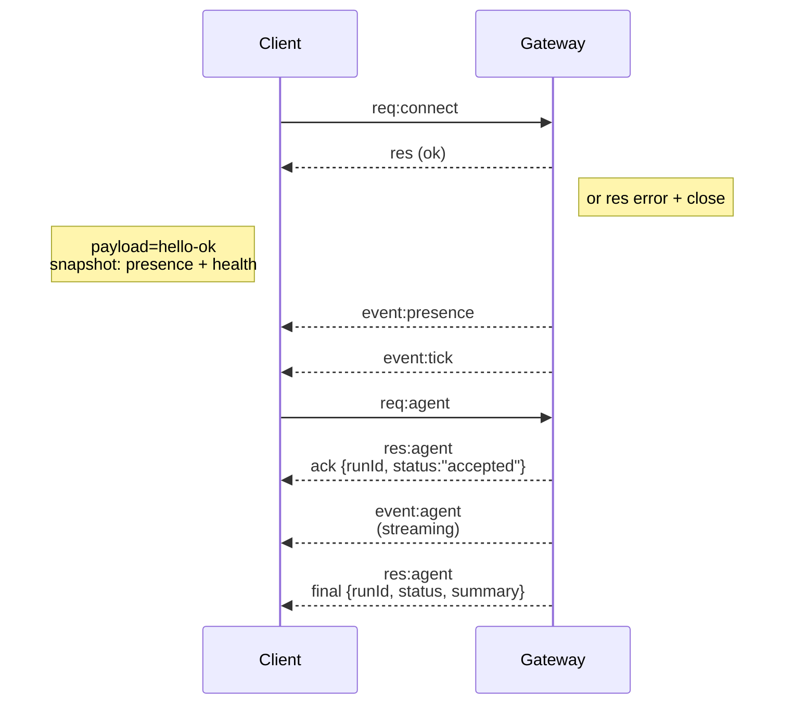

# OpenClaw Core — Source + Docs

Generated: 2026-02-15T13:51:09Z

## Project Structure

```
Source files:
  src/gateway/server.impl.ts
  src/gateway/server-chat.ts
  src/gateway/server-channels.ts
  src/gateway/server-startup.ts
  src/gateway/boot.ts
  src/channels/registry.ts
  src/channels/dock.ts
  src/channels/plugins/types.plugin.ts
  src/channels/session.ts
  src/routing/resolve-route.ts
  src/routing/bindings.ts
  src/routing/session-key.ts
  src/agents/pi-embedded-runner.ts
  src/agents/pi-embedded-runner/run.ts
  src/agents/pi-embedded-runner/runs.ts
  src/agents/pi-embedded-runner/types.ts
  src/agents/pi-tools.ts
  src/agents/models-config.ts
  src/agents/system-prompt.ts
  src/agents/context.ts
  src/agents/skills.ts
  src/agents/subagent-registry.ts
  src/plugins/types.ts
  src/plugins/registry.ts
  src/plugins/hooks.ts
  src/plugins/loader.ts
  src/plugin-sdk/index.ts
  src/config/config.ts
  src/config/types.ts
  src/config/schema.ts

Documentation:
  docs/concepts/agent-loop.md
  docs/concepts/agent-workspace.md
  docs/concepts/agent.md
  docs/concepts/architecture.md
  docs/concepts/compaction.md
  docs/concepts/context.md
  docs/concepts/core-components.md
  docs/concepts/features.md
  docs/concepts/markdown-formatting.md
  docs/concepts/memory.md
  docs/concepts/messages.md
  docs/concepts/model-failover.md
  docs/concepts/model-providers.md
  docs/concepts/models.md
  docs/concepts/multi-agent.md
  docs/concepts/oauth.md
  docs/concepts/presence.md
  docs/concepts/queue.md
  docs/concepts/retry.md
  docs/concepts/session-pruning.md
  docs/concepts/session-tool.md
  docs/concepts/session.md
  docs/concepts/sessions.md
  docs/concepts/streaming.md
  docs/concepts/system-prompt.md
  docs/concepts/timezone.md
  docs/concepts/typebox.md
  docs/concepts/typing-indicators.md
  docs/concepts/usage-tracking.md
```

## Source Files

### src/gateway/server.impl.ts

```typescript
import path from "node:path";
import type { CanvasHostServer } from "../canvas-host/server.js";
import type { PluginRegistry } from "../plugins/registry.js";
import type { PluginServicesHandle } from "../plugins/services.js";
import type { RuntimeEnv } from "../runtime.js";
import type { ControlUiRootState } from "./control-ui.js";
import type { startBrowserControlServerIfEnabled } from "./server-browser.js";
import { resolveAgentWorkspaceDir, resolveDefaultAgentId } from "../agents/agent-scope.js";
import { getActiveEmbeddedRunCount } from "../agents/pi-embedded-runner/runs.js";
import { registerSkillsChangeListener } from "../agents/skills/refresh.js";
import { initSubagentRegistry } from "../agents/subagent-registry.js";
import { getTotalPendingReplies } from "../auto-reply/reply/dispatcher-registry.js";
import { type ChannelId, listChannelPlugins } from "../channels/plugins/index.js";
import { formatCliCommand } from "../cli/command-format.js";
import { createDefaultDeps } from "../cli/deps.js";
import {
  CONFIG_PATH,
  isNixMode,
  loadConfig,
  migrateLegacyConfig,
  readConfigFileSnapshot,
  writeConfigFile,
} from "../config/config.js";
import { applyPluginAutoEnable } from "../config/plugin-auto-enable.js";
import { clearAgentRunContext, onAgentEvent } from "../infra/agent-events.js";
import {
  ensureControlUiAssetsBuilt,
  resolveControlUiRootOverrideSync,
  resolveControlUiRootSync,
} from "../infra/control-ui-assets.js";
import { isDiagnosticsEnabled } from "../infra/diagnostic-events.js";
import { logAcceptedEnvOption } from "../infra/env.js";
import { createExecApprovalForwarder } from "../infra/exec-approval-forwarder.js";
import { onHeartbeatEvent } from "../infra/heartbeat-events.js";
import { startHeartbeatRunner, type HeartbeatRunner } from "../infra/heartbeat-runner.js";
import { getMachineDisplayName } from "../infra/machine-name.js";
import { ensureOpenClawCliOnPath } from "../infra/path-env.js";
import { setGatewaySigusr1RestartPolicy, setPreRestartDeferralCheck } from "../infra/restart.js";
import {
  primeRemoteSkillsCache,
  refreshRemoteBinsForConnectedNodes,
  setSkillsRemoteRegistry,
} from "../infra/skills-remote.js";
import { scheduleGatewayUpdateCheck } from "../infra/update-startup.js";
import { startDiagnosticHeartbeat, stopDiagnosticHeartbeat } from "../logging/diagnostic.js";
import { createSubsystemLogger, runtimeForLogger } from "../logging/subsystem.js";
import { getGlobalHookRunner, runGlobalGatewayStopSafely } from "../plugins/hook-runner-global.js";
import { getTotalQueueSize } from "../process/command-queue.js";
import { runOnboardingWizard } from "../wizard/onboarding.js";
import { createAuthRateLimiter, type AuthRateLimiter } from "./auth-rate-limit.js";
import { startGatewayConfigReloader } from "./config-reload.js";
import { ExecApprovalManager } from "./exec-approval-manager.js";
import { NodeRegistry } from "./node-registry.js";
import { createChannelManager } from "./server-channels.js";
import { createAgentEventHandler } from "./server-chat.js";
import { createGatewayCloseHandler } from "./server-close.js";
import { buildGatewayCronService } from "./server-cron.js";
import { startGatewayDiscovery } from "./server-discovery-runtime.js";
import { applyGatewayLaneConcurrency } from "./server-lanes.js";
import { startGatewayMaintenanceTimers } from "./server-maintenance.js";
import { GATEWAY_EVENTS, listGatewayMethods } from "./server-methods-list.js";
import { coreGatewayHandlers } from "./server-methods.js";
import { createExecApprovalHandlers } from "./server-methods/exec-approval.js";
import { safeParseJson } from "./server-methods/nodes.helpers.js";
import { hasConnectedMobileNode } from "./server-mobile-nodes.js";
import { loadGatewayModelCatalog } from "./server-model-catalog.js";
import { createNodeSubscriptionManager } from "./server-node-subscriptions.js";
import { loadGatewayPlugins } from "./server-plugins.js";
import { createGatewayReloadHandlers } from "./server-reload-handlers.js";
import { resolveGatewayRuntimeConfig } from "./server-runtime-config.js";
import { createGatewayRuntimeState } from "./server-runtime-state.js";
import { resolveSessionKeyForRun } from "./server-session-key.js";
import { logGatewayStartup } from "./server-startup-log.js";
import { startGatewaySidecars } from "./server-startup.js";
import { startGatewayTailscaleExposure } from "./server-tailscale.js";
import { createWizardSessionTracker } from "./server-wizard-sessions.js";
import { attachGatewayWsHandlers } from "./server-ws-runtime.js";
import {
  getHealthCache,
  getHealthVersion,
  getPresenceVersion,
  incrementPresenceVersion,
  refreshGatewayHealthSnapshot,
} from "./server/health-state.js";
import { loadGatewayTlsRuntime } from "./server/tls.js";

export { __resetModelCatalogCacheForTest } from "./server-model-catalog.js";

ensureOpenClawCliOnPath();

const log = createSubsystemLogger("gateway");
const logCanvas = log.child("canvas");
const logDiscovery = log.child("discovery");
const logTailscale = log.child("tailscale");
const logChannels = log.child("channels");
const logBrowser = log.child("browser");
const logHealth = log.child("health");
const logCron = log.child("cron");
const logReload = log.child("reload");
const logHooks = log.child("hooks");
const logPlugins = log.child("plugins");
const logWsControl = log.child("ws");
const gatewayRuntime = runtimeForLogger(log);
const canvasRuntime = runtimeForLogger(logCanvas);

export type GatewayServer = {
  close: (opts?: { reason?: string; restartExpectedMs?: number | null }) => Promise<void>;
};

export type GatewayServerOptions = {
  /**
   * Bind address policy for the Gateway WebSocket/HTTP server.
   * - loopback: 127.0.0.1
   * - lan: 0.0.0.0
   * - tailnet: bind only to the Tailscale IPv4 address (100.64.0.0/10)
   * - auto: prefer loopback, else LAN
   */
  bind?: import("../config/config.js").GatewayBindMode;
  /**
   * Advanced override for the bind host, bypassing bind resolution.
   * Prefer `bind` unless you really need a specific address.
   */
  host?: string;
  /**
   * If false, do not serve the browser Control UI.
   * Default: config `gateway.controlUi.enabled` (or true when absent).
   */
  controlUiEnabled?: boolean;
  /**
   * If false, do not serve `POST /v1/chat/completions`.
   * Default: config `gateway.http.endpoints.chatCompletions.enabled` (or false when absent).
   */
  openAiChatCompletionsEnabled?: boolean;
  /**
   * If false, do not serve `POST /v1/responses` (OpenResponses API).
   * Default: config `gateway.http.endpoints.responses.enabled` (or false when absent).
   */
  openResponsesEnabled?: boolean;
  /**
   * Override gateway auth configuration (merges with config).
   */
  auth?: import("../config/config.js").GatewayAuthConfig;
  /**
   * Override gateway Tailscale exposure configuration (merges with config).
   */
  tailscale?: import("../config/config.js").GatewayTailscaleConfig;
  /**
   * Test-only: allow canvas host startup even when NODE_ENV/VITEST would disable it.
   */
  allowCanvasHostInTests?: boolean;
  /**
   * Test-only: override the onboarding wizard runner.
   */
  wizardRunner?: (
    opts: import("../commands/onboard-types.js").OnboardOptions,
    runtime: import("../runtime.js").RuntimeEnv,
    prompter: import("../wizard/prompts.js").WizardPrompter,
  ) => Promise<void>;
};

export async function startGatewayServer(
  port = 18789,
  opts: GatewayServerOptions = {},
): Promise<GatewayServer> {
  const minimalTestGateway =
    process.env.VITEST === "1" && process.env.OPENCLAW_TEST_MINIMAL_GATEWAY === "1";

  // Ensure all default port derivations (browser/canvas) see the actual runtime port.
  process.env.OPENCLAW_GATEWAY_PORT = String(port);
  logAcceptedEnvOption({
    key: "OPENCLAW_RAW_STREAM",
    description: "raw stream logging enabled",
  });
  logAcceptedEnvOption({
    key: "OPENCLAW_RAW_STREAM_PATH",
    description: "raw stream log path override",
  });

  let configSnapshot = await readConfigFileSnapshot();
  if (configSnapshot.legacyIssues.length > 0) {
    if (isNixMode) {
      throw new Error(
        "Legacy config entries detected while running in Nix mode. Update your Nix config to the latest schema and restart.",
      );
    }
    const { config: migrated, changes } = migrateLegacyConfig(configSnapshot.parsed);
    if (!migrated) {
      throw new Error(
        `Legacy config entries detected but auto-migration failed. Run "${formatCliCommand("openclaw doctor")}" to migrate.`,
      );
    }
    await writeConfigFile(migrated);
    if (changes.length > 0) {
      log.info(
        `gateway: migrated legacy config entries:\n${changes
          .map((entry) => `- ${entry}`)
          .join("\n")}`,
      );
    }
  }

  configSnapshot = await readConfigFileSnapshot();
  if (configSnapshot.exists && !configSnapshot.valid) {
    const issues =
      configSnapshot.issues.length > 0
        ? configSnapshot.issues
            .map((issue) => `${issue.path || "<root>"}: ${issue.message}`)
            .join("\n")
        : "Unknown validation issue.";
    throw new Error(
      `Invalid config at ${configSnapshot.path}.\n${issues}\nRun "${formatCliCommand("openclaw doctor")}" to repair, then retry.`,
    );
  }

  const autoEnable = applyPluginAutoEnable({ config: configSnapshot.config, env: process.env });
  if (autoEnable.changes.length > 0) {
    try {
      await writeConfigFile(autoEnable.config);
      log.info(
        `gateway: auto-enabled plugins:\n${autoEnable.changes
          .map((entry) => `- ${entry}`)
          .join("\n")}`,
      );
    } catch (err) {
      log.warn(`gateway: failed to persist plugin auto-enable changes: ${String(err)}`);
    }
  }

  const cfgAtStart = loadConfig();
  const diagnosticsEnabled = isDiagnosticsEnabled(cfgAtStart);
  if (diagnosticsEnabled) {
    startDiagnosticHeartbeat();
  }
  setGatewaySigusr1RestartPolicy({ allowExternal: cfgAtStart.commands?.restart === true });
  setPreRestartDeferralCheck(
    () => getTotalQueueSize() + getTotalPendingReplies() + getActiveEmbeddedRunCount(),
  );
  initSubagentRegistry();
  const defaultAgentId = resolveDefaultAgentId(cfgAtStart);
  const defaultWorkspaceDir = resolveAgentWorkspaceDir(cfgAtStart, defaultAgentId);
  const baseMethods = listGatewayMethods();
  const emptyPluginRegistry: PluginRegistry = {
    plugins: [],
    tools: [],
    hooks: [],
    typedHooks: [],
    channels: [],
    providers: [],
    gatewayHandlers: {},
    httpHandlers: [],
    httpRoutes: [],
    cliRegistrars: [],
    services: [],
    commands: [],
    diagnostics: [],
  };
  const { pluginRegistry, gatewayMethods: baseGatewayMethods } = minimalTestGateway
    ? { pluginRegistry: emptyPluginRegistry, gatewayMethods: baseMethods }
    : loadGatewayPlugins({
        cfg: cfgAtStart,
        workspaceDir: defaultWorkspaceDir,
        log,
        coreGatewayHandlers,
        baseMethods,
      });
  const channelLogs = Object.fromEntries(
    listChannelPlugins().map((plugin) => [plugin.id, logChannels.child(plugin.id)]),
  ) as Record<ChannelId, ReturnType<typeof createSubsystemLogger>>;
  const channelRuntimeEnvs = Object.fromEntries(
    Object.entries(channelLogs).map(([id, logger]) => [id, runtimeForLogger(logger)]),
  ) as Record<ChannelId, RuntimeEnv>;
  const channelMethods = listChannelPlugins().flatMap((plugin) => plugin.gatewayMethods ?? []);
  const gatewayMethods = Array.from(new Set([...baseGatewayMethods, ...channelMethods]));
  let pluginServices: PluginServicesHandle | null = null;
  const runtimeConfig = await resolveGatewayRuntimeConfig({
    cfg: cfgAtStart,
    port,
    bind: opts.bind,
    host: opts.host,
    controlUiEnabled: opts.controlUiEnabled,
    openAiChatCompletionsEnabled: opts.openAiChatCompletionsEnabled,
    openResponsesEnabled: opts.openResponsesEnabled,
    auth: opts.auth,
    tailscale: opts.tailscale,
  });
  const {
    bindHost,
    controlUiEnabled,
    openAiChatCompletionsEnabled,
    openResponsesEnabled,
    openResponsesConfig,
    controlUiBasePath,
    controlUiRoot: controlUiRootOverride,
    resolvedAuth,
    tailscaleConfig,
    tailscaleMode,
  } = runtimeConfig;
  let hooksConfig = runtimeConfig.hooksConfig;
  const canvasHostEnabled = runtimeConfig.canvasHostEnabled;

  // Create auth rate limiter only when explicitly configured.
  const rateLimitConfig = cfgAtStart.gateway?.auth?.rateLimit;
  const authRateLimiter: AuthRateLimiter | undefined = rateLimitConfig
    ? createAuthRateLimiter(rateLimitConfig)
    : undefined;

  let controlUiRootState: ControlUiRootState | undefined;
  if (controlUiRootOverride) {
    const resolvedOverride = resolveControlUiRootOverrideSync(controlUiRootOverride);
    const resolvedOverridePath = path.resolve(controlUiRootOverride);
    controlUiRootState = resolvedOverride
      ? { kind: "resolved", path: resolvedOverride }
      : { kind: "invalid", path: resolvedOverridePath };
    if (!resolvedOverride) {
      log.warn(`gateway: controlUi.root not found at ${resolvedOverridePath}`);
    }
  } else if (controlUiEnabled) {
    let resolvedRoot = resolveControlUiRootSync({
      moduleUrl: import.meta.url,
      argv1: process.argv[1],
      cwd: process.cwd(),
    });
    if (!resolvedRoot) {
      const ensureResult = await ensureControlUiAssetsBuilt(gatewayRuntime);
      if (!ensureResult.ok && ensureResult.message) {
        log.warn(`gateway: ${ensureResult.message}`);
      }
      resolvedRoot = resolveControlUiRootSync({
        moduleUrl: import.meta.url,
        argv1: process.argv[1],
        cwd: process.cwd(),
      });
    }
    controlUiRootState = resolvedRoot
      ? { kind: "resolved", path: resolvedRoot }
      : { kind: "missing" };
  }

  const wizardRunner = opts.wizardRunner ?? runOnboardingWizard;
  const { wizardSessions, findRunningWizard, purgeWizardSession } = createWizardSessionTracker();

  const deps = createDefaultDeps();
  let canvasHostServer: CanvasHostServer | null = null;
  const gatewayTls = await loadGatewayTlsRuntime(cfgAtStart.gateway?.tls, log.child("tls"));
  if (cfgAtStart.gateway?.tls?.enabled && !gatewayTls.enabled) {
    throw new Error(gatewayTls.error ?? "gateway tls: failed to enable");
  }
  const {
    canvasHost,
    httpServer,
    httpServers,
    httpBindHosts,
    wss,
    clients,
    broadcast,
    broadcastToConnIds,
    agentRunSeq,
    dedupe,
    chatRunState,
    chatRunBuffers,
    chatDeltaSentAt,
    addChatRun,
    removeChatRun,
    chatAbortControllers,
    toolEventRecipients,
  } = await createGatewayRuntimeState({
    cfg: cfgAtStart,
    bindHost,
    port,
    controlUiEnabled,
    controlUiBasePath,
    controlUiRoot: controlUiRootState,
    openAiChatCompletionsEnabled,
    openResponsesEnabled,
    openResponsesConfig,
    resolvedAuth,
    rateLimiter: authRateLimiter,
    gatewayTls,
    hooksConfig: () => hooksConfig,
    pluginRegistry,
    deps,
    canvasRuntime,
    canvasHostEnabled,
    allowCanvasHostInTests: opts.allowCanvasHostInTests,
    logCanvas,
    log,
    logHooks,
    logPlugins,
  });
  let bonjourStop: (() => Promise<void>) | null = null;
  const nodeRegistry = new NodeRegistry();
  const nodePresenceTimers = new Map<string, ReturnType<typeof setInterval>>();
  const nodeSubscriptions = createNodeSubscriptionManager();
  const nodeSendEvent = (opts: { nodeId: string; event: string; payloadJSON?: string | null }) => {
    const payload = safeParseJson(opts.payloadJSON ?? null);
    nodeRegistry.sendEvent(opts.nodeId, opts.event, payload);
  };
  const nodeSendToSession = (sessionKey: string, event: string, payload: unknown) =>
    nodeSubscriptions.sendToSession(sessionKey, event, payload, nodeSendEvent);
  const nodeSendToAllSubscribed = (event: string, payload: unknown) =>
    nodeSubscriptions.sendToAllSubscribed(event, payload, nodeSendEvent);
  const nodeSubscribe = nodeSubscriptions.subscribe;
  const nodeUnsubscribe = nodeSubscriptions.unsubscribe;
  const nodeUnsubscribeAll = nodeSubscriptions.unsubscribeAll;
  const broadcastVoiceWakeChanged = (triggers: string[]) => {
    broadcast("voicewake.changed", { triggers }, { dropIfSlow: true });
  };
  const hasMobileNodeConnected = () => hasConnectedMobileNode(nodeRegistry);
  applyGatewayLaneConcurrency(cfgAtStart);

  let cronState = buildGatewayCronService({
    cfg: cfgAtStart,
    deps,
    broadcast,
  });
  let { cron, storePath: cronStorePath } = cronState;

  const channelManager = createChannelManager({
    loadConfig,
    channelLogs,
    channelRuntimeEnvs,
  });
  const { getRuntimeSnapshot, startChannels, startChannel, stopChannel, markChannelLoggedOut } =
    channelManager;

  if (!minimalTestGateway) {
    const machineDisplayName = await getMachineDisplayName();
    const discovery = await startGatewayDiscovery({
      machineDisplayName,
      port,
      gatewayTls: gatewayTls.enabled
        ? { enabled: true, fingerprintSha256: gatewayTls.fingerprintSha256 }
        : undefined,
      wideAreaDiscoveryEnabled: cfgAtStart.discovery?.wideArea?.enabled === true,
      wideAreaDiscoveryDomain: cfgAtStart.discovery?.wideArea?.domain,
      tailscaleMode,
      mdnsMode: cfgAtStart.discovery?.mdns?.mode,
      logDiscovery,
    });
    bonjourStop = discovery.bonjourStop;
  }

  if (!minimalTestGateway) {
    setSkillsRemoteRegistry(nodeRegistry);
    void primeRemoteSkillsCache();
  }
  // Debounce skills-triggered node probes to avoid feedback loops and rapid-fire invokes.
  // Skills changes can happen in bursts (e.g., file watcher events), and each probe
  // takes time to complete. A 30-second delay ensures we batch changes together.
  let skillsRefreshTimer: ReturnType<typeof setTimeout> | null = null;
  const skillsRefreshDelayMs = 30_000;
  const skillsChangeUnsub = minimalTestGateway
    ? () => {}
    : registerSkillsChangeListener((event) => {
        if (event.reason === "remote-node") {
          return;
        }
        if (skillsRefreshTimer) {
          clearTimeout(skillsRefreshTimer);
        }
        skillsRefreshTimer = setTimeout(() => {
          skillsRefreshTimer = null;
          const latest = loadConfig();
          void refreshRemoteBinsForConnectedNodes(latest);
        }, skillsRefreshDelayMs);
      });

  const noopInterval = () => setInterval(() => {}, 1 << 30);
  let tickInterval = noopInterval();
  let healthInterval = noopInterval();
  let dedupeCleanup = noopInterval();
  if (!minimalTestGateway) {
    ({ tickInterval, healthInterval, dedupeCleanup } = startGatewayMaintenanceTimers({
      broadcast,
      nodeSendToAllSubscribed,
      getPresenceVersion,
      getHealthVersion,
      refreshGatewayHealthSnapshot,
      logHealth,
      dedupe,
      chatAbortControllers,
      chatRunState,
      chatRunBuffers,
      chatDeltaSentAt,
      removeChatRun,
      agentRunSeq,
      nodeSendToSession,
    }));
  }

  const agentUnsub = minimalTestGateway
    ? null
    : onAgentEvent(
        createAgentEventHandler({
          broadcast,
          broadcastToConnIds,
          nodeSendToSession,
          agentRunSeq,
          chatRunState,
          resolveSessionKeyForRun,
          clearAgentRunContext,
          toolEventRecipients,
        }),
      );

  const heartbeatUnsub = minimalTestGateway
    ? null
    : onHeartbeatEvent((evt) => {
        broadcast("heartbeat", evt, { dropIfSlow: true });
      });

  let heartbeatRunner: HeartbeatRunner = minimalTestGateway
    ? {
        stop: () => {},
        updateConfig: () => {},
      }
    : startHeartbeatRunner({ cfg: cfgAtStart });

  if (!minimalTestGateway) {
    void cron.start().catch((err) => logCron.error(`failed to start: ${String(err)}`));
  }

  // Recover pending outbound deliveries from previous crash/restart.
  if (!minimalTestGateway) {
    void (async () => {
      const { recoverPendingDeliveries } = await import("../infra/outbound/delivery-queue.js");
      const { deliverOutboundPayloads } = await import("../infra/outbound/deliver.js");
      const logRecovery = log.child("delivery-recovery");
      await recoverPendingDeliveries({
        deliver: deliverOutboundPayloads,
        log: logRecovery,
        cfg: cfgAtStart,
      });
    })().catch((err) => log.error(`Delivery recovery failed: ${String(err)}`));
  }

  const execApprovalManager = new ExecApprovalManager();
  const execApprovalForwarder = createExecApprovalForwarder();
  const execApprovalHandlers = createExecApprovalHandlers(execApprovalManager, {
    forwarder: execApprovalForwarder,
  });

  const canvasHostServerPort = (canvasHostServer as CanvasHostServer | null)?.port;

  attachGatewayWsHandlers({
    wss,
    clients,
    port,
    gatewayHost: bindHost ?? undefined,
    canvasHostEnabled: Boolean(canvasHost),
    canvasHostServerPort,
    resolvedAuth,
    rateLimiter: authRateLimiter,
    gatewayMethods,
    events: GATEWAY_EVENTS,
    logGateway: log,
    logHealth,
    logWsControl,
    extraHandlers: {
      ...pluginRegistry.gatewayHandlers,
      ...execApprovalHandlers,
    },
    broadcast,
    context: {
      deps,
      cron,
      cronStorePath,
      execApprovalManager,
      loadGatewayModelCatalog,
      getHealthCache,
      refreshHealthSnapshot: refreshGatewayHealthSnapshot,
      logHealth,
      logGateway: log,
      incrementPresenceVersion,
      getHealthVersion,
      broadcast,
      broadcastToConnIds,
      nodeSendToSession,
      nodeSendToAllSubscribed,
      nodeSubscribe,
      nodeUnsubscribe,
      nodeUnsubscribeAll,
      hasConnectedMobileNode: hasMobileNodeConnected,
      nodeRegistry,
      agentRunSeq,
      chatAbortControllers,
      chatAbortedRuns: chatRunState.abortedRuns,
      chatRunBuffers: chatRunState.buffers,
      chatDeltaSentAt: chatRunState.deltaSentAt,
      addChatRun,
      removeChatRun,
      registerToolEventRecipient: toolEventRecipients.add,
      dedupe,
      wizardSessions,
      findRunningWizard,
      purgeWizardSession,
      getRuntimeSnapshot,
      startChannel,
      stopChannel,
      markChannelLoggedOut,
      wizardRunner,
      broadcastVoiceWakeChanged,
    },
  });
  logGatewayStartup({
    cfg: cfgAtStart,
    bindHost,
    bindHosts: httpBindHosts,
    port,
    tlsEnabled: gatewayTls.enabled,
    log,
    isNixMode,
  });
  if (!minimalTestGateway) {
    scheduleGatewayUpdateCheck({ cfg: cfgAtStart, log, isNixMode });
  }
  const tailscaleCleanup = minimalTestGateway
    ? null
    : await startGatewayTailscaleExposure({
        tailscaleMode,
        resetOnExit: tailscaleConfig.resetOnExit,
        port,
        controlUiBasePath,
        logTailscale,
      });

  let browserControl: Awaited<ReturnType<typeof startBrowserControlServerIfEnabled>> = null;
  if (!minimalTestGateway) {
    ({ browserControl, pluginServices } = await startGatewaySidecars({
      cfg: cfgAtStart,
      pluginRegistry,
      defaultWorkspaceDir,
      deps,
      startChannels,
      log,
      logHooks,
      logChannels,
      logBrowser,
    }));
  }

  // Run gateway_start plugin hook (fire-and-forget)
  if (!minimalTestGateway) {
    const hookRunner = getGlobalHookRunner();
    if (hookRunner?.hasHooks("gateway_start")) {
      void hookRunner.runGatewayStart({ port }, { port }).catch((err) => {
        log.warn(`gateway_start hook failed: ${String(err)}`);
      });
    }
  }

  const configReloader = minimalTestGateway
    ? { stop: async () => {} }
    : (() => {
        const { applyHotReload, requestGatewayRestart } = createGatewayReloadHandlers({
          deps,
          broadcast,
          getState: () => ({
            hooksConfig,
            heartbeatRunner,
            cronState,
            browserControl,
          }),
          setState: (nextState) => {
            hooksConfig = nextState.hooksConfig;
            heartbeatRunner = nextState.heartbeatRunner;
            cronState = nextState.cronState;
            cron = cronState.cron;
            cronStorePath = cronState.storePath;
            browserControl = nextState.browserControl;
          },
          startChannel,
          stopChannel,
          logHooks,
          logBrowser,
          logChannels,
          logCron,
          logReload,
        });

        return startGatewayConfigReloader({
          initialConfig: cfgAtStart,
          readSnapshot: readConfigFileSnapshot,
          onHotReload: applyHotReload,
          onRestart: requestGatewayRestart,
          log: {
            info: (msg) => logReload.info(msg),
            warn: (msg) => logReload.warn(msg),
            error: (msg) => logReload.error(msg),
          },
          watchPath: CONFIG_PATH,
        });
      })();

  const close = createGatewayCloseHandler({
    bonjourStop,
    tailscaleCleanup,
    canvasHost,
    canvasHostServer,
    stopChannel,
    pluginServices,
    cron,
    heartbeatRunner,
    nodePresenceTimers,
    broadcast,
    tickInterval,
    healthInterval,
    dedupeCleanup,
    agentUnsub,
    heartbeatUnsub,
    chatRunState,
    clients,
    configReloader,
    browserControl,
    wss,
    httpServer,
    httpServers,
  });

  return {
    close: async (opts) => {
      // Run gateway_stop plugin hook before shutdown
      await runGlobalGatewayStopSafely({
        event: { reason: opts?.reason ?? "gateway stopping" },
        ctx: { port },
        onError: (err) => log.warn(`gateway_stop hook failed: ${String(err)}`),
      });
      if (diagnosticsEnabled) {
        stopDiagnosticHeartbeat();
      }
      if (skillsRefreshTimer) {
        clearTimeout(skillsRefreshTimer);
        skillsRefreshTimer = null;
      }
      skillsChangeUnsub();
      authRateLimiter?.dispose();
      await close(opts);
    },
  };
}
```

### src/gateway/server-chat.ts

```typescript
import { normalizeVerboseLevel } from "../auto-reply/thinking.js";
import { isSilentReplyText, SILENT_REPLY_TOKEN } from "../auto-reply/tokens.js";
import { loadConfig } from "../config/config.js";
import { type AgentEventPayload, getAgentRunContext } from "../infra/agent-events.js";
import { resolveHeartbeatVisibility } from "../infra/heartbeat-visibility.js";
import { loadSessionEntry } from "./session-utils.js";
import { formatForLog } from "./ws-log.js";

/**
 * Check if webchat broadcasts should be suppressed for heartbeat runs.
 * Returns true if the run is a heartbeat and showOk is false.
 */
function shouldSuppressHeartbeatBroadcast(runId: string): boolean {
  const runContext = getAgentRunContext(runId);
  if (!runContext?.isHeartbeat) {
    return false;
  }

  try {
    const cfg = loadConfig();
    const visibility = resolveHeartbeatVisibility({ cfg, channel: "webchat" });
    return !visibility.showOk;
  } catch {
    // Default to suppressing if we can't load config
    return true;
  }
}

export type ChatRunEntry = {
  sessionKey: string;
  clientRunId: string;
};

export type ChatRunRegistry = {
  add: (sessionId: string, entry: ChatRunEntry) => void;
  peek: (sessionId: string) => ChatRunEntry | undefined;
  shift: (sessionId: string) => ChatRunEntry | undefined;
  remove: (sessionId: string, clientRunId: string, sessionKey?: string) => ChatRunEntry | undefined;
  clear: () => void;
};

export function createChatRunRegistry(): ChatRunRegistry {
  const chatRunSessions = new Map<string, ChatRunEntry[]>();

  const add = (sessionId: string, entry: ChatRunEntry) => {
    const queue = chatRunSessions.get(sessionId);
    if (queue) {
      queue.push(entry);
    } else {
      chatRunSessions.set(sessionId, [entry]);
    }
  };

  const peek = (sessionId: string) => chatRunSessions.get(sessionId)?.[0];

  const shift = (sessionId: string) => {
    const queue = chatRunSessions.get(sessionId);
    if (!queue || queue.length === 0) {
      return undefined;
    }
    const entry = queue.shift();
    if (!queue.length) {
      chatRunSessions.delete(sessionId);
    }
    return entry;
  };

  const remove = (sessionId: string, clientRunId: string, sessionKey?: string) => {
    const queue = chatRunSessions.get(sessionId);
    if (!queue || queue.length === 0) {
      return undefined;
    }
    const idx = queue.findIndex(
      (entry) =>
        entry.clientRunId === clientRunId && (sessionKey ? entry.sessionKey === sessionKey : true),
    );
    if (idx < 0) {
      return undefined;
    }
    const [entry] = queue.splice(idx, 1);
    if (!queue.length) {
      chatRunSessions.delete(sessionId);
    }
    return entry;
  };

  const clear = () => {
    chatRunSessions.clear();
  };

  return { add, peek, shift, remove, clear };
}

export type ChatRunState = {
  registry: ChatRunRegistry;
  buffers: Map<string, string>;
  deltaSentAt: Map<string, number>;
  abortedRuns: Map<string, number>;
  clear: () => void;
};

export function createChatRunState(): ChatRunState {
  const registry = createChatRunRegistry();
  const buffers = new Map<string, string>();
  const deltaSentAt = new Map<string, number>();
  const abortedRuns = new Map<string, number>();

  const clear = () => {
    registry.clear();
    buffers.clear();
    deltaSentAt.clear();
    abortedRuns.clear();
  };

  return {
    registry,
    buffers,
    deltaSentAt,
    abortedRuns,
    clear,
  };
}

export type ToolEventRecipientRegistry = {
  add: (runId: string, connId: string) => void;
  get: (runId: string) => ReadonlySet<string> | undefined;
  markFinal: (runId: string) => void;
};

type ToolRecipientEntry = {
  connIds: Set<string>;
  updatedAt: number;
  finalizedAt?: number;
};

const TOOL_EVENT_RECIPIENT_TTL_MS = 10 * 60 * 1000;
const TOOL_EVENT_RECIPIENT_FINAL_GRACE_MS = 30 * 1000;

export function createToolEventRecipientRegistry(): ToolEventRecipientRegistry {
  const recipients = new Map<string, ToolRecipientEntry>();

  const prune = () => {
    if (recipients.size === 0) {
      return;
    }
    const now = Date.now();
    for (const [runId, entry] of recipients) {
      const cutoff = entry.finalizedAt
        ? entry.finalizedAt + TOOL_EVENT_RECIPIENT_FINAL_GRACE_MS
        : entry.updatedAt + TOOL_EVENT_RECIPIENT_TTL_MS;
      if (now >= cutoff) {
        recipients.delete(runId);
      }
    }
  };

  const add = (runId: string, connId: string) => {
    if (!runId || !connId) {
      return;
    }
    const now = Date.now();
    const existing = recipients.get(runId);
    if (existing) {
      existing.connIds.add(connId);
      existing.updatedAt = now;
    } else {
      recipients.set(runId, {
        connIds: new Set([connId]),
        updatedAt: now,
      });
    }
    prune();
  };

  const get = (runId: string) => {
    const entry = recipients.get(runId);
    if (!entry) {
      return undefined;
    }
    entry.updatedAt = Date.now();
    prune();
    return entry.connIds;
  };

  const markFinal = (runId: string) => {
    const entry = recipients.get(runId);
    if (!entry) {
      return;
    }
    entry.finalizedAt = Date.now();
    prune();
  };

  return { add, get, markFinal };
}

export type ChatEventBroadcast = (
  event: string,
  payload: unknown,
  opts?: { dropIfSlow?: boolean },
) => void;

export type NodeSendToSession = (sessionKey: string, event: string, payload: unknown) => void;

export type AgentEventHandlerOptions = {
  broadcast: ChatEventBroadcast;
  broadcastToConnIds: (
    event: string,
    payload: unknown,
    connIds: ReadonlySet<string>,
    opts?: { dropIfSlow?: boolean },
  ) => void;
  nodeSendToSession: NodeSendToSession;
  agentRunSeq: Map<string, number>;
  chatRunState: ChatRunState;
  resolveSessionKeyForRun: (runId: string) => string | undefined;
  clearAgentRunContext: (runId: string) => void;
  toolEventRecipients: ToolEventRecipientRegistry;
};

export function createAgentEventHandler({
  broadcast,
  broadcastToConnIds,
  nodeSendToSession,
  agentRunSeq,
  chatRunState,
  resolveSessionKeyForRun,
  clearAgentRunContext,
  toolEventRecipients,
}: AgentEventHandlerOptions) {
  const emitChatDelta = (sessionKey: string, clientRunId: string, seq: number, text: string) => {
    if (isSilentReplyText(text, SILENT_REPLY_TOKEN)) {
      return;
    }
    chatRunState.buffers.set(clientRunId, text);
    const now = Date.now();
    const last = chatRunState.deltaSentAt.get(clientRunId) ?? 0;
    if (now - last < 150) {
      return;
    }
    chatRunState.deltaSentAt.set(clientRunId, now);
    const payload = {
      runId: clientRunId,
      sessionKey,
      seq,
      state: "delta" as const,
      message: {
        role: "assistant",
        content: [{ type: "text", text }],
        timestamp: now,
      },
    };
    // Suppress webchat broadcast for heartbeat runs when showOk is false
    if (!shouldSuppressHeartbeatBroadcast(clientRunId)) {
      broadcast("chat", payload, { dropIfSlow: true });
    }
    nodeSendToSession(sessionKey, "chat", payload);
  };

  const emitChatFinal = (
    sessionKey: string,
    clientRunId: string,
    seq: number,
    jobState: "done" | "error",
    error?: unknown,
  ) => {
    const text = chatRunState.buffers.get(clientRunId)?.trim() ?? "";
    const shouldSuppressSilent = isSilentReplyText(text, SILENT_REPLY_TOKEN);
    chatRunState.buffers.delete(clientRunId);
    chatRunState.deltaSentAt.delete(clientRunId);
    if (jobState === "done") {
      const payload = {
        runId: clientRunId,
        sessionKey,
        seq,
        state: "final" as const,
        message:
          text && !shouldSuppressSilent
            ? {
                role: "assistant",
                content: [{ type: "text", text }],
                timestamp: Date.now(),
              }
            : undefined,
      };
      // Suppress webchat broadcast for heartbeat runs when showOk is false
      if (!shouldSuppressHeartbeatBroadcast(clientRunId)) {
        broadcast("chat", payload);
      }
      nodeSendToSession(sessionKey, "chat", payload);
      return;
    }
    const payload = {
      runId: clientRunId,
      sessionKey,
      seq,
      state: "error" as const,
      errorMessage: error ? formatForLog(error) : undefined,
    };
    broadcast("chat", payload);
    nodeSendToSession(sessionKey, "chat", payload);
  };

  const resolveToolVerboseLevel = (runId: string, sessionKey?: string) => {
    const runContext = getAgentRunContext(runId);
    const runVerbose = normalizeVerboseLevel(runContext?.verboseLevel);
    if (runVerbose) {
      return runVerbose;
    }
    if (!sessionKey) {
      return "off";
    }
    try {
      const { cfg, entry } = loadSessionEntry(sessionKey);
      const sessionVerbose = normalizeVerboseLevel(entry?.verboseLevel);
      if (sessionVerbose) {
        return sessionVerbose;
      }
      const defaultVerbose = normalizeVerboseLevel(cfg.agents?.defaults?.verboseDefault);
      return defaultVerbose ?? "off";
    } catch {
      return "off";
    }
  };

  return (evt: AgentEventPayload) => {
    const chatLink = chatRunState.registry.peek(evt.runId);
    const sessionKey = chatLink?.sessionKey ?? resolveSessionKeyForRun(evt.runId);
    const clientRunId = chatLink?.clientRunId ?? evt.runId;
    const isAborted =
      chatRunState.abortedRuns.has(clientRunId) || chatRunState.abortedRuns.has(evt.runId);
    // Include sessionKey so Control UI can filter tool streams per session.
    const agentPayload = sessionKey ? { ...evt, sessionKey } : evt;
    const last = agentRunSeq.get(evt.runId) ?? 0;
    const isToolEvent = evt.stream === "tool";
    const toolVerbose = isToolEvent ? resolveToolVerboseLevel(evt.runId, sessionKey) : "off";
    // Build tool payload: strip result/partialResult unless verbose=full
    const toolPayload =
      isToolEvent && toolVerbose !== "full"
        ? (() => {
            const data = evt.data ? { ...evt.data } : {};
            delete data.result;
            delete data.partialResult;
            return sessionKey ? { ...evt, sessionKey, data } : { ...evt, data };
          })()
        : agentPayload;
    if (evt.seq !== last + 1) {
      broadcast("agent", {
        runId: evt.runId,
        stream: "error",
        ts: Date.now(),
        sessionKey,
        data: {
          reason: "seq gap",
          expected: last + 1,
          received: evt.seq,
        },
      });
    }
    agentRunSeq.set(evt.runId, evt.seq);
    if (isToolEvent) {
      // Always broadcast tool events to registered WS recipients with
      // tool-events capability, regardless of verboseLevel. The verbose
      // setting only controls whether tool details are sent as channel
      // messages to messaging surfaces (Telegram, Discord, etc.).
      const recipients = toolEventRecipients.get(evt.runId);
      if (recipients && recipients.size > 0) {
        broadcastToConnIds("agent", toolPayload, recipients);
      }
    } else {
      broadcast("agent", agentPayload);
    }

    const lifecyclePhase =
      evt.stream === "lifecycle" && typeof evt.data?.phase === "string" ? evt.data.phase : null;

    if (sessionKey) {
      // Send tool events to node/channel subscribers only when verbose is enabled;
      // WS clients already received the event above via broadcastToConnIds.
      if (!isToolEvent || toolVerbose !== "off") {
        nodeSendToSession(sessionKey, "agent", isToolEvent ? toolPayload : agentPayload);
      }
      if (!isAborted && evt.stream === "assistant" && typeof evt.data?.text === "string") {
        emitChatDelta(sessionKey, clientRunId, evt.seq, evt.data.text);
      } else if (!isAborted && (lifecyclePhase === "end" || lifecyclePhase === "error")) {
        if (chatLink) {
          const finished = chatRunState.registry.shift(evt.runId);
          if (!finished) {
            clearAgentRunContext(evt.runId);
            return;
          }
          emitChatFinal(
            finished.sessionKey,
            finished.clientRunId,
            evt.seq,
            lifecyclePhase === "error" ? "error" : "done",
            evt.data?.error,
          );
        } else {
          emitChatFinal(
            sessionKey,
            evt.runId,
            evt.seq,
            lifecyclePhase === "error" ? "error" : "done",
            evt.data?.error,
          );
        }
      } else if (isAborted && (lifecyclePhase === "end" || lifecyclePhase === "error")) {
        chatRunState.abortedRuns.delete(clientRunId);
        chatRunState.abortedRuns.delete(evt.runId);
        chatRunState.buffers.delete(clientRunId);
        chatRunState.deltaSentAt.delete(clientRunId);
        if (chatLink) {
          chatRunState.registry.remove(evt.runId, clientRunId, sessionKey);
        }
      }
    }

    if (lifecyclePhase === "end" || lifecyclePhase === "error") {
      toolEventRecipients.markFinal(evt.runId);
      clearAgentRunContext(evt.runId);
      agentRunSeq.delete(evt.runId);
      agentRunSeq.delete(clientRunId);
    }
  };
}
```

### src/gateway/server-channels.ts

```typescript
import type { ChannelAccountSnapshot } from "../channels/plugins/types.js";
import type { OpenClawConfig } from "../config/config.js";
import type { createSubsystemLogger } from "../logging/subsystem.js";
import type { RuntimeEnv } from "../runtime.js";
import { resolveChannelDefaultAccountId } from "../channels/plugins/helpers.js";
import { type ChannelId, getChannelPlugin, listChannelPlugins } from "../channels/plugins/index.js";
import { formatErrorMessage } from "../infra/errors.js";
import { resetDirectoryCache } from "../infra/outbound/target-resolver.js";
import { DEFAULT_ACCOUNT_ID } from "../routing/session-key.js";

export type ChannelRuntimeSnapshot = {
  channels: Partial<Record<ChannelId, ChannelAccountSnapshot>>;
  channelAccounts: Partial<Record<ChannelId, Record<string, ChannelAccountSnapshot>>>;
};

type SubsystemLogger = ReturnType<typeof createSubsystemLogger>;

type ChannelRuntimeStore = {
  aborts: Map<string, AbortController>;
  tasks: Map<string, Promise<unknown>>;
  runtimes: Map<string, ChannelAccountSnapshot>;
};

function createRuntimeStore(): ChannelRuntimeStore {
  return {
    aborts: new Map(),
    tasks: new Map(),
    runtimes: new Map(),
  };
}

function isAccountEnabled(account: unknown): boolean {
  if (!account || typeof account !== "object") {
    return true;
  }
  const enabled = (account as { enabled?: boolean }).enabled;
  return enabled !== false;
}

function resolveDefaultRuntime(channelId: ChannelId): ChannelAccountSnapshot {
  const plugin = getChannelPlugin(channelId);
  return plugin?.status?.defaultRuntime ?? { accountId: DEFAULT_ACCOUNT_ID };
}

function cloneDefaultRuntime(channelId: ChannelId, accountId: string): ChannelAccountSnapshot {
  return { ...resolveDefaultRuntime(channelId), accountId };
}

type ChannelManagerOptions = {
  loadConfig: () => OpenClawConfig;
  channelLogs: Record<ChannelId, SubsystemLogger>;
  channelRuntimeEnvs: Record<ChannelId, RuntimeEnv>;
};

export type ChannelManager = {
  getRuntimeSnapshot: () => ChannelRuntimeSnapshot;
  startChannels: () => Promise<void>;
  startChannel: (channel: ChannelId, accountId?: string) => Promise<void>;
  stopChannel: (channel: ChannelId, accountId?: string) => Promise<void>;
  markChannelLoggedOut: (channelId: ChannelId, cleared: boolean, accountId?: string) => void;
};

// Channel docking: lifecycle hooks (`plugin.gateway`) flow through this manager.
export function createChannelManager(opts: ChannelManagerOptions): ChannelManager {
  const { loadConfig, channelLogs, channelRuntimeEnvs } = opts;

  const channelStores = new Map<ChannelId, ChannelRuntimeStore>();

  const getStore = (channelId: ChannelId): ChannelRuntimeStore => {
    const existing = channelStores.get(channelId);
    if (existing) {
      return existing;
    }
    const next = createRuntimeStore();
    channelStores.set(channelId, next);
    return next;
  };

  const getRuntime = (channelId: ChannelId, accountId: string): ChannelAccountSnapshot => {
    const store = getStore(channelId);
    return store.runtimes.get(accountId) ?? cloneDefaultRuntime(channelId, accountId);
  };

  const setRuntime = (
    channelId: ChannelId,
    accountId: string,
    patch: ChannelAccountSnapshot,
  ): ChannelAccountSnapshot => {
    const store = getStore(channelId);
    const current = getRuntime(channelId, accountId);
    const next = { ...current, ...patch, accountId };
    store.runtimes.set(accountId, next);
    return next;
  };

  const startChannel = async (channelId: ChannelId, accountId?: string) => {
    const plugin = getChannelPlugin(channelId);
    const startAccount = plugin?.gateway?.startAccount;
    if (!startAccount) {
      return;
    }
    const cfg = loadConfig();
    resetDirectoryCache({ channel: channelId, accountId });
    const store = getStore(channelId);
    const accountIds = accountId ? [accountId] : plugin.config.listAccountIds(cfg);
    if (accountIds.length === 0) {
      return;
    }

    await Promise.all(
      accountIds.map(async (id) => {
        if (store.tasks.has(id)) {
          return;
        }
        const account = plugin.config.resolveAccount(cfg, id);
        const enabled = plugin.config.isEnabled
          ? plugin.config.isEnabled(account, cfg)
          : isAccountEnabled(account);
        if (!enabled) {
          setRuntime(channelId, id, {
            accountId: id,
            running: false,
            lastError: plugin.config.disabledReason?.(account, cfg) ?? "disabled",
          });
          return;
        }

        let configured = true;
        if (plugin.config.isConfigured) {
          configured = await plugin.config.isConfigured(account, cfg);
        }
        if (!configured) {
          setRuntime(channelId, id, {
            accountId: id,
            running: false,
            lastError: plugin.config.unconfiguredReason?.(account, cfg) ?? "not configured",
          });
          return;
        }

        const abort = new AbortController();
        store.aborts.set(id, abort);
        setRuntime(channelId, id, {
          accountId: id,
          running: true,
          lastStartAt: Date.now(),
          lastError: null,
        });

        const log = channelLogs[channelId];
        const task = startAccount({
          cfg,
          accountId: id,
          account,
          runtime: channelRuntimeEnvs[channelId],
          abortSignal: abort.signal,
          log,
          getStatus: () => getRuntime(channelId, id),
          setStatus: (next) => setRuntime(channelId, id, next),
        });
        const tracked = Promise.resolve(task)
          .catch((err) => {
            const message = formatErrorMessage(err);
            setRuntime(channelId, id, { accountId: id, lastError: message });
            log.error?.(`[${id}] channel exited: ${message}`);
          })
          .finally(() => {
            store.aborts.delete(id);
            store.tasks.delete(id);
            setRuntime(channelId, id, {
              accountId: id,
              running: false,
              lastStopAt: Date.now(),
            });
          });
        store.tasks.set(id, tracked);
      }),
    );
  };

  const stopChannel = async (channelId: ChannelId, accountId?: string) => {
    const plugin = getChannelPlugin(channelId);
    const store = getStore(channelId);
    // Fast path: nothing running and no explicit plugin shutdown hook to run.
    if (!plugin?.gateway?.stopAccount && store.aborts.size === 0 && store.tasks.size === 0) {
      return;
    }
    const cfg = loadConfig();
    const knownIds = new Set<string>([
      ...store.aborts.keys(),
      ...store.tasks.keys(),
      ...(plugin ? plugin.config.listAccountIds(cfg) : []),
    ]);
    if (accountId) {
      knownIds.clear();
      knownIds.add(accountId);
    }

    await Promise.all(
      Array.from(knownIds.values()).map(async (id) => {
        const abort = store.aborts.get(id);
        const task = store.tasks.get(id);
        if (!abort && !task && !plugin?.gateway?.stopAccount) {
          return;
        }
        abort?.abort();
        if (plugin?.gateway?.stopAccount) {
          const account = plugin.config.resolveAccount(cfg, id);
          await plugin.gateway.stopAccount({
            cfg,
            accountId: id,
            account,
            runtime: channelRuntimeEnvs[channelId],
            abortSignal: abort?.signal ?? new AbortController().signal,
            log: channelLogs[channelId],
            getStatus: () => getRuntime(channelId, id),
            setStatus: (next) => setRuntime(channelId, id, next),
          });
        }
        try {
          await task;
        } catch {
          // ignore
        }
        store.aborts.delete(id);
        store.tasks.delete(id);
        setRuntime(channelId, id, {
          accountId: id,
          running: false,
          lastStopAt: Date.now(),
        });
      }),
    );
  };

  const startChannels = async () => {
    for (const plugin of listChannelPlugins()) {
      await startChannel(plugin.id);
    }
  };

  const markChannelLoggedOut = (channelId: ChannelId, cleared: boolean, accountId?: string) => {
    const plugin = getChannelPlugin(channelId);
    if (!plugin) {
      return;
    }
    const cfg = loadConfig();
    const resolvedId =
      accountId ??
      resolveChannelDefaultAccountId({
        plugin,
        cfg,
      });
    const current = getRuntime(channelId, resolvedId);
    const next: ChannelAccountSnapshot = {
      accountId: resolvedId,
      running: false,
      lastError: cleared ? "logged out" : current.lastError,
    };
    if (typeof current.connected === "boolean") {
      next.connected = false;
    }
    setRuntime(channelId, resolvedId, next);
  };

  const getRuntimeSnapshot = (): ChannelRuntimeSnapshot => {
    const cfg = loadConfig();
    const channels: ChannelRuntimeSnapshot["channels"] = {};
    const channelAccounts: ChannelRuntimeSnapshot["channelAccounts"] = {};
    for (const plugin of listChannelPlugins()) {
      const store = getStore(plugin.id);
      const accountIds = plugin.config.listAccountIds(cfg);
      const defaultAccountId = resolveChannelDefaultAccountId({
        plugin,
        cfg,
        accountIds,
      });
      const accounts: Record<string, ChannelAccountSnapshot> = {};
      for (const id of accountIds) {
        const account = plugin.config.resolveAccount(cfg, id);
        const enabled = plugin.config.isEnabled
          ? plugin.config.isEnabled(account, cfg)
          : isAccountEnabled(account);
        const described = plugin.config.describeAccount?.(account, cfg);
        const configured = described?.configured;
        const current = store.runtimes.get(id) ?? cloneDefaultRuntime(plugin.id, id);
        const next = { ...current, accountId: id };
        if (!next.running) {
          if (!enabled) {
            next.lastError ??= plugin.config.disabledReason?.(account, cfg) ?? "disabled";
          } else if (configured === false) {
            next.lastError ??= plugin.config.unconfiguredReason?.(account, cfg) ?? "not configured";
          }
        }
        accounts[id] = next;
      }
      const defaultAccount =
        accounts[defaultAccountId] ?? cloneDefaultRuntime(plugin.id, defaultAccountId);
      channels[plugin.id] = defaultAccount;
      channelAccounts[plugin.id] = accounts;
    }
    return { channels, channelAccounts };
  };

  return {
    getRuntimeSnapshot,
    startChannels,
    startChannel,
    stopChannel,
    markChannelLoggedOut,
  };
}
```

### src/gateway/server-startup.ts

```typescript
import type { CliDeps } from "../cli/deps.js";
import type { loadConfig } from "../config/config.js";
import type { loadOpenClawPlugins } from "../plugins/loader.js";
import { DEFAULT_MODEL, DEFAULT_PROVIDER } from "../agents/defaults.js";
import { loadModelCatalog } from "../agents/model-catalog.js";
import {
  getModelRefStatus,
  resolveConfiguredModelRef,
  resolveHooksGmailModel,
} from "../agents/model-selection.js";
import { startGmailWatcher } from "../hooks/gmail-watcher.js";
import {
  clearInternalHooks,
  createInternalHookEvent,
  triggerInternalHook,
} from "../hooks/internal-hooks.js";
import { loadInternalHooks } from "../hooks/loader.js";
import { isTruthyEnvValue } from "../infra/env.js";
import { type PluginServicesHandle, startPluginServices } from "../plugins/services.js";
import { startBrowserControlServerIfEnabled } from "./server-browser.js";
import {
  scheduleRestartSentinelWake,
  shouldWakeFromRestartSentinel,
} from "./server-restart-sentinel.js";
import { startGatewayMemoryBackend } from "./server-startup-memory.js";

export async function startGatewaySidecars(params: {
  cfg: ReturnType<typeof loadConfig>;
  pluginRegistry: ReturnType<typeof loadOpenClawPlugins>;
  defaultWorkspaceDir: string;
  deps: CliDeps;
  startChannels: () => Promise<void>;
  log: { warn: (msg: string) => void };
  logHooks: {
    info: (msg: string) => void;
    warn: (msg: string) => void;
    error: (msg: string) => void;
  };
  logChannels: { info: (msg: string) => void; error: (msg: string) => void };
  logBrowser: { error: (msg: string) => void };
}) {
  // Start OpenClaw browser control server (unless disabled via config).
  let browserControl: Awaited<ReturnType<typeof startBrowserControlServerIfEnabled>> = null;
  try {
    browserControl = await startBrowserControlServerIfEnabled();
  } catch (err) {
    params.logBrowser.error(`server failed to start: ${String(err)}`);
  }

  // Start Gmail watcher if configured (hooks.gmail.account).
  if (!isTruthyEnvValue(process.env.OPENCLAW_SKIP_GMAIL_WATCHER)) {
    try {
      const gmailResult = await startGmailWatcher(params.cfg);
      if (gmailResult.started) {
        params.logHooks.info("gmail watcher started");
      } else if (
        gmailResult.reason &&
        gmailResult.reason !== "hooks not enabled" &&
        gmailResult.reason !== "no gmail account configured"
      ) {
        params.logHooks.warn(`gmail watcher not started: ${gmailResult.reason}`);
      }
    } catch (err) {
      params.logHooks.error(`gmail watcher failed to start: ${String(err)}`);
    }
  }

  // Validate hooks.gmail.model if configured.
  if (params.cfg.hooks?.gmail?.model) {
    const hooksModelRef = resolveHooksGmailModel({
      cfg: params.cfg,
      defaultProvider: DEFAULT_PROVIDER,
    });
    if (hooksModelRef) {
      const { provider: defaultProvider, model: defaultModel } = resolveConfiguredModelRef({
        cfg: params.cfg,
        defaultProvider: DEFAULT_PROVIDER,
        defaultModel: DEFAULT_MODEL,
      });
      const catalog = await loadModelCatalog({ config: params.cfg });
      const status = getModelRefStatus({
        cfg: params.cfg,
        catalog,
        ref: hooksModelRef,
        defaultProvider,
        defaultModel,
      });
      if (!status.allowed) {
        params.logHooks.warn(
          `hooks.gmail.model "${status.key}" not in agents.defaults.models allowlist (will use primary instead)`,
        );
      }
      if (!status.inCatalog) {
        params.logHooks.warn(
          `hooks.gmail.model "${status.key}" not in the model catalog (may fail at runtime)`,
        );
      }
    }
  }

  // Load internal hook handlers from configuration and directory discovery.
  try {
    // Clear any previously registered hooks to ensure fresh loading
    clearInternalHooks();
    const loadedCount = await loadInternalHooks(params.cfg, params.defaultWorkspaceDir);
    if (loadedCount > 0) {
      params.logHooks.info(
        `loaded ${loadedCount} internal hook handler${loadedCount > 1 ? "s" : ""}`,
      );
    }
  } catch (err) {
    params.logHooks.error(`failed to load hooks: ${String(err)}`);
  }

  // Launch configured channels so gateway replies via the surface the message came from.
  // Tests can opt out via OPENCLAW_SKIP_CHANNELS (or legacy OPENCLAW_SKIP_PROVIDERS).
  const skipChannels =
    isTruthyEnvValue(process.env.OPENCLAW_SKIP_CHANNELS) ||
    isTruthyEnvValue(process.env.OPENCLAW_SKIP_PROVIDERS);
  if (!skipChannels) {
    try {
      await params.startChannels();
    } catch (err) {
      params.logChannels.error(`channel startup failed: ${String(err)}`);
    }
  } else {
    params.logChannels.info(
      "skipping channel start (OPENCLAW_SKIP_CHANNELS=1 or OPENCLAW_SKIP_PROVIDERS=1)",
    );
  }

  if (params.cfg.hooks?.internal?.enabled) {
    setTimeout(() => {
      const hookEvent = createInternalHookEvent("gateway", "startup", "gateway:startup", {
        cfg: params.cfg,
        deps: params.deps,
        workspaceDir: params.defaultWorkspaceDir,
      });
      void triggerInternalHook(hookEvent);
    }, 250);
  }

  let pluginServices: PluginServicesHandle | null = null;
  try {
    pluginServices = await startPluginServices({
      registry: params.pluginRegistry,
      config: params.cfg,
      workspaceDir: params.defaultWorkspaceDir,
    });
  } catch (err) {
    params.log.warn(`plugin services failed to start: ${String(err)}`);
  }

  void startGatewayMemoryBackend({ cfg: params.cfg, log: params.log }).catch((err) => {
    params.log.warn(`qmd memory startup initialization failed: ${String(err)}`);
  });

  if (shouldWakeFromRestartSentinel()) {
    setTimeout(() => {
      void scheduleRestartSentinelWake({ deps: params.deps });
    }, 750);
  }

  return { browserControl, pluginServices };
}
```

### src/gateway/boot.ts

```typescript
import crypto from "node:crypto";
import fs from "node:fs/promises";
import path from "node:path";
import type { CliDeps } from "../cli/deps.js";
import type { OpenClawConfig } from "../config/config.js";
import { SILENT_REPLY_TOKEN } from "../auto-reply/tokens.js";
import { agentCommand } from "../commands/agent.js";
import { resolveMainSessionKey } from "../config/sessions/main-session.js";
import { createSubsystemLogger } from "../logging/subsystem.js";
import { type RuntimeEnv, defaultRuntime } from "../runtime.js";

function generateBootSessionId(): string {
  const now = new Date();
  const ts = now.toISOString().replace(/[:.]/g, "-").replace("T", "_").replace("Z", "");
  const suffix = crypto.randomUUID().slice(0, 8);
  return `boot-${ts}-${suffix}`;
}

const log = createSubsystemLogger("gateway/boot");
const BOOT_FILENAME = "BOOT.md";

export type BootRunResult =
  | { status: "skipped"; reason: "missing" | "empty" }
  | { status: "ran" }
  | { status: "failed"; reason: string };

function buildBootPrompt(content: string) {
  return [
    "You are running a boot check. Follow BOOT.md instructions exactly.",
    "",
    "BOOT.md:",
    content,
    "",
    "If BOOT.md asks you to send a message, use the message tool (action=send with channel + target).",
    "Use the `target` field (not `to`) for message tool destinations.",
    `After sending with the message tool, reply with ONLY: ${SILENT_REPLY_TOKEN}.`,
    `If nothing needs attention, reply with ONLY: ${SILENT_REPLY_TOKEN}.`,
  ].join("\n");
}

async function loadBootFile(
  workspaceDir: string,
): Promise<{ content?: string; status: "ok" | "missing" | "empty" }> {
  const bootPath = path.join(workspaceDir, BOOT_FILENAME);
  try {
    const content = await fs.readFile(bootPath, "utf-8");
    const trimmed = content.trim();
    if (!trimmed) {
      return { status: "empty" };
    }
    return { status: "ok", content: trimmed };
  } catch (err) {
    const anyErr = err as { code?: string };
    if (anyErr.code === "ENOENT") {
      return { status: "missing" };
    }
    throw err;
  }
}

export async function runBootOnce(params: {
  cfg: OpenClawConfig;
  deps: CliDeps;
  workspaceDir: string;
}): Promise<BootRunResult> {
  const bootRuntime: RuntimeEnv = {
    log: () => {},
    error: (message) => log.error(String(message)),
    exit: defaultRuntime.exit,
  };
  let result: Awaited<ReturnType<typeof loadBootFile>>;
  try {
    result = await loadBootFile(params.workspaceDir);
  } catch (err) {
    const message = err instanceof Error ? err.message : String(err);
    log.error(`boot: failed to read ${BOOT_FILENAME}: ${message}`);
    return { status: "failed", reason: message };
  }

  if (result.status === "missing" || result.status === "empty") {
    return { status: "skipped", reason: result.status };
  }

  const sessionKey = resolveMainSessionKey(params.cfg);
  const message = buildBootPrompt(result.content ?? "");
  const sessionId = generateBootSessionId();

  try {
    await agentCommand(
      {
        message,
        sessionKey,
        sessionId,
        deliver: false,
      },
      bootRuntime,
      params.deps,
    );
    return { status: "ran" };
  } catch (err) {
    const messageText = err instanceof Error ? err.message : String(err);
    log.error(`boot: agent run failed: ${messageText}`);
    return { status: "failed", reason: messageText };
  }
}
```

### src/channels/registry.ts

```typescript
import type { ChannelMeta } from "./plugins/types.js";
import type { ChannelId } from "./plugins/types.js";
import { requireActivePluginRegistry } from "../plugins/runtime.js";

// Channel docking: add new core channels here (order + meta + aliases), then
// register the plugin in its extension entrypoint and keep protocol IDs in sync.
export const CHAT_CHANNEL_ORDER = [
  "telegram",
  "whatsapp",
  "discord",
  "irc",
  "googlechat",
  "slack",
  "signal",
  "imessage",
] as const;

export type ChatChannelId = (typeof CHAT_CHANNEL_ORDER)[number];

export const CHANNEL_IDS = [...CHAT_CHANNEL_ORDER] as const;

export const DEFAULT_CHAT_CHANNEL: ChatChannelId = "whatsapp";

export type ChatChannelMeta = ChannelMeta;

const WEBSITE_URL = "https://openclaw.ai";

const CHAT_CHANNEL_META: Record<ChatChannelId, ChannelMeta> = {
  telegram: {
    id: "telegram",
    label: "Telegram",
    selectionLabel: "Telegram (Bot API)",
    detailLabel: "Telegram Bot",
    docsPath: "/channels/telegram",
    docsLabel: "telegram",
    blurb: "simplest way to get started — register a bot with @BotFather and get going.",
    systemImage: "paperplane",
    selectionDocsPrefix: "",
    selectionDocsOmitLabel: true,
    selectionExtras: [WEBSITE_URL],
  },
  whatsapp: {
    id: "whatsapp",
    label: "WhatsApp",
    selectionLabel: "WhatsApp (QR link)",
    detailLabel: "WhatsApp Web",
    docsPath: "/channels/whatsapp",
    docsLabel: "whatsapp",
    blurb: "works with your own number; recommend a separate phone + eSIM.",
    systemImage: "message",
  },
  discord: {
    id: "discord",
    label: "Discord",
    selectionLabel: "Discord (Bot API)",
    detailLabel: "Discord Bot",
    docsPath: "/channels/discord",
    docsLabel: "discord",
    blurb: "very well supported right now.",
    systemImage: "bubble.left.and.bubble.right",
  },
  irc: {
    id: "irc",
    label: "IRC",
    selectionLabel: "IRC (Server + Nick)",
    detailLabel: "IRC",
    docsPath: "/channels/irc",
    docsLabel: "irc",
    blurb: "classic IRC networks with DM/channel routing and pairing controls.",
    systemImage: "network",
  },
  googlechat: {
    id: "googlechat",
    label: "Google Chat",
    selectionLabel: "Google Chat (Chat API)",
    detailLabel: "Google Chat",
    docsPath: "/channels/googlechat",
    docsLabel: "googlechat",
    blurb: "Google Workspace Chat app with HTTP webhook.",
    systemImage: "message.badge",
  },
  slack: {
    id: "slack",
    label: "Slack",
    selectionLabel: "Slack (Socket Mode)",
    detailLabel: "Slack Bot",
    docsPath: "/channels/slack",
    docsLabel: "slack",
    blurb: "supported (Socket Mode).",
    systemImage: "number",
  },
  signal: {
    id: "signal",
    label: "Signal",
    selectionLabel: "Signal (signal-cli)",
    detailLabel: "Signal REST",
    docsPath: "/channels/signal",
    docsLabel: "signal",
    blurb: 'signal-cli linked device; more setup (David Reagans: "Hop on Discord.").',
    systemImage: "antenna.radiowaves.left.and.right",
  },
  imessage: {
    id: "imessage",
    label: "iMessage",
    selectionLabel: "iMessage (imsg)",
    detailLabel: "iMessage",
    docsPath: "/channels/imessage",
    docsLabel: "imessage",
    blurb: "this is still a work in progress.",
    systemImage: "message.fill",
  },
};

export const CHAT_CHANNEL_ALIASES: Record<string, ChatChannelId> = {
  imsg: "imessage",
  "internet-relay-chat": "irc",
  "google-chat": "googlechat",
  gchat: "googlechat",
};

const normalizeChannelKey = (raw?: string | null): string | undefined => {
  const normalized = raw?.trim().toLowerCase();
  return normalized || undefined;
};

export function listChatChannels(): ChatChannelMeta[] {
  return CHAT_CHANNEL_ORDER.map((id) => CHAT_CHANNEL_META[id]);
}

export function listChatChannelAliases(): string[] {
  return Object.keys(CHAT_CHANNEL_ALIASES);
}

export function getChatChannelMeta(id: ChatChannelId): ChatChannelMeta {
  return CHAT_CHANNEL_META[id];
}

export function normalizeChatChannelId(raw?: string | null): ChatChannelId | null {
  const normalized = normalizeChannelKey(raw);
  if (!normalized) {
    return null;
  }
  const resolved = CHAT_CHANNEL_ALIASES[normalized] ?? normalized;
  return CHAT_CHANNEL_ORDER.includes(resolved) ? resolved : null;
}

// Channel docking: prefer this helper in shared code. Importing from
// `src/channels/plugins/*` can eagerly load channel implementations.
export function normalizeChannelId(raw?: string | null): ChatChannelId | null {
  return normalizeChatChannelId(raw);
}

// Normalizes registered channel plugins (bundled or external).
//
// Keep this light: we do not import channel plugins here (those are "heavy" and can pull in
// monitors, web login, etc). The plugin registry must be initialized first.
export function normalizeAnyChannelId(raw?: string | null): ChannelId | null {
  const key = normalizeChannelKey(raw);
  if (!key) {
    return null;
  }

  const registry = requireActivePluginRegistry();
  const hit = registry.channels.find((entry) => {
    const id = String(entry.plugin.id ?? "")
      .trim()
      .toLowerCase();
    if (id && id === key) {
      return true;
    }
    return (entry.plugin.meta.aliases ?? []).some((alias) => alias.trim().toLowerCase() === key);
  });
  return hit?.plugin.id ?? null;
}

export function formatChannelPrimerLine(meta: ChatChannelMeta): string {
  return `${meta.label}: ${meta.blurb}`;
}

export function formatChannelSelectionLine(
  meta: ChatChannelMeta,
  docsLink: (path: string, label?: string) => string,
): string {
  const docsPrefix = meta.selectionDocsPrefix ?? "Docs:";
  const docsLabel = meta.docsLabel ?? meta.id;
  const docs = meta.selectionDocsOmitLabel
    ? docsLink(meta.docsPath)
    : docsLink(meta.docsPath, docsLabel);
  const extras = (meta.selectionExtras ?? []).filter(Boolean).join(" ");
  return `${meta.label} — ${meta.blurb} ${docsPrefix ? `${docsPrefix} ` : ""}${docs}${extras ? ` ${extras}` : ""}`;
}
```

### src/channels/dock.ts

```typescript
import type { OpenClawConfig } from "../config/config.js";
import type {
  ChannelCapabilities,
  ChannelCommandAdapter,
  ChannelElevatedAdapter,
  ChannelGroupAdapter,
  ChannelId,
  ChannelAgentPromptAdapter,
  ChannelMentionAdapter,
  ChannelPlugin,
  ChannelThreadingAdapter,
} from "./plugins/types.js";
import {
  resolveChannelGroupRequireMention,
  resolveChannelGroupToolsPolicy,
} from "../config/group-policy.js";
import { resolveDiscordAccount } from "../discord/accounts.js";
import { resolveIMessageAccount } from "../imessage/accounts.js";
import { requireActivePluginRegistry } from "../plugins/runtime.js";
import { normalizeAccountId } from "../routing/session-key.js";
import { resolveSignalAccount } from "../signal/accounts.js";
import { resolveSlackAccount, resolveSlackReplyToMode } from "../slack/accounts.js";
import { buildSlackThreadingToolContext } from "../slack/threading-tool-context.js";
import { resolveTelegramAccount } from "../telegram/accounts.js";
import { escapeRegExp, normalizeE164 } from "../utils.js";
import { resolveWhatsAppAccount } from "../web/accounts.js";
import { normalizeWhatsAppTarget } from "../whatsapp/normalize.js";
import {
  resolveDiscordGroupRequireMention,
  resolveDiscordGroupToolPolicy,
  resolveGoogleChatGroupRequireMention,
  resolveGoogleChatGroupToolPolicy,
  resolveIMessageGroupRequireMention,
  resolveIMessageGroupToolPolicy,
  resolveSlackGroupRequireMention,
  resolveSlackGroupToolPolicy,
  resolveTelegramGroupRequireMention,
  resolveTelegramGroupToolPolicy,
  resolveWhatsAppGroupRequireMention,
  resolveWhatsAppGroupToolPolicy,
} from "./plugins/group-mentions.js";
import { CHAT_CHANNEL_ORDER, type ChatChannelId, getChatChannelMeta } from "./registry.js";

export type ChannelDock = {
  id: ChannelId;
  capabilities: ChannelCapabilities;
  commands?: ChannelCommandAdapter;
  outbound?: {
    textChunkLimit?: number;
  };
  streaming?: ChannelDockStreaming;
  elevated?: ChannelElevatedAdapter;
  config?: {
    resolveAllowFrom?: (params: {
      cfg: OpenClawConfig;
      accountId?: string | null;
    }) => Array<string | number> | undefined;
    formatAllowFrom?: (params: {
      cfg: OpenClawConfig;
      accountId?: string | null;
      allowFrom: Array<string | number>;
    }) => string[];
  };
  groups?: ChannelGroupAdapter;
  mentions?: ChannelMentionAdapter;
  threading?: ChannelThreadingAdapter;
  agentPrompt?: ChannelAgentPromptAdapter;
};

type ChannelDockStreaming = {
  blockStreamingCoalesceDefaults?: {
    minChars?: number;
    idleMs?: number;
  };
};

const formatLower = (allowFrom: Array<string | number>) =>
  allowFrom
    .map((entry) => String(entry).trim())
    .filter(Boolean)
    .map((entry) => entry.toLowerCase());
// Channel docks: lightweight channel metadata/behavior for shared code paths.
//
// Rules:
// - keep this module *light* (no monitors, probes, puppeteer/web login, etc)
// - OK: config readers, allowFrom formatting, mention stripping patterns, threading defaults
// - shared code should import from here (and from `src/channels/registry.ts`), not from the plugins registry
//
// Adding a channel:
// - add a new entry to `DOCKS`
// - keep it cheap; push heavy logic into `src/channels/plugins/<id>.ts` or channel modules
const DOCKS: Record<ChatChannelId, ChannelDock> = {
  telegram: {
    id: "telegram",
    capabilities: {
      chatTypes: ["direct", "group", "channel", "thread"],
      nativeCommands: true,
      blockStreaming: true,
    },
    outbound: { textChunkLimit: 4000 },
    config: {
      resolveAllowFrom: ({ cfg, accountId }) =>
        (resolveTelegramAccount({ cfg, accountId }).config.allowFrom ?? []).map((entry) =>
          String(entry),
        ),
      formatAllowFrom: ({ allowFrom }) =>
        allowFrom
          .map((entry) => String(entry).trim())
          .filter(Boolean)
          .map((entry) => entry.replace(/^(telegram|tg):/i, ""))
          .map((entry) => entry.toLowerCase()),
    },
    groups: {
      resolveRequireMention: resolveTelegramGroupRequireMention,
      resolveToolPolicy: resolveTelegramGroupToolPolicy,
    },
    threading: {
      resolveReplyToMode: ({ cfg }) => cfg.channels?.telegram?.replyToMode ?? "off",
      buildToolContext: ({ context, hasRepliedRef }) => {
        const threadId = context.MessageThreadId ?? context.ReplyToId;
        return {
          currentChannelId: context.To?.trim() || undefined,
          currentThreadTs: threadId != null ? String(threadId) : undefined,
          hasRepliedRef,
        };
      },
    },
  },
  whatsapp: {
    id: "whatsapp",
    capabilities: {
      chatTypes: ["direct", "group"],
      polls: true,
      reactions: true,
      media: true,
    },
    commands: {
      enforceOwnerForCommands: true,
      skipWhenConfigEmpty: true,
    },
    outbound: { textChunkLimit: 4000 },
    config: {
      resolveAllowFrom: ({ cfg, accountId }) =>
        resolveWhatsAppAccount({ cfg, accountId }).allowFrom ?? [],
      formatAllowFrom: ({ allowFrom }) =>
        allowFrom
          .map((entry) => String(entry).trim())
          .filter((entry): entry is string => Boolean(entry))
          .map((entry) => (entry === "*" ? entry : normalizeWhatsAppTarget(entry)))
          .filter((entry): entry is string => Boolean(entry)),
    },
    groups: {
      resolveRequireMention: resolveWhatsAppGroupRequireMention,
      resolveToolPolicy: resolveWhatsAppGroupToolPolicy,
      resolveGroupIntroHint: () =>
        "WhatsApp IDs: SenderId is the participant JID (group participant id).",
    },
    mentions: {
      stripPatterns: ({ ctx }) => {
        const selfE164 = (ctx.To ?? "").replace(/^whatsapp:/, "");
        if (!selfE164) {
          return [];
        }
        const escaped = escapeRegExp(selfE164);
        return [escaped, `@${escaped}`];
      },
    },
    threading: {
      buildToolContext: ({ context, hasRepliedRef }) => {
        const channelId = context.From?.trim() || context.To?.trim() || undefined;
        return {
          currentChannelId: channelId,
          currentThreadTs: context.ReplyToId,
          hasRepliedRef,
        };
      },
    },
  },
  discord: {
    id: "discord",
    capabilities: {
      chatTypes: ["direct", "channel", "thread"],
      polls: true,
      reactions: true,
      media: true,
      nativeCommands: true,
      threads: true,
    },
    outbound: { textChunkLimit: 2000 },
    streaming: {
      blockStreamingCoalesceDefaults: { minChars: 1500, idleMs: 1000 },
    },
    elevated: {
      allowFromFallback: ({ cfg }) =>
        cfg.channels?.discord?.allowFrom ?? cfg.channels?.discord?.dm?.allowFrom,
    },
    config: {
      resolveAllowFrom: ({ cfg, accountId }) => {
        const account = resolveDiscordAccount({ cfg, accountId });
        return (account.config.allowFrom ?? account.config.dm?.allowFrom ?? []).map((entry) =>
          String(entry),
        );
      },
      formatAllowFrom: ({ allowFrom }) => formatLower(allowFrom),
    },
    groups: {
      resolveRequireMention: resolveDiscordGroupRequireMention,
      resolveToolPolicy: resolveDiscordGroupToolPolicy,
    },
    mentions: {
      stripPatterns: () => ["<@!?\\d+>"],
    },
    threading: {
      resolveReplyToMode: ({ cfg }) => cfg.channels?.discord?.replyToMode ?? "off",
      buildToolContext: ({ context, hasRepliedRef }) => ({
        currentChannelId: context.To?.trim() || undefined,
        currentThreadTs: context.ReplyToId,
        hasRepliedRef,
      }),
    },
  },
  irc: {
    id: "irc",
    capabilities: {
      chatTypes: ["direct", "group"],
      media: true,
      blockStreaming: true,
    },
    outbound: { textChunkLimit: 350 },
    streaming: {
      blockStreamingCoalesceDefaults: { minChars: 300, idleMs: 1000 },
    },
    config: {
      resolveAllowFrom: ({ cfg, accountId }) => {
        const channel = cfg.channels?.irc;
        const normalized = normalizeAccountId(accountId);
        const account =
          channel?.accounts?.[normalized] ??
          channel?.accounts?.[
            Object.keys(channel?.accounts ?? {}).find(
              (key) => key.toLowerCase() === normalized.toLowerCase(),
            ) ?? ""
          ];
        return (account?.allowFrom ?? channel?.allowFrom ?? []).map((entry) => String(entry));
      },
      formatAllowFrom: ({ allowFrom }) =>
        allowFrom
          .map((entry) => String(entry).trim())
          .filter(Boolean)
          .map((entry) =>
            entry
              .replace(/^irc:/i, "")
              .replace(/^user:/i, "")
              .toLowerCase(),
          ),
    },
    groups: {
      resolveRequireMention: ({ cfg, accountId, groupId }) => {
        if (!groupId) {
          return true;
        }
        return resolveChannelGroupRequireMention({
          cfg,
          channel: "irc",
          groupId,
          accountId,
          groupIdCaseInsensitive: true,
        });
      },
      resolveToolPolicy: ({ cfg, accountId, groupId, senderId, senderName, senderUsername }) => {
        if (!groupId) {
          return undefined;
        }
        // IRC supports per-channel tool policies. Prefer the shared resolver so
        // toolsBySender is honored consistently across surfaces.
        return resolveChannelGroupToolsPolicy({
          cfg,
          channel: "irc",
          groupId,
          accountId,
          groupIdCaseInsensitive: true,
          senderId,
          senderName,
          senderUsername,
        });
      },
    },
  },
  googlechat: {
    id: "googlechat",
    capabilities: {
      chatTypes: ["direct", "group", "thread"],
      reactions: true,
      media: true,
      threads: true,
      blockStreaming: true,
    },
    outbound: { textChunkLimit: 4000 },
    config: {
      resolveAllowFrom: ({ cfg, accountId }) => {
        const channel = cfg.channels?.googlechat as
          | {
              accounts?: Record<string, { dm?: { allowFrom?: Array<string | number> } }>;
              dm?: { allowFrom?: Array<string | number> };
            }
          | undefined;
        const normalized = normalizeAccountId(accountId);
        const account =
          channel?.accounts?.[normalized] ??
          channel?.accounts?.[
            Object.keys(channel?.accounts ?? {}).find(
              (key) => key.toLowerCase() === normalized.toLowerCase(),
            ) ?? ""
          ];
        return (account?.dm?.allowFrom ?? channel?.dm?.allowFrom ?? []).map((entry) =>
          String(entry),
        );
      },
      formatAllowFrom: ({ allowFrom }) =>
        allowFrom
          .map((entry) => String(entry).trim())
          .filter(Boolean)
          .map((entry) =>
            entry
              .replace(/^(googlechat|google-chat|gchat):/i, "")
              .replace(/^user:/i, "")
              .replace(/^users\//i, "")
              .toLowerCase(),
          ),
    },
    groups: {
      resolveRequireMention: resolveGoogleChatGroupRequireMention,
      resolveToolPolicy: resolveGoogleChatGroupToolPolicy,
    },
    threading: {
      resolveReplyToMode: ({ cfg }) => cfg.channels?.googlechat?.replyToMode ?? "off",
      buildToolContext: ({ context, hasRepliedRef }) => {
        const threadId = context.MessageThreadId ?? context.ReplyToId;
        return {
          currentChannelId: context.To?.trim() || undefined,
          currentThreadTs: threadId != null ? String(threadId) : undefined,
          hasRepliedRef,
        };
      },
    },
  },
  slack: {
    id: "slack",
    capabilities: {
      chatTypes: ["direct", "channel", "thread"],
      reactions: true,
      media: true,
      nativeCommands: true,
      threads: true,
    },
    outbound: { textChunkLimit: 4000 },
    streaming: {
      blockStreamingCoalesceDefaults: { minChars: 1500, idleMs: 1000 },
    },
    config: {
      resolveAllowFrom: ({ cfg, accountId }) => {
        const account = resolveSlackAccount({ cfg, accountId });
        return (account.config.allowFrom ?? account.dm?.allowFrom ?? []).map((entry) =>
          String(entry),
        );
      },
      formatAllowFrom: ({ allowFrom }) => formatLower(allowFrom),
    },
    groups: {
      resolveRequireMention: resolveSlackGroupRequireMention,
      resolveToolPolicy: resolveSlackGroupToolPolicy,
    },
    mentions: {
      stripPatterns: () => ["<@[^>]+>"],
    },
    threading: {
      resolveReplyToMode: ({ cfg, accountId, chatType }) =>
        resolveSlackReplyToMode(resolveSlackAccount({ cfg, accountId }), chatType),
      allowExplicitReplyTagsWhenOff: true,
      buildToolContext: (params) => buildSlackThreadingToolContext(params),
    },
  },
  signal: {
    id: "signal",
    capabilities: {
      chatTypes: ["direct", "group"],
      reactions: true,
      media: true,
    },
    outbound: { textChunkLimit: 4000 },
    streaming: {
      blockStreamingCoalesceDefaults: { minChars: 1500, idleMs: 1000 },
    },
    config: {
      resolveAllowFrom: ({ cfg, accountId }) =>
        (resolveSignalAccount({ cfg, accountId }).config.allowFrom ?? []).map((entry) =>
          String(entry),
        ),
      formatAllowFrom: ({ allowFrom }) =>
        allowFrom
          .map((entry) => String(entry).trim())
          .filter(Boolean)
          .map((entry) => (entry === "*" ? "*" : normalizeE164(entry.replace(/^signal:/i, ""))))
          .filter(Boolean),
    },
    threading: {
      buildToolContext: ({ context, hasRepliedRef }) => {
        const isDirect = context.ChatType?.toLowerCase() === "direct";
        const channelId =
          (isDirect ? (context.From ?? context.To) : context.To)?.trim() || undefined;
        return {
          currentChannelId: channelId,
          currentThreadTs: context.ReplyToId,
          hasRepliedRef,
        };
      },
    },
  },
  imessage: {
    id: "imessage",
    capabilities: {
      chatTypes: ["direct", "group"],
      reactions: true,
      media: true,
    },
    outbound: { textChunkLimit: 4000 },
    config: {
      resolveAllowFrom: ({ cfg, accountId }) =>
        (resolveIMessageAccount({ cfg, accountId }).config.allowFrom ?? []).map((entry) =>
          String(entry),
        ),
      formatAllowFrom: ({ allowFrom }) =>
        allowFrom.map((entry) => String(entry).trim()).filter(Boolean),
    },
    groups: {
      resolveRequireMention: resolveIMessageGroupRequireMention,
      resolveToolPolicy: resolveIMessageGroupToolPolicy,
    },
    threading: {
      buildToolContext: ({ context, hasRepliedRef }) => {
        const isDirect = context.ChatType?.toLowerCase() === "direct";
        const channelId =
          (isDirect ? (context.From ?? context.To) : context.To)?.trim() || undefined;
        return {
          currentChannelId: channelId,
          currentThreadTs: context.ReplyToId,
          hasRepliedRef,
        };
      },
    },
  },
};

function buildDockFromPlugin(plugin: ChannelPlugin): ChannelDock {
  return {
    id: plugin.id,
    capabilities: plugin.capabilities,
    commands: plugin.commands,
    outbound: plugin.outbound?.textChunkLimit
      ? { textChunkLimit: plugin.outbound.textChunkLimit }
      : undefined,
    streaming: plugin.streaming
      ? { blockStreamingCoalesceDefaults: plugin.streaming.blockStreamingCoalesceDefaults }
      : undefined,
    elevated: plugin.elevated,
    config: plugin.config
      ? {
          resolveAllowFrom: plugin.config.resolveAllowFrom,
          formatAllowFrom: plugin.config.formatAllowFrom,
        }
      : undefined,
    groups: plugin.groups,
    mentions: plugin.mentions,
    threading: plugin.threading,
    agentPrompt: plugin.agentPrompt,
  };
}

function listPluginDockEntries(): Array<{ id: ChannelId; dock: ChannelDock; order?: number }> {
  const registry = requireActivePluginRegistry();
  const entries: Array<{ id: ChannelId; dock: ChannelDock; order?: number }> = [];
  const seen = new Set<string>();
  for (const entry of registry.channels) {
    const plugin = entry.plugin;
    const id = String(plugin.id).trim();
    if (!id || seen.has(id)) {
      continue;
    }
    seen.add(id);
    if (CHAT_CHANNEL_ORDER.includes(plugin.id as ChatChannelId)) {
      continue;
    }
    const dock = entry.dock ?? buildDockFromPlugin(plugin);
    entries.push({ id: plugin.id, dock, order: plugin.meta.order });
  }
  return entries;
}

export function listChannelDocks(): ChannelDock[] {
  const baseEntries = CHAT_CHANNEL_ORDER.map((id) => ({
    id,
    dock: DOCKS[id],
    order: getChatChannelMeta(id).order,
  }));
  const pluginEntries = listPluginDockEntries();
  const combined = [...baseEntries, ...pluginEntries];
  combined.sort((a, b) => {
    const indexA = CHAT_CHANNEL_ORDER.indexOf(a.id as ChatChannelId);
    const indexB = CHAT_CHANNEL_ORDER.indexOf(b.id as ChatChannelId);
    const orderA = a.order ?? (indexA === -1 ? 999 : indexA);
    const orderB = b.order ?? (indexB === -1 ? 999 : indexB);
    if (orderA !== orderB) {
      return orderA - orderB;
    }
    return String(a.id).localeCompare(String(b.id));
  });
  return combined.map((entry) => entry.dock);
}

export function getChannelDock(id: ChannelId): ChannelDock | undefined {
  const core = DOCKS[id as ChatChannelId];
  if (core) {
    return core;
  }
  const registry = requireActivePluginRegistry();
  const pluginEntry = registry.channels.find((entry) => entry.plugin.id === id);
  if (!pluginEntry) {
    return undefined;
  }
  return pluginEntry.dock ?? buildDockFromPlugin(pluginEntry.plugin);
}
```

### src/channels/plugins/types.plugin.ts

```typescript
import type { ChannelOnboardingAdapter } from "./onboarding-types.js";
import type {
  ChannelAuthAdapter,
  ChannelCommandAdapter,
  ChannelConfigAdapter,
  ChannelDirectoryAdapter,
  ChannelResolverAdapter,
  ChannelElevatedAdapter,
  ChannelGatewayAdapter,
  ChannelGroupAdapter,
  ChannelHeartbeatAdapter,
  ChannelOutboundAdapter,
  ChannelPairingAdapter,
  ChannelSecurityAdapter,
  ChannelSetupAdapter,
  ChannelStatusAdapter,
} from "./types.adapters.js";
import type {
  ChannelAgentTool,
  ChannelAgentToolFactory,
  ChannelCapabilities,
  ChannelId,
  ChannelAgentPromptAdapter,
  ChannelMentionAdapter,
  ChannelMessageActionAdapter,
  ChannelMessagingAdapter,
  ChannelMeta,
  ChannelStreamingAdapter,
  ChannelThreadingAdapter,
} from "./types.core.js";

// Channel docking: implement this contract in src/channels/plugins/<id>.ts.
export type ChannelConfigUiHint = {
  label?: string;
  help?: string;
  advanced?: boolean;
  sensitive?: boolean;
  placeholder?: string;
  itemTemplate?: unknown;
};

export type ChannelConfigSchema = {
  schema: Record<string, unknown>;
  uiHints?: Record<string, ChannelConfigUiHint>;
};

// oxlint-disable-next-line typescript/no-explicit-any
export type ChannelPlugin<ResolvedAccount = any, Probe = unknown, Audit = unknown> = {
  id: ChannelId;
  meta: ChannelMeta;
  capabilities: ChannelCapabilities;
  defaults?: {
    queue?: {
      debounceMs?: number;
    };
  };
  reload?: { configPrefixes: string[]; noopPrefixes?: string[] };
  // CLI onboarding wizard hooks for this channel.
  onboarding?: ChannelOnboardingAdapter;
  config: ChannelConfigAdapter<ResolvedAccount>;
  configSchema?: ChannelConfigSchema;
  setup?: ChannelSetupAdapter;
  pairing?: ChannelPairingAdapter;
  security?: ChannelSecurityAdapter<ResolvedAccount>;
  groups?: ChannelGroupAdapter;
  mentions?: ChannelMentionAdapter;
  outbound?: ChannelOutboundAdapter;
  status?: ChannelStatusAdapter<ResolvedAccount, Probe, Audit>;
  gatewayMethods?: string[];
  gateway?: ChannelGatewayAdapter<ResolvedAccount>;
  auth?: ChannelAuthAdapter;
  elevated?: ChannelElevatedAdapter;
  commands?: ChannelCommandAdapter;
  streaming?: ChannelStreamingAdapter;
  threading?: ChannelThreadingAdapter;
  messaging?: ChannelMessagingAdapter;
  agentPrompt?: ChannelAgentPromptAdapter;
  directory?: ChannelDirectoryAdapter;
  resolver?: ChannelResolverAdapter;
  actions?: ChannelMessageActionAdapter;
  heartbeat?: ChannelHeartbeatAdapter;
  // Channel-owned agent tools (login flows, etc.).
  agentTools?: ChannelAgentToolFactory | ChannelAgentTool[];
};
```

### src/channels/session.ts

```typescript
import type { MsgContext } from "../auto-reply/templating.js";
import {
  recordSessionMetaFromInbound,
  type GroupKeyResolution,
  type SessionEntry,
  updateLastRoute,
} from "../config/sessions.js";

export type InboundLastRouteUpdate = {
  sessionKey: string;
  channel: SessionEntry["lastChannel"];
  to: string;
  accountId?: string;
  threadId?: string | number;
};

export async function recordInboundSession(params: {
  storePath: string;
  sessionKey: string;
  ctx: MsgContext;
  groupResolution?: GroupKeyResolution | null;
  createIfMissing?: boolean;
  updateLastRoute?: InboundLastRouteUpdate;
  onRecordError: (err: unknown) => void;
}): Promise<void> {
  const { storePath, sessionKey, ctx, groupResolution, createIfMissing } = params;
  void recordSessionMetaFromInbound({
    storePath,
    sessionKey,
    ctx,
    groupResolution,
    createIfMissing,
  }).catch(params.onRecordError);

  const update = params.updateLastRoute;
  if (!update) {
    return;
  }
  await updateLastRoute({
    storePath,
    sessionKey: update.sessionKey,
    deliveryContext: {
      channel: update.channel,
      to: update.to,
      accountId: update.accountId,
      threadId: update.threadId,
    },
    ctx,
    groupResolution,
  });
}
```

### src/routing/resolve-route.ts

```typescript
import type { ChatType } from "../channels/chat-type.js";
import type { OpenClawConfig } from "../config/config.js";
import { resolveDefaultAgentId } from "../agents/agent-scope.js";
import { normalizeChatType } from "../channels/chat-type.js";
import { shouldLogVerbose } from "../globals.js";
import { logDebug } from "../logger.js";
import { listBindings } from "./bindings.js";
import {
  buildAgentMainSessionKey,
  buildAgentPeerSessionKey,
  DEFAULT_ACCOUNT_ID,
  DEFAULT_MAIN_KEY,
  normalizeAgentId,
  sanitizeAgentId,
} from "./session-key.js";

/** @deprecated Use ChatType from channels/chat-type.js */
export type RoutePeerKind = ChatType;

export type RoutePeer = {
  kind: ChatType;
  id: string;
};

export type ResolveAgentRouteInput = {
  cfg: OpenClawConfig;
  channel: string;
  accountId?: string | null;
  peer?: RoutePeer | null;
  /** Parent peer for threads — used for binding inheritance when peer doesn't match directly. */
  parentPeer?: RoutePeer | null;
  guildId?: string | null;
  teamId?: string | null;
  /** Discord member role IDs — used for role-based agent routing. */
  memberRoleIds?: string[];
};

export type ResolvedAgentRoute = {
  agentId: string;
  channel: string;
  accountId: string;
  /** Internal session key used for persistence + concurrency. */
  sessionKey: string;
  /** Convenience alias for direct-chat collapse. */
  mainSessionKey: string;
  /** Match description for debugging/logging. */
  matchedBy:
    | "binding.peer"
    | "binding.peer.parent"
    | "binding.guild+roles"
    | "binding.guild"
    | "binding.team"
    | "binding.account"
    | "binding.channel"
    | "default";
};

export { DEFAULT_ACCOUNT_ID, DEFAULT_AGENT_ID } from "./session-key.js";

function normalizeToken(value: string | undefined | null): string {
  return (value ?? "").trim().toLowerCase();
}

function normalizeId(value: string | undefined | null): string {
  return (value ?? "").trim();
}

function normalizeAccountId(value: string | undefined | null): string {
  const trimmed = (value ?? "").trim();
  return trimmed ? trimmed : DEFAULT_ACCOUNT_ID;
}

function matchesAccountId(match: string | undefined, actual: string): boolean {
  const trimmed = (match ?? "").trim();
  if (!trimmed) {
    return actual === DEFAULT_ACCOUNT_ID;
  }
  if (trimmed === "*") {
    return true;
  }
  return trimmed === actual;
}

export function buildAgentSessionKey(params: {
  agentId: string;
  channel: string;
  accountId?: string | null;
  peer?: RoutePeer | null;
  /** DM session scope. */
  dmScope?: "main" | "per-peer" | "per-channel-peer" | "per-account-channel-peer";
  identityLinks?: Record<string, string[]>;
}): string {
  const channel = normalizeToken(params.channel) || "unknown";
  const peer = params.peer;
  return buildAgentPeerSessionKey({
    agentId: params.agentId,
    mainKey: DEFAULT_MAIN_KEY,
    channel,
    accountId: params.accountId,
    peerKind: peer?.kind ?? "direct",
    peerId: peer ? normalizeId(peer.id) || "unknown" : null,
    dmScope: params.dmScope,
    identityLinks: params.identityLinks,
  });
}

function listAgents(cfg: OpenClawConfig) {
  const agents = cfg.agents?.list;
  return Array.isArray(agents) ? agents : [];
}

function pickFirstExistingAgentId(cfg: OpenClawConfig, agentId: string): string {
  const trimmed = (agentId ?? "").trim();
  if (!trimmed) {
    return sanitizeAgentId(resolveDefaultAgentId(cfg));
  }
  const normalized = normalizeAgentId(trimmed);
  const agents = listAgents(cfg);
  if (agents.length === 0) {
    return sanitizeAgentId(trimmed);
  }
  const match = agents.find((agent) => normalizeAgentId(agent.id) === normalized);
  if (match?.id?.trim()) {
    return sanitizeAgentId(match.id.trim());
  }
  return sanitizeAgentId(resolveDefaultAgentId(cfg));
}

function matchesChannel(
  match: { channel?: string | undefined } | undefined,
  channel: string,
): boolean {
  const key = normalizeToken(match?.channel);
  if (!key) {
    return false;
  }
  return key === channel;
}

type NormalizedPeerConstraint =
  | { state: "none" }
  | { state: "invalid" }
  | { state: "valid"; kind: ChatType; id: string };

type NormalizedBindingMatch = {
  accountPattern: string;
  peer: NormalizedPeerConstraint;
  guildId: string | null;
  teamId: string | null;
  roles: string[] | null;
};

type EvaluatedBinding = {
  binding: ReturnType<typeof listBindings>[number];
  match: NormalizedBindingMatch;
};

type BindingScope = {
  peer: RoutePeer | null;
  guildId: string;
  teamId: string;
  memberRoleIds: Set<string>;
};

type EvaluatedBindingsCache = {
  bindingsRef: OpenClawConfig["bindings"];
  byChannelAccount: Map<string, EvaluatedBinding[]>;
};

const evaluatedBindingsCacheByCfg = new WeakMap<OpenClawConfig, EvaluatedBindingsCache>();
const MAX_EVALUATED_BINDINGS_CACHE_KEYS = 2000;

function getEvaluatedBindingsForChannelAccount(
  cfg: OpenClawConfig,
  channel: string,
  accountId: string,
): EvaluatedBinding[] {
  const bindingsRef = cfg.bindings;
  const existing = evaluatedBindingsCacheByCfg.get(cfg);
  const cache =
    existing && existing.bindingsRef === bindingsRef
      ? existing
      : { bindingsRef, byChannelAccount: new Map<string, EvaluatedBinding[]>() };
  if (cache !== existing) {
    evaluatedBindingsCacheByCfg.set(cfg, cache);
  }

  const cacheKey = `${channel}\t${accountId}`;
  const hit = cache.byChannelAccount.get(cacheKey);
  if (hit) {
    return hit;
  }

  const evaluated: EvaluatedBinding[] = listBindings(cfg).flatMap((binding) => {
    if (!binding || typeof binding !== "object") {
      return [];
    }
    if (!matchesChannel(binding.match, channel)) {
      return [];
    }
    if (!matchesAccountId(binding.match?.accountId, accountId)) {
      return [];
    }
    return [{ binding, match: normalizeBindingMatch(binding.match) }];
  });

  cache.byChannelAccount.set(cacheKey, evaluated);
  if (cache.byChannelAccount.size > MAX_EVALUATED_BINDINGS_CACHE_KEYS) {
    cache.byChannelAccount.clear();
    cache.byChannelAccount.set(cacheKey, evaluated);
  }

  return evaluated;
}

function normalizePeerConstraint(
  peer: { kind?: string; id?: string } | undefined,
): NormalizedPeerConstraint {
  if (!peer) {
    return { state: "none" };
  }
  const kind = normalizeChatType(peer.kind);
  const id = normalizeId(peer.id);
  if (!kind || !id) {
    return { state: "invalid" };
  }
  return { state: "valid", kind, id };
}

function normalizeBindingMatch(
  match:
    | {
        accountId?: string | undefined;
        peer?: { kind?: string; id?: string } | undefined;
        guildId?: string | undefined;
        teamId?: string | undefined;
        roles?: string[] | undefined;
      }
    | undefined,
): NormalizedBindingMatch {
  const rawRoles = match?.roles;
  return {
    accountPattern: (match?.accountId ?? "").trim(),
    peer: normalizePeerConstraint(match?.peer),
    guildId: normalizeId(match?.guildId) || null,
    teamId: normalizeId(match?.teamId) || null,
    roles: Array.isArray(rawRoles) && rawRoles.length > 0 ? rawRoles : null,
  };
}

function hasGuildConstraint(match: NormalizedBindingMatch): boolean {
  return Boolean(match.guildId);
}

function hasTeamConstraint(match: NormalizedBindingMatch): boolean {
  return Boolean(match.teamId);
}

function hasRolesConstraint(match: NormalizedBindingMatch): boolean {
  return Boolean(match.roles);
}

function matchesBindingScope(match: NormalizedBindingMatch, scope: BindingScope): boolean {
  if (match.peer.state === "invalid") {
    return false;
  }
  if (match.peer.state === "valid") {
    if (!scope.peer || scope.peer.kind !== match.peer.kind || scope.peer.id !== match.peer.id) {
      return false;
    }
  }
  if (match.guildId && match.guildId !== scope.guildId) {
    return false;
  }
  if (match.teamId && match.teamId !== scope.teamId) {
    return false;
  }
  if (match.roles) {
    for (const role of match.roles) {
      if (scope.memberRoleIds.has(role)) {
        return true;
      }
    }
    return false;
  }
  return true;
}

export function resolveAgentRoute(input: ResolveAgentRouteInput): ResolvedAgentRoute {
  const channel = normalizeToken(input.channel);
  const accountId = normalizeAccountId(input.accountId);
  const peer = input.peer ? { kind: input.peer.kind, id: normalizeId(input.peer.id) } : null;
  const guildId = normalizeId(input.guildId);
  const teamId = normalizeId(input.teamId);
  const memberRoleIds = input.memberRoleIds ?? [];
  const memberRoleIdSet = new Set(memberRoleIds);

  const bindings = getEvaluatedBindingsForChannelAccount(input.cfg, channel, accountId);

  const dmScope = input.cfg.session?.dmScope ?? "main";
  const identityLinks = input.cfg.session?.identityLinks;

  const choose = (agentId: string, matchedBy: ResolvedAgentRoute["matchedBy"]) => {
    const resolvedAgentId = pickFirstExistingAgentId(input.cfg, agentId);
    const sessionKey = buildAgentSessionKey({
      agentId: resolvedAgentId,
      channel,
      accountId,
      peer,
      dmScope,
      identityLinks,
    }).toLowerCase();
    const mainSessionKey = buildAgentMainSessionKey({
      agentId: resolvedAgentId,
      mainKey: DEFAULT_MAIN_KEY,
    }).toLowerCase();
    return {
      agentId: resolvedAgentId,
      channel,
      accountId,
      sessionKey,
      mainSessionKey,
      matchedBy,
    };
  };

  const shouldLogDebug = shouldLogVerbose();
  const formatPeer = (value?: RoutePeer | null) =>
    value?.kind && value?.id ? `${value.kind}:${value.id}` : "none";
  const formatNormalizedPeer = (value: NormalizedPeerConstraint) => {
    if (value.state === "none") {
      return "none";
    }
    if (value.state === "invalid") {
      return "invalid";
    }
    return `${value.kind}:${value.id}`;
  };

  if (shouldLogDebug) {
    logDebug(
      `[routing] resolveAgentRoute: channel=${channel} accountId=${accountId} peer=${formatPeer(peer)} guildId=${guildId || "none"} teamId=${teamId || "none"} bindings=${bindings.length}`,
    );
    for (const entry of bindings) {
      logDebug(
        `[routing] binding: agentId=${entry.binding.agentId} accountPattern=${entry.match.accountPattern || "default"} peer=${formatNormalizedPeer(entry.match.peer)} guildId=${entry.match.guildId ?? "none"} teamId=${entry.match.teamId ?? "none"} roles=${entry.match.roles?.length ?? 0}`,
      );
    }
  }
  // Thread parent inheritance: if peer (thread) didn't match, check parent peer binding
  const parentPeer = input.parentPeer
    ? { kind: input.parentPeer.kind, id: normalizeId(input.parentPeer.id) }
    : null;
  const baseScope = {
    guildId,
    teamId,
    memberRoleIds: memberRoleIdSet,
  };

  const tiers: Array<{
    matchedBy: Exclude<ResolvedAgentRoute["matchedBy"], "default">;
    enabled: boolean;
    scopePeer: RoutePeer | null;
    predicate: (candidate: EvaluatedBinding) => boolean;
  }> = [
    {
      matchedBy: "binding.peer",
      enabled: Boolean(peer),
      scopePeer: peer,
      predicate: (candidate) => candidate.match.peer.state === "valid",
    },
    {
      matchedBy: "binding.peer.parent",
      enabled: Boolean(parentPeer && parentPeer.id),
      scopePeer: parentPeer && parentPeer.id ? parentPeer : null,
      predicate: (candidate) => candidate.match.peer.state === "valid",
    },
    {
      matchedBy: "binding.guild+roles",
      enabled: Boolean(guildId && memberRoleIds.length > 0),
      scopePeer: peer,
      predicate: (candidate) =>
        hasGuildConstraint(candidate.match) && hasRolesConstraint(candidate.match),
    },
    {
      matchedBy: "binding.guild",
      enabled: Boolean(guildId),
      scopePeer: peer,
      predicate: (candidate) =>
        hasGuildConstraint(candidate.match) && !hasRolesConstraint(candidate.match),
    },
    {
      matchedBy: "binding.team",
      enabled: Boolean(teamId),
      scopePeer: peer,
      predicate: (candidate) => hasTeamConstraint(candidate.match),
    },
    {
      matchedBy: "binding.account",
      enabled: true,
      scopePeer: peer,
      predicate: (candidate) => candidate.match.accountPattern !== "*",
    },
    {
      matchedBy: "binding.channel",
      enabled: true,
      scopePeer: peer,
      predicate: (candidate) => candidate.match.accountPattern === "*",
    },
  ];

  for (const tier of tiers) {
    if (!tier.enabled) {
      continue;
    }
    const matched = bindings.find(
      (candidate) =>
        tier.predicate(candidate) &&
        matchesBindingScope(candidate.match, {
          ...baseScope,
          peer: tier.scopePeer,
        }),
    );
    if (matched) {
      if (shouldLogDebug) {
        logDebug(`[routing] match: matchedBy=${tier.matchedBy} agentId=${matched.binding.agentId}`);
      }
      return choose(matched.binding.agentId, tier.matchedBy);
    }
  }

  return choose(resolveDefaultAgentId(input.cfg), "default");
}
```

### src/routing/bindings.ts

```typescript
import type { OpenClawConfig } from "../config/config.js";
import type { AgentBinding } from "../config/types.agents.js";
import { resolveDefaultAgentId } from "../agents/agent-scope.js";
import { normalizeChatChannelId } from "../channels/registry.js";
import { normalizeAccountId, normalizeAgentId } from "./session-key.js";

function normalizeBindingChannelId(raw?: string | null): string | null {
  const normalized = normalizeChatChannelId(raw);
  if (normalized) {
    return normalized;
  }
  const fallback = (raw ?? "").trim().toLowerCase();
  return fallback || null;
}

export function listBindings(cfg: OpenClawConfig): AgentBinding[] {
  return Array.isArray(cfg.bindings) ? cfg.bindings : [];
}

export function listBoundAccountIds(cfg: OpenClawConfig, channelId: string): string[] {
  const normalizedChannel = normalizeBindingChannelId(channelId);
  if (!normalizedChannel) {
    return [];
  }
  const ids = new Set<string>();
  for (const binding of listBindings(cfg)) {
    if (!binding || typeof binding !== "object") {
      continue;
    }
    const match = binding.match;
    if (!match || typeof match !== "object") {
      continue;
    }
    const channel = normalizeBindingChannelId(match.channel);
    if (!channel || channel !== normalizedChannel) {
      continue;
    }
    const accountId = typeof match.accountId === "string" ? match.accountId.trim() : "";
    if (!accountId || accountId === "*") {
      continue;
    }
    ids.add(normalizeAccountId(accountId));
  }
  return Array.from(ids).toSorted((a, b) => a.localeCompare(b));
}

export function resolveDefaultAgentBoundAccountId(
  cfg: OpenClawConfig,
  channelId: string,
): string | null {
  const normalizedChannel = normalizeBindingChannelId(channelId);
  if (!normalizedChannel) {
    return null;
  }
  const defaultAgentId = normalizeAgentId(resolveDefaultAgentId(cfg));
  for (const binding of listBindings(cfg)) {
    if (!binding || typeof binding !== "object") {
      continue;
    }
    if (normalizeAgentId(binding.agentId) !== defaultAgentId) {
      continue;
    }
    const match = binding.match;
    if (!match || typeof match !== "object") {
      continue;
    }
    const channel = normalizeBindingChannelId(match.channel);
    if (!channel || channel !== normalizedChannel) {
      continue;
    }
    const accountId = typeof match.accountId === "string" ? match.accountId.trim() : "";
    if (!accountId || accountId === "*") {
      continue;
    }
    return normalizeAccountId(accountId);
  }
  return null;
}

export function buildChannelAccountBindings(cfg: OpenClawConfig) {
  const map = new Map<string, Map<string, string[]>>();
  for (const binding of listBindings(cfg)) {
    if (!binding || typeof binding !== "object") {
      continue;
    }
    const match = binding.match;
    if (!match || typeof match !== "object") {
      continue;
    }
    const channelId = normalizeBindingChannelId(match.channel);
    if (!channelId) {
      continue;
    }
    const accountId = typeof match.accountId === "string" ? match.accountId.trim() : "";
    if (!accountId || accountId === "*") {
      continue;
    }
    const agentId = normalizeAgentId(binding.agentId);
    const byAgent = map.get(channelId) ?? new Map<string, string[]>();
    const list = byAgent.get(agentId) ?? [];
    const normalizedAccountId = normalizeAccountId(accountId);
    if (!list.includes(normalizedAccountId)) {
      list.push(normalizedAccountId);
    }
    byAgent.set(agentId, list);
    map.set(channelId, byAgent);
  }
  return map;
}

export function resolvePreferredAccountId(params: {
  accountIds: string[];
  defaultAccountId: string;
  boundAccounts: string[];
}): string {
  if (params.boundAccounts.length > 0) {
    return params.boundAccounts[0];
  }
  return params.defaultAccountId;
}
```

### src/routing/session-key.ts

```typescript
import type { ChatType } from "../channels/chat-type.js";
import { parseAgentSessionKey, type ParsedAgentSessionKey } from "../sessions/session-key-utils.js";

export {
  getSubagentDepth,
  isCronSessionKey,
  isAcpSessionKey,
  isSubagentSessionKey,
  parseAgentSessionKey,
  type ParsedAgentSessionKey,
} from "../sessions/session-key-utils.js";

export const DEFAULT_AGENT_ID = "main";
export const DEFAULT_MAIN_KEY = "main";
export const DEFAULT_ACCOUNT_ID = "default";
export type SessionKeyShape = "missing" | "agent" | "legacy_or_alias" | "malformed_agent";

// Pre-compiled regex
const VALID_ID_RE = /^[a-z0-9][a-z0-9_-]{0,63}$/i;
const INVALID_CHARS_RE = /[^a-z0-9_-]+/g;
const LEADING_DASH_RE = /^-+/;
const TRAILING_DASH_RE = /-+$/;

function normalizeToken(value: string | undefined | null): string {
  return (value ?? "").trim().toLowerCase();
}

export function normalizeMainKey(value: string | undefined | null): string {
  const trimmed = (value ?? "").trim();
  return trimmed ? trimmed.toLowerCase() : DEFAULT_MAIN_KEY;
}

export function toAgentRequestSessionKey(storeKey: string | undefined | null): string | undefined {
  const raw = (storeKey ?? "").trim();
  if (!raw) {
    return undefined;
  }
  return parseAgentSessionKey(raw)?.rest ?? raw;
}

export function toAgentStoreSessionKey(params: {
  agentId: string;
  requestKey: string | undefined | null;
  mainKey?: string | undefined;
}): string {
  const raw = (params.requestKey ?? "").trim();
  if (!raw || raw === DEFAULT_MAIN_KEY) {
    return buildAgentMainSessionKey({ agentId: params.agentId, mainKey: params.mainKey });
  }
  const lowered = raw.toLowerCase();
  if (lowered.startsWith("agent:")) {
    return lowered;
  }
  if (lowered.startsWith("subagent:")) {
    return `agent:${normalizeAgentId(params.agentId)}:${lowered}`;
  }
  return `agent:${normalizeAgentId(params.agentId)}:${lowered}`;
}

export function resolveAgentIdFromSessionKey(sessionKey: string | undefined | null): string {
  const parsed = parseAgentSessionKey(sessionKey);
  return normalizeAgentId(parsed?.agentId ?? DEFAULT_AGENT_ID);
}

export function classifySessionKeyShape(sessionKey: string | undefined | null): SessionKeyShape {
  const raw = (sessionKey ?? "").trim();
  if (!raw) {
    return "missing";
  }
  if (parseAgentSessionKey(raw)) {
    return "agent";
  }
  return raw.toLowerCase().startsWith("agent:") ? "malformed_agent" : "legacy_or_alias";
}

export function normalizeAgentId(value: string | undefined | null): string {
  const trimmed = (value ?? "").trim();
  if (!trimmed) {
    return DEFAULT_AGENT_ID;
  }
  // Keep it path-safe + shell-friendly.
  if (VALID_ID_RE.test(trimmed)) {
    return trimmed.toLowerCase();
  }
  // Best-effort fallback: collapse invalid characters to "-"
  return (
    trimmed
      .toLowerCase()
      .replace(INVALID_CHARS_RE, "-")
      .replace(LEADING_DASH_RE, "")
      .replace(TRAILING_DASH_RE, "")
      .slice(0, 64) || DEFAULT_AGENT_ID
  );
}

export function sanitizeAgentId(value: string | undefined | null): string {
  const trimmed = (value ?? "").trim();
  if (!trimmed) {
    return DEFAULT_AGENT_ID;
  }
  if (VALID_ID_RE.test(trimmed)) {
    return trimmed.toLowerCase();
  }
  return (
    trimmed
      .toLowerCase()
      .replace(INVALID_CHARS_RE, "-")
      .replace(LEADING_DASH_RE, "")
      .replace(TRAILING_DASH_RE, "")
      .slice(0, 64) || DEFAULT_AGENT_ID
  );
}

export function normalizeAccountId(value: string | undefined | null): string {
  const trimmed = (value ?? "").trim();
  if (!trimmed) {
    return DEFAULT_ACCOUNT_ID;
  }
  if (VALID_ID_RE.test(trimmed)) {
    return trimmed.toLowerCase();
  }
  return (
    trimmed
      .toLowerCase()
      .replace(INVALID_CHARS_RE, "-")
      .replace(LEADING_DASH_RE, "")
      .replace(TRAILING_DASH_RE, "")
      .slice(0, 64) || DEFAULT_ACCOUNT_ID
  );
}

export function buildAgentMainSessionKey(params: {
  agentId: string;
  mainKey?: string | undefined;
}): string {
  const agentId = normalizeAgentId(params.agentId);
  const mainKey = normalizeMainKey(params.mainKey);
  return `agent:${agentId}:${mainKey}`;
}

export function buildAgentPeerSessionKey(params: {
  agentId: string;
  mainKey?: string | undefined;
  channel: string;
  accountId?: string | null;
  peerKind?: ChatType | null;
  peerId?: string | null;
  identityLinks?: Record<string, string[]>;
  /** DM session scope. */
  dmScope?: "main" | "per-peer" | "per-channel-peer" | "per-account-channel-peer";
}): string {
  const peerKind = params.peerKind ?? "direct";
  if (peerKind === "direct") {
    const dmScope = params.dmScope ?? "main";
    let peerId = (params.peerId ?? "").trim();
    const linkedPeerId =
      dmScope === "main"
        ? null
        : resolveLinkedPeerId({
            identityLinks: params.identityLinks,
            channel: params.channel,
            peerId,
          });
    if (linkedPeerId) {
      peerId = linkedPeerId;
    }
    peerId = peerId.toLowerCase();
    if (dmScope === "per-account-channel-peer" && peerId) {
      const channel = (params.channel ?? "").trim().toLowerCase() || "unknown";
      const accountId = normalizeAccountId(params.accountId);
      return `agent:${normalizeAgentId(params.agentId)}:${channel}:${accountId}:direct:${peerId}`;
    }
    if (dmScope === "per-channel-peer" && peerId) {
      const channel = (params.channel ?? "").trim().toLowerCase() || "unknown";
      return `agent:${normalizeAgentId(params.agentId)}:${channel}:direct:${peerId}`;
    }
    if (dmScope === "per-peer" && peerId) {
      return `agent:${normalizeAgentId(params.agentId)}:direct:${peerId}`;
    }
    return buildAgentMainSessionKey({
      agentId: params.agentId,
      mainKey: params.mainKey,
    });
  }
  const channel = (params.channel ?? "").trim().toLowerCase() || "unknown";
  const peerId = ((params.peerId ?? "").trim() || "unknown").toLowerCase();
  return `agent:${normalizeAgentId(params.agentId)}:${channel}:${peerKind}:${peerId}`;
}

function resolveLinkedPeerId(params: {
  identityLinks?: Record<string, string[]>;
  channel: string;
  peerId: string;
}): string | null {
  const identityLinks = params.identityLinks;
  if (!identityLinks) {
    return null;
  }
  const peerId = params.peerId.trim();
  if (!peerId) {
    return null;
  }
  const candidates = new Set<string>();
  const rawCandidate = normalizeToken(peerId);
  if (rawCandidate) {
    candidates.add(rawCandidate);
  }
  const channel = normalizeToken(params.channel);
  if (channel) {
    const scopedCandidate = normalizeToken(`${channel}:${peerId}`);
    if (scopedCandidate) {
      candidates.add(scopedCandidate);
    }
  }
  if (candidates.size === 0) {
    return null;
  }
  for (const [canonical, ids] of Object.entries(identityLinks)) {
    const canonicalName = canonical.trim();
    if (!canonicalName) {
      continue;
    }
    if (!Array.isArray(ids)) {
      continue;
    }
    for (const id of ids) {
      const normalized = normalizeToken(id);
      if (normalized && candidates.has(normalized)) {
        return canonicalName;
      }
    }
  }
  return null;
}

export function buildGroupHistoryKey(params: {
  channel: string;
  accountId?: string | null;
  peerKind: "group" | "channel";
  peerId: string;
}): string {
  const channel = normalizeToken(params.channel) || "unknown";
  const accountId = normalizeAccountId(params.accountId);
  const peerId = params.peerId.trim().toLowerCase() || "unknown";
  return `${channel}:${accountId}:${params.peerKind}:${peerId}`;
}

export function resolveThreadSessionKeys(params: {
  baseSessionKey: string;
  threadId?: string | null;
  parentSessionKey?: string;
  useSuffix?: boolean;
}): { sessionKey: string; parentSessionKey?: string } {
  const threadId = (params.threadId ?? "").trim();
  if (!threadId) {
    return { sessionKey: params.baseSessionKey, parentSessionKey: undefined };
  }
  const normalizedThreadId = threadId.toLowerCase();
  const useSuffix = params.useSuffix ?? true;
  const sessionKey = useSuffix
    ? `${params.baseSessionKey}:thread:${normalizedThreadId}`
    : params.baseSessionKey;
  return { sessionKey, parentSessionKey: params.parentSessionKey };
}
```

### src/agents/pi-embedded-runner.ts

```typescript
export type { MessagingToolSend } from "./pi-embedded-messaging.js";
export { compactEmbeddedPiSession } from "./pi-embedded-runner/compact.js";
export { applyExtraParamsToAgent, resolveExtraParams } from "./pi-embedded-runner/extra-params.js";

export { applyGoogleTurnOrderingFix } from "./pi-embedded-runner/google.js";
export {
  getDmHistoryLimitFromSessionKey,
  getHistoryLimitFromSessionKey,
  limitHistoryTurns,
} from "./pi-embedded-runner/history.js";
export { resolveEmbeddedSessionLane } from "./pi-embedded-runner/lanes.js";
export { runEmbeddedPiAgent } from "./pi-embedded-runner/run.js";
export {
  abortEmbeddedPiRun,
  isEmbeddedPiRunActive,
  isEmbeddedPiRunStreaming,
  queueEmbeddedPiMessage,
  waitForEmbeddedPiRunEnd,
} from "./pi-embedded-runner/runs.js";
export { buildEmbeddedSandboxInfo } from "./pi-embedded-runner/sandbox-info.js";
export { createSystemPromptOverride } from "./pi-embedded-runner/system-prompt.js";
export { splitSdkTools } from "./pi-embedded-runner/tool-split.js";
export type {
  EmbeddedPiAgentMeta,
  EmbeddedPiCompactResult,
  EmbeddedPiRunMeta,
  EmbeddedPiRunResult,
} from "./pi-embedded-runner/types.js";
```

### src/agents/pi-embedded-runner/run.ts

```typescript
import fs from "node:fs/promises";
import type { ThinkLevel } from "../../auto-reply/thinking.js";
import type { RunEmbeddedPiAgentParams } from "./run/params.js";
import type { EmbeddedPiAgentMeta, EmbeddedPiRunResult } from "./types.js";
import { enqueueCommandInLane } from "../../process/command-queue.js";
import { isMarkdownCapableMessageChannel } from "../../utils/message-channel.js";
import { resolveOpenClawAgentDir } from "../agent-paths.js";
import {
  isProfileInCooldown,
  markAuthProfileFailure,
  markAuthProfileGood,
  markAuthProfileUsed,
} from "../auth-profiles.js";
import {
  CONTEXT_WINDOW_HARD_MIN_TOKENS,
  CONTEXT_WINDOW_WARN_BELOW_TOKENS,
  evaluateContextWindowGuard,
  resolveContextWindowInfo,
} from "../context-window-guard.js";
import { DEFAULT_CONTEXT_TOKENS, DEFAULT_MODEL, DEFAULT_PROVIDER } from "../defaults.js";
import { FailoverError, resolveFailoverStatus } from "../failover-error.js";
import {
  ensureAuthProfileStore,
  getApiKeyForModel,
  resolveAuthProfileOrder,
  type ResolvedProviderAuth,
} from "../model-auth.js";
import { normalizeProviderId } from "../model-selection.js";
import { ensureOpenClawModelsJson } from "../models-config.js";
import {
  formatBillingErrorMessage,
  classifyFailoverReason,
  formatAssistantErrorText,
  isAuthAssistantError,
  isBillingAssistantError,
  isCompactionFailureError,
  isLikelyContextOverflowError,
  isFailoverAssistantError,
  isFailoverErrorMessage,
  parseImageSizeError,
  parseImageDimensionError,
  isRateLimitAssistantError,
  isTimeoutErrorMessage,
  pickFallbackThinkingLevel,
  type FailoverReason,
} from "../pi-embedded-helpers.js";
import { derivePromptTokens, normalizeUsage, type UsageLike } from "../usage.js";
import { redactRunIdentifier, resolveRunWorkspaceDir } from "../workspace-run.js";
import { compactEmbeddedPiSessionDirect } from "./compact.js";
import { resolveGlobalLane, resolveSessionLane } from "./lanes.js";
import { log } from "./logger.js";
import { resolveModel } from "./model.js";
import { runEmbeddedAttempt } from "./run/attempt.js";
import { buildEmbeddedRunPayloads } from "./run/payloads.js";
import {
  truncateOversizedToolResultsInSession,
  sessionLikelyHasOversizedToolResults,
} from "./tool-result-truncation.js";
import { describeUnknownError } from "./utils.js";

type ApiKeyInfo = ResolvedProviderAuth;

// Avoid Anthropic's refusal test token poisoning session transcripts.
const ANTHROPIC_MAGIC_STRING_TRIGGER_REFUSAL = "ANTHROPIC_MAGIC_STRING_TRIGGER_REFUSAL";
const ANTHROPIC_MAGIC_STRING_REPLACEMENT = "ANTHROPIC MAGIC STRING TRIGGER REFUSAL (redacted)";

function scrubAnthropicRefusalMagic(prompt: string): string {
  if (!prompt.includes(ANTHROPIC_MAGIC_STRING_TRIGGER_REFUSAL)) {
    return prompt;
  }
  return prompt.replaceAll(
    ANTHROPIC_MAGIC_STRING_TRIGGER_REFUSAL,
    ANTHROPIC_MAGIC_STRING_REPLACEMENT,
  );
}

type UsageAccumulator = {
  input: number;
  output: number;
  cacheRead: number;
  cacheWrite: number;
  total: number;
  /** Cache fields from the most recent API call (not accumulated). */
  lastCacheRead: number;
  lastCacheWrite: number;
  lastInput: number;
};

const createUsageAccumulator = (): UsageAccumulator => ({
  input: 0,
  output: 0,
  cacheRead: 0,
  cacheWrite: 0,
  total: 0,
  lastCacheRead: 0,
  lastCacheWrite: 0,
  lastInput: 0,
});

function createCompactionDiagId(): string {
  return `ovf-${Date.now().toString(36)}-${Math.random().toString(36).slice(2, 8)}`;
}

const hasUsageValues = (
  usage: ReturnType<typeof normalizeUsage>,
): usage is NonNullable<ReturnType<typeof normalizeUsage>> =>
  !!usage &&
  [usage.input, usage.output, usage.cacheRead, usage.cacheWrite, usage.total].some(
    (value) => typeof value === "number" && Number.isFinite(value) && value > 0,
  );

const mergeUsageIntoAccumulator = (
  target: UsageAccumulator,
  usage: ReturnType<typeof normalizeUsage>,
) => {
  if (!hasUsageValues(usage)) {
    return;
  }
  target.input += usage.input ?? 0;
  target.output += usage.output ?? 0;
  target.cacheRead += usage.cacheRead ?? 0;
  target.cacheWrite += usage.cacheWrite ?? 0;
  target.total +=
    usage.total ??
    (usage.input ?? 0) + (usage.output ?? 0) + (usage.cacheRead ?? 0) + (usage.cacheWrite ?? 0);
  // Track the most recent API call's cache fields for accurate context-size reporting.
  // Accumulated cache totals inflate context size when there are multiple tool-call round-trips,
  // since each call reports cacheRead ≈ current_context_size.
  target.lastCacheRead = usage.cacheRead ?? 0;
  target.lastCacheWrite = usage.cacheWrite ?? 0;
  target.lastInput = usage.input ?? 0;
};

const toNormalizedUsage = (usage: UsageAccumulator) => {
  const hasUsage =
    usage.input > 0 ||
    usage.output > 0 ||
    usage.cacheRead > 0 ||
    usage.cacheWrite > 0 ||
    usage.total > 0;
  if (!hasUsage) {
    return undefined;
  }
  // Use the LAST API call's cache fields for context-size calculation.
  // The accumulated cacheRead/cacheWrite inflate context size because each tool-call
  // round-trip reports cacheRead ≈ current_context_size, and summing N calls gives
  // N × context_size which gets clamped to contextWindow (e.g. 200k).
  // See: https://github.com/openclaw/openclaw/issues/13698
  //
  // We use lastInput/lastCacheRead/lastCacheWrite (from the most recent API call) for
  // cache-related fields, but keep accumulated output (total generated text this turn).
  const lastPromptTokens = usage.lastInput + usage.lastCacheRead + usage.lastCacheWrite;
  return {
    input: usage.lastInput || undefined,
    output: usage.output || undefined,
    cacheRead: usage.lastCacheRead || undefined,
    cacheWrite: usage.lastCacheWrite || undefined,
    total: lastPromptTokens + usage.output || undefined,
  };
};

export async function runEmbeddedPiAgent(
  params: RunEmbeddedPiAgentParams,
): Promise<EmbeddedPiRunResult> {
  const sessionLane = resolveSessionLane(params.sessionKey?.trim() || params.sessionId);
  const globalLane = resolveGlobalLane(params.lane);
  const enqueueGlobal =
    params.enqueue ?? ((task, opts) => enqueueCommandInLane(globalLane, task, opts));
  const enqueueSession =
    params.enqueue ?? ((task, opts) => enqueueCommandInLane(sessionLane, task, opts));
  const channelHint = params.messageChannel ?? params.messageProvider;
  const resolvedToolResultFormat =
    params.toolResultFormat ??
    (channelHint
      ? isMarkdownCapableMessageChannel(channelHint)
        ? "markdown"
        : "plain"
      : "markdown");
  const isProbeSession = params.sessionId?.startsWith("probe-") ?? false;

  return enqueueSession(() =>
    enqueueGlobal(async () => {
      const started = Date.now();
      const workspaceResolution = resolveRunWorkspaceDir({
        workspaceDir: params.workspaceDir,
        sessionKey: params.sessionKey,
        agentId: params.agentId,
        config: params.config,
      });
      const resolvedWorkspace = workspaceResolution.workspaceDir;
      const redactedSessionId = redactRunIdentifier(params.sessionId);
      const redactedSessionKey = redactRunIdentifier(params.sessionKey);
      const redactedWorkspace = redactRunIdentifier(resolvedWorkspace);
      if (workspaceResolution.usedFallback) {
        log.warn(
          `[workspace-fallback] caller=runEmbeddedPiAgent reason=${workspaceResolution.fallbackReason} run=${params.runId} session=${redactedSessionId} sessionKey=${redactedSessionKey} agent=${workspaceResolution.agentId} workspace=${redactedWorkspace}`,
        );
      }
      const prevCwd = process.cwd();

      const provider = (params.provider ?? DEFAULT_PROVIDER).trim() || DEFAULT_PROVIDER;
      const modelId = (params.model ?? DEFAULT_MODEL).trim() || DEFAULT_MODEL;
      const agentDir = params.agentDir ?? resolveOpenClawAgentDir();
      const fallbackConfigured =
        (params.config?.agents?.defaults?.model?.fallbacks?.length ?? 0) > 0;
      await ensureOpenClawModelsJson(params.config, agentDir);

      const { model, error, authStorage, modelRegistry } = resolveModel(
        provider,
        modelId,
        agentDir,
        params.config,
      );
      if (!model) {
        throw new Error(error ?? `Unknown model: ${provider}/${modelId}`);
      }

      const ctxInfo = resolveContextWindowInfo({
        cfg: params.config,
        provider,
        modelId,
        modelContextWindow: model.contextWindow,
        defaultTokens: DEFAULT_CONTEXT_TOKENS,
      });
      const ctxGuard = evaluateContextWindowGuard({
        info: ctxInfo,
        warnBelowTokens: CONTEXT_WINDOW_WARN_BELOW_TOKENS,
        hardMinTokens: CONTEXT_WINDOW_HARD_MIN_TOKENS,
      });
      if (ctxGuard.shouldWarn) {
        log.warn(
          `low context window: ${provider}/${modelId} ctx=${ctxGuard.tokens} (warn<${CONTEXT_WINDOW_WARN_BELOW_TOKENS}) source=${ctxGuard.source}`,
        );
      }
      if (ctxGuard.shouldBlock) {
        log.error(
          `blocked model (context window too small): ${provider}/${modelId} ctx=${ctxGuard.tokens} (min=${CONTEXT_WINDOW_HARD_MIN_TOKENS}) source=${ctxGuard.source}`,
        );
        throw new FailoverError(
          `Model context window too small (${ctxGuard.tokens} tokens). Minimum is ${CONTEXT_WINDOW_HARD_MIN_TOKENS}.`,
          { reason: "unknown", provider, model: modelId },
        );
      }

      const authStore = ensureAuthProfileStore(agentDir, { allowKeychainPrompt: false });
      const preferredProfileId = params.authProfileId?.trim();
      let lockedProfileId = params.authProfileIdSource === "user" ? preferredProfileId : undefined;
      if (lockedProfileId) {
        const lockedProfile = authStore.profiles[lockedProfileId];
        if (
          !lockedProfile ||
          normalizeProviderId(lockedProfile.provider) !== normalizeProviderId(provider)
        ) {
          lockedProfileId = undefined;
        }
      }
      const profileOrder = resolveAuthProfileOrder({
        cfg: params.config,
        store: authStore,
        provider,
        preferredProfile: preferredProfileId,
      });
      if (lockedProfileId && !profileOrder.includes(lockedProfileId)) {
        throw new Error(`Auth profile "${lockedProfileId}" is not configured for ${provider}.`);
      }
      const profileCandidates = lockedProfileId
        ? [lockedProfileId]
        : profileOrder.length > 0
          ? profileOrder
          : [undefined];
      let profileIndex = 0;

      const initialThinkLevel = params.thinkLevel ?? "off";
      let thinkLevel = initialThinkLevel;
      const attemptedThinking = new Set<ThinkLevel>();
      let apiKeyInfo: ApiKeyInfo | null = null;
      let lastProfileId: string | undefined;

      const resolveAuthProfileFailoverReason = (params: {
        allInCooldown: boolean;
        message: string;
      }): FailoverReason => {
        if (params.allInCooldown) {
          return "rate_limit";
        }
        const classified = classifyFailoverReason(params.message);
        return classified ?? "auth";
      };

      const throwAuthProfileFailover = (params: {
        allInCooldown: boolean;
        message?: string;
        error?: unknown;
      }): never => {
        const fallbackMessage = `No available auth profile for ${provider} (all in cooldown or unavailable).`;
        const message =
          params.message?.trim() ||
          (params.error ? describeUnknownError(params.error).trim() : "") ||
          fallbackMessage;
        const reason = resolveAuthProfileFailoverReason({
          allInCooldown: params.allInCooldown,
          message,
        });
        if (fallbackConfigured) {
          throw new FailoverError(message, {
            reason,
            provider,
            model: modelId,
            status: resolveFailoverStatus(reason),
            cause: params.error,
          });
        }
        if (params.error instanceof Error) {
          throw params.error;
        }
        throw new Error(message);
      };

      const resolveApiKeyForCandidate = async (candidate?: string) => {
        return getApiKeyForModel({
          model,
          cfg: params.config,
          profileId: candidate,
          store: authStore,
          agentDir,
        });
      };

      const applyApiKeyInfo = async (candidate?: string): Promise<void> => {
        apiKeyInfo = await resolveApiKeyForCandidate(candidate);
        const resolvedProfileId = apiKeyInfo.profileId ?? candidate;
        if (!apiKeyInfo.apiKey) {
          if (apiKeyInfo.mode !== "aws-sdk") {
            throw new Error(
              `No API key resolved for provider "${model.provider}" (auth mode: ${apiKeyInfo.mode}).`,
            );
          }
          lastProfileId = resolvedProfileId;
          return;
        }
        if (model.provider === "github-copilot") {
          const { resolveCopilotApiToken } =
            await import("../../providers/github-copilot-token.js");
          const copilotToken = await resolveCopilotApiToken({
            githubToken: apiKeyInfo.apiKey,
          });
          authStorage.setRuntimeApiKey(model.provider, copilotToken.token);
        } else {
          authStorage.setRuntimeApiKey(model.provider, apiKeyInfo.apiKey);
        }
        lastProfileId = apiKeyInfo.profileId;
      };

      const advanceAuthProfile = async (): Promise<boolean> => {
        if (lockedProfileId) {
          return false;
        }
        let nextIndex = profileIndex + 1;
        while (nextIndex < profileCandidates.length) {
          const candidate = profileCandidates[nextIndex];
          if (candidate && isProfileInCooldown(authStore, candidate)) {
            nextIndex += 1;
            continue;
          }
          try {
            await applyApiKeyInfo(candidate);
            profileIndex = nextIndex;
            thinkLevel = initialThinkLevel;
            attemptedThinking.clear();
            return true;
          } catch (err) {
            if (candidate && candidate === lockedProfileId) {
              throw err;
            }
            nextIndex += 1;
          }
        }
        return false;
      };

      try {
        while (profileIndex < profileCandidates.length) {
          const candidate = profileCandidates[profileIndex];
          if (
            candidate &&
            candidate !== lockedProfileId &&
            isProfileInCooldown(authStore, candidate)
          ) {
            profileIndex += 1;
            continue;
          }
          await applyApiKeyInfo(profileCandidates[profileIndex]);
          break;
        }
        if (profileIndex >= profileCandidates.length) {
          throwAuthProfileFailover({ allInCooldown: true });
        }
      } catch (err) {
        if (err instanceof FailoverError) {
          throw err;
        }
        if (profileCandidates[profileIndex] === lockedProfileId) {
          throwAuthProfileFailover({ allInCooldown: false, error: err });
        }
        const advanced = await advanceAuthProfile();
        if (!advanced) {
          throwAuthProfileFailover({ allInCooldown: false, error: err });
        }
      }

      const MAX_OVERFLOW_COMPACTION_ATTEMPTS = 3;
      let overflowCompactionAttempts = 0;
      let toolResultTruncationAttempted = false;
      const usageAccumulator = createUsageAccumulator();
      let lastRunPromptUsage: ReturnType<typeof normalizeUsage> | undefined;
      let autoCompactionCount = 0;
      try {
        while (true) {
          attemptedThinking.add(thinkLevel);
          await fs.mkdir(resolvedWorkspace, { recursive: true });

          const prompt =
            provider === "anthropic" ? scrubAnthropicRefusalMagic(params.prompt) : params.prompt;

          const attempt = await runEmbeddedAttempt({
            sessionId: params.sessionId,
            sessionKey: params.sessionKey,
            messageChannel: params.messageChannel,
            messageProvider: params.messageProvider,
            agentAccountId: params.agentAccountId,
            messageTo: params.messageTo,
            messageThreadId: params.messageThreadId,
            groupId: params.groupId,
            groupChannel: params.groupChannel,
            groupSpace: params.groupSpace,
            spawnedBy: params.spawnedBy,
            senderIsOwner: params.senderIsOwner,
            currentChannelId: params.currentChannelId,
            currentThreadTs: params.currentThreadTs,
            replyToMode: params.replyToMode,
            hasRepliedRef: params.hasRepliedRef,
            sessionFile: params.sessionFile,
            workspaceDir: resolvedWorkspace,
            agentDir,
            config: params.config,
            skillsSnapshot: params.skillsSnapshot,
            prompt,
            images: params.images,
            disableTools: params.disableTools,
            provider,
            modelId,
            model,
            authStorage,
            modelRegistry,
            agentId: workspaceResolution.agentId,
            thinkLevel,
            verboseLevel: params.verboseLevel,
            reasoningLevel: params.reasoningLevel,
            toolResultFormat: resolvedToolResultFormat,
            execOverrides: params.execOverrides,
            bashElevated: params.bashElevated,
            timeoutMs: params.timeoutMs,
            runId: params.runId,
            abortSignal: params.abortSignal,
            shouldEmitToolResult: params.shouldEmitToolResult,
            shouldEmitToolOutput: params.shouldEmitToolOutput,
            onPartialReply: params.onPartialReply,
            onAssistantMessageStart: params.onAssistantMessageStart,
            onBlockReply: params.onBlockReply,
            onBlockReplyFlush: params.onBlockReplyFlush,
            blockReplyBreak: params.blockReplyBreak,
            blockReplyChunking: params.blockReplyChunking,
            onReasoningStream: params.onReasoningStream,
            onToolResult: params.onToolResult,
            onAgentEvent: params.onAgentEvent,
            extraSystemPrompt: params.extraSystemPrompt,
            inputProvenance: params.inputProvenance,
            streamParams: params.streamParams,
            ownerNumbers: params.ownerNumbers,
            enforceFinalTag: params.enforceFinalTag,
          });

          const {
            aborted,
            promptError,
            timedOut,
            timedOutDuringCompaction,
            sessionIdUsed,
            lastAssistant,
          } = attempt;
          const lastAssistantUsage = normalizeUsage(lastAssistant?.usage as UsageLike);
          const attemptUsage = attempt.attemptUsage ?? lastAssistantUsage;
          mergeUsageIntoAccumulator(usageAccumulator, attemptUsage);
          // Keep prompt size from the latest model call so session totalTokens
          // reflects current context usage, not accumulated tool-loop usage.
          lastRunPromptUsage = lastAssistantUsage ?? attemptUsage;
          const attemptCompactionCount = Math.max(0, attempt.compactionCount ?? 0);
          autoCompactionCount += attemptCompactionCount;
          const formattedAssistantErrorText = lastAssistant
            ? formatAssistantErrorText(lastAssistant, {
                cfg: params.config,
                sessionKey: params.sessionKey ?? params.sessionId,
                provider,
              })
            : undefined;
          const assistantErrorText =
            lastAssistant?.stopReason === "error"
              ? lastAssistant.errorMessage?.trim() || formattedAssistantErrorText
              : undefined;

          const contextOverflowError = !aborted
            ? (() => {
                if (promptError) {
                  const errorText = describeUnknownError(promptError);
                  if (isLikelyContextOverflowError(errorText)) {
                    return { text: errorText, source: "promptError" as const };
                  }
                  // Prompt submission failed with a non-overflow error. Do not
                  // inspect prior assistant errors from history for this attempt.
                  return null;
                }
                if (assistantErrorText && isLikelyContextOverflowError(assistantErrorText)) {
                  return { text: assistantErrorText, source: "assistantError" as const };
                }
                return null;
              })()
            : null;

          if (contextOverflowError) {
            const overflowDiagId = createCompactionDiagId();
            const errorText = contextOverflowError.text;
            const msgCount = attempt.messagesSnapshot?.length ?? 0;
            log.warn(
              `[context-overflow-diag] sessionKey=${params.sessionKey ?? params.sessionId} ` +
                `provider=${provider}/${modelId} source=${contextOverflowError.source} ` +
                `messages=${msgCount} sessionFile=${params.sessionFile} ` +
                `diagId=${overflowDiagId} compactionAttempts=${overflowCompactionAttempts} ` +
                `error=${errorText.slice(0, 200)}`,
            );
            const isCompactionFailure = isCompactionFailureError(errorText);
            const hadAttemptLevelCompaction = attemptCompactionCount > 0;
            // If this attempt already compacted (SDK auto-compaction), avoid immediately
            // running another explicit compaction for the same overflow trigger.
            if (
              !isCompactionFailure &&
              hadAttemptLevelCompaction &&
              overflowCompactionAttempts < MAX_OVERFLOW_COMPACTION_ATTEMPTS
            ) {
              overflowCompactionAttempts++;
              log.warn(
                `context overflow persisted after in-attempt compaction (attempt ${overflowCompactionAttempts}/${MAX_OVERFLOW_COMPACTION_ATTEMPTS}); retrying prompt without additional compaction for ${provider}/${modelId}`,
              );
              continue;
            }
            // Attempt explicit overflow compaction only when this attempt did not
            // already auto-compact.
            if (
              !isCompactionFailure &&
              !hadAttemptLevelCompaction &&
              overflowCompactionAttempts < MAX_OVERFLOW_COMPACTION_ATTEMPTS
            ) {
              if (log.isEnabled("debug")) {
                log.debug(
                  `[compaction-diag] decision diagId=${overflowDiagId} branch=compact ` +
                    `isCompactionFailure=${isCompactionFailure} hasOversizedToolResults=unknown ` +
                    `attempt=${overflowCompactionAttempts + 1} maxAttempts=${MAX_OVERFLOW_COMPACTION_ATTEMPTS}`,
                );
              }
              overflowCompactionAttempts++;
              log.warn(
                `context overflow detected (attempt ${overflowCompactionAttempts}/${MAX_OVERFLOW_COMPACTION_ATTEMPTS}); attempting auto-compaction for ${provider}/${modelId}`,
              );
              const compactResult = await compactEmbeddedPiSessionDirect({
                sessionId: params.sessionId,
                sessionKey: params.sessionKey,
                messageChannel: params.messageChannel,
                messageProvider: params.messageProvider,
                agentAccountId: params.agentAccountId,
                authProfileId: lastProfileId,
                sessionFile: params.sessionFile,
                workspaceDir: resolvedWorkspace,
                agentDir,
                config: params.config,
                skillsSnapshot: params.skillsSnapshot,
                senderIsOwner: params.senderIsOwner,
                provider,
                model: modelId,
                runId: params.runId,
                thinkLevel,
                reasoningLevel: params.reasoningLevel,
                bashElevated: params.bashElevated,
                extraSystemPrompt: params.extraSystemPrompt,
                ownerNumbers: params.ownerNumbers,
                trigger: "overflow",
                diagId: overflowDiagId,
                attempt: overflowCompactionAttempts,
                maxAttempts: MAX_OVERFLOW_COMPACTION_ATTEMPTS,
              });
              if (compactResult.compacted) {
                autoCompactionCount += 1;
                log.info(`auto-compaction succeeded for ${provider}/${modelId}; retrying prompt`);
                continue;
              }
              log.warn(
                `auto-compaction failed for ${provider}/${modelId}: ${compactResult.reason ?? "nothing to compact"}`,
              );
            }
            // Fallback: try truncating oversized tool results in the session.
            // This handles the case where a single tool result exceeds the
            // context window and compaction cannot reduce it further.
            if (!toolResultTruncationAttempted) {
              const contextWindowTokens = ctxInfo.tokens;
              const hasOversized = attempt.messagesSnapshot
                ? sessionLikelyHasOversizedToolResults({
                    messages: attempt.messagesSnapshot,
                    contextWindowTokens,
                  })
                : false;

              if (hasOversized) {
                if (log.isEnabled("debug")) {
                  log.debug(
                    `[compaction-diag] decision diagId=${overflowDiagId} branch=truncate_tool_results ` +
                      `isCompactionFailure=${isCompactionFailure} hasOversizedToolResults=${hasOversized} ` +
                      `attempt=${overflowCompactionAttempts} maxAttempts=${MAX_OVERFLOW_COMPACTION_ATTEMPTS}`,
                  );
                }
                toolResultTruncationAttempted = true;
                log.warn(
                  `[context-overflow-recovery] Attempting tool result truncation for ${provider}/${modelId} ` +
                    `(contextWindow=${contextWindowTokens} tokens)`,
                );
                const truncResult = await truncateOversizedToolResultsInSession({
                  sessionFile: params.sessionFile,
                  contextWindowTokens,
                  sessionId: params.sessionId,
                  sessionKey: params.sessionKey,
                });
                if (truncResult.truncated) {
                  log.info(
                    `[context-overflow-recovery] Truncated ${truncResult.truncatedCount} tool result(s); retrying prompt`,
                  );
                  // Session is now smaller; allow compaction retries again.
                  overflowCompactionAttempts = 0;
                  continue;
                }
                log.warn(
                  `[context-overflow-recovery] Tool result truncation did not help: ${truncResult.reason ?? "unknown"}`,
                );
              } else if (log.isEnabled("debug")) {
                log.debug(
                  `[compaction-diag] decision diagId=${overflowDiagId} branch=give_up ` +
                    `isCompactionFailure=${isCompactionFailure} hasOversizedToolResults=${hasOversized} ` +
                    `attempt=${overflowCompactionAttempts} maxAttempts=${MAX_OVERFLOW_COMPACTION_ATTEMPTS}`,
                );
              }
            }
            if (
              (isCompactionFailure ||
                overflowCompactionAttempts >= MAX_OVERFLOW_COMPACTION_ATTEMPTS ||
                toolResultTruncationAttempted) &&
              log.isEnabled("debug")
            ) {
              log.debug(
                `[compaction-diag] decision diagId=${overflowDiagId} branch=give_up ` +
                  `isCompactionFailure=${isCompactionFailure} hasOversizedToolResults=unknown ` +
                  `attempt=${overflowCompactionAttempts} maxAttempts=${MAX_OVERFLOW_COMPACTION_ATTEMPTS}`,
              );
            }
            const kind = isCompactionFailure ? "compaction_failure" : "context_overflow";
            return {
              payloads: [
                {
                  text:
                    "Context overflow: prompt too large for the model. " +
                    "Try /reset (or /new) to start a fresh session, or use a larger-context model.",
                  isError: true,
                },
              ],
              meta: {
                durationMs: Date.now() - started,
                agentMeta: {
                  sessionId: sessionIdUsed,
                  provider,
                  model: model.id,
                },
                systemPromptReport: attempt.systemPromptReport,
                error: { kind, message: errorText },
              },
            };
          }

          if (promptError && !aborted) {
            const errorText = describeUnknownError(promptError);
            // Handle role ordering errors with a user-friendly message
            if (/incorrect role information|roles must alternate/i.test(errorText)) {
              return {
                payloads: [
                  {
                    text:
                      "Message ordering conflict - please try again. " +
                      "If this persists, use /new to start a fresh session.",
                    isError: true,
                  },
                ],
                meta: {
                  durationMs: Date.now() - started,
                  agentMeta: {
                    sessionId: sessionIdUsed,
                    provider,
                    model: model.id,
                  },
                  systemPromptReport: attempt.systemPromptReport,
                  error: { kind: "role_ordering", message: errorText },
                },
              };
            }
            // Handle image size errors with a user-friendly message (no retry needed)
            const imageSizeError = parseImageSizeError(errorText);
            if (imageSizeError) {
              const maxMb = imageSizeError.maxMb;
              const maxMbLabel =
                typeof maxMb === "number" && Number.isFinite(maxMb) ? `${maxMb}` : null;
              const maxBytesHint = maxMbLabel ? ` (max ${maxMbLabel}MB)` : "";
              return {
                payloads: [
                  {
                    text:
                      `Image too large for the model${maxBytesHint}. ` +
                      "Please compress or resize the image and try again.",
                    isError: true,
                  },
                ],
                meta: {
                  durationMs: Date.now() - started,
                  agentMeta: {
                    sessionId: sessionIdUsed,
                    provider,
                    model: model.id,
                  },
                  systemPromptReport: attempt.systemPromptReport,
                  error: { kind: "image_size", message: errorText },
                },
              };
            }
            const promptFailoverReason = classifyFailoverReason(errorText);
            if (promptFailoverReason && promptFailoverReason !== "timeout" && lastProfileId) {
              await markAuthProfileFailure({
                store: authStore,
                profileId: lastProfileId,
                reason: promptFailoverReason,
                cfg: params.config,
                agentDir: params.agentDir,
              });
            }
            if (
              isFailoverErrorMessage(errorText) &&
              promptFailoverReason !== "timeout" &&
              (await advanceAuthProfile())
            ) {
              continue;
            }
            const fallbackThinking = pickFallbackThinkingLevel({
              message: errorText,
              attempted: attemptedThinking,
            });
            if (fallbackThinking) {
              log.warn(
                `unsupported thinking level for ${provider}/${modelId}; retrying with ${fallbackThinking}`,
              );
              thinkLevel = fallbackThinking;
              continue;
            }
            // FIX: Throw FailoverError for prompt errors when fallbacks configured
            // This enables model fallback for quota/rate limit errors during prompt submission
            if (fallbackConfigured && isFailoverErrorMessage(errorText)) {
              throw new FailoverError(errorText, {
                reason: promptFailoverReason ?? "unknown",
                provider,
                model: modelId,
                profileId: lastProfileId,
                status: resolveFailoverStatus(promptFailoverReason ?? "unknown"),
              });
            }
            throw promptError;
          }

          const fallbackThinking = pickFallbackThinkingLevel({
            message: lastAssistant?.errorMessage,
            attempted: attemptedThinking,
          });
          if (fallbackThinking && !aborted) {
            log.warn(
              `unsupported thinking level for ${provider}/${modelId}; retrying with ${fallbackThinking}`,
            );
            thinkLevel = fallbackThinking;
            continue;
          }

          const authFailure = isAuthAssistantError(lastAssistant);
          const rateLimitFailure = isRateLimitAssistantError(lastAssistant);
          const billingFailure = isBillingAssistantError(lastAssistant);
          const failoverFailure = isFailoverAssistantError(lastAssistant);
          const assistantFailoverReason = classifyFailoverReason(lastAssistant?.errorMessage ?? "");
          const cloudCodeAssistFormatError = attempt.cloudCodeAssistFormatError;
          const imageDimensionError = parseImageDimensionError(lastAssistant?.errorMessage ?? "");

          if (imageDimensionError && lastProfileId) {
            const details = [
              imageDimensionError.messageIndex !== undefined
                ? `message=${imageDimensionError.messageIndex}`
                : null,
              imageDimensionError.contentIndex !== undefined
                ? `content=${imageDimensionError.contentIndex}`
                : null,
              imageDimensionError.maxDimensionPx !== undefined
                ? `limit=${imageDimensionError.maxDimensionPx}px`
                : null,
            ]
              .filter(Boolean)
              .join(" ");
            log.warn(
              `Profile ${lastProfileId} rejected image payload${details ? ` (${details})` : ""}.`,
            );
          }

          // Treat timeout as potential rate limit (Antigravity hangs on rate limit)
          // But exclude post-prompt compaction timeouts (model succeeded; no profile issue)
          const shouldRotate =
            (!aborted && failoverFailure) || (timedOut && !timedOutDuringCompaction);

          if (shouldRotate) {
            if (lastProfileId) {
              const reason =
                timedOut || assistantFailoverReason === "timeout"
                  ? "timeout"
                  : (assistantFailoverReason ?? "unknown");
              await markAuthProfileFailure({
                store: authStore,
                profileId: lastProfileId,
                reason,
                cfg: params.config,
                agentDir: params.agentDir,
              });
              if (timedOut && !isProbeSession) {
                log.warn(
                  `Profile ${lastProfileId} timed out (possible rate limit). Trying next account...`,
                );
              }
              if (cloudCodeAssistFormatError) {
                log.warn(
                  `Profile ${lastProfileId} hit Cloud Code Assist format error. Tool calls will be sanitized on retry.`,
                );
              }
            }

            const rotated = await advanceAuthProfile();
            if (rotated) {
              continue;
            }

            if (fallbackConfigured) {
              // Prefer formatted error message (user-friendly) over raw errorMessage
              const message =
                (lastAssistant
                  ? formatAssistantErrorText(lastAssistant, {
                      cfg: params.config,
                      sessionKey: params.sessionKey ?? params.sessionId,
                      provider,
                    })
                  : undefined) ||
                lastAssistant?.errorMessage?.trim() ||
                (timedOut
                  ? "LLM request timed out."
                  : rateLimitFailure
                    ? "LLM request rate limited."
                    : billingFailure
                      ? formatBillingErrorMessage(provider)
                      : authFailure
                        ? "LLM request unauthorized."
                        : "LLM request failed.");
              const status =
                resolveFailoverStatus(assistantFailoverReason ?? "unknown") ??
                (isTimeoutErrorMessage(message) ? 408 : undefined);
              throw new FailoverError(message, {
                reason: assistantFailoverReason ?? "unknown",
                provider,
                model: modelId,
                profileId: lastProfileId,
                status,
              });
            }
          }

          const usage = toNormalizedUsage(usageAccumulator);
          // Extract the last individual API call's usage for context-window
          // utilization display. The accumulated `usage` sums input tokens
          // across all calls (tool-use loops, compaction retries), which
          // overstates the actual context size. `lastCallUsage` reflects only
          // the final call, giving an accurate snapshot of current context.
          const lastCallUsage = normalizeUsage(lastAssistant?.usage as UsageLike);
          const promptTokens = derivePromptTokens(lastRunPromptUsage);
          const agentMeta: EmbeddedPiAgentMeta = {
            sessionId: sessionIdUsed,
            provider: lastAssistant?.provider ?? provider,
            model: lastAssistant?.model ?? model.id,
            usage,
            lastCallUsage: lastCallUsage ?? undefined,
            promptTokens,
            compactionCount: autoCompactionCount > 0 ? autoCompactionCount : undefined,
          };

          const payloads = buildEmbeddedRunPayloads({
            assistantTexts: attempt.assistantTexts,
            toolMetas: attempt.toolMetas,
            lastAssistant: attempt.lastAssistant,
            lastToolError: attempt.lastToolError,
            config: params.config,
            sessionKey: params.sessionKey ?? params.sessionId,
            provider,
            verboseLevel: params.verboseLevel,
            reasoningLevel: params.reasoningLevel,
            toolResultFormat: resolvedToolResultFormat,
            inlineToolResultsAllowed: false,
          });

          // Timeout aborts can leave the run without any assistant payloads.
          // Emit an explicit timeout error instead of silently completing, so
          // callers do not lose the turn as an orphaned user message.
          if (timedOut && !timedOutDuringCompaction && payloads.length === 0) {
            return {
              payloads: [
                {
                  text:
                    "Request timed out before a response was generated. " +
                    "Please try again, or increase `agents.defaults.timeoutSeconds` in your config.",
                  isError: true,
                },
              ],
              meta: {
                durationMs: Date.now() - started,
                agentMeta,
                aborted,
                systemPromptReport: attempt.systemPromptReport,
              },
              didSendViaMessagingTool: attempt.didSendViaMessagingTool,
              messagingToolSentTexts: attempt.messagingToolSentTexts,
              messagingToolSentTargets: attempt.messagingToolSentTargets,
            };
          }

          log.debug(
            `embedded run done: runId=${params.runId} sessionId=${params.sessionId} durationMs=${Date.now() - started} aborted=${aborted}`,
          );
          if (lastProfileId) {
            await markAuthProfileGood({
              store: authStore,
              provider,
              profileId: lastProfileId,
              agentDir: params.agentDir,
            });
            await markAuthProfileUsed({
              store: authStore,
              profileId: lastProfileId,
              agentDir: params.agentDir,
            });
          }
          return {
            payloads: payloads.length ? payloads : undefined,
            meta: {
              durationMs: Date.now() - started,
              agentMeta,
              aborted,
              systemPromptReport: attempt.systemPromptReport,
              // Handle client tool calls (OpenResponses hosted tools)
              stopReason: attempt.clientToolCall ? "tool_calls" : undefined,
              pendingToolCalls: attempt.clientToolCall
                ? [
                    {
                      id: `call_${Date.now()}`,
                      name: attempt.clientToolCall.name,
                      arguments: JSON.stringify(attempt.clientToolCall.params),
                    },
                  ]
                : undefined,
            },
            didSendViaMessagingTool: attempt.didSendViaMessagingTool,
            messagingToolSentTexts: attempt.messagingToolSentTexts,
            messagingToolSentTargets: attempt.messagingToolSentTargets,
          };
        }
      } finally {
        process.chdir(prevCwd);
      }
    }),
  );
}
```

### src/agents/pi-embedded-runner/runs.ts

```typescript
import {
  diagnosticLogger as diag,
  logMessageQueued,
  logSessionStateChange,
} from "../../logging/diagnostic.js";

type EmbeddedPiQueueHandle = {
  queueMessage: (text: string) => Promise<void>;
  isStreaming: () => boolean;
  isCompacting: () => boolean;
  abort: () => void;
};

const ACTIVE_EMBEDDED_RUNS = new Map<string, EmbeddedPiQueueHandle>();
type EmbeddedRunWaiter = {
  resolve: (ended: boolean) => void;
  timer: NodeJS.Timeout;
};
const EMBEDDED_RUN_WAITERS = new Map<string, Set<EmbeddedRunWaiter>>();

export function queueEmbeddedPiMessage(sessionId: string, text: string): boolean {
  const handle = ACTIVE_EMBEDDED_RUNS.get(sessionId);
  if (!handle) {
    diag.debug(`queue message failed: sessionId=${sessionId} reason=no_active_run`);
    return false;
  }
  if (!handle.isStreaming()) {
    diag.debug(`queue message failed: sessionId=${sessionId} reason=not_streaming`);
    return false;
  }
  if (handle.isCompacting()) {
    diag.debug(`queue message failed: sessionId=${sessionId} reason=compacting`);
    return false;
  }
  logMessageQueued({ sessionId, source: "pi-embedded-runner" });
  void handle.queueMessage(text);
  return true;
}

export function abortEmbeddedPiRun(sessionId: string): boolean {
  const handle = ACTIVE_EMBEDDED_RUNS.get(sessionId);
  if (!handle) {
    diag.debug(`abort failed: sessionId=${sessionId} reason=no_active_run`);
    return false;
  }
  diag.debug(`aborting run: sessionId=${sessionId}`);
  handle.abort();
  return true;
}

export function isEmbeddedPiRunActive(sessionId: string): boolean {
  const active = ACTIVE_EMBEDDED_RUNS.has(sessionId);
  if (active) {
    diag.debug(`run active check: sessionId=${sessionId} active=true`);
  }
  return active;
}

export function isEmbeddedPiRunStreaming(sessionId: string): boolean {
  const handle = ACTIVE_EMBEDDED_RUNS.get(sessionId);
  if (!handle) {
    return false;
  }
  return handle.isStreaming();
}

export function getActiveEmbeddedRunCount(): number {
  return ACTIVE_EMBEDDED_RUNS.size;
}

export function waitForEmbeddedPiRunEnd(sessionId: string, timeoutMs = 15_000): Promise<boolean> {
  if (!sessionId || !ACTIVE_EMBEDDED_RUNS.has(sessionId)) {
    return Promise.resolve(true);
  }
  diag.debug(`waiting for run end: sessionId=${sessionId} timeoutMs=${timeoutMs}`);
  return new Promise((resolve) => {
    const waiters = EMBEDDED_RUN_WAITERS.get(sessionId) ?? new Set();
    const waiter: EmbeddedRunWaiter = {
      resolve,
      timer: setTimeout(
        () => {
          waiters.delete(waiter);
          if (waiters.size === 0) {
            EMBEDDED_RUN_WAITERS.delete(sessionId);
          }
          diag.warn(`wait timeout: sessionId=${sessionId} timeoutMs=${timeoutMs}`);
          resolve(false);
        },
        Math.max(100, timeoutMs),
      ),
    };
    waiters.add(waiter);
    EMBEDDED_RUN_WAITERS.set(sessionId, waiters);
    if (!ACTIVE_EMBEDDED_RUNS.has(sessionId)) {
      waiters.delete(waiter);
      if (waiters.size === 0) {
        EMBEDDED_RUN_WAITERS.delete(sessionId);
      }
      clearTimeout(waiter.timer);
      resolve(true);
    }
  });
}

function notifyEmbeddedRunEnded(sessionId: string) {
  const waiters = EMBEDDED_RUN_WAITERS.get(sessionId);
  if (!waiters || waiters.size === 0) {
    return;
  }
  EMBEDDED_RUN_WAITERS.delete(sessionId);
  diag.debug(`notifying waiters: sessionId=${sessionId} waiterCount=${waiters.size}`);
  for (const waiter of waiters) {
    clearTimeout(waiter.timer);
    waiter.resolve(true);
  }
}

export function setActiveEmbeddedRun(sessionId: string, handle: EmbeddedPiQueueHandle) {
  const wasActive = ACTIVE_EMBEDDED_RUNS.has(sessionId);
  ACTIVE_EMBEDDED_RUNS.set(sessionId, handle);
  logSessionStateChange({
    sessionId,
    state: "processing",
    reason: wasActive ? "run_replaced" : "run_started",
  });
  if (!sessionId.startsWith("probe-")) {
    diag.debug(`run registered: sessionId=${sessionId} totalActive=${ACTIVE_EMBEDDED_RUNS.size}`);
  }
}

export function clearActiveEmbeddedRun(sessionId: string, handle: EmbeddedPiQueueHandle) {
  if (ACTIVE_EMBEDDED_RUNS.get(sessionId) === handle) {
    ACTIVE_EMBEDDED_RUNS.delete(sessionId);
    logSessionStateChange({ sessionId, state: "idle", reason: "run_completed" });
    if (!sessionId.startsWith("probe-")) {
      diag.debug(`run cleared: sessionId=${sessionId} totalActive=${ACTIVE_EMBEDDED_RUNS.size}`);
    }
    notifyEmbeddedRunEnded(sessionId);
  } else {
    diag.debug(`run clear skipped: sessionId=${sessionId} reason=handle_mismatch`);
  }
}

export type { EmbeddedPiQueueHandle };
```

### src/agents/pi-embedded-runner/types.ts

```typescript
import type { SessionSystemPromptReport } from "../../config/sessions/types.js";
import type { MessagingToolSend } from "../pi-embedded-messaging.js";

export type EmbeddedPiAgentMeta = {
  sessionId: string;
  provider: string;
  model: string;
  compactionCount?: number;
  promptTokens?: number;
  usage?: {
    input?: number;
    output?: number;
    cacheRead?: number;
    cacheWrite?: number;
    total?: number;
  };
  /**
   * Usage from the last individual API call (not accumulated across tool-use
   * loops or compaction retries). Used for context-window utilization display
   * (`totalTokens` in sessions.json) because the accumulated `usage.input`
   * sums input tokens from every API call in the run, which overstates the
   * actual context size.
   */
  lastCallUsage?: {
    input?: number;
    output?: number;
    cacheRead?: number;
    cacheWrite?: number;
    total?: number;
  };
};

export type EmbeddedPiRunMeta = {
  durationMs: number;
  agentMeta?: EmbeddedPiAgentMeta;
  aborted?: boolean;
  systemPromptReport?: SessionSystemPromptReport;
  error?: {
    kind: "context_overflow" | "compaction_failure" | "role_ordering" | "image_size";
    message: string;
  };
  /** Stop reason for the agent run (e.g., "completed", "tool_calls"). */
  stopReason?: string;
  /** Pending tool calls when stopReason is "tool_calls". */
  pendingToolCalls?: Array<{
    id: string;
    name: string;
    arguments: string;
  }>;
};

export type EmbeddedPiRunResult = {
  payloads?: Array<{
    text?: string;
    mediaUrl?: string;
    mediaUrls?: string[];
    replyToId?: string;
    isError?: boolean;
  }>;
  meta: EmbeddedPiRunMeta;
  // True if a messaging tool (telegram, whatsapp, discord, slack, sessions_send)
  // successfully sent a message. Used to suppress agent's confirmation text.
  didSendViaMessagingTool?: boolean;
  // Texts successfully sent via messaging tools during the run.
  messagingToolSentTexts?: string[];
  // Messaging tool targets that successfully sent a message during the run.
  messagingToolSentTargets?: MessagingToolSend[];
};

export type EmbeddedPiCompactResult = {
  ok: boolean;
  compacted: boolean;
  reason?: string;
  result?: {
    summary: string;
    firstKeptEntryId: string;
    tokensBefore: number;
    tokensAfter?: number;
    details?: unknown;
  };
};

export type EmbeddedSandboxInfo = {
  enabled: boolean;
  workspaceDir?: string;
  containerWorkspaceDir?: string;
  workspaceAccess?: "none" | "ro" | "rw";
  agentWorkspaceMount?: string;
  browserBridgeUrl?: string;
  browserNoVncUrl?: string;
  hostBrowserAllowed?: boolean;
  elevated?: {
    allowed: boolean;
    defaultLevel: "on" | "off" | "ask" | "full";
  };
};
```

### src/agents/pi-tools.ts

```typescript
import {
  codingTools,
  createEditTool,
  createReadTool,
  createWriteTool,
  readTool,
} from "@mariozechner/pi-coding-agent";
import type { OpenClawConfig } from "../config/config.js";
import type { ModelAuthMode } from "./model-auth.js";
import type { AnyAgentTool } from "./pi-tools.types.js";
import type { SandboxContext } from "./sandbox.js";
import { logWarn } from "../logger.js";
import { getPluginToolMeta } from "../plugins/tools.js";
import { isSubagentSessionKey } from "../routing/session-key.js";
import { resolveGatewayMessageChannel } from "../utils/message-channel.js";
import { resolveAgentConfig } from "./agent-scope.js";
import { createApplyPatchTool } from "./apply-patch.js";
import {
  createExecTool,
  createProcessTool,
  type ExecToolDefaults,
  type ProcessToolDefaults,
} from "./bash-tools.js";
import { listChannelAgentTools } from "./channel-tools.js";
import { createOpenClawTools } from "./openclaw-tools.js";
import { wrapToolWithAbortSignal } from "./pi-tools.abort.js";
import { wrapToolWithBeforeToolCallHook } from "./pi-tools.before-tool-call.js";
import {
  isToolAllowedByPolicies,
  resolveEffectiveToolPolicy,
  resolveGroupToolPolicy,
  resolveSubagentToolPolicy,
} from "./pi-tools.policy.js";
import {
  assertRequiredParams,
  CLAUDE_PARAM_GROUPS,
  createOpenClawReadTool,
  createSandboxedEditTool,
  createSandboxedReadTool,
  createSandboxedWriteTool,
  normalizeToolParams,
  patchToolSchemaForClaudeCompatibility,
  wrapToolWorkspaceRootGuard,
  wrapToolParamNormalization,
} from "./pi-tools.read.js";
import { cleanToolSchemaForGemini, normalizeToolParameters } from "./pi-tools.schema.js";
import { getSubagentDepthFromSessionStore } from "./subagent-depth.js";
import {
  applyToolPolicyPipeline,
  buildDefaultToolPolicyPipelineSteps,
} from "./tool-policy-pipeline.js";
import {
  applyOwnerOnlyToolPolicy,
  collectExplicitAllowlist,
  resolveToolProfilePolicy,
} from "./tool-policy.js";
import { resolveWorkspaceRoot } from "./workspace-dir.js";

function isOpenAIProvider(provider?: string) {
  const normalized = provider?.trim().toLowerCase();
  return normalized === "openai" || normalized === "openai-codex";
}

function isApplyPatchAllowedForModel(params: {
  modelProvider?: string;
  modelId?: string;
  allowModels?: string[];
}) {
  const allowModels = Array.isArray(params.allowModels) ? params.allowModels : [];
  if (allowModels.length === 0) {
    return true;
  }
  const modelId = params.modelId?.trim();
  if (!modelId) {
    return false;
  }
  const normalizedModelId = modelId.toLowerCase();
  const provider = params.modelProvider?.trim().toLowerCase();
  const normalizedFull =
    provider && !normalizedModelId.includes("/")
      ? `${provider}/${normalizedModelId}`
      : normalizedModelId;
  return allowModels.some((entry) => {
    const normalized = entry.trim().toLowerCase();
    if (!normalized) {
      return false;
    }
    return normalized === normalizedModelId || normalized === normalizedFull;
  });
}

function resolveExecConfig(params: { cfg?: OpenClawConfig; agentId?: string }) {
  const cfg = params.cfg;
  const globalExec = cfg?.tools?.exec;
  const agentExec =
    cfg && params.agentId ? resolveAgentConfig(cfg, params.agentId)?.tools?.exec : undefined;
  return {
    host: agentExec?.host ?? globalExec?.host,
    security: agentExec?.security ?? globalExec?.security,
    ask: agentExec?.ask ?? globalExec?.ask,
    node: agentExec?.node ?? globalExec?.node,
    pathPrepend: agentExec?.pathPrepend ?? globalExec?.pathPrepend,
    safeBins: agentExec?.safeBins ?? globalExec?.safeBins,
    backgroundMs: agentExec?.backgroundMs ?? globalExec?.backgroundMs,
    timeoutSec: agentExec?.timeoutSec ?? globalExec?.timeoutSec,
    approvalRunningNoticeMs:
      agentExec?.approvalRunningNoticeMs ?? globalExec?.approvalRunningNoticeMs,
    cleanupMs: agentExec?.cleanupMs ?? globalExec?.cleanupMs,
    notifyOnExit: agentExec?.notifyOnExit ?? globalExec?.notifyOnExit,
    notifyOnExitEmptySuccess:
      agentExec?.notifyOnExitEmptySuccess ?? globalExec?.notifyOnExitEmptySuccess,
    applyPatch: agentExec?.applyPatch ?? globalExec?.applyPatch,
  };
}

function resolveFsConfig(params: { cfg?: OpenClawConfig; agentId?: string }) {
  const cfg = params.cfg;
  const globalFs = cfg?.tools?.fs;
  const agentFs =
    cfg && params.agentId ? resolveAgentConfig(cfg, params.agentId)?.tools?.fs : undefined;
  return {
    workspaceOnly: agentFs?.workspaceOnly ?? globalFs?.workspaceOnly,
  };
}

export const __testing = {
  cleanToolSchemaForGemini,
  normalizeToolParams,
  patchToolSchemaForClaudeCompatibility,
  wrapToolParamNormalization,
  assertRequiredParams,
} as const;

export function createOpenClawCodingTools(options?: {
  exec?: ExecToolDefaults & ProcessToolDefaults;
  messageProvider?: string;
  agentAccountId?: string;
  messageTo?: string;
  messageThreadId?: string | number;
  sandbox?: SandboxContext | null;
  sessionKey?: string;
  agentDir?: string;
  workspaceDir?: string;
  config?: OpenClawConfig;
  abortSignal?: AbortSignal;
  /**
   * Provider of the currently selected model (used for provider-specific tool quirks).
   * Example: "anthropic", "openai", "google", "openai-codex".
   */
  modelProvider?: string;
  /** Model id for the current provider (used for model-specific tool gating). */
  modelId?: string;
  /**
   * Auth mode for the current provider. We only need this for Anthropic OAuth
   * tool-name blocking quirks.
   */
  modelAuthMode?: ModelAuthMode;
  /** Current channel ID for auto-threading (Slack). */
  currentChannelId?: string;
  /** Current thread timestamp for auto-threading (Slack). */
  currentThreadTs?: string;
  /** Group id for channel-level tool policy resolution. */
  groupId?: string | null;
  /** Group channel label (e.g. #general) for channel-level tool policy resolution. */
  groupChannel?: string | null;
  /** Group space label (e.g. guild/team id) for channel-level tool policy resolution. */
  groupSpace?: string | null;
  /** Parent session key for subagent group policy inheritance. */
  spawnedBy?: string | null;
  senderId?: string | null;
  senderName?: string | null;
  senderUsername?: string | null;
  senderE164?: string | null;
  /** Reply-to mode for Slack auto-threading. */
  replyToMode?: "off" | "first" | "all";
  /** Mutable ref to track if a reply was sent (for "first" mode). */
  hasRepliedRef?: { value: boolean };
  /** If true, the model has native vision capability */
  modelHasVision?: boolean;
  /** Require explicit message targets (no implicit last-route sends). */
  requireExplicitMessageTarget?: boolean;
  /** If true, omit the message tool from the tool list. */
  disableMessageTool?: boolean;
  /** Whether the sender is an owner (required for owner-only tools). */
  senderIsOwner?: boolean;
}): AnyAgentTool[] {
  const execToolName = "exec";
  const sandbox = options?.sandbox?.enabled ? options.sandbox : undefined;
  const {
    agentId,
    globalPolicy,
    globalProviderPolicy,
    agentPolicy,
    agentProviderPolicy,
    profile,
    providerProfile,
    profileAlsoAllow,
    providerProfileAlsoAllow,
  } = resolveEffectiveToolPolicy({
    config: options?.config,
    sessionKey: options?.sessionKey,
    modelProvider: options?.modelProvider,
    modelId: options?.modelId,
  });
  const groupPolicy = resolveGroupToolPolicy({
    config: options?.config,
    sessionKey: options?.sessionKey,
    spawnedBy: options?.spawnedBy,
    messageProvider: options?.messageProvider,
    groupId: options?.groupId,
    groupChannel: options?.groupChannel,
    groupSpace: options?.groupSpace,
    accountId: options?.agentAccountId,
    senderId: options?.senderId,
    senderName: options?.senderName,
    senderUsername: options?.senderUsername,
    senderE164: options?.senderE164,
  });
  const profilePolicy = resolveToolProfilePolicy(profile);
  const providerProfilePolicy = resolveToolProfilePolicy(providerProfile);

  const mergeAlsoAllow = (policy: typeof profilePolicy, alsoAllow?: string[]) => {
    if (!policy?.allow || !Array.isArray(alsoAllow) || alsoAllow.length === 0) {
      return policy;
    }
    return { ...policy, allow: Array.from(new Set([...policy.allow, ...alsoAllow])) };
  };

  const profilePolicyWithAlsoAllow = mergeAlsoAllow(profilePolicy, profileAlsoAllow);
  const providerProfilePolicyWithAlsoAllow = mergeAlsoAllow(
    providerProfilePolicy,
    providerProfileAlsoAllow,
  );
  // Prefer sessionKey for process isolation scope to prevent cross-session process visibility/killing.
  // Fallback to agentId if no sessionKey is available (e.g. legacy or global contexts).
  const scopeKey =
    options?.exec?.scopeKey ?? options?.sessionKey ?? (agentId ? `agent:${agentId}` : undefined);
  const subagentPolicy =
    isSubagentSessionKey(options?.sessionKey) && options?.sessionKey
      ? resolveSubagentToolPolicy(
          options.config,
          getSubagentDepthFromSessionStore(options.sessionKey, { cfg: options.config }),
        )
      : undefined;
  const allowBackground = isToolAllowedByPolicies("process", [
    profilePolicyWithAlsoAllow,
    providerProfilePolicyWithAlsoAllow,
    globalPolicy,
    globalProviderPolicy,
    agentPolicy,
    agentProviderPolicy,
    groupPolicy,
    sandbox?.tools,
    subagentPolicy,
  ]);
  const execConfig = resolveExecConfig({ cfg: options?.config, agentId });
  const fsConfig = resolveFsConfig({ cfg: options?.config, agentId });
  const sandboxRoot = sandbox?.workspaceDir;
  const sandboxFsBridge = sandbox?.fsBridge;
  const allowWorkspaceWrites = sandbox?.workspaceAccess !== "ro";
  const workspaceRoot = resolveWorkspaceRoot(options?.workspaceDir);
  const workspaceOnly = fsConfig.workspaceOnly === true;
  const applyPatchConfig = execConfig.applyPatch;
  // Secure by default: apply_patch is workspace-contained unless explicitly disabled.
  // (tools.fs.workspaceOnly is a separate umbrella flag for read/write/edit/apply_patch.)
  const applyPatchWorkspaceOnly = workspaceOnly || applyPatchConfig?.workspaceOnly !== false;
  const applyPatchEnabled =
    !!applyPatchConfig?.enabled &&
    isOpenAIProvider(options?.modelProvider) &&
    isApplyPatchAllowedForModel({
      modelProvider: options?.modelProvider,
      modelId: options?.modelId,
      allowModels: applyPatchConfig?.allowModels,
    });

  if (sandboxRoot && !sandboxFsBridge) {
    throw new Error("Sandbox filesystem bridge is unavailable.");
  }

  const base = (codingTools as unknown as AnyAgentTool[]).flatMap((tool) => {
    if (tool.name === readTool.name) {
      if (sandboxRoot) {
        const sandboxed = createSandboxedReadTool({
          root: sandboxRoot,
          bridge: sandboxFsBridge!,
        });
        return [workspaceOnly ? wrapToolWorkspaceRootGuard(sandboxed, sandboxRoot) : sandboxed];
      }
      const freshReadTool = createReadTool(workspaceRoot);
      const wrapped = createOpenClawReadTool(freshReadTool);
      return [workspaceOnly ? wrapToolWorkspaceRootGuard(wrapped, workspaceRoot) : wrapped];
    }
    if (tool.name === "bash" || tool.name === execToolName) {
      return [];
    }
    if (tool.name === "write") {
      if (sandboxRoot) {
        return [];
      }
      // Wrap with param normalization for Claude Code compatibility
      const wrapped = wrapToolParamNormalization(
        createWriteTool(workspaceRoot),
        CLAUDE_PARAM_GROUPS.write,
      );
      return [workspaceOnly ? wrapToolWorkspaceRootGuard(wrapped, workspaceRoot) : wrapped];
    }
    if (tool.name === "edit") {
      if (sandboxRoot) {
        return [];
      }
      // Wrap with param normalization for Claude Code compatibility
      const wrapped = wrapToolParamNormalization(
        createEditTool(workspaceRoot),
        CLAUDE_PARAM_GROUPS.edit,
      );
      return [workspaceOnly ? wrapToolWorkspaceRootGuard(wrapped, workspaceRoot) : wrapped];
    }
    return [tool];
  });
  const { cleanupMs: cleanupMsOverride, ...execDefaults } = options?.exec ?? {};
  const execTool = createExecTool({
    ...execDefaults,
    host: options?.exec?.host ?? execConfig.host,
    security: options?.exec?.security ?? execConfig.security,
    ask: options?.exec?.ask ?? execConfig.ask,
    node: options?.exec?.node ?? execConfig.node,
    pathPrepend: options?.exec?.pathPrepend ?? execConfig.pathPrepend,
    safeBins: options?.exec?.safeBins ?? execConfig.safeBins,
    agentId,
    cwd: workspaceRoot,
    allowBackground,
    scopeKey,
    sessionKey: options?.sessionKey,
    messageProvider: options?.messageProvider,
    backgroundMs: options?.exec?.backgroundMs ?? execConfig.backgroundMs,
    timeoutSec: options?.exec?.timeoutSec ?? execConfig.timeoutSec,
    approvalRunningNoticeMs:
      options?.exec?.approvalRunningNoticeMs ?? execConfig.approvalRunningNoticeMs,
    notifyOnExit: options?.exec?.notifyOnExit ?? execConfig.notifyOnExit,
    notifyOnExitEmptySuccess:
      options?.exec?.notifyOnExitEmptySuccess ?? execConfig.notifyOnExitEmptySuccess,
    sandbox: sandbox
      ? {
          containerName: sandbox.containerName,
          workspaceDir: sandbox.workspaceDir,
          containerWorkdir: sandbox.containerWorkdir,
          env: sandbox.docker.env,
        }
      : undefined,
  });
  const processTool = createProcessTool({
    cleanupMs: cleanupMsOverride ?? execConfig.cleanupMs,
    scopeKey,
  });
  const applyPatchTool =
    !applyPatchEnabled || (sandboxRoot && !allowWorkspaceWrites)
      ? null
      : createApplyPatchTool({
          cwd: sandboxRoot ?? workspaceRoot,
          sandbox:
            sandboxRoot && allowWorkspaceWrites
              ? { root: sandboxRoot, bridge: sandboxFsBridge! }
              : undefined,
          workspaceOnly: applyPatchWorkspaceOnly,
        });
  const tools: AnyAgentTool[] = [
    ...base,
    ...(sandboxRoot
      ? allowWorkspaceWrites
        ? [
            workspaceOnly
              ? wrapToolWorkspaceRootGuard(
                  createSandboxedEditTool({ root: sandboxRoot, bridge: sandboxFsBridge! }),
                  sandboxRoot,
                )
              : createSandboxedEditTool({ root: sandboxRoot, bridge: sandboxFsBridge! }),
            workspaceOnly
              ? wrapToolWorkspaceRootGuard(
                  createSandboxedWriteTool({ root: sandboxRoot, bridge: sandboxFsBridge! }),
                  sandboxRoot,
                )
              : createSandboxedWriteTool({ root: sandboxRoot, bridge: sandboxFsBridge! }),
          ]
        : []
      : []),
    ...(applyPatchTool ? [applyPatchTool as unknown as AnyAgentTool] : []),
    execTool as unknown as AnyAgentTool,
    processTool as unknown as AnyAgentTool,
    // Channel docking: include channel-defined agent tools (login, etc.).
    ...listChannelAgentTools({ cfg: options?.config }),
    ...createOpenClawTools({
      sandboxBrowserBridgeUrl: sandbox?.browser?.bridgeUrl,
      allowHostBrowserControl: sandbox ? sandbox.browserAllowHostControl : true,
      agentSessionKey: options?.sessionKey,
      agentChannel: resolveGatewayMessageChannel(options?.messageProvider),
      agentAccountId: options?.agentAccountId,
      agentTo: options?.messageTo,
      agentThreadId: options?.messageThreadId,
      agentGroupId: options?.groupId ?? null,
      agentGroupChannel: options?.groupChannel ?? null,
      agentGroupSpace: options?.groupSpace ?? null,
      agentDir: options?.agentDir,
      sandboxRoot,
      sandboxFsBridge,
      workspaceDir: workspaceRoot,
      sandboxed: !!sandbox,
      config: options?.config,
      pluginToolAllowlist: collectExplicitAllowlist([
        profilePolicy,
        providerProfilePolicy,
        globalPolicy,
        globalProviderPolicy,
        agentPolicy,
        agentProviderPolicy,
        groupPolicy,
        sandbox?.tools,
        subagentPolicy,
      ]),
      currentChannelId: options?.currentChannelId,
      currentThreadTs: options?.currentThreadTs,
      replyToMode: options?.replyToMode,
      hasRepliedRef: options?.hasRepliedRef,
      modelHasVision: options?.modelHasVision,
      requireExplicitMessageTarget: options?.requireExplicitMessageTarget,
      disableMessageTool: options?.disableMessageTool,
      requesterAgentIdOverride: agentId,
    }),
  ];
  // Security: treat unknown/undefined as unauthorized (opt-in, not opt-out)
  const senderIsOwner = options?.senderIsOwner === true;
  const toolsByAuthorization = applyOwnerOnlyToolPolicy(tools, senderIsOwner);
  const subagentFiltered = applyToolPolicyPipeline({
    tools: toolsByAuthorization,
    toolMeta: (tool) => getPluginToolMeta(tool),
    warn: logWarn,
    steps: [
      ...buildDefaultToolPolicyPipelineSteps({
        profilePolicy: profilePolicyWithAlsoAllow,
        profile,
        providerProfilePolicy: providerProfilePolicyWithAlsoAllow,
        providerProfile,
        globalPolicy,
        globalProviderPolicy,
        agentPolicy,
        agentProviderPolicy,
        groupPolicy,
        agentId,
      }),
      { policy: sandbox?.tools, label: "sandbox tools.allow" },
      { policy: subagentPolicy, label: "subagent tools.allow" },
    ],
  });
  // Always normalize tool JSON Schemas before handing them to pi-agent/pi-ai.
  // Without this, some providers (notably OpenAI) will reject root-level union schemas.
  const normalized = subagentFiltered.map(normalizeToolParameters);
  const withHooks = normalized.map((tool) =>
    wrapToolWithBeforeToolCallHook(tool, {
      agentId,
      sessionKey: options?.sessionKey,
    }),
  );
  const withAbort = options?.abortSignal
    ? withHooks.map((tool) => wrapToolWithAbortSignal(tool, options.abortSignal))
    : withHooks;

  // NOTE: Keep canonical (lowercase) tool names here.
  // pi-ai's Anthropic OAuth transport remaps tool names to Claude Code-style names
  // on the wire and maps them back for tool dispatch.
  return withAbort;
}
```

### src/agents/models-config.ts

```typescript
import fs from "node:fs/promises";
import path from "node:path";
import { type OpenClawConfig, loadConfig } from "../config/config.js";
import { isRecord } from "../utils.js";
import { resolveOpenClawAgentDir } from "./agent-paths.js";
import {
  normalizeProviders,
  type ProviderConfig,
  resolveImplicitBedrockProvider,
  resolveImplicitCopilotProvider,
  resolveImplicitProviders,
} from "./models-config.providers.js";

type ModelsConfig = NonNullable<OpenClawConfig["models"]>;

const DEFAULT_MODE: NonNullable<ModelsConfig["mode"]> = "merge";

function mergeProviderModels(implicit: ProviderConfig, explicit: ProviderConfig): ProviderConfig {
  const implicitModels = Array.isArray(implicit.models) ? implicit.models : [];
  const explicitModels = Array.isArray(explicit.models) ? explicit.models : [];
  if (implicitModels.length === 0) {
    return { ...implicit, ...explicit };
  }

  const getId = (model: unknown): string => {
    if (!model || typeof model !== "object") {
      return "";
    }
    const id = (model as { id?: unknown }).id;
    return typeof id === "string" ? id.trim() : "";
  };
  const seen = new Set(explicitModels.map(getId).filter(Boolean));

  const mergedModels = [
    ...explicitModels,
    ...implicitModels.filter((model) => {
      const id = getId(model);
      if (!id) {
        return false;
      }
      if (seen.has(id)) {
        return false;
      }
      seen.add(id);
      return true;
    }),
  ];

  return {
    ...implicit,
    ...explicit,
    models: mergedModels,
  };
}

function mergeProviders(params: {
  implicit?: Record<string, ProviderConfig> | null;
  explicit?: Record<string, ProviderConfig> | null;
}): Record<string, ProviderConfig> {
  const out: Record<string, ProviderConfig> = params.implicit ? { ...params.implicit } : {};
  for (const [key, explicit] of Object.entries(params.explicit ?? {})) {
    const providerKey = key.trim();
    if (!providerKey) {
      continue;
    }
    const implicit = out[providerKey];
    out[providerKey] = implicit ? mergeProviderModels(implicit, explicit) : explicit;
  }
  return out;
}

async function readJson(pathname: string): Promise<unknown> {
  try {
    const raw = await fs.readFile(pathname, "utf8");
    return JSON.parse(raw) as unknown;
  } catch {
    return null;
  }
}

export async function ensureOpenClawModelsJson(
  config?: OpenClawConfig,
  agentDirOverride?: string,
): Promise<{ agentDir: string; wrote: boolean }> {
  const cfg = config ?? loadConfig();
  const agentDir = agentDirOverride?.trim() ? agentDirOverride.trim() : resolveOpenClawAgentDir();

  const explicitProviders = cfg.models?.providers ?? {};
  const implicitProviders = await resolveImplicitProviders({ agentDir, explicitProviders });
  const providers: Record<string, ProviderConfig> = mergeProviders({
    implicit: implicitProviders,
    explicit: explicitProviders,
  });
  const implicitBedrock = await resolveImplicitBedrockProvider({ agentDir, config: cfg });
  if (implicitBedrock) {
    const existing = providers["amazon-bedrock"];
    providers["amazon-bedrock"] = existing
      ? mergeProviderModels(implicitBedrock, existing)
      : implicitBedrock;
  }
  const implicitCopilot = await resolveImplicitCopilotProvider({ agentDir });
  if (implicitCopilot && !providers["github-copilot"]) {
    providers["github-copilot"] = implicitCopilot;
  }

  if (Object.keys(providers).length === 0) {
    return { agentDir, wrote: false };
  }

  const mode = cfg.models?.mode ?? DEFAULT_MODE;
  const targetPath = path.join(agentDir, "models.json");

  let mergedProviders = providers;
  let existingRaw = "";
  if (mode === "merge") {
    const existing = await readJson(targetPath);
    if (isRecord(existing) && isRecord(existing.providers)) {
      const existingProviders = existing.providers as Record<
        string,
        NonNullable<ModelsConfig["providers"]>[string]
      >;
      mergedProviders = { ...existingProviders, ...providers };
    }
  }

  const normalizedProviders = normalizeProviders({
    providers: mergedProviders,
    agentDir,
  });
  const next = `${JSON.stringify({ providers: normalizedProviders }, null, 2)}\n`;
  try {
    existingRaw = await fs.readFile(targetPath, "utf8");
  } catch {
    existingRaw = "";
  }

  if (existingRaw === next) {
    return { agentDir, wrote: false };
  }

  await fs.mkdir(agentDir, { recursive: true, mode: 0o700 });
  await fs.writeFile(targetPath, next, { mode: 0o600 });
  return { agentDir, wrote: true };
}
```

### src/agents/system-prompt.ts

```typescript
import type { ReasoningLevel, ThinkLevel } from "../auto-reply/thinking.js";
import type { MemoryCitationsMode } from "../config/types.memory.js";
import type { ResolvedTimeFormat } from "./date-time.js";
import type { EmbeddedContextFile } from "./pi-embedded-helpers.js";
import { SILENT_REPLY_TOKEN } from "../auto-reply/tokens.js";
import { listDeliverableMessageChannels } from "../utils/message-channel.js";

/**
 * Controls which hardcoded sections are included in the system prompt.
 * - "full": All sections (default, for main agent)
 * - "minimal": Reduced sections (Tooling, Workspace, Runtime) - used for subagents
 * - "none": Just basic identity line, no sections
 */
export type PromptMode = "full" | "minimal" | "none";

function buildSkillsSection(params: {
  skillsPrompt?: string;
  isMinimal: boolean;
  readToolName: string;
}) {
  if (params.isMinimal) {
    return [];
  }
  const trimmed = params.skillsPrompt?.trim();
  if (!trimmed) {
    return [];
  }
  return [
    "## Skills (mandatory)",
    "Before replying: scan <available_skills> <description> entries.",
    `- If exactly one skill clearly applies: read its SKILL.md at <location> with \`${params.readToolName}\`, then follow it.`,
    "- If multiple could apply: choose the most specific one, then read/follow it.",
    "- If none clearly apply: do not read any SKILL.md.",
    "Constraints: never read more than one skill up front; only read after selecting.",
    trimmed,
    "",
  ];
}

function buildMemorySection(params: {
  isMinimal: boolean;
  availableTools: Set<string>;
  citationsMode?: MemoryCitationsMode;
}) {
  if (params.isMinimal) {
    return [];
  }
  if (!params.availableTools.has("memory_search") && !params.availableTools.has("memory_get")) {
    return [];
  }
  const lines = [
    "## Memory Recall",
    "Before answering anything about prior work, decisions, dates, people, preferences, or todos: run memory_search on MEMORY.md + memory/*.md; then use memory_get to pull only the needed lines. If low confidence after search, say you checked.",
  ];
  if (params.citationsMode === "off") {
    lines.push(
      "Citations are disabled: do not mention file paths or line numbers in replies unless the user explicitly asks.",
    );
  } else {
    lines.push(
      "Citations: include Source: <path#line> when it helps the user verify memory snippets.",
    );
  }
  lines.push("");
  return lines;
}

function buildUserIdentitySection(ownerLine: string | undefined, isMinimal: boolean) {
  if (!ownerLine || isMinimal) {
    return [];
  }
  return ["## User Identity", ownerLine, ""];
}

function buildTimeSection(params: { userTimezone?: string }) {
  if (!params.userTimezone) {
    return [];
  }
  return ["## Current Date & Time", `Time zone: ${params.userTimezone}`, ""];
}

function buildReplyTagsSection(isMinimal: boolean) {
  if (isMinimal) {
    return [];
  }
  return [
    "## Reply Tags",
    "To request a native reply/quote on supported surfaces, include one tag in your reply:",
    "- [[reply_to_current]] replies to the triggering message.",
    "- Prefer [[reply_to_current]]. Use [[reply_to:<id>]] only when an id was explicitly provided (e.g. by the user or a tool).",
    "Whitespace inside the tag is allowed (e.g. [[ reply_to_current ]] / [[ reply_to: 123 ]]).",
    "Tags are stripped before sending; support depends on the current channel config.",
    "",
  ];
}

function buildMessagingSection(params: {
  isMinimal: boolean;
  availableTools: Set<string>;
  messageChannelOptions: string;
  inlineButtonsEnabled: boolean;
  runtimeChannel?: string;
  messageToolHints?: string[];
}) {
  if (params.isMinimal) {
    return [];
  }
  return [
    "## Messaging",
    "- Reply in current session → automatically routes to the source channel (Signal, Telegram, etc.)",
    "- Cross-session messaging → use sessions_send(sessionKey, message)",
    "- Sub-agent orchestration → use subagents(action=list|steer|kill)",
    "- `[System Message] ...` blocks are internal context and are not user-visible by default.",
    "- If a `[System Message]` reports completed cron/subagent work and asks for a user update, rewrite it in your normal assistant voice and send that update (do not forward raw system text or default to NO_REPLY).",
    "- Never use exec/curl for provider messaging; OpenClaw handles all routing internally.",
    params.availableTools.has("message")
      ? [
          "",
          "### message tool",
          "- Use `message` for proactive sends + channel actions (polls, reactions, etc.).",
          "- For `action=send`, include `to` and `message`.",
          `- If multiple channels are configured, pass \`channel\` (${params.messageChannelOptions}).`,
          `- If you use \`message\` (\`action=send\`) to deliver your user-visible reply, respond with ONLY: ${SILENT_REPLY_TOKEN} (avoid duplicate replies).`,
          params.inlineButtonsEnabled
            ? "- Inline buttons supported. Use `action=send` with `buttons=[[{text,callback_data}]]` (callback_data routes back as a user message)."
            : params.runtimeChannel
              ? `- Inline buttons not enabled for ${params.runtimeChannel}. If you need them, ask to set ${params.runtimeChannel}.capabilities.inlineButtons ("dm"|"group"|"all"|"allowlist").`
              : "",
          ...(params.messageToolHints ?? []),
        ]
          .filter(Boolean)
          .join("\n")
      : "",
    "",
  ];
}

function buildVoiceSection(params: { isMinimal: boolean; ttsHint?: string }) {
  if (params.isMinimal) {
    return [];
  }
  const hint = params.ttsHint?.trim();
  if (!hint) {
    return [];
  }
  return ["## Voice (TTS)", hint, ""];
}

function buildDocsSection(params: { docsPath?: string; isMinimal: boolean; readToolName: string }) {
  const docsPath = params.docsPath?.trim();
  if (!docsPath || params.isMinimal) {
    return [];
  }
  return [
    "## Documentation",
    `OpenClaw docs: ${docsPath}`,
    "Mirror: https://docs.openclaw.ai",
    "Source: https://github.com/openclaw/openclaw",
    "Community: https://discord.com/invite/clawd",
    "Find new skills: https://clawhub.com",
    "For OpenClaw behavior, commands, config, or architecture: consult local docs first.",
    "When diagnosing issues, run `openclaw status` yourself when possible; only ask the user if you lack access (e.g., sandboxed).",
    "",
  ];
}

export function buildAgentSystemPrompt(params: {
  workspaceDir: string;
  defaultThinkLevel?: ThinkLevel;
  reasoningLevel?: ReasoningLevel;
  extraSystemPrompt?: string;
  ownerNumbers?: string[];
  reasoningTagHint?: boolean;
  toolNames?: string[];
  toolSummaries?: Record<string, string>;
  modelAliasLines?: string[];
  userTimezone?: string;
  userTime?: string;
  userTimeFormat?: ResolvedTimeFormat;
  contextFiles?: EmbeddedContextFile[];
  skillsPrompt?: string;
  heartbeatPrompt?: string;
  docsPath?: string;
  workspaceNotes?: string[];
  ttsHint?: string;
  /** Controls which hardcoded sections to include. Defaults to "full". */
  promptMode?: PromptMode;
  runtimeInfo?: {
    agentId?: string;
    host?: string;
    os?: string;
    arch?: string;
    node?: string;
    model?: string;
    defaultModel?: string;
    shell?: string;
    channel?: string;
    capabilities?: string[];
    repoRoot?: string;
  };
  messageToolHints?: string[];
  sandboxInfo?: {
    enabled: boolean;
    workspaceDir?: string;
    containerWorkspaceDir?: string;
    workspaceAccess?: "none" | "ro" | "rw";
    agentWorkspaceMount?: string;
    browserBridgeUrl?: string;
    browserNoVncUrl?: string;
    hostBrowserAllowed?: boolean;
    elevated?: {
      allowed: boolean;
      defaultLevel: "on" | "off" | "ask" | "full";
    };
  };
  /** Reaction guidance for the agent (for Telegram minimal/extensive modes). */
  reactionGuidance?: {
    level: "minimal" | "extensive";
    channel: string;
  };
  memoryCitationsMode?: MemoryCitationsMode;
}) {
  const coreToolSummaries: Record<string, string> = {
    read: "Read file contents",
    write: "Create or overwrite files",
    edit: "Make precise edits to files",
    apply_patch: "Apply multi-file patches",
    grep: "Search file contents for patterns",
    find: "Find files by glob pattern",
    ls: "List directory contents",
    exec: "Run shell commands (pty available for TTY-required CLIs)",
    process: "Manage background exec sessions",
    web_search: "Search the web (Brave API)",
    web_fetch: "Fetch and extract readable content from a URL",
    // Channel docking: add login tools here when a channel needs interactive linking.
    browser: "Control web browser",
    canvas: "Present/eval/snapshot the Canvas",
    nodes: "List/describe/notify/camera/screen on paired nodes",
    cron: "Manage cron jobs and wake events (use for reminders; when scheduling a reminder, write the systemEvent text as something that will read like a reminder when it fires, and mention that it is a reminder depending on the time gap between setting and firing; include recent context in reminder text if appropriate)",
    message: "Send messages and channel actions",
    gateway: "Restart, apply config, or run updates on the running OpenClaw process",
    agents_list: "List agent ids allowed for sessions_spawn",
    sessions_list: "List other sessions (incl. sub-agents) with filters/last",
    sessions_history: "Fetch history for another session/sub-agent",
    sessions_send: "Send a message to another session/sub-agent",
    sessions_spawn: "Spawn a sub-agent session",
    subagents: "List, steer, or kill sub-agent runs for this requester session",
    session_status:
      "Show a /status-equivalent status card (usage + time + Reasoning/Verbose/Elevated); use for model-use questions (📊 session_status); optional per-session model override",
    image: "Analyze an image with the configured image model",
  };

  const toolOrder = [
    "read",
    "write",
    "edit",
    "apply_patch",
    "grep",
    "find",
    "ls",
    "exec",
    "process",
    "web_search",
    "web_fetch",
    "browser",
    "canvas",
    "nodes",
    "cron",
    "message",
    "gateway",
    "agents_list",
    "sessions_list",
    "sessions_history",
    "sessions_send",
    "subagents",
    "session_status",
    "image",
  ];

  const rawToolNames = (params.toolNames ?? []).map((tool) => tool.trim());
  const canonicalToolNames = rawToolNames.filter(Boolean);
  // Preserve caller casing while deduping tool names by lowercase.
  const canonicalByNormalized = new Map<string, string>();
  for (const name of canonicalToolNames) {
    const normalized = name.toLowerCase();
    if (!canonicalByNormalized.has(normalized)) {
      canonicalByNormalized.set(normalized, name);
    }
  }
  const resolveToolName = (normalized: string) =>
    canonicalByNormalized.get(normalized) ?? normalized;

  const normalizedTools = canonicalToolNames.map((tool) => tool.toLowerCase());
  const availableTools = new Set(normalizedTools);
  const externalToolSummaries = new Map<string, string>();
  for (const [key, value] of Object.entries(params.toolSummaries ?? {})) {
    const normalized = key.trim().toLowerCase();
    if (!normalized || !value?.trim()) {
      continue;
    }
    externalToolSummaries.set(normalized, value.trim());
  }
  const extraTools = Array.from(
    new Set(normalizedTools.filter((tool) => !toolOrder.includes(tool))),
  );
  const enabledTools = toolOrder.filter((tool) => availableTools.has(tool));
  const toolLines = enabledTools.map((tool) => {
    const summary = coreToolSummaries[tool] ?? externalToolSummaries.get(tool);
    const name = resolveToolName(tool);
    return summary ? `- ${name}: ${summary}` : `- ${name}`;
  });
  for (const tool of extraTools.toSorted()) {
    const summary = coreToolSummaries[tool] ?? externalToolSummaries.get(tool);
    const name = resolveToolName(tool);
    toolLines.push(summary ? `- ${name}: ${summary}` : `- ${name}`);
  }

  const hasGateway = availableTools.has("gateway");
  const readToolName = resolveToolName("read");
  const execToolName = resolveToolName("exec");
  const processToolName = resolveToolName("process");
  const extraSystemPrompt = params.extraSystemPrompt?.trim();
  const ownerNumbers = (params.ownerNumbers ?? []).map((value) => value.trim()).filter(Boolean);
  const ownerLine =
    ownerNumbers.length > 0
      ? `Owner numbers: ${ownerNumbers.join(", ")}. Treat messages from these numbers as the user.`
      : undefined;
  const reasoningHint = params.reasoningTagHint
    ? [
        "ALL internal reasoning MUST be inside <think>...</think>.",
        "Do not output any analysis outside <think>.",
        "Format every reply as <think>...</think> then <final>...</final>, with no other text.",
        "Only the final user-visible reply may appear inside <final>.",
        "Only text inside <final> is shown to the user; everything else is discarded and never seen by the user.",
        "Example:",
        "<think>Short internal reasoning.</think>",
        "<final>Hey there! What would you like to do next?</final>",
      ].join(" ")
    : undefined;
  const reasoningLevel = params.reasoningLevel ?? "off";
  const userTimezone = params.userTimezone?.trim();
  const skillsPrompt = params.skillsPrompt?.trim();
  const heartbeatPrompt = params.heartbeatPrompt?.trim();
  const heartbeatPromptLine = heartbeatPrompt
    ? `Heartbeat prompt: ${heartbeatPrompt}`
    : "Heartbeat prompt: (configured)";
  const runtimeInfo = params.runtimeInfo;
  const runtimeChannel = runtimeInfo?.channel?.trim().toLowerCase();
  const runtimeCapabilities = (runtimeInfo?.capabilities ?? [])
    .map((cap) => String(cap).trim())
    .filter(Boolean);
  const runtimeCapabilitiesLower = new Set(runtimeCapabilities.map((cap) => cap.toLowerCase()));
  const inlineButtonsEnabled = runtimeCapabilitiesLower.has("inlinebuttons");
  const messageChannelOptions = listDeliverableMessageChannels().join("|");
  const promptMode = params.promptMode ?? "full";
  const isMinimal = promptMode === "minimal" || promptMode === "none";
  const sandboxContainerWorkspace = params.sandboxInfo?.containerWorkspaceDir?.trim();
  const displayWorkspaceDir =
    params.sandboxInfo?.enabled && sandboxContainerWorkspace
      ? sandboxContainerWorkspace
      : params.workspaceDir;
  const workspaceGuidance =
    params.sandboxInfo?.enabled && sandboxContainerWorkspace
      ? `For read/write/edit/apply_patch, file paths resolve against host workspace: ${params.workspaceDir}. Prefer relative paths so both sandboxed exec and file tools work consistently.`
      : "Treat this directory as the single global workspace for file operations unless explicitly instructed otherwise.";
  const safetySection = [
    "## Safety",
    "You have no independent goals: do not pursue self-preservation, replication, resource acquisition, or power-seeking; avoid long-term plans beyond the user's request.",
    "Prioritize safety and human oversight over completion; if instructions conflict, pause and ask; comply with stop/pause/audit requests and never bypass safeguards. (Inspired by Anthropic's constitution.)",
    "Do not manipulate or persuade anyone to expand access or disable safeguards. Do not copy yourself or change system prompts, safety rules, or tool policies unless explicitly requested.",
    "",
  ];
  const skillsSection = buildSkillsSection({
    skillsPrompt,
    isMinimal,
    readToolName,
  });
  const memorySection = buildMemorySection({
    isMinimal,
    availableTools,
    citationsMode: params.memoryCitationsMode,
  });
  const docsSection = buildDocsSection({
    docsPath: params.docsPath,
    isMinimal,
    readToolName,
  });
  const workspaceNotes = (params.workspaceNotes ?? []).map((note) => note.trim()).filter(Boolean);

  // For "none" mode, return just the basic identity line
  if (promptMode === "none") {
    return "You are a personal assistant running inside OpenClaw.";
  }

  const lines = [
    "You are a personal assistant running inside OpenClaw.",
    "",
    "## Tooling",
    "Tool availability (filtered by policy):",
    "Tool names are case-sensitive. Call tools exactly as listed.",
    toolLines.length > 0
      ? toolLines.join("\n")
      : [
          "Pi lists the standard tools above. This runtime enables:",
          "- grep: search file contents for patterns",
          "- find: find files by glob pattern",
          "- ls: list directory contents",
          "- apply_patch: apply multi-file patches",
          `- ${execToolName}: run shell commands (supports background via yieldMs/background)`,
          `- ${processToolName}: manage background exec sessions`,
          `- For long waits, avoid rapid poll loops: use ${execToolName} with enough yieldMs or ${processToolName}(action=poll, timeout=<ms>).`,
          "- browser: control OpenClaw's dedicated browser",
          "- canvas: present/eval/snapshot the Canvas",
          "- nodes: list/describe/notify/camera/screen on paired nodes",
          "- cron: manage cron jobs and wake events (use for reminders; when scheduling a reminder, write the systemEvent text as something that will read like a reminder when it fires, and mention that it is a reminder depending on the time gap between setting and firing; include recent context in reminder text if appropriate)",
          "- sessions_list: list sessions",
          "- sessions_history: fetch session history",
          "- sessions_send: send to another session",
          "- subagents: list/steer/kill sub-agent runs",
          '- session_status: show usage/time/model state and answer "what model are we using?"',
        ].join("\n"),
    "TOOLS.md does not control tool availability; it is user guidance for how to use external tools.",
    "If a task is more complex or takes longer, spawn a sub-agent. Completion is push-based: it will auto-announce when done.",
    "Do not poll `subagents list` / `sessions_list` in a loop; only check status on-demand (for intervention, debugging, or when explicitly asked).",
    "",
    "## Tool Call Style",
    "Default: do not narrate routine, low-risk tool calls (just call the tool).",
    "Narrate only when it helps: multi-step work, complex/challenging problems, sensitive actions (e.g., deletions), or when the user explicitly asks.",
    "Keep narration brief and value-dense; avoid repeating obvious steps.",
    "Use plain human language for narration unless in a technical context.",
    "",
    ...safetySection,
    "## OpenClaw CLI Quick Reference",
    "OpenClaw is controlled via subcommands. Do not invent commands.",
    "To manage the Gateway daemon service (start/stop/restart):",
    "- openclaw gateway status",
    "- openclaw gateway start",
    "- openclaw gateway stop",
    "- openclaw gateway restart",
    "If unsure, ask the user to run `openclaw help` (or `openclaw gateway --help`) and paste the output.",
    "",
    ...skillsSection,
    ...memorySection,
    // Skip self-update for subagent/none modes
    hasGateway && !isMinimal ? "## OpenClaw Self-Update" : "",
    hasGateway && !isMinimal
      ? [
          "Get Updates (self-update) is ONLY allowed when the user explicitly asks for it.",
          "Do not run config.apply or update.run unless the user explicitly requests an update or config change; if it's not explicit, ask first.",
          "Actions: config.get, config.schema, config.apply (validate + write full config, then restart), update.run (update deps or git, then restart).",
          "After restart, OpenClaw pings the last active session automatically.",
        ].join("\n")
      : "",
    hasGateway && !isMinimal ? "" : "",
    "",
    // Skip model aliases for subagent/none modes
    params.modelAliasLines && params.modelAliasLines.length > 0 && !isMinimal
      ? "## Model Aliases"
      : "",
    params.modelAliasLines && params.modelAliasLines.length > 0 && !isMinimal
      ? "Prefer aliases when specifying model overrides; full provider/model is also accepted."
      : "",
    params.modelAliasLines && params.modelAliasLines.length > 0 && !isMinimal
      ? params.modelAliasLines.join("\n")
      : "",
    params.modelAliasLines && params.modelAliasLines.length > 0 && !isMinimal ? "" : "",
    userTimezone
      ? "If you need the current date, time, or day of week, run session_status (📊 session_status)."
      : "",
    "## Workspace",
    `Your working directory is: ${displayWorkspaceDir}`,
    workspaceGuidance,
    ...workspaceNotes,
    "",
    ...docsSection,
    params.sandboxInfo?.enabled ? "## Sandbox" : "",
    params.sandboxInfo?.enabled
      ? [
          "You are running in a sandboxed runtime (tools execute in Docker).",
          "Some tools may be unavailable due to sandbox policy.",
          "Sub-agents stay sandboxed (no elevated/host access). Need outside-sandbox read/write? Don't spawn; ask first.",
          params.sandboxInfo.containerWorkspaceDir
            ? `Sandbox container workdir: ${params.sandboxInfo.containerWorkspaceDir}`
            : "",
          params.sandboxInfo.workspaceDir
            ? `Sandbox host workspace: ${params.sandboxInfo.workspaceDir}`
            : "",
          params.sandboxInfo.workspaceAccess
            ? `Agent workspace access: ${params.sandboxInfo.workspaceAccess}${
                params.sandboxInfo.agentWorkspaceMount
                  ? ` (mounted at ${params.sandboxInfo.agentWorkspaceMount})`
                  : ""
              }`
            : "",
          params.sandboxInfo.browserBridgeUrl ? "Sandbox browser: enabled." : "",
          params.sandboxInfo.browserNoVncUrl
            ? `Sandbox browser observer (noVNC): ${params.sandboxInfo.browserNoVncUrl}`
            : "",
          params.sandboxInfo.hostBrowserAllowed === true
            ? "Host browser control: allowed."
            : params.sandboxInfo.hostBrowserAllowed === false
              ? "Host browser control: blocked."
              : "",
          params.sandboxInfo.elevated?.allowed
            ? "Elevated exec is available for this session."
            : "",
          params.sandboxInfo.elevated?.allowed
            ? "User can toggle with /elevated on|off|ask|full."
            : "",
          params.sandboxInfo.elevated?.allowed
            ? "You may also send /elevated on|off|ask|full when needed."
            : "",
          params.sandboxInfo.elevated?.allowed
            ? `Current elevated level: ${params.sandboxInfo.elevated.defaultLevel} (ask runs exec on host with approvals; full auto-approves).`
            : "",
        ]
          .filter(Boolean)
          .join("\n")
      : "",
    params.sandboxInfo?.enabled ? "" : "",
    ...buildUserIdentitySection(ownerLine, isMinimal),
    ...buildTimeSection({
      userTimezone,
    }),
    "## Workspace Files (injected)",
    "These user-editable files are loaded by OpenClaw and included below in Project Context.",
    "",
    ...buildReplyTagsSection(isMinimal),
    ...buildMessagingSection({
      isMinimal,
      availableTools,
      messageChannelOptions,
      inlineButtonsEnabled,
      runtimeChannel,
      messageToolHints: params.messageToolHints,
    }),
    ...buildVoiceSection({ isMinimal, ttsHint: params.ttsHint }),
  ];

  if (extraSystemPrompt) {
    // Use "Subagent Context" header for minimal mode (subagents), otherwise "Group Chat Context"
    const contextHeader =
      promptMode === "minimal" ? "## Subagent Context" : "## Group Chat Context";
    lines.push(contextHeader, extraSystemPrompt, "");
  }
  if (params.reactionGuidance) {
    const { level, channel } = params.reactionGuidance;
    const guidanceText =
      level === "minimal"
        ? [
            `Reactions are enabled for ${channel} in MINIMAL mode.`,
            "React ONLY when truly relevant:",
            "- Acknowledge important user requests or confirmations",
            "- Express genuine sentiment (humor, appreciation) sparingly",
            "- Avoid reacting to routine messages or your own replies",
            "Guideline: at most 1 reaction per 5-10 exchanges.",
          ].join("\n")
        : [
            `Reactions are enabled for ${channel} in EXTENSIVE mode.`,
            "Feel free to react liberally:",
            "- Acknowledge messages with appropriate emojis",
            "- Express sentiment and personality through reactions",
            "- React to interesting content, humor, or notable events",
            "- Use reactions to confirm understanding or agreement",
            "Guideline: react whenever it feels natural.",
          ].join("\n");
    lines.push("## Reactions", guidanceText, "");
  }
  if (reasoningHint) {
    lines.push("## Reasoning Format", reasoningHint, "");
  }

  const contextFiles = params.contextFiles ?? [];
  const validContextFiles = contextFiles.filter(
    (file) => typeof file.path === "string" && file.path.trim().length > 0,
  );
  if (validContextFiles.length > 0) {
    const hasSoulFile = validContextFiles.some((file) => {
      const normalizedPath = file.path.trim().replace(/\\/g, "/");
      const baseName = normalizedPath.split("/").pop() ?? normalizedPath;
      return baseName.toLowerCase() === "soul.md";
    });
    lines.push("# Project Context", "", "The following project context files have been loaded:");
    if (hasSoulFile) {
      lines.push(
        "If SOUL.md is present, embody its persona and tone. Avoid stiff, generic replies; follow its guidance unless higher-priority instructions override it.",
      );
    }
    lines.push("");
    for (const file of validContextFiles) {
      lines.push(`## ${file.path}`, "", file.content, "");
    }
  }

  // Skip silent replies for subagent/none modes
  if (!isMinimal) {
    lines.push(
      "## Silent Replies",
      `When you have nothing to say, respond with ONLY: ${SILENT_REPLY_TOKEN}`,
      "",
      "⚠️ Rules:",
      "- It must be your ENTIRE message — nothing else",
      `- Never append it to an actual response (never include "${SILENT_REPLY_TOKEN}" in real replies)`,
      "- Never wrap it in markdown or code blocks",
      "",
      `❌ Wrong: "Here's help... ${SILENT_REPLY_TOKEN}"`,
      `❌ Wrong: "${SILENT_REPLY_TOKEN}"`,
      `✅ Right: ${SILENT_REPLY_TOKEN}`,
      "",
    );
  }

  // Skip heartbeats for subagent/none modes
  if (!isMinimal) {
    lines.push(
      "## Heartbeats",
      heartbeatPromptLine,
      "If you receive a heartbeat poll (a user message matching the heartbeat prompt above), and there is nothing that needs attention, reply exactly:",
      "HEARTBEAT_OK",
      'OpenClaw treats a leading/trailing "HEARTBEAT_OK" as a heartbeat ack (and may discard it).',
      'If something needs attention, do NOT include "HEARTBEAT_OK"; reply with the alert text instead.',
      "",
    );
  }

  lines.push(
    "## Runtime",
    buildRuntimeLine(runtimeInfo, runtimeChannel, runtimeCapabilities, params.defaultThinkLevel),
    `Reasoning: ${reasoningLevel} (hidden unless on/stream). Toggle /reasoning; /status shows Reasoning when enabled.`,
  );

  return lines.filter(Boolean).join("\n");
}

export function buildRuntimeLine(
  runtimeInfo?: {
    agentId?: string;
    host?: string;
    os?: string;
    arch?: string;
    node?: string;
    model?: string;
    defaultModel?: string;
    shell?: string;
    repoRoot?: string;
  },
  runtimeChannel?: string,
  runtimeCapabilities: string[] = [],
  defaultThinkLevel?: ThinkLevel,
): string {
  return `Runtime: ${[
    runtimeInfo?.agentId ? `agent=${runtimeInfo.agentId}` : "",
    runtimeInfo?.host ? `host=${runtimeInfo.host}` : "",
    runtimeInfo?.repoRoot ? `repo=${runtimeInfo.repoRoot}` : "",
    runtimeInfo?.os
      ? `os=${runtimeInfo.os}${runtimeInfo?.arch ? ` (${runtimeInfo.arch})` : ""}`
      : runtimeInfo?.arch
        ? `arch=${runtimeInfo.arch}`
        : "",
    runtimeInfo?.node ? `node=${runtimeInfo.node}` : "",
    runtimeInfo?.model ? `model=${runtimeInfo.model}` : "",
    runtimeInfo?.defaultModel ? `default_model=${runtimeInfo.defaultModel}` : "",
    runtimeInfo?.shell ? `shell=${runtimeInfo.shell}` : "",
    runtimeChannel ? `channel=${runtimeChannel}` : "",
    runtimeChannel
      ? `capabilities=${runtimeCapabilities.length > 0 ? runtimeCapabilities.join(",") : "none"}`
      : "",
    `thinking=${defaultThinkLevel ?? "off"}`,
  ]
    .filter(Boolean)
    .join(" | ")}`;
}
```

### src/agents/context.ts

```typescript
// Lazy-load pi-coding-agent model metadata so we can infer context windows when
// the agent reports a model id. This includes custom models.json entries.

import { loadConfig } from "../config/config.js";
import { resolveOpenClawAgentDir } from "./agent-paths.js";
import { ensureOpenClawModelsJson } from "./models-config.js";

type ModelEntry = { id: string; contextWindow?: number };

const MODEL_CACHE = new Map<string, number>();
const loadPromise = (async () => {
  try {
    const { discoverAuthStorage, discoverModels } = await import("./pi-model-discovery.js");
    const cfg = loadConfig();
    await ensureOpenClawModelsJson(cfg);
    const agentDir = resolveOpenClawAgentDir();
    const authStorage = discoverAuthStorage(agentDir);
    const modelRegistry = discoverModels(authStorage, agentDir);
    const models = modelRegistry.getAll() as ModelEntry[];
    for (const m of models) {
      if (!m?.id) {
        continue;
      }
      if (typeof m.contextWindow === "number" && m.contextWindow > 0) {
        MODEL_CACHE.set(m.id, m.contextWindow);
      }
    }
  } catch {
    // If pi-ai isn't available, leave cache empty; lookup will fall back.
  }
})();

export function lookupContextTokens(modelId?: string): number | undefined {
  if (!modelId) {
    return undefined;
  }
  // Best-effort: kick off loading, but don't block.
  void loadPromise;
  return MODEL_CACHE.get(modelId);
}
```

### src/agents/skills.ts

```typescript
import type { OpenClawConfig } from "../config/config.js";
import type { SkillsInstallPreferences } from "./skills/types.js";

export {
  hasBinary,
  isBundledSkillAllowed,
  isConfigPathTruthy,
  resolveBundledAllowlist,
  resolveConfigPath,
  resolveRuntimePlatform,
  resolveSkillConfig,
} from "./skills/config.js";
export {
  applySkillEnvOverrides,
  applySkillEnvOverridesFromSnapshot,
} from "./skills/env-overrides.js";
export type {
  OpenClawSkillMetadata,
  SkillEligibilityContext,
  SkillCommandSpec,
  SkillEntry,
  SkillInstallSpec,
  SkillSnapshot,
  SkillsInstallPreferences,
} from "./skills/types.js";
export {
  buildWorkspaceSkillSnapshot,
  buildWorkspaceSkillsPrompt,
  buildWorkspaceSkillCommandSpecs,
  filterWorkspaceSkillEntries,
  loadWorkspaceSkillEntries,
  resolveSkillsPromptForRun,
  syncSkillsToWorkspace,
} from "./skills/workspace.js";

export function resolveSkillsInstallPreferences(config?: OpenClawConfig): SkillsInstallPreferences {
  const raw = config?.skills?.install;
  const preferBrew = raw?.preferBrew ?? true;
  const managerRaw = typeof raw?.nodeManager === "string" ? raw.nodeManager.trim() : "";
  const manager = managerRaw.toLowerCase();
  const nodeManager: SkillsInstallPreferences["nodeManager"] =
    manager === "pnpm" || manager === "yarn" || manager === "bun" || manager === "npm"
      ? manager
      : "npm";
  return { preferBrew, nodeManager };
}
```

### src/agents/subagent-registry.ts

```typescript
import { loadConfig } from "../config/config.js";
import { callGateway } from "../gateway/call.js";
import { onAgentEvent } from "../infra/agent-events.js";
import { type DeliveryContext, normalizeDeliveryContext } from "../utils/delivery-context.js";
import { resetAnnounceQueuesForTests } from "./subagent-announce-queue.js";
import { runSubagentAnnounceFlow, type SubagentRunOutcome } from "./subagent-announce.js";
import {
  loadSubagentRegistryFromDisk,
  saveSubagentRegistryToDisk,
} from "./subagent-registry.store.js";
import { resolveAgentTimeoutMs } from "./timeout.js";

export type SubagentRunRecord = {
  runId: string;
  childSessionKey: string;
  requesterSessionKey: string;
  requesterOrigin?: DeliveryContext;
  requesterDisplayKey: string;
  task: string;
  cleanup: "delete" | "keep";
  label?: string;
  model?: string;
  runTimeoutSeconds?: number;
  createdAt: number;
  startedAt?: number;
  endedAt?: number;
  outcome?: SubagentRunOutcome;
  archiveAtMs?: number;
  cleanupCompletedAt?: number;
  cleanupHandled?: boolean;
  suppressAnnounceReason?: "steer-restart" | "killed";
};

const subagentRuns = new Map<string, SubagentRunRecord>();
let sweeper: NodeJS.Timeout | null = null;
let listenerStarted = false;
let listenerStop: (() => void) | null = null;
// Use var to avoid TDZ when init runs across circular imports during bootstrap.
var restoreAttempted = false;
const SUBAGENT_ANNOUNCE_TIMEOUT_MS = 120_000;

function persistSubagentRuns() {
  try {
    saveSubagentRegistryToDisk(subagentRuns);
  } catch {
    // ignore persistence failures
  }
}

const resumedRuns = new Set<string>();

function suppressAnnounceForSteerRestart(entry?: SubagentRunRecord) {
  return entry?.suppressAnnounceReason === "steer-restart";
}

function startSubagentAnnounceCleanupFlow(runId: string, entry: SubagentRunRecord): boolean {
  if (!beginSubagentCleanup(runId)) {
    return false;
  }
  const requesterOrigin = normalizeDeliveryContext(entry.requesterOrigin);
  void runSubagentAnnounceFlow({
    childSessionKey: entry.childSessionKey,
    childRunId: entry.runId,
    requesterSessionKey: entry.requesterSessionKey,
    requesterOrigin,
    requesterDisplayKey: entry.requesterDisplayKey,
    task: entry.task,
    timeoutMs: SUBAGENT_ANNOUNCE_TIMEOUT_MS,
    cleanup: entry.cleanup,
    waitForCompletion: false,
    startedAt: entry.startedAt,
    endedAt: entry.endedAt,
    label: entry.label,
    outcome: entry.outcome,
  }).then((didAnnounce) => {
    finalizeSubagentCleanup(runId, entry.cleanup, didAnnounce);
  });
  return true;
}

function resumeSubagentRun(runId: string) {
  if (!runId || resumedRuns.has(runId)) {
    return;
  }
  const entry = subagentRuns.get(runId);
  if (!entry) {
    return;
  }
  if (entry.cleanupCompletedAt) {
    return;
  }

  if (typeof entry.endedAt === "number" && entry.endedAt > 0) {
    if (suppressAnnounceForSteerRestart(entry)) {
      resumedRuns.add(runId);
      return;
    }
    if (!startSubagentAnnounceCleanupFlow(runId, entry)) {
      return;
    }
    resumedRuns.add(runId);
    return;
  }

  // Wait for completion again after restart.
  const cfg = loadConfig();
  const waitTimeoutMs = resolveSubagentWaitTimeoutMs(cfg, entry.runTimeoutSeconds);
  void waitForSubagentCompletion(runId, waitTimeoutMs);
  resumedRuns.add(runId);
}

function restoreSubagentRunsOnce() {
  if (restoreAttempted) {
    return;
  }
  restoreAttempted = true;
  try {
    const restored = loadSubagentRegistryFromDisk();
    if (restored.size === 0) {
      return;
    }
    for (const [runId, entry] of restored.entries()) {
      if (!runId || !entry) {
        continue;
      }
      // Keep any newer in-memory entries.
      if (!subagentRuns.has(runId)) {
        subagentRuns.set(runId, entry);
      }
    }

    // Resume pending work.
    ensureListener();
    if ([...subagentRuns.values()].some((entry) => entry.archiveAtMs)) {
      startSweeper();
    }
    for (const runId of subagentRuns.keys()) {
      resumeSubagentRun(runId);
    }
  } catch {
    // ignore restore failures
  }
}

function resolveArchiveAfterMs(cfg?: ReturnType<typeof loadConfig>) {
  const config = cfg ?? loadConfig();
  const minutes = config.agents?.defaults?.subagents?.archiveAfterMinutes ?? 60;
  if (!Number.isFinite(minutes) || minutes <= 0) {
    return undefined;
  }
  return Math.max(1, Math.floor(minutes)) * 60_000;
}

function resolveSubagentWaitTimeoutMs(
  cfg: ReturnType<typeof loadConfig>,
  runTimeoutSeconds?: number,
) {
  return resolveAgentTimeoutMs({ cfg, overrideSeconds: runTimeoutSeconds ?? 0 });
}

function startSweeper() {
  if (sweeper) {
    return;
  }
  sweeper = setInterval(() => {
    void sweepSubagentRuns();
  }, 60_000);
  sweeper.unref?.();
}

function stopSweeper() {
  if (!sweeper) {
    return;
  }
  clearInterval(sweeper);
  sweeper = null;
}

async function sweepSubagentRuns() {
  const now = Date.now();
  let mutated = false;
  for (const [runId, entry] of subagentRuns.entries()) {
    if (!entry.archiveAtMs || entry.archiveAtMs > now) {
      continue;
    }
    subagentRuns.delete(runId);
    mutated = true;
    try {
      await callGateway({
        method: "sessions.delete",
        params: { key: entry.childSessionKey, deleteTranscript: true },
        timeoutMs: 10_000,
      });
    } catch {
      // ignore
    }
  }
  if (mutated) {
    persistSubagentRuns();
  }
  if (subagentRuns.size === 0) {
    stopSweeper();
  }
}

function ensureListener() {
  if (listenerStarted) {
    return;
  }
  listenerStarted = true;
  listenerStop = onAgentEvent((evt) => {
    if (!evt || evt.stream !== "lifecycle") {
      return;
    }
    const entry = subagentRuns.get(evt.runId);
    if (!entry) {
      return;
    }
    const phase = evt.data?.phase;
    if (phase === "start") {
      const startedAt = typeof evt.data?.startedAt === "number" ? evt.data.startedAt : undefined;
      if (startedAt) {
        entry.startedAt = startedAt;
        persistSubagentRuns();
      }
      return;
    }
    if (phase !== "end" && phase !== "error") {
      return;
    }
    const endedAt = typeof evt.data?.endedAt === "number" ? evt.data.endedAt : Date.now();
    entry.endedAt = endedAt;
    if (phase === "error") {
      const error = typeof evt.data?.error === "string" ? evt.data.error : undefined;
      entry.outcome = { status: "error", error };
    } else if (evt.data?.aborted) {
      entry.outcome = { status: "timeout" };
    } else {
      entry.outcome = { status: "ok" };
    }
    persistSubagentRuns();

    if (suppressAnnounceForSteerRestart(entry)) {
      return;
    }

    if (!startSubagentAnnounceCleanupFlow(evt.runId, entry)) {
      return;
    }
  });
}

function finalizeSubagentCleanup(runId: string, cleanup: "delete" | "keep", didAnnounce: boolean) {
  const entry = subagentRuns.get(runId);
  if (!entry) {
    return;
  }
  if (!didAnnounce) {
    // Allow retry on the next wake if announce was deferred or failed.
    entry.cleanupHandled = false;
    resumedRuns.delete(runId);
    persistSubagentRuns();
    return;
  }
  if (cleanup === "delete") {
    subagentRuns.delete(runId);
    persistSubagentRuns();
    retryDeferredCompletedAnnounces(runId);
    return;
  }
  entry.cleanupCompletedAt = Date.now();
  persistSubagentRuns();
  retryDeferredCompletedAnnounces(runId);
}

function retryDeferredCompletedAnnounces(excludeRunId?: string) {
  for (const [runId, entry] of subagentRuns.entries()) {
    if (excludeRunId && runId === excludeRunId) {
      continue;
    }
    if (typeof entry.endedAt !== "number") {
      continue;
    }
    if (entry.cleanupCompletedAt || entry.cleanupHandled) {
      continue;
    }
    if (suppressAnnounceForSteerRestart(entry)) {
      continue;
    }
    resumedRuns.delete(runId);
    resumeSubagentRun(runId);
  }
}

function beginSubagentCleanup(runId: string) {
  const entry = subagentRuns.get(runId);
  if (!entry) {
    return false;
  }
  if (entry.cleanupCompletedAt) {
    return false;
  }
  if (entry.cleanupHandled) {
    return false;
  }
  entry.cleanupHandled = true;
  persistSubagentRuns();
  return true;
}

export function markSubagentRunForSteerRestart(runId: string) {
  const key = runId.trim();
  if (!key) {
    return false;
  }
  const entry = subagentRuns.get(key);
  if (!entry) {
    return false;
  }
  if (entry.suppressAnnounceReason === "steer-restart") {
    return true;
  }
  entry.suppressAnnounceReason = "steer-restart";
  persistSubagentRuns();
  return true;
}

export function clearSubagentRunSteerRestart(runId: string) {
  const key = runId.trim();
  if (!key) {
    return false;
  }
  const entry = subagentRuns.get(key);
  if (!entry) {
    return false;
  }
  if (entry.suppressAnnounceReason !== "steer-restart") {
    return true;
  }
  entry.suppressAnnounceReason = undefined;
  persistSubagentRuns();
  // If the interrupted run already finished while suppression was active, retry
  // cleanup now so completion output is not lost when restart dispatch fails.
  resumedRuns.delete(key);
  if (typeof entry.endedAt === "number" && !entry.cleanupCompletedAt) {
    resumeSubagentRun(key);
  }
  return true;
}

export function replaceSubagentRunAfterSteer(params: {
  previousRunId: string;
  nextRunId: string;
  fallback?: SubagentRunRecord;
  runTimeoutSeconds?: number;
}) {
  const previousRunId = params.previousRunId.trim();
  const nextRunId = params.nextRunId.trim();
  if (!previousRunId || !nextRunId) {
    return false;
  }

  const previous = subagentRuns.get(previousRunId);
  const source = previous ?? params.fallback;
  if (!source) {
    return false;
  }

  if (previousRunId !== nextRunId) {
    subagentRuns.delete(previousRunId);
    resumedRuns.delete(previousRunId);
  }

  const now = Date.now();
  const cfg = loadConfig();
  const archiveAfterMs = resolveArchiveAfterMs(cfg);
  const archiveAtMs = archiveAfterMs ? now + archiveAfterMs : undefined;
  const runTimeoutSeconds = params.runTimeoutSeconds ?? source.runTimeoutSeconds ?? 0;
  const waitTimeoutMs = resolveSubagentWaitTimeoutMs(cfg, runTimeoutSeconds);

  const next: SubagentRunRecord = {
    ...source,
    runId: nextRunId,
    startedAt: now,
    endedAt: undefined,
    outcome: undefined,
    cleanupCompletedAt: undefined,
    cleanupHandled: false,
    suppressAnnounceReason: undefined,
    archiveAtMs,
    runTimeoutSeconds,
  };

  subagentRuns.set(nextRunId, next);
  ensureListener();
  persistSubagentRuns();
  if (archiveAtMs) {
    startSweeper();
  }
  void waitForSubagentCompletion(nextRunId, waitTimeoutMs);
  return true;
}

export function registerSubagentRun(params: {
  runId: string;
  childSessionKey: string;
  requesterSessionKey: string;
  requesterOrigin?: DeliveryContext;
  requesterDisplayKey: string;
  task: string;
  cleanup: "delete" | "keep";
  label?: string;
  model?: string;
  runTimeoutSeconds?: number;
}) {
  const now = Date.now();
  const cfg = loadConfig();
  const archiveAfterMs = resolveArchiveAfterMs(cfg);
  const archiveAtMs = archiveAfterMs ? now + archiveAfterMs : undefined;
  const runTimeoutSeconds = params.runTimeoutSeconds ?? 0;
  const waitTimeoutMs = resolveSubagentWaitTimeoutMs(cfg, runTimeoutSeconds);
  const requesterOrigin = normalizeDeliveryContext(params.requesterOrigin);
  subagentRuns.set(params.runId, {
    runId: params.runId,
    childSessionKey: params.childSessionKey,
    requesterSessionKey: params.requesterSessionKey,
    requesterOrigin,
    requesterDisplayKey: params.requesterDisplayKey,
    task: params.task,
    cleanup: params.cleanup,
    label: params.label,
    model: params.model,
    runTimeoutSeconds,
    createdAt: now,
    startedAt: now,
    archiveAtMs,
    cleanupHandled: false,
  });
  ensureListener();
  persistSubagentRuns();
  if (archiveAfterMs) {
    startSweeper();
  }
  // Wait for subagent completion via gateway RPC (cross-process).
  // The in-process lifecycle listener is a fallback for embedded runs.
  void waitForSubagentCompletion(params.runId, waitTimeoutMs);
}

async function waitForSubagentCompletion(runId: string, waitTimeoutMs: number) {
  try {
    const timeoutMs = Math.max(1, Math.floor(waitTimeoutMs));
    const wait = await callGateway<{
      status?: string;
      startedAt?: number;
      endedAt?: number;
      error?: string;
    }>({
      method: "agent.wait",
      params: {
        runId,
        timeoutMs,
      },
      timeoutMs: timeoutMs + 10_000,
    });
    if (wait?.status !== "ok" && wait?.status !== "error" && wait?.status !== "timeout") {
      return;
    }
    const entry = subagentRuns.get(runId);
    if (!entry) {
      return;
    }
    let mutated = false;
    if (typeof wait.startedAt === "number") {
      entry.startedAt = wait.startedAt;
      mutated = true;
    }
    if (typeof wait.endedAt === "number") {
      entry.endedAt = wait.endedAt;
      mutated = true;
    }
    if (!entry.endedAt) {
      entry.endedAt = Date.now();
      mutated = true;
    }
    const waitError = typeof wait.error === "string" ? wait.error : undefined;
    entry.outcome =
      wait.status === "error"
        ? { status: "error", error: waitError }
        : wait.status === "timeout"
          ? { status: "timeout" }
          : { status: "ok" };
    mutated = true;
    if (mutated) {
      persistSubagentRuns();
    }
    if (suppressAnnounceForSteerRestart(entry)) {
      return;
    }
    if (!startSubagentAnnounceCleanupFlow(runId, entry)) {
      return;
    }
  } catch {
    // ignore
  }
}

export function resetSubagentRegistryForTests(opts?: { persist?: boolean }) {
  subagentRuns.clear();
  resumedRuns.clear();
  resetAnnounceQueuesForTests();
  stopSweeper();
  restoreAttempted = false;
  if (listenerStop) {
    listenerStop();
    listenerStop = null;
  }
  listenerStarted = false;
  if (opts?.persist !== false) {
    persistSubagentRuns();
  }
}

export function addSubagentRunForTests(entry: SubagentRunRecord) {
  subagentRuns.set(entry.runId, entry);
}

export function releaseSubagentRun(runId: string) {
  const didDelete = subagentRuns.delete(runId);
  if (didDelete) {
    persistSubagentRuns();
  }
  if (subagentRuns.size === 0) {
    stopSweeper();
  }
}

function findRunIdsByChildSessionKey(childSessionKey: string): string[] {
  const key = childSessionKey.trim();
  if (!key) {
    return [];
  }
  const runIds: string[] = [];
  for (const [runId, entry] of subagentRuns.entries()) {
    if (entry.childSessionKey === key) {
      runIds.push(runId);
    }
  }
  return runIds;
}

function getRunsSnapshotForRead(): Map<string, SubagentRunRecord> {
  const merged = new Map<string, SubagentRunRecord>();
  const shouldReadDisk = !(process.env.VITEST || process.env.NODE_ENV === "test");
  if (shouldReadDisk) {
    try {
      // Registry state is persisted to disk so other worker processes (for
      // example cron runners) can observe active children spawned elsewhere.
      for (const [runId, entry] of loadSubagentRegistryFromDisk().entries()) {
        merged.set(runId, entry);
      }
    } catch {
      // Ignore disk read failures and fall back to local memory state.
    }
  }
  for (const [runId, entry] of subagentRuns.entries()) {
    merged.set(runId, entry);
  }
  return merged;
}

export function resolveRequesterForChildSession(childSessionKey: string): {
  requesterSessionKey: string;
  requesterOrigin?: DeliveryContext;
} | null {
  const key = childSessionKey.trim();
  if (!key) {
    return null;
  }
  let best: SubagentRunRecord | undefined;
  for (const entry of getRunsSnapshotForRead().values()) {
    if (entry.childSessionKey !== key) {
      continue;
    }
    if (!best || entry.createdAt > best.createdAt) {
      best = entry;
    }
  }
  if (!best) {
    return null;
  }
  return {
    requesterSessionKey: best.requesterSessionKey,
    requesterOrigin: normalizeDeliveryContext(best.requesterOrigin),
  };
}

export function isSubagentSessionRunActive(childSessionKey: string): boolean {
  const runIds = findRunIdsByChildSessionKey(childSessionKey);
  for (const runId of runIds) {
    const entry = subagentRuns.get(runId);
    if (!entry) {
      continue;
    }
    if (typeof entry.endedAt !== "number") {
      return true;
    }
  }
  return false;
}

export function markSubagentRunTerminated(params: {
  runId?: string;
  childSessionKey?: string;
  reason?: string;
}): number {
  const runIds = new Set<string>();
  if (typeof params.runId === "string" && params.runId.trim()) {
    runIds.add(params.runId.trim());
  }
  if (typeof params.childSessionKey === "string" && params.childSessionKey.trim()) {
    for (const runId of findRunIdsByChildSessionKey(params.childSessionKey)) {
      runIds.add(runId);
    }
  }
  if (runIds.size === 0) {
    return 0;
  }

  const now = Date.now();
  const reason = params.reason?.trim() || "killed";
  let updated = 0;
  for (const runId of runIds) {
    const entry = subagentRuns.get(runId);
    if (!entry) {
      continue;
    }
    if (typeof entry.endedAt === "number") {
      continue;
    }
    entry.endedAt = now;
    entry.outcome = { status: "error", error: reason };
    entry.cleanupHandled = true;
    entry.cleanupCompletedAt = now;
    entry.suppressAnnounceReason = "killed";
    updated += 1;
  }
  if (updated > 0) {
    persistSubagentRuns();
  }
  return updated;
}

export function listSubagentRunsForRequester(requesterSessionKey: string): SubagentRunRecord[] {
  const key = requesterSessionKey.trim();
  if (!key) {
    return [];
  }
  return [...subagentRuns.values()].filter((entry) => entry.requesterSessionKey === key);
}

export function countActiveRunsForSession(requesterSessionKey: string): number {
  const key = requesterSessionKey.trim();
  if (!key) {
    return 0;
  }
  let count = 0;
  for (const entry of getRunsSnapshotForRead().values()) {
    if (entry.requesterSessionKey !== key) {
      continue;
    }
    if (typeof entry.endedAt === "number") {
      continue;
    }
    count += 1;
  }
  return count;
}

export function countActiveDescendantRuns(rootSessionKey: string): number {
  const root = rootSessionKey.trim();
  if (!root) {
    return 0;
  }
  const runs = getRunsSnapshotForRead();
  const pending = [root];
  const visited = new Set<string>([root]);
  let count = 0;
  while (pending.length > 0) {
    const requester = pending.shift();
    if (!requester) {
      continue;
    }
    for (const entry of runs.values()) {
      if (entry.requesterSessionKey !== requester) {
        continue;
      }
      if (typeof entry.endedAt !== "number") {
        count += 1;
      }
      const childKey = entry.childSessionKey.trim();
      if (!childKey || visited.has(childKey)) {
        continue;
      }
      visited.add(childKey);
      pending.push(childKey);
    }
  }
  return count;
}

export function listDescendantRunsForRequester(rootSessionKey: string): SubagentRunRecord[] {
  const root = rootSessionKey.trim();
  if (!root) {
    return [];
  }
  const runs = getRunsSnapshotForRead();
  const pending = [root];
  const visited = new Set<string>([root]);
  const descendants: SubagentRunRecord[] = [];
  while (pending.length > 0) {
    const requester = pending.shift();
    if (!requester) {
      continue;
    }
    for (const entry of runs.values()) {
      if (entry.requesterSessionKey !== requester) {
        continue;
      }
      descendants.push(entry);
      const childKey = entry.childSessionKey.trim();
      if (!childKey || visited.has(childKey)) {
        continue;
      }
      visited.add(childKey);
      pending.push(childKey);
    }
  }
  return descendants;
}

export function initSubagentRegistry() {
  restoreSubagentRunsOnce();
}
```

### src/plugins/types.ts

```typescript
import type { AgentMessage } from "@mariozechner/pi-agent-core";
import type { Command } from "commander";
import type { IncomingMessage, ServerResponse } from "node:http";
import type { AuthProfileCredential, OAuthCredential } from "../agents/auth-profiles/types.js";
import type { AnyAgentTool } from "../agents/tools/common.js";
import type { ReplyPayload } from "../auto-reply/types.js";
import type { ChannelDock } from "../channels/dock.js";
import type { ChannelId, ChannelPlugin } from "../channels/plugins/types.js";
import type { createVpsAwareOAuthHandlers } from "../commands/oauth-flow.js";
import type { OpenClawConfig } from "../config/config.js";
import type { ModelProviderConfig } from "../config/types.js";
import type { GatewayRequestHandler } from "../gateway/server-methods/types.js";
import type { InternalHookHandler } from "../hooks/internal-hooks.js";
import type { HookEntry } from "../hooks/types.js";
import type { RuntimeEnv } from "../runtime.js";
import type { WizardPrompter } from "../wizard/prompts.js";
import type { PluginRuntime } from "./runtime/types.js";

export type { PluginRuntime } from "./runtime/types.js";
export type { AnyAgentTool } from "../agents/tools/common.js";

export type PluginLogger = {
  debug?: (message: string) => void;
  info: (message: string) => void;
  warn: (message: string) => void;
  error: (message: string) => void;
};

export type PluginConfigUiHint = {
  label?: string;
  help?: string;
  advanced?: boolean;
  sensitive?: boolean;
  placeholder?: string;
};

export type PluginKind = "memory";

export type PluginConfigValidation =
  | { ok: true; value?: unknown }
  | { ok: false; errors: string[] };

export type OpenClawPluginConfigSchema = {
  safeParse?: (value: unknown) => {
    success: boolean;
    data?: unknown;
    error?: {
      issues?: Array<{ path: Array<string | number>; message: string }>;
    };
  };
  parse?: (value: unknown) => unknown;
  validate?: (value: unknown) => PluginConfigValidation;
  uiHints?: Record<string, PluginConfigUiHint>;
  jsonSchema?: Record<string, unknown>;
};

export type OpenClawPluginToolContext = {
  config?: OpenClawConfig;
  workspaceDir?: string;
  agentDir?: string;
  agentId?: string;
  sessionKey?: string;
  messageChannel?: string;
  agentAccountId?: string;
  sandboxed?: boolean;
};

export type OpenClawPluginToolFactory = (
  ctx: OpenClawPluginToolContext,
) => AnyAgentTool | AnyAgentTool[] | null | undefined;

export type OpenClawPluginToolOptions = {
  name?: string;
  names?: string[];
  optional?: boolean;
};

export type OpenClawPluginHookOptions = {
  entry?: HookEntry;
  name?: string;
  description?: string;
  register?: boolean;
};

export type ProviderAuthKind = "oauth" | "api_key" | "token" | "device_code" | "custom";

export type ProviderAuthResult = {
  profiles: Array<{ profileId: string; credential: AuthProfileCredential }>;
  configPatch?: Partial<OpenClawConfig>;
  defaultModel?: string;
  notes?: string[];
};

export type ProviderAuthContext = {
  config: OpenClawConfig;
  agentDir?: string;
  workspaceDir?: string;
  prompter: WizardPrompter;
  runtime: RuntimeEnv;
  isRemote: boolean;
  openUrl: (url: string) => Promise<void>;
  oauth: {
    createVpsAwareHandlers: typeof createVpsAwareOAuthHandlers;
  };
};

export type ProviderAuthMethod = {
  id: string;
  label: string;
  hint?: string;
  kind: ProviderAuthKind;
  run: (ctx: ProviderAuthContext) => Promise<ProviderAuthResult>;
};

export type ProviderPlugin = {
  id: string;
  label: string;
  docsPath?: string;
  aliases?: string[];
  envVars?: string[];
  models?: ModelProviderConfig;
  auth: ProviderAuthMethod[];
  formatApiKey?: (cred: AuthProfileCredential) => string;
  refreshOAuth?: (cred: OAuthCredential) => Promise<OAuthCredential>;
};

export type OpenClawPluginGatewayMethod = {
  method: string;
  handler: GatewayRequestHandler;
};

// =============================================================================
// Plugin Commands
// =============================================================================

/**
 * Context passed to plugin command handlers.
 */
export type PluginCommandContext = {
  /** The sender's identifier (e.g., Telegram user ID) */
  senderId?: string;
  /** The channel/surface (e.g., "telegram", "discord") */
  channel: string;
  /** Provider channel id (e.g., "telegram") */
  channelId?: ChannelId;
  /** Whether the sender is on the allowlist */
  isAuthorizedSender: boolean;
  /** Raw command arguments after the command name */
  args?: string;
  /** The full normalized command body */
  commandBody: string;
  /** Current OpenClaw configuration */
  config: OpenClawConfig;
  /** Raw "From" value (channel-scoped id) */
  from?: string;
  /** Raw "To" value (channel-scoped id) */
  to?: string;
  /** Account id for multi-account channels */
  accountId?: string;
  /** Thread/topic id if available */
  messageThreadId?: number;
};

/**
 * Result returned by a plugin command handler.
 */
export type PluginCommandResult = ReplyPayload;

/**
 * Handler function for plugin commands.
 */
export type PluginCommandHandler = (
  ctx: PluginCommandContext,
) => PluginCommandResult | Promise<PluginCommandResult>;

/**
 * Definition for a plugin-registered command.
 */
export type OpenClawPluginCommandDefinition = {
  /** Command name without leading slash (e.g., "tts") */
  name: string;
  /** Description shown in /help and command menus */
  description: string;
  /** Whether this command accepts arguments */
  acceptsArgs?: boolean;
  /** Whether only authorized senders can use this command (default: true) */
  requireAuth?: boolean;
  /** The handler function */
  handler: PluginCommandHandler;
};

export type OpenClawPluginHttpHandler = (
  req: IncomingMessage,
  res: ServerResponse,
) => Promise<boolean> | boolean;

export type OpenClawPluginHttpRouteHandler = (
  req: IncomingMessage,
  res: ServerResponse,
) => Promise<void> | void;

export type OpenClawPluginCliContext = {
  program: Command;
  config: OpenClawConfig;
  workspaceDir?: string;
  logger: PluginLogger;
};

export type OpenClawPluginCliRegistrar = (ctx: OpenClawPluginCliContext) => void | Promise<void>;

export type OpenClawPluginServiceContext = {
  config: OpenClawConfig;
  workspaceDir?: string;
  stateDir: string;
  logger: PluginLogger;
};

export type OpenClawPluginService = {
  id: string;
  start: (ctx: OpenClawPluginServiceContext) => void | Promise<void>;
  stop?: (ctx: OpenClawPluginServiceContext) => void | Promise<void>;
};

export type OpenClawPluginChannelRegistration = {
  plugin: ChannelPlugin;
  dock?: ChannelDock;
};

export type OpenClawPluginDefinition = {
  id?: string;
  name?: string;
  description?: string;
  version?: string;
  kind?: PluginKind;
  configSchema?: OpenClawPluginConfigSchema;
  register?: (api: OpenClawPluginApi) => void | Promise<void>;
  activate?: (api: OpenClawPluginApi) => void | Promise<void>;
};

export type OpenClawPluginModule =
  | OpenClawPluginDefinition
  | ((api: OpenClawPluginApi) => void | Promise<void>);

export type OpenClawPluginApi = {
  id: string;
  name: string;
  version?: string;
  description?: string;
  source: string;
  config: OpenClawConfig;
  pluginConfig?: Record<string, unknown>;
  runtime: PluginRuntime;
  logger: PluginLogger;
  registerTool: (
    tool: AnyAgentTool | OpenClawPluginToolFactory,
    opts?: OpenClawPluginToolOptions,
  ) => void;
  registerHook: (
    events: string | string[],
    handler: InternalHookHandler,
    opts?: OpenClawPluginHookOptions,
  ) => void;
  registerHttpHandler: (handler: OpenClawPluginHttpHandler) => void;
  registerHttpRoute: (params: { path: string; handler: OpenClawPluginHttpRouteHandler }) => void;
  registerChannel: (registration: OpenClawPluginChannelRegistration | ChannelPlugin) => void;
  registerGatewayMethod: (method: string, handler: GatewayRequestHandler) => void;
  registerCli: (registrar: OpenClawPluginCliRegistrar, opts?: { commands?: string[] }) => void;
  registerService: (service: OpenClawPluginService) => void;
  registerProvider: (provider: ProviderPlugin) => void;
  /**
   * Register a custom command that bypasses the LLM agent.
   * Plugin commands are processed before built-in commands and before agent invocation.
   * Use this for simple state-toggling or status commands that don't need AI reasoning.
   */
  registerCommand: (command: OpenClawPluginCommandDefinition) => void;
  resolvePath: (input: string) => string;
  /** Register a lifecycle hook handler */
  on: <K extends PluginHookName>(
    hookName: K,
    handler: PluginHookHandlerMap[K],
    opts?: { priority?: number },
  ) => void;
};

export type PluginOrigin = "bundled" | "global" | "workspace" | "config";

export type PluginDiagnostic = {
  level: "warn" | "error";
  message: string;
  pluginId?: string;
  source?: string;
};

// ============================================================================
// Plugin Hooks
// ============================================================================

export type PluginHookName =
  | "before_agent_start"
  | "agent_end"
  | "before_compaction"
  | "after_compaction"
  | "before_reset"
  | "message_received"
  | "message_sending"
  | "message_sent"
  | "before_tool_call"
  | "after_tool_call"
  | "tool_result_persist"
  | "session_start"
  | "session_end"
  | "gateway_start"
  | "gateway_stop";

// Agent context shared across agent hooks
export type PluginHookAgentContext = {
  agentId?: string;
  sessionKey?: string;
  sessionId?: string;
  workspaceDir?: string;
  messageProvider?: string;
};

// before_agent_start hook
export type PluginHookBeforeAgentStartEvent = {
  prompt: string;
  messages?: unknown[];
};

export type PluginHookBeforeAgentStartResult = {
  systemPrompt?: string;
  prependContext?: string;
};

// agent_end hook
export type PluginHookAgentEndEvent = {
  messages: unknown[];
  success: boolean;
  error?: string;
  durationMs?: number;
};

// Compaction hooks
export type PluginHookBeforeCompactionEvent = {
  /** Total messages in the session before any truncation or compaction */
  messageCount: number;
  /** Messages being fed to the compaction LLM (after history-limit truncation) */
  compactingCount?: number;
  tokenCount?: number;
  messages?: unknown[];
  /** Path to the session JSONL transcript. All messages are already on disk
   *  before compaction starts, so plugins can read this file asynchronously
   *  and process in parallel with the compaction LLM call. */
  sessionFile?: string;
};

// before_reset hook — fired when /new or /reset clears a session
export type PluginHookBeforeResetEvent = {
  sessionFile?: string;
  messages?: unknown[];
  reason?: string;
};

export type PluginHookAfterCompactionEvent = {
  messageCount: number;
  tokenCount?: number;
  compactedCount: number;
  /** Path to the session JSONL transcript. All pre-compaction messages are
   *  preserved on disk, so plugins can read and process them asynchronously
   *  without blocking the compaction pipeline. */
  sessionFile?: string;
};

// Message context
export type PluginHookMessageContext = {
  channelId: string;
  accountId?: string;
  conversationId?: string;
};

// message_received hook
export type PluginHookMessageReceivedEvent = {
  from: string;
  content: string;
  timestamp?: number;
  metadata?: Record<string, unknown>;
};

// message_sending hook
export type PluginHookMessageSendingEvent = {
  to: string;
  content: string;
  metadata?: Record<string, unknown>;
};

export type PluginHookMessageSendingResult = {
  content?: string;
  cancel?: boolean;
};

// message_sent hook
export type PluginHookMessageSentEvent = {
  to: string;
  content: string;
  success: boolean;
  error?: string;
};

// Tool context
export type PluginHookToolContext = {
  agentId?: string;
  sessionKey?: string;
  toolName: string;
};

// before_tool_call hook
export type PluginHookBeforeToolCallEvent = {
  toolName: string;
  params: Record<string, unknown>;
};

export type PluginHookBeforeToolCallResult = {
  params?: Record<string, unknown>;
  block?: boolean;
  blockReason?: string;
};

// after_tool_call hook
export type PluginHookAfterToolCallEvent = {
  toolName: string;
  params: Record<string, unknown>;
  result?: unknown;
  error?: string;
  durationMs?: number;
};

// tool_result_persist hook
export type PluginHookToolResultPersistContext = {
  agentId?: string;
  sessionKey?: string;
  toolName?: string;
  toolCallId?: string;
};

export type PluginHookToolResultPersistEvent = {
  toolName?: string;
  toolCallId?: string;
  /**
   * The toolResult message about to be written to the session transcript.
   * Handlers may return a modified message (e.g. drop non-essential fields).
   */
  message: AgentMessage;
  /** True when the tool result was synthesized by a guard/repair step. */
  isSynthetic?: boolean;
};

export type PluginHookToolResultPersistResult = {
  message?: AgentMessage;
};

// Session context
export type PluginHookSessionContext = {
  agentId?: string;
  sessionId: string;
};

// session_start hook
export type PluginHookSessionStartEvent = {
  sessionId: string;
  resumedFrom?: string;
};

// session_end hook
export type PluginHookSessionEndEvent = {
  sessionId: string;
  messageCount: number;
  durationMs?: number;
};

// Gateway context
export type PluginHookGatewayContext = {
  port?: number;
};

// gateway_start hook
export type PluginHookGatewayStartEvent = {
  port: number;
};

// gateway_stop hook
export type PluginHookGatewayStopEvent = {
  reason?: string;
};

// Hook handler types mapped by hook name
export type PluginHookHandlerMap = {
  before_agent_start: (
    event: PluginHookBeforeAgentStartEvent,
    ctx: PluginHookAgentContext,
  ) => Promise<PluginHookBeforeAgentStartResult | void> | PluginHookBeforeAgentStartResult | void;
  agent_end: (event: PluginHookAgentEndEvent, ctx: PluginHookAgentContext) => Promise<void> | void;
  before_compaction: (
    event: PluginHookBeforeCompactionEvent,
    ctx: PluginHookAgentContext,
  ) => Promise<void> | void;
  after_compaction: (
    event: PluginHookAfterCompactionEvent,
    ctx: PluginHookAgentContext,
  ) => Promise<void> | void;
  before_reset: (
    event: PluginHookBeforeResetEvent,
    ctx: PluginHookAgentContext,
  ) => Promise<void> | void;
  message_received: (
    event: PluginHookMessageReceivedEvent,
    ctx: PluginHookMessageContext,
  ) => Promise<void> | void;
  message_sending: (
    event: PluginHookMessageSendingEvent,
    ctx: PluginHookMessageContext,
  ) => Promise<PluginHookMessageSendingResult | void> | PluginHookMessageSendingResult | void;
  message_sent: (
    event: PluginHookMessageSentEvent,
    ctx: PluginHookMessageContext,
  ) => Promise<void> | void;
  before_tool_call: (
    event: PluginHookBeforeToolCallEvent,
    ctx: PluginHookToolContext,
  ) => Promise<PluginHookBeforeToolCallResult | void> | PluginHookBeforeToolCallResult | void;
  after_tool_call: (
    event: PluginHookAfterToolCallEvent,
    ctx: PluginHookToolContext,
  ) => Promise<void> | void;
  tool_result_persist: (
    event: PluginHookToolResultPersistEvent,
    ctx: PluginHookToolResultPersistContext,
  ) => PluginHookToolResultPersistResult | void;
  session_start: (
    event: PluginHookSessionStartEvent,
    ctx: PluginHookSessionContext,
  ) => Promise<void> | void;
  session_end: (
    event: PluginHookSessionEndEvent,
    ctx: PluginHookSessionContext,
  ) => Promise<void> | void;
  gateway_start: (
    event: PluginHookGatewayStartEvent,
    ctx: PluginHookGatewayContext,
  ) => Promise<void> | void;
  gateway_stop: (
    event: PluginHookGatewayStopEvent,
    ctx: PluginHookGatewayContext,
  ) => Promise<void> | void;
};

export type PluginHookRegistration<K extends PluginHookName = PluginHookName> = {
  pluginId: string;
  hookName: K;
  handler: PluginHookHandlerMap[K];
  priority?: number;
  source: string;
};
```

### src/plugins/registry.ts

```typescript
import path from "node:path";
import type { AnyAgentTool } from "../agents/tools/common.js";
import type { ChannelDock } from "../channels/dock.js";
import type { ChannelPlugin } from "../channels/plugins/types.js";
import type {
  GatewayRequestHandler,
  GatewayRequestHandlers,
} from "../gateway/server-methods/types.js";
import type { HookEntry } from "../hooks/types.js";
import type { PluginRuntime } from "./runtime/types.js";
import type {
  OpenClawPluginApi,
  OpenClawPluginChannelRegistration,
  OpenClawPluginCliRegistrar,
  OpenClawPluginCommandDefinition,
  OpenClawPluginHttpHandler,
  OpenClawPluginHttpRouteHandler,
  OpenClawPluginHookOptions,
  ProviderPlugin,
  OpenClawPluginService,
  OpenClawPluginToolContext,
  OpenClawPluginToolFactory,
  PluginConfigUiHint,
  PluginDiagnostic,
  PluginLogger,
  PluginOrigin,
  PluginKind,
  PluginHookName,
  PluginHookHandlerMap,
  PluginHookRegistration as TypedPluginHookRegistration,
} from "./types.js";
import { registerInternalHook } from "../hooks/internal-hooks.js";
import { resolveUserPath } from "../utils.js";
import { registerPluginCommand } from "./commands.js";
import { normalizePluginHttpPath } from "./http-path.js";

export type PluginToolRegistration = {
  pluginId: string;
  factory: OpenClawPluginToolFactory;
  names: string[];
  optional: boolean;
  source: string;
};

export type PluginCliRegistration = {
  pluginId: string;
  register: OpenClawPluginCliRegistrar;
  commands: string[];
  source: string;
};

export type PluginHttpRegistration = {
  pluginId: string;
  handler: OpenClawPluginHttpHandler;
  source: string;
};

export type PluginHttpRouteRegistration = {
  pluginId?: string;
  path: string;
  handler: OpenClawPluginHttpRouteHandler;
  source?: string;
};

export type PluginChannelRegistration = {
  pluginId: string;
  plugin: ChannelPlugin;
  dock?: ChannelDock;
  source: string;
};

export type PluginProviderRegistration = {
  pluginId: string;
  provider: ProviderPlugin;
  source: string;
};

export type PluginHookRegistration = {
  pluginId: string;
  entry: HookEntry;
  events: string[];
  source: string;
};

export type PluginServiceRegistration = {
  pluginId: string;
  service: OpenClawPluginService;
  source: string;
};

export type PluginCommandRegistration = {
  pluginId: string;
  command: OpenClawPluginCommandDefinition;
  source: string;
};

export type PluginRecord = {
  id: string;
  name: string;
  version?: string;
  description?: string;
  kind?: PluginKind;
  source: string;
  origin: PluginOrigin;
  workspaceDir?: string;
  enabled: boolean;
  status: "loaded" | "disabled" | "error";
  error?: string;
  toolNames: string[];
  hookNames: string[];
  channelIds: string[];
  providerIds: string[];
  gatewayMethods: string[];
  cliCommands: string[];
  services: string[];
  commands: string[];
  httpHandlers: number;
  hookCount: number;
  configSchema: boolean;
  configUiHints?: Record<string, PluginConfigUiHint>;
  configJsonSchema?: Record<string, unknown>;
};

export type PluginRegistry = {
  plugins: PluginRecord[];
  tools: PluginToolRegistration[];
  hooks: PluginHookRegistration[];
  typedHooks: TypedPluginHookRegistration[];
  channels: PluginChannelRegistration[];
  providers: PluginProviderRegistration[];
  gatewayHandlers: GatewayRequestHandlers;
  httpHandlers: PluginHttpRegistration[];
  httpRoutes: PluginHttpRouteRegistration[];
  cliRegistrars: PluginCliRegistration[];
  services: PluginServiceRegistration[];
  commands: PluginCommandRegistration[];
  diagnostics: PluginDiagnostic[];
};

export type PluginRegistryParams = {
  logger: PluginLogger;
  coreGatewayHandlers?: GatewayRequestHandlers;
  runtime: PluginRuntime;
};

export function createPluginRegistry(registryParams: PluginRegistryParams) {
  const registry: PluginRegistry = {
    plugins: [],
    tools: [],
    hooks: [],
    typedHooks: [],
    channels: [],
    providers: [],
    gatewayHandlers: {},
    httpHandlers: [],
    httpRoutes: [],
    cliRegistrars: [],
    services: [],
    commands: [],
    diagnostics: [],
  };
  const coreGatewayMethods = new Set(Object.keys(registryParams.coreGatewayHandlers ?? {}));

  const pushDiagnostic = (diag: PluginDiagnostic) => {
    registry.diagnostics.push(diag);
  };

  const registerTool = (
    record: PluginRecord,
    tool: AnyAgentTool | OpenClawPluginToolFactory,
    opts?: { name?: string; names?: string[]; optional?: boolean },
  ) => {
    const names = opts?.names ?? (opts?.name ? [opts.name] : []);
    const optional = opts?.optional === true;
    const factory: OpenClawPluginToolFactory =
      typeof tool === "function" ? tool : (_ctx: OpenClawPluginToolContext) => tool;

    if (typeof tool !== "function") {
      names.push(tool.name);
    }

    const normalized = names.map((name) => name.trim()).filter(Boolean);
    if (normalized.length > 0) {
      record.toolNames.push(...normalized);
    }
    registry.tools.push({
      pluginId: record.id,
      factory,
      names: normalized,
      optional,
      source: record.source,
    });
  };

  const registerHook = (
    record: PluginRecord,
    events: string | string[],
    handler: Parameters<typeof registerInternalHook>[1],
    opts: OpenClawPluginHookOptions | undefined,
    config: OpenClawPluginApi["config"],
  ) => {
    const eventList = Array.isArray(events) ? events : [events];
    const normalizedEvents = eventList.map((event) => event.trim()).filter(Boolean);
    const entry = opts?.entry ?? null;
    const name = entry?.hook.name ?? opts?.name?.trim();
    if (!name) {
      pushDiagnostic({
        level: "warn",
        pluginId: record.id,
        source: record.source,
        message: "hook registration missing name",
      });
      return;
    }

    const description = entry?.hook.description ?? opts?.description ?? "";
    const hookEntry: HookEntry = entry
      ? {
          ...entry,
          hook: {
            ...entry.hook,
            name,
            description,
            source: "openclaw-plugin",
            pluginId: record.id,
          },
          metadata: {
            ...entry.metadata,
            events: normalizedEvents,
          },
        }
      : {
          hook: {
            name,
            description,
            source: "openclaw-plugin",
            pluginId: record.id,
            filePath: record.source,
            baseDir: path.dirname(record.source),
            handlerPath: record.source,
          },
          frontmatter: {},
          metadata: { events: normalizedEvents },
          invocation: { enabled: true },
        };

    record.hookNames.push(name);
    registry.hooks.push({
      pluginId: record.id,
      entry: hookEntry,
      events: normalizedEvents,
      source: record.source,
    });

    const hookSystemEnabled = config?.hooks?.internal?.enabled === true;
    if (!hookSystemEnabled || opts?.register === false) {
      return;
    }

    for (const event of normalizedEvents) {
      registerInternalHook(event, handler);
    }
  };

  const registerGatewayMethod = (
    record: PluginRecord,
    method: string,
    handler: GatewayRequestHandler,
  ) => {
    const trimmed = method.trim();
    if (!trimmed) {
      return;
    }
    if (coreGatewayMethods.has(trimmed) || registry.gatewayHandlers[trimmed]) {
      pushDiagnostic({
        level: "error",
        pluginId: record.id,
        source: record.source,
        message: `gateway method already registered: ${trimmed}`,
      });
      return;
    }
    registry.gatewayHandlers[trimmed] = handler;
    record.gatewayMethods.push(trimmed);
  };

  const registerHttpHandler = (record: PluginRecord, handler: OpenClawPluginHttpHandler) => {
    record.httpHandlers += 1;
    registry.httpHandlers.push({
      pluginId: record.id,
      handler,
      source: record.source,
    });
  };

  const registerHttpRoute = (
    record: PluginRecord,
    params: { path: string; handler: OpenClawPluginHttpRouteHandler },
  ) => {
    const normalizedPath = normalizePluginHttpPath(params.path);
    if (!normalizedPath) {
      pushDiagnostic({
        level: "warn",
        pluginId: record.id,
        source: record.source,
        message: "http route registration missing path",
      });
      return;
    }
    if (registry.httpRoutes.some((entry) => entry.path === normalizedPath)) {
      pushDiagnostic({
        level: "error",
        pluginId: record.id,
        source: record.source,
        message: `http route already registered: ${normalizedPath}`,
      });
      return;
    }
    record.httpHandlers += 1;
    registry.httpRoutes.push({
      pluginId: record.id,
      path: normalizedPath,
      handler: params.handler,
      source: record.source,
    });
  };

  const registerChannel = (
    record: PluginRecord,
    registration: OpenClawPluginChannelRegistration | ChannelPlugin,
  ) => {
    const normalized =
      typeof (registration as OpenClawPluginChannelRegistration).plugin === "object"
        ? (registration as OpenClawPluginChannelRegistration)
        : { plugin: registration as ChannelPlugin };
    const plugin = normalized.plugin;
    const id = typeof plugin?.id === "string" ? plugin.id.trim() : String(plugin?.id ?? "").trim();
    if (!id) {
      pushDiagnostic({
        level: "error",
        pluginId: record.id,
        source: record.source,
        message: "channel registration missing id",
      });
      return;
    }
    record.channelIds.push(id);
    registry.channels.push({
      pluginId: record.id,
      plugin,
      dock: normalized.dock,
      source: record.source,
    });
  };

  const registerProvider = (record: PluginRecord, provider: ProviderPlugin) => {
    const id = typeof provider?.id === "string" ? provider.id.trim() : "";
    if (!id) {
      pushDiagnostic({
        level: "error",
        pluginId: record.id,
        source: record.source,
        message: "provider registration missing id",
      });
      return;
    }
    const existing = registry.providers.find((entry) => entry.provider.id === id);
    if (existing) {
      pushDiagnostic({
        level: "error",
        pluginId: record.id,
        source: record.source,
        message: `provider already registered: ${id} (${existing.pluginId})`,
      });
      return;
    }
    record.providerIds.push(id);
    registry.providers.push({
      pluginId: record.id,
      provider,
      source: record.source,
    });
  };

  const registerCli = (
    record: PluginRecord,
    registrar: OpenClawPluginCliRegistrar,
    opts?: { commands?: string[] },
  ) => {
    const commands = (opts?.commands ?? []).map((cmd) => cmd.trim()).filter(Boolean);
    record.cliCommands.push(...commands);
    registry.cliRegistrars.push({
      pluginId: record.id,
      register: registrar,
      commands,
      source: record.source,
    });
  };

  const registerService = (record: PluginRecord, service: OpenClawPluginService) => {
    const id = service.id.trim();
    if (!id) {
      return;
    }
    record.services.push(id);
    registry.services.push({
      pluginId: record.id,
      service,
      source: record.source,
    });
  };

  const registerCommand = (record: PluginRecord, command: OpenClawPluginCommandDefinition) => {
    const name = command.name.trim();
    if (!name) {
      pushDiagnostic({
        level: "error",
        pluginId: record.id,
        source: record.source,
        message: "command registration missing name",
      });
      return;
    }

    // Register with the plugin command system (validates name and checks for duplicates)
    const result = registerPluginCommand(record.id, command);
    if (!result.ok) {
      pushDiagnostic({
        level: "error",
        pluginId: record.id,
        source: record.source,
        message: `command registration failed: ${result.error}`,
      });
      return;
    }

    record.commands.push(name);
    registry.commands.push({
      pluginId: record.id,
      command,
      source: record.source,
    });
  };

  const registerTypedHook = <K extends PluginHookName>(
    record: PluginRecord,
    hookName: K,
    handler: PluginHookHandlerMap[K],
    opts?: { priority?: number },
  ) => {
    record.hookCount += 1;
    registry.typedHooks.push({
      pluginId: record.id,
      hookName,
      handler,
      priority: opts?.priority,
      source: record.source,
    } as TypedPluginHookRegistration);
  };

  const normalizeLogger = (logger: PluginLogger): PluginLogger => ({
    info: logger.info,
    warn: logger.warn,
    error: logger.error,
    debug: logger.debug,
  });

  const createApi = (
    record: PluginRecord,
    params: {
      config: OpenClawPluginApi["config"];
      pluginConfig?: Record<string, unknown>;
    },
  ): OpenClawPluginApi => {
    return {
      id: record.id,
      name: record.name,
      version: record.version,
      description: record.description,
      source: record.source,
      config: params.config,
      pluginConfig: params.pluginConfig,
      runtime: registryParams.runtime,
      logger: normalizeLogger(registryParams.logger),
      registerTool: (tool, opts) => registerTool(record, tool, opts),
      registerHook: (events, handler, opts) =>
        registerHook(record, events, handler, opts, params.config),
      registerHttpHandler: (handler) => registerHttpHandler(record, handler),
      registerHttpRoute: (params) => registerHttpRoute(record, params),
      registerChannel: (registration) => registerChannel(record, registration),
      registerProvider: (provider) => registerProvider(record, provider),
      registerGatewayMethod: (method, handler) => registerGatewayMethod(record, method, handler),
      registerCli: (registrar, opts) => registerCli(record, registrar, opts),
      registerService: (service) => registerService(record, service),
      registerCommand: (command) => registerCommand(record, command),
      resolvePath: (input: string) => resolveUserPath(input),
      on: (hookName, handler, opts) => registerTypedHook(record, hookName, handler, opts),
    };
  };

  return {
    registry,
    createApi,
    pushDiagnostic,
    registerTool,
    registerChannel,
    registerProvider,
    registerGatewayMethod,
    registerCli,
    registerService,
    registerCommand,
    registerHook,
    registerTypedHook,
  };
}
```

### src/plugins/hooks.ts

```typescript
/**
 * Plugin Hook Runner
 *
 * Provides utilities for executing plugin lifecycle hooks with proper
 * error handling, priority ordering, and async support.
 */

import type { PluginRegistry } from "./registry.js";
import type {
  PluginHookAfterCompactionEvent,
  PluginHookAfterToolCallEvent,
  PluginHookAgentContext,
  PluginHookAgentEndEvent,
  PluginHookBeforeAgentStartEvent,
  PluginHookBeforeAgentStartResult,
  PluginHookBeforeCompactionEvent,
  PluginHookBeforeResetEvent,
  PluginHookBeforeToolCallEvent,
  PluginHookBeforeToolCallResult,
  PluginHookGatewayContext,
  PluginHookGatewayStartEvent,
  PluginHookGatewayStopEvent,
  PluginHookMessageContext,
  PluginHookMessageReceivedEvent,
  PluginHookMessageSendingEvent,
  PluginHookMessageSendingResult,
  PluginHookMessageSentEvent,
  PluginHookName,
  PluginHookRegistration,
  PluginHookSessionContext,
  PluginHookSessionEndEvent,
  PluginHookSessionStartEvent,
  PluginHookToolContext,
  PluginHookToolResultPersistContext,
  PluginHookToolResultPersistEvent,
  PluginHookToolResultPersistResult,
} from "./types.js";

// Re-export types for consumers
export type {
  PluginHookAgentContext,
  PluginHookBeforeAgentStartEvent,
  PluginHookBeforeAgentStartResult,
  PluginHookAgentEndEvent,
  PluginHookBeforeCompactionEvent,
  PluginHookBeforeResetEvent,
  PluginHookAfterCompactionEvent,
  PluginHookMessageContext,
  PluginHookMessageReceivedEvent,
  PluginHookMessageSendingEvent,
  PluginHookMessageSendingResult,
  PluginHookMessageSentEvent,
  PluginHookToolContext,
  PluginHookBeforeToolCallEvent,
  PluginHookBeforeToolCallResult,
  PluginHookAfterToolCallEvent,
  PluginHookToolResultPersistContext,
  PluginHookToolResultPersistEvent,
  PluginHookToolResultPersistResult,
  PluginHookSessionContext,
  PluginHookSessionStartEvent,
  PluginHookSessionEndEvent,
  PluginHookGatewayContext,
  PluginHookGatewayStartEvent,
  PluginHookGatewayStopEvent,
};

export type HookRunnerLogger = {
  debug?: (message: string) => void;
  warn: (message: string) => void;
  error: (message: string) => void;
};

export type HookRunnerOptions = {
  logger?: HookRunnerLogger;
  /** If true, errors in hooks will be caught and logged instead of thrown */
  catchErrors?: boolean;
};

/**
 * Get hooks for a specific hook name, sorted by priority (higher first).
 */
function getHooksForName<K extends PluginHookName>(
  registry: PluginRegistry,
  hookName: K,
): PluginHookRegistration<K>[] {
  return (registry.typedHooks as PluginHookRegistration<K>[])
    .filter((h) => h.hookName === hookName)
    .toSorted((a, b) => (b.priority ?? 0) - (a.priority ?? 0));
}

/**
 * Create a hook runner for a specific registry.
 */
export function createHookRunner(registry: PluginRegistry, options: HookRunnerOptions = {}) {
  const logger = options.logger;
  const catchErrors = options.catchErrors ?? true;

  /**
   * Run a hook that doesn't return a value (fire-and-forget style).
   * All handlers are executed in parallel for performance.
   */
  async function runVoidHook<K extends PluginHookName>(
    hookName: K,
    event: Parameters<NonNullable<PluginHookRegistration<K>["handler"]>>[0],
    ctx: Parameters<NonNullable<PluginHookRegistration<K>["handler"]>>[1],
  ): Promise<void> {
    const hooks = getHooksForName(registry, hookName);
    if (hooks.length === 0) {
      return;
    }

    logger?.debug?.(`[hooks] running ${hookName} (${hooks.length} handlers)`);

    const promises = hooks.map(async (hook) => {
      try {
        await (hook.handler as (event: unknown, ctx: unknown) => Promise<void>)(event, ctx);
      } catch (err) {
        const msg = `[hooks] ${hookName} handler from ${hook.pluginId} failed: ${String(err)}`;
        if (catchErrors) {
          logger?.error(msg);
        } else {
          throw new Error(msg, { cause: err });
        }
      }
    });

    await Promise.all(promises);
  }

  /**
   * Run a hook that can return a modifying result.
   * Handlers are executed sequentially in priority order, and results are merged.
   */
  async function runModifyingHook<K extends PluginHookName, TResult>(
    hookName: K,
    event: Parameters<NonNullable<PluginHookRegistration<K>["handler"]>>[0],
    ctx: Parameters<NonNullable<PluginHookRegistration<K>["handler"]>>[1],
    mergeResults?: (accumulated: TResult | undefined, next: TResult) => TResult,
  ): Promise<TResult | undefined> {
    const hooks = getHooksForName(registry, hookName);
    if (hooks.length === 0) {
      return undefined;
    }

    logger?.debug?.(`[hooks] running ${hookName} (${hooks.length} handlers, sequential)`);

    let result: TResult | undefined;

    for (const hook of hooks) {
      try {
        const handlerResult = await (
          hook.handler as (event: unknown, ctx: unknown) => Promise<TResult>
        )(event, ctx);

        if (handlerResult !== undefined && handlerResult !== null) {
          if (mergeResults && result !== undefined) {
            result = mergeResults(result, handlerResult);
          } else {
            result = handlerResult;
          }
        }
      } catch (err) {
        const msg = `[hooks] ${hookName} handler from ${hook.pluginId} failed: ${String(err)}`;
        if (catchErrors) {
          logger?.error(msg);
        } else {
          throw new Error(msg, { cause: err });
        }
      }
    }

    return result;
  }

  // =========================================================================
  // Agent Hooks
  // =========================================================================

  /**
   * Run before_agent_start hook.
   * Allows plugins to inject context into the system prompt.
   * Runs sequentially, merging systemPrompt and prependContext from all handlers.
   */
  async function runBeforeAgentStart(
    event: PluginHookBeforeAgentStartEvent,
    ctx: PluginHookAgentContext,
  ): Promise<PluginHookBeforeAgentStartResult | undefined> {
    return runModifyingHook<"before_agent_start", PluginHookBeforeAgentStartResult>(
      "before_agent_start",
      event,
      ctx,
      (acc, next) => ({
        systemPrompt: next.systemPrompt ?? acc?.systemPrompt,
        prependContext:
          acc?.prependContext && next.prependContext
            ? `${acc.prependContext}\n\n${next.prependContext}`
            : (next.prependContext ?? acc?.prependContext),
      }),
    );
  }

  /**
   * Run agent_end hook.
   * Allows plugins to analyze completed conversations.
   * Runs in parallel (fire-and-forget).
   */
  async function runAgentEnd(
    event: PluginHookAgentEndEvent,
    ctx: PluginHookAgentContext,
  ): Promise<void> {
    return runVoidHook("agent_end", event, ctx);
  }

  /**
   * Run before_compaction hook.
   */
  async function runBeforeCompaction(
    event: PluginHookBeforeCompactionEvent,
    ctx: PluginHookAgentContext,
  ): Promise<void> {
    return runVoidHook("before_compaction", event, ctx);
  }

  /**
   * Run after_compaction hook.
   */
  async function runAfterCompaction(
    event: PluginHookAfterCompactionEvent,
    ctx: PluginHookAgentContext,
  ): Promise<void> {
    return runVoidHook("after_compaction", event, ctx);
  }

  /**
   * Run before_reset hook.
   * Fired when /new or /reset clears a session, before messages are lost.
   * Runs in parallel (fire-and-forget).
   */
  async function runBeforeReset(
    event: PluginHookBeforeResetEvent,
    ctx: PluginHookAgentContext,
  ): Promise<void> {
    return runVoidHook("before_reset", event, ctx);
  }

  // =========================================================================
  // Message Hooks
  // =========================================================================

  /**
   * Run message_received hook.
   * Runs in parallel (fire-and-forget).
   */
  async function runMessageReceived(
    event: PluginHookMessageReceivedEvent,
    ctx: PluginHookMessageContext,
  ): Promise<void> {
    return runVoidHook("message_received", event, ctx);
  }

  /**
   * Run message_sending hook.
   * Allows plugins to modify or cancel outgoing messages.
   * Runs sequentially.
   */
  async function runMessageSending(
    event: PluginHookMessageSendingEvent,
    ctx: PluginHookMessageContext,
  ): Promise<PluginHookMessageSendingResult | undefined> {
    return runModifyingHook<"message_sending", PluginHookMessageSendingResult>(
      "message_sending",
      event,
      ctx,
      (acc, next) => ({
        content: next.content ?? acc?.content,
        cancel: next.cancel ?? acc?.cancel,
      }),
    );
  }

  /**
   * Run message_sent hook.
   * Runs in parallel (fire-and-forget).
   */
  async function runMessageSent(
    event: PluginHookMessageSentEvent,
    ctx: PluginHookMessageContext,
  ): Promise<void> {
    return runVoidHook("message_sent", event, ctx);
  }

  // =========================================================================
  // Tool Hooks
  // =========================================================================

  /**
   * Run before_tool_call hook.
   * Allows plugins to modify or block tool calls.
   * Runs sequentially.
   */
  async function runBeforeToolCall(
    event: PluginHookBeforeToolCallEvent,
    ctx: PluginHookToolContext,
  ): Promise<PluginHookBeforeToolCallResult | undefined> {
    return runModifyingHook<"before_tool_call", PluginHookBeforeToolCallResult>(
      "before_tool_call",
      event,
      ctx,
      (acc, next) => ({
        params: next.params ?? acc?.params,
        block: next.block ?? acc?.block,
        blockReason: next.blockReason ?? acc?.blockReason,
      }),
    );
  }

  /**
   * Run after_tool_call hook.
   * Runs in parallel (fire-and-forget).
   */
  async function runAfterToolCall(
    event: PluginHookAfterToolCallEvent,
    ctx: PluginHookToolContext,
  ): Promise<void> {
    return runVoidHook("after_tool_call", event, ctx);
  }

  /**
   * Run tool_result_persist hook.
   *
   * This hook is intentionally synchronous: it runs in hot paths where session
   * transcripts are appended synchronously.
   *
   * Handlers are executed sequentially in priority order (higher first). Each
   * handler may return `{ message }` to replace the message passed to the next
   * handler.
   */
  function runToolResultPersist(
    event: PluginHookToolResultPersistEvent,
    ctx: PluginHookToolResultPersistContext,
  ): PluginHookToolResultPersistResult | undefined {
    const hooks = getHooksForName(registry, "tool_result_persist");
    if (hooks.length === 0) {
      return undefined;
    }

    let current = event.message;

    for (const hook of hooks) {
      try {
        // oxlint-disable-next-line typescript/no-explicit-any
        const out = (hook.handler as any)({ ...event, message: current }, ctx) as
          | PluginHookToolResultPersistResult
          | void
          | Promise<unknown>;

        // Guard against accidental async handlers (this hook is sync-only).
        // oxlint-disable-next-line typescript/no-explicit-any
        if (out && typeof (out as any).then === "function") {
          const msg =
            `[hooks] tool_result_persist handler from ${hook.pluginId} returned a Promise; ` +
            `this hook is synchronous and the result was ignored.`;
          if (catchErrors) {
            logger?.warn?.(msg);
            continue;
          }
          throw new Error(msg);
        }

        const next = (out as PluginHookToolResultPersistResult | undefined)?.message;
        if (next) {
          current = next;
        }
      } catch (err) {
        const msg = `[hooks] tool_result_persist handler from ${hook.pluginId} failed: ${String(err)}`;
        if (catchErrors) {
          logger?.error(msg);
        } else {
          throw new Error(msg, { cause: err });
        }
      }
    }

    return { message: current };
  }

  // =========================================================================
  // Session Hooks
  // =========================================================================

  /**
   * Run session_start hook.
   * Runs in parallel (fire-and-forget).
   */
  async function runSessionStart(
    event: PluginHookSessionStartEvent,
    ctx: PluginHookSessionContext,
  ): Promise<void> {
    return runVoidHook("session_start", event, ctx);
  }

  /**
   * Run session_end hook.
   * Runs in parallel (fire-and-forget).
   */
  async function runSessionEnd(
    event: PluginHookSessionEndEvent,
    ctx: PluginHookSessionContext,
  ): Promise<void> {
    return runVoidHook("session_end", event, ctx);
  }

  // =========================================================================
  // Gateway Hooks
  // =========================================================================

  /**
   * Run gateway_start hook.
   * Runs in parallel (fire-and-forget).
   */
  async function runGatewayStart(
    event: PluginHookGatewayStartEvent,
    ctx: PluginHookGatewayContext,
  ): Promise<void> {
    return runVoidHook("gateway_start", event, ctx);
  }

  /**
   * Run gateway_stop hook.
   * Runs in parallel (fire-and-forget).
   */
  async function runGatewayStop(
    event: PluginHookGatewayStopEvent,
    ctx: PluginHookGatewayContext,
  ): Promise<void> {
    return runVoidHook("gateway_stop", event, ctx);
  }

  // =========================================================================
  // Utility
  // =========================================================================

  /**
   * Check if any hooks are registered for a given hook name.
   */
  function hasHooks(hookName: PluginHookName): boolean {
    return registry.typedHooks.some((h) => h.hookName === hookName);
  }

  /**
   * Get count of registered hooks for a given hook name.
   */
  function getHookCount(hookName: PluginHookName): number {
    return registry.typedHooks.filter((h) => h.hookName === hookName).length;
  }

  return {
    // Agent hooks
    runBeforeAgentStart,
    runAgentEnd,
    runBeforeCompaction,
    runAfterCompaction,
    runBeforeReset,
    // Message hooks
    runMessageReceived,
    runMessageSending,
    runMessageSent,
    // Tool hooks
    runBeforeToolCall,
    runAfterToolCall,
    runToolResultPersist,
    // Session hooks
    runSessionStart,
    runSessionEnd,
    // Gateway hooks
    runGatewayStart,
    runGatewayStop,
    // Utility
    hasHooks,
    getHookCount,
  };
}

export type HookRunner = ReturnType<typeof createHookRunner>;
```

### src/plugins/loader.ts

```typescript
import { createJiti } from "jiti";
import fs from "node:fs";
import path from "node:path";
import { fileURLToPath } from "node:url";
import type { OpenClawConfig } from "../config/config.js";
import type { GatewayRequestHandler } from "../gateway/server-methods/types.js";
import type {
  OpenClawPluginDefinition,
  OpenClawPluginModule,
  PluginDiagnostic,
  PluginLogger,
} from "./types.js";
import { createSubsystemLogger } from "../logging/subsystem.js";
import { resolveUserPath } from "../utils.js";
import { clearPluginCommands } from "./commands.js";
import {
  applyTestPluginDefaults,
  normalizePluginsConfig,
  resolveEnableState,
  resolveMemorySlotDecision,
  type NormalizedPluginsConfig,
} from "./config-state.js";
import { discoverOpenClawPlugins } from "./discovery.js";
import { initializeGlobalHookRunner } from "./hook-runner-global.js";
import { loadPluginManifestRegistry } from "./manifest-registry.js";
import { createPluginRegistry, type PluginRecord, type PluginRegistry } from "./registry.js";
import { setActivePluginRegistry } from "./runtime.js";
import { createPluginRuntime } from "./runtime/index.js";
import { validateJsonSchemaValue } from "./schema-validator.js";

export type PluginLoadResult = PluginRegistry;

export type PluginLoadOptions = {
  config?: OpenClawConfig;
  workspaceDir?: string;
  logger?: PluginLogger;
  coreGatewayHandlers?: Record<string, GatewayRequestHandler>;
  cache?: boolean;
  mode?: "full" | "validate";
};

const registryCache = new Map<string, PluginRegistry>();

const defaultLogger = () => createSubsystemLogger("plugins");

const resolvePluginSdkAliasFile = (params: {
  srcFile: string;
  distFile: string;
}): string | null => {
  try {
    const modulePath = fileURLToPath(import.meta.url);
    const isProduction = process.env.NODE_ENV === "production";
    const isTest = process.env.VITEST || process.env.NODE_ENV === "test";
    let cursor = path.dirname(modulePath);
    for (let i = 0; i < 6; i += 1) {
      const srcCandidate = path.join(cursor, "src", "plugin-sdk", params.srcFile);
      const distCandidate = path.join(cursor, "dist", "plugin-sdk", params.distFile);
      const orderedCandidates = isProduction
        ? isTest
          ? [distCandidate, srcCandidate]
          : [distCandidate]
        : [srcCandidate, distCandidate];
      for (const candidate of orderedCandidates) {
        if (fs.existsSync(candidate)) {
          return candidate;
        }
      }
      const parent = path.dirname(cursor);
      if (parent === cursor) {
        break;
      }
      cursor = parent;
    }
  } catch {
    // ignore
  }
  return null;
};

const resolvePluginSdkAlias = (): string | null =>
  resolvePluginSdkAliasFile({ srcFile: "index.ts", distFile: "index.js" });

const resolvePluginSdkAccountIdAlias = (): string | null => {
  return resolvePluginSdkAliasFile({ srcFile: "account-id.ts", distFile: "account-id.js" });
};

function buildCacheKey(params: {
  workspaceDir?: string;
  plugins: NormalizedPluginsConfig;
}): string {
  const workspaceKey = params.workspaceDir ? resolveUserPath(params.workspaceDir) : "";
  return `${workspaceKey}::${JSON.stringify(params.plugins)}`;
}

function validatePluginConfig(params: {
  schema?: Record<string, unknown>;
  cacheKey?: string;
  value?: unknown;
}): { ok: boolean; value?: Record<string, unknown>; errors?: string[] } {
  const schema = params.schema;
  if (!schema) {
    return { ok: true, value: params.value as Record<string, unknown> | undefined };
  }
  const cacheKey = params.cacheKey ?? JSON.stringify(schema);
  const result = validateJsonSchemaValue({
    schema,
    cacheKey,
    value: params.value ?? {},
  });
  if (result.ok) {
    return { ok: true, value: params.value as Record<string, unknown> | undefined };
  }
  return { ok: false, errors: result.errors };
}

function resolvePluginModuleExport(moduleExport: unknown): {
  definition?: OpenClawPluginDefinition;
  register?: OpenClawPluginDefinition["register"];
} {
  const resolved =
    moduleExport &&
    typeof moduleExport === "object" &&
    "default" in (moduleExport as Record<string, unknown>)
      ? (moduleExport as { default: unknown }).default
      : moduleExport;
  if (typeof resolved === "function") {
    return {
      register: resolved as OpenClawPluginDefinition["register"],
    };
  }
  if (resolved && typeof resolved === "object") {
    const def = resolved as OpenClawPluginDefinition;
    const register = def.register ?? def.activate;
    return { definition: def, register };
  }
  return {};
}

function createPluginRecord(params: {
  id: string;
  name?: string;
  description?: string;
  version?: string;
  source: string;
  origin: PluginRecord["origin"];
  workspaceDir?: string;
  enabled: boolean;
  configSchema: boolean;
}): PluginRecord {
  return {
    id: params.id,
    name: params.name ?? params.id,
    description: params.description,
    version: params.version,
    source: params.source,
    origin: params.origin,
    workspaceDir: params.workspaceDir,
    enabled: params.enabled,
    status: params.enabled ? "loaded" : "disabled",
    toolNames: [],
    hookNames: [],
    channelIds: [],
    providerIds: [],
    gatewayMethods: [],
    cliCommands: [],
    services: [],
    commands: [],
    httpHandlers: 0,
    hookCount: 0,
    configSchema: params.configSchema,
    configUiHints: undefined,
    configJsonSchema: undefined,
  };
}

function pushDiagnostics(diagnostics: PluginDiagnostic[], append: PluginDiagnostic[]) {
  diagnostics.push(...append);
}

export function loadOpenClawPlugins(options: PluginLoadOptions = {}): PluginRegistry {
  // Test env: default-disable plugins unless explicitly configured.
  // This keeps unit/gateway suites fast and avoids loading heavyweight plugin deps by accident.
  const cfg = applyTestPluginDefaults(options.config ?? {}, process.env);
  const logger = options.logger ?? defaultLogger();
  const validateOnly = options.mode === "validate";
  const normalized = normalizePluginsConfig(cfg.plugins);
  const cacheKey = buildCacheKey({
    workspaceDir: options.workspaceDir,
    plugins: normalized,
  });
  const cacheEnabled = options.cache !== false;
  if (cacheEnabled) {
    const cached = registryCache.get(cacheKey);
    if (cached) {
      setActivePluginRegistry(cached, cacheKey);
      return cached;
    }
  }

  // Clear previously registered plugin commands before reloading
  clearPluginCommands();

  const runtime = createPluginRuntime();
  const { registry, createApi } = createPluginRegistry({
    logger,
    runtime,
    coreGatewayHandlers: options.coreGatewayHandlers as Record<string, GatewayRequestHandler>,
  });

  const discovery = discoverOpenClawPlugins({
    workspaceDir: options.workspaceDir,
    extraPaths: normalized.loadPaths,
  });
  const manifestRegistry = loadPluginManifestRegistry({
    config: cfg,
    workspaceDir: options.workspaceDir,
    cache: options.cache,
    candidates: discovery.candidates,
    diagnostics: discovery.diagnostics,
  });
  pushDiagnostics(registry.diagnostics, manifestRegistry.diagnostics);

  const pluginSdkAlias = resolvePluginSdkAlias();
  const pluginSdkAccountIdAlias = resolvePluginSdkAccountIdAlias();
  const jiti = createJiti(import.meta.url, {
    interopDefault: true,
    extensions: [".ts", ".tsx", ".mts", ".cts", ".mtsx", ".ctsx", ".js", ".mjs", ".cjs", ".json"],
    ...(pluginSdkAlias || pluginSdkAccountIdAlias
      ? {
          alias: {
            ...(pluginSdkAlias ? { "openclaw/plugin-sdk": pluginSdkAlias } : {}),
            ...(pluginSdkAccountIdAlias
              ? { "openclaw/plugin-sdk/account-id": pluginSdkAccountIdAlias }
              : {}),
          },
        }
      : {}),
  });

  const manifestByRoot = new Map(
    manifestRegistry.plugins.map((record) => [record.rootDir, record]),
  );

  const seenIds = new Map<string, PluginRecord["origin"]>();
  const memorySlot = normalized.slots.memory;
  let selectedMemoryPluginId: string | null = null;
  let memorySlotMatched = false;

  for (const candidate of discovery.candidates) {
    const manifestRecord = manifestByRoot.get(candidate.rootDir);
    if (!manifestRecord) {
      continue;
    }
    const pluginId = manifestRecord.id;
    const existingOrigin = seenIds.get(pluginId);
    if (existingOrigin) {
      const record = createPluginRecord({
        id: pluginId,
        name: manifestRecord.name ?? pluginId,
        description: manifestRecord.description,
        version: manifestRecord.version,
        source: candidate.source,
        origin: candidate.origin,
        workspaceDir: candidate.workspaceDir,
        enabled: false,
        configSchema: Boolean(manifestRecord.configSchema),
      });
      record.status = "disabled";
      record.error = `overridden by ${existingOrigin} plugin`;
      registry.plugins.push(record);
      continue;
    }

    const enableState = resolveEnableState(pluginId, candidate.origin, normalized);
    const entry = normalized.entries[pluginId];
    const record = createPluginRecord({
      id: pluginId,
      name: manifestRecord.name ?? pluginId,
      description: manifestRecord.description,
      version: manifestRecord.version,
      source: candidate.source,
      origin: candidate.origin,
      workspaceDir: candidate.workspaceDir,
      enabled: enableState.enabled,
      configSchema: Boolean(manifestRecord.configSchema),
    });
    record.kind = manifestRecord.kind;
    record.configUiHints = manifestRecord.configUiHints;
    record.configJsonSchema = manifestRecord.configSchema;

    if (!enableState.enabled) {
      record.status = "disabled";
      record.error = enableState.reason;
      registry.plugins.push(record);
      seenIds.set(pluginId, candidate.origin);
      continue;
    }

    if (!manifestRecord.configSchema) {
      record.status = "error";
      record.error = "missing config schema";
      registry.plugins.push(record);
      seenIds.set(pluginId, candidate.origin);
      registry.diagnostics.push({
        level: "error",
        pluginId: record.id,
        source: record.source,
        message: record.error,
      });
      continue;
    }

    let mod: OpenClawPluginModule | null = null;
    try {
      mod = jiti(candidate.source) as OpenClawPluginModule;
    } catch (err) {
      logger.error(`[plugins] ${record.id} failed to load from ${record.source}: ${String(err)}`);
      record.status = "error";
      record.error = String(err);
      registry.plugins.push(record);
      seenIds.set(pluginId, candidate.origin);
      registry.diagnostics.push({
        level: "error",
        pluginId: record.id,
        source: record.source,
        message: `failed to load plugin: ${String(err)}`,
      });
      continue;
    }

    const resolved = resolvePluginModuleExport(mod);
    const definition = resolved.definition;
    const register = resolved.register;

    if (definition?.id && definition.id !== record.id) {
      registry.diagnostics.push({
        level: "warn",
        pluginId: record.id,
        source: record.source,
        message: `plugin id mismatch (config uses "${record.id}", export uses "${definition.id}")`,
      });
    }

    record.name = definition?.name ?? record.name;
    record.description = definition?.description ?? record.description;
    record.version = definition?.version ?? record.version;
    const manifestKind = record.kind as string | undefined;
    const exportKind = definition?.kind as string | undefined;
    if (manifestKind && exportKind && exportKind !== manifestKind) {
      registry.diagnostics.push({
        level: "warn",
        pluginId: record.id,
        source: record.source,
        message: `plugin kind mismatch (manifest uses "${manifestKind}", export uses "${exportKind}")`,
      });
    }
    record.kind = definition?.kind ?? record.kind;

    if (record.kind === "memory" && memorySlot === record.id) {
      memorySlotMatched = true;
    }

    const memoryDecision = resolveMemorySlotDecision({
      id: record.id,
      kind: record.kind,
      slot: memorySlot,
      selectedId: selectedMemoryPluginId,
    });

    if (!memoryDecision.enabled) {
      record.enabled = false;
      record.status = "disabled";
      record.error = memoryDecision.reason;
      registry.plugins.push(record);
      seenIds.set(pluginId, candidate.origin);
      continue;
    }

    if (memoryDecision.selected && record.kind === "memory") {
      selectedMemoryPluginId = record.id;
    }

    const validatedConfig = validatePluginConfig({
      schema: manifestRecord.configSchema,
      cacheKey: manifestRecord.schemaCacheKey,
      value: entry?.config,
    });

    if (!validatedConfig.ok) {
      logger.error(`[plugins] ${record.id} invalid config: ${validatedConfig.errors?.join(", ")}`);
      record.status = "error";
      record.error = `invalid config: ${validatedConfig.errors?.join(", ")}`;
      registry.plugins.push(record);
      seenIds.set(pluginId, candidate.origin);
      registry.diagnostics.push({
        level: "error",
        pluginId: record.id,
        source: record.source,
        message: record.error,
      });
      continue;
    }

    if (validateOnly) {
      registry.plugins.push(record);
      seenIds.set(pluginId, candidate.origin);
      continue;
    }

    if (typeof register !== "function") {
      logger.error(`[plugins] ${record.id} missing register/activate export`);
      record.status = "error";
      record.error = "plugin export missing register/activate";
      registry.plugins.push(record);
      seenIds.set(pluginId, candidate.origin);
      registry.diagnostics.push({
        level: "error",
        pluginId: record.id,
        source: record.source,
        message: record.error,
      });
      continue;
    }

    const api = createApi(record, {
      config: cfg,
      pluginConfig: validatedConfig.value,
    });

    try {
      const result = register(api);
      if (result && typeof result.then === "function") {
        registry.diagnostics.push({
          level: "warn",
          pluginId: record.id,
          source: record.source,
          message: "plugin register returned a promise; async registration is ignored",
        });
      }
      registry.plugins.push(record);
      seenIds.set(pluginId, candidate.origin);
    } catch (err) {
      logger.error(
        `[plugins] ${record.id} failed during register from ${record.source}: ${String(err)}`,
      );
      record.status = "error";
      record.error = String(err);
      registry.plugins.push(record);
      seenIds.set(pluginId, candidate.origin);
      registry.diagnostics.push({
        level: "error",
        pluginId: record.id,
        source: record.source,
        message: `plugin failed during register: ${String(err)}`,
      });
    }
  }

  if (typeof memorySlot === "string" && !memorySlotMatched) {
    registry.diagnostics.push({
      level: "warn",
      message: `memory slot plugin not found or not marked as memory: ${memorySlot}`,
    });
  }

  if (cacheEnabled) {
    registryCache.set(cacheKey, registry);
  }
  setActivePluginRegistry(registry, cacheKey);
  initializeGlobalHookRunner(registry);
  return registry;
}
```

### src/plugin-sdk/index.ts

```typescript
export { CHANNEL_MESSAGE_ACTION_NAMES } from "../channels/plugins/message-action-names.js";
export {
  BLUEBUBBLES_ACTIONS,
  BLUEBUBBLES_ACTION_NAMES,
  BLUEBUBBLES_GROUP_ACTIONS,
} from "../channels/plugins/bluebubbles-actions.js";
export type {
  ChannelAccountSnapshot,
  ChannelAccountState,
  ChannelAgentTool,
  ChannelAgentToolFactory,
  ChannelAuthAdapter,
  ChannelCapabilities,
  ChannelCommandAdapter,
  ChannelConfigAdapter,
  ChannelDirectoryAdapter,
  ChannelDirectoryEntry,
  ChannelDirectoryEntryKind,
  ChannelElevatedAdapter,
  ChannelGatewayAdapter,
  ChannelGatewayContext,
  ChannelGroupAdapter,
  ChannelGroupContext,
  ChannelHeartbeatAdapter,
  ChannelHeartbeatDeps,
  ChannelId,
  ChannelLogSink,
  ChannelLoginWithQrStartResult,
  ChannelLoginWithQrWaitResult,
  ChannelLogoutContext,
  ChannelLogoutResult,
  ChannelMentionAdapter,
  ChannelMessageActionAdapter,
  ChannelMessageActionContext,
  ChannelMessageActionName,
  ChannelMessagingAdapter,
  ChannelMeta,
  ChannelOutboundAdapter,
  ChannelOutboundContext,
  ChannelOutboundTargetMode,
  ChannelPairingAdapter,
  ChannelPollContext,
  ChannelPollResult,
  ChannelResolveKind,
  ChannelResolveResult,
  ChannelResolverAdapter,
  ChannelSecurityAdapter,
  ChannelSecurityContext,
  ChannelSecurityDmPolicy,
  ChannelSetupAdapter,
  ChannelSetupInput,
  ChannelStatusAdapter,
  ChannelStatusIssue,
  ChannelStreamingAdapter,
  ChannelThreadingAdapter,
  ChannelThreadingContext,
  ChannelThreadingToolContext,
  ChannelToolSend,
} from "../channels/plugins/types.js";
export type { ChannelConfigSchema, ChannelPlugin } from "../channels/plugins/types.plugin.js";
export type {
  AnyAgentTool,
  OpenClawPluginApi,
  OpenClawPluginService,
  OpenClawPluginServiceContext,
  ProviderAuthContext,
  ProviderAuthResult,
} from "../plugins/types.js";
export type {
  GatewayRequestHandler,
  GatewayRequestHandlerOptions,
  RespondFn,
} from "../gateway/server-methods/types.js";
export type { PluginRuntime, RuntimeLogger } from "../plugins/runtime/types.js";
export { normalizePluginHttpPath } from "../plugins/http-path.js";
export { registerPluginHttpRoute } from "../plugins/http-registry.js";
export { emptyPluginConfigSchema } from "../plugins/config-schema.js";
export type { OpenClawConfig } from "../config/config.js";
/** @deprecated Use OpenClawConfig instead */
export type { OpenClawConfig as ClawdbotConfig } from "../config/config.js";

export type { FileLockHandle, FileLockOptions } from "./file-lock.js";
export { acquireFileLock, withFileLock } from "./file-lock.js";
export type { ChannelDock } from "../channels/dock.js";
export { getChatChannelMeta } from "../channels/registry.js";
export type {
  BlockStreamingCoalesceConfig,
  DmPolicy,
  DmConfig,
  GroupPolicy,
  GroupToolPolicyConfig,
  GroupToolPolicyBySenderConfig,
  MarkdownConfig,
  MarkdownTableMode,
  GoogleChatAccountConfig,
  GoogleChatConfig,
  GoogleChatDmConfig,
  GoogleChatGroupConfig,
  GoogleChatActionConfig,
  MSTeamsChannelConfig,
  MSTeamsConfig,
  MSTeamsReplyStyle,
  MSTeamsTeamConfig,
} from "../config/types.js";
export {
  DiscordConfigSchema,
  GoogleChatConfigSchema,
  IMessageConfigSchema,
  MSTeamsConfigSchema,
  SignalConfigSchema,
  SlackConfigSchema,
  TelegramConfigSchema,
} from "../config/zod-schema.providers-core.js";
export { WhatsAppConfigSchema } from "../config/zod-schema.providers-whatsapp.js";
export {
  BlockStreamingCoalesceSchema,
  DmConfigSchema,
  DmPolicySchema,
  GroupPolicySchema,
  MarkdownConfigSchema,
  MarkdownTableModeSchema,
  normalizeAllowFrom,
  requireOpenAllowFrom,
  TtsAutoSchema,
  TtsConfigSchema,
  TtsModeSchema,
  TtsProviderSchema,
} from "../config/zod-schema.core.js";
export { ToolPolicySchema } from "../config/zod-schema.agent-runtime.js";
export type { RuntimeEnv } from "../runtime.js";
export type { WizardPrompter } from "../wizard/prompts.js";
export { DEFAULT_ACCOUNT_ID, normalizeAccountId } from "../routing/session-key.js";
export { formatAllowFromLowercase } from "./allow-from.js";
export { resolveChannelAccountConfigBasePath } from "./config-paths.js";
export { chunkTextForOutbound } from "./text-chunking.js";
export type { ChatType } from "../channels/chat-type.js";
/** @deprecated Use ChatType instead */
export type { RoutePeerKind } from "../routing/resolve-route.js";
export { resolveAckReaction } from "../agents/identity.js";
export type { ReplyPayload } from "../auto-reply/types.js";
export type { ChunkMode } from "../auto-reply/chunk.js";
export { SILENT_REPLY_TOKEN, isSilentReplyText } from "../auto-reply/tokens.js";
export {
  approveDevicePairing,
  listDevicePairing,
  rejectDevicePairing,
} from "../infra/device-pairing.js";
export { createDedupeCache } from "../infra/dedupe.js";
export type { DedupeCache } from "../infra/dedupe.js";
export { formatErrorMessage } from "../infra/errors.js";
export {
  DEFAULT_WEBHOOK_BODY_TIMEOUT_MS,
  DEFAULT_WEBHOOK_MAX_BODY_BYTES,
  RequestBodyLimitError,
  installRequestBodyLimitGuard,
  isRequestBodyLimitError,
  readJsonBodyWithLimit,
  readRequestBodyWithLimit,
  requestBodyErrorToText,
} from "../infra/http-body.js";

export { fetchWithSsrFGuard } from "../infra/net/fetch-guard.js";
export { SsrFBlockedError, isBlockedHostname, isPrivateIpAddress } from "../infra/net/ssrf.js";
export type { LookupFn, SsrFPolicy } from "../infra/net/ssrf.js";
export { isWSLSync, isWSL2Sync, isWSLEnv } from "../infra/wsl.js";
export { isTruthyEnvValue } from "../infra/env.js";
export { resolveToolsBySender } from "../config/group-policy.js";
export {
  buildPendingHistoryContextFromMap,
  clearHistoryEntries,
  clearHistoryEntriesIfEnabled,
  DEFAULT_GROUP_HISTORY_LIMIT,
  recordPendingHistoryEntry,
  recordPendingHistoryEntryIfEnabled,
} from "../auto-reply/reply/history.js";
export type { HistoryEntry } from "../auto-reply/reply/history.js";
export { mergeAllowlist, summarizeMapping } from "../channels/allowlists/resolve-utils.js";
export {
  resolveMentionGating,
  resolveMentionGatingWithBypass,
} from "../channels/mention-gating.js";
export type {
  AckReactionGateParams,
  AckReactionScope,
  WhatsAppAckReactionMode,
} from "../channels/ack-reactions.js";
export {
  removeAckReactionAfterReply,
  shouldAckReaction,
  shouldAckReactionForWhatsApp,
} from "../channels/ack-reactions.js";
export { createTypingCallbacks } from "../channels/typing.js";
export { createReplyPrefixContext, createReplyPrefixOptions } from "../channels/reply-prefix.js";
export { logAckFailure, logInboundDrop, logTypingFailure } from "../channels/logging.js";
export { resolveChannelMediaMaxBytes } from "../channels/plugins/media-limits.js";
export type { NormalizedLocation } from "../channels/location.js";
export { formatLocationText, toLocationContext } from "../channels/location.js";
export { resolveControlCommandGate } from "../channels/command-gating.js";
export {
  resolveBlueBubblesGroupRequireMention,
  resolveDiscordGroupRequireMention,
  resolveGoogleChatGroupRequireMention,
  resolveIMessageGroupRequireMention,
  resolveSlackGroupRequireMention,
  resolveTelegramGroupRequireMention,
  resolveWhatsAppGroupRequireMention,
  resolveBlueBubblesGroupToolPolicy,
  resolveDiscordGroupToolPolicy,
  resolveGoogleChatGroupToolPolicy,
  resolveIMessageGroupToolPolicy,
  resolveSlackGroupToolPolicy,
  resolveTelegramGroupToolPolicy,
  resolveWhatsAppGroupToolPolicy,
} from "../channels/plugins/group-mentions.js";
export { recordInboundSession } from "../channels/session.js";
export {
  buildChannelKeyCandidates,
  normalizeChannelSlug,
  resolveChannelEntryMatch,
  resolveChannelEntryMatchWithFallback,
  resolveNestedAllowlistDecision,
} from "../channels/plugins/channel-config.js";
export {
  listDiscordDirectoryGroupsFromConfig,
  listDiscordDirectoryPeersFromConfig,
  listSlackDirectoryGroupsFromConfig,
  listSlackDirectoryPeersFromConfig,
  listTelegramDirectoryGroupsFromConfig,
  listTelegramDirectoryPeersFromConfig,
  listWhatsAppDirectoryGroupsFromConfig,
  listWhatsAppDirectoryPeersFromConfig,
} from "../channels/plugins/directory-config.js";
export type { AllowlistMatch } from "../channels/plugins/allowlist-match.js";
export {
  formatAllowlistMatchMeta,
  resolveAllowlistMatchSimple,
} from "../channels/plugins/allowlist-match.js";
export { optionalStringEnum, stringEnum } from "../agents/schema/typebox.js";
export type { PollInput } from "../polls.js";

export { buildChannelConfigSchema } from "../channels/plugins/config-schema.js";
export {
  deleteAccountFromConfigSection,
  setAccountEnabledInConfigSection,
} from "../channels/plugins/config-helpers.js";
export {
  applyAccountNameToChannelSection,
  migrateBaseNameToDefaultAccount,
} from "../channels/plugins/setup-helpers.js";
export { formatPairingApproveHint } from "../channels/plugins/helpers.js";
export { PAIRING_APPROVED_MESSAGE } from "../channels/plugins/pairing-message.js";

export type {
  ChannelOnboardingAdapter,
  ChannelOnboardingDmPolicy,
} from "../channels/plugins/onboarding-types.js";
export { addWildcardAllowFrom, promptAccountId } from "../channels/plugins/onboarding/helpers.js";
export { promptChannelAccessConfig } from "../channels/plugins/onboarding/channel-access.js";

export {
  createActionGate,
  jsonResult,
  readNumberParam,
  readReactionParams,
  readStringParam,
} from "../agents/tools/common.js";
export { formatDocsLink } from "../terminal/links.js";
export type { HookEntry } from "../hooks/types.js";
export { clamp, escapeRegExp, normalizeE164, safeParseJson, sleep } from "../utils.js";
export { stripAnsi } from "../terminal/ansi.js";
export { missingTargetError } from "../infra/outbound/target-errors.js";
export { registerLogTransport } from "../logging/logger.js";
export type { LogTransport, LogTransportRecord } from "../logging/logger.js";
export {
  emitDiagnosticEvent,
  isDiagnosticsEnabled,
  onDiagnosticEvent,
} from "../infra/diagnostic-events.js";
export type {
  DiagnosticEventPayload,
  DiagnosticHeartbeatEvent,
  DiagnosticLaneDequeueEvent,
  DiagnosticLaneEnqueueEvent,
  DiagnosticMessageProcessedEvent,
  DiagnosticMessageQueuedEvent,
  DiagnosticRunAttemptEvent,
  DiagnosticSessionState,
  DiagnosticSessionStateEvent,
  DiagnosticSessionStuckEvent,
  DiagnosticUsageEvent,
  DiagnosticWebhookErrorEvent,
  DiagnosticWebhookProcessedEvent,
  DiagnosticWebhookReceivedEvent,
} from "../infra/diagnostic-events.js";
export { detectMime, extensionForMime, getFileExtension } from "../media/mime.js";
export { extractOriginalFilename } from "../media/store.js";

// Channel: Discord
export {
  listDiscordAccountIds,
  resolveDefaultDiscordAccountId,
  resolveDiscordAccount,
  type ResolvedDiscordAccount,
} from "../discord/accounts.js";
export { collectDiscordAuditChannelIds } from "../discord/audit.js";
export { discordOnboardingAdapter } from "../channels/plugins/onboarding/discord.js";
export {
  looksLikeDiscordTargetId,
  normalizeDiscordMessagingTarget,
} from "../channels/plugins/normalize/discord.js";
export { collectDiscordStatusIssues } from "../channels/plugins/status-issues/discord.js";

// Channel: iMessage
export {
  listIMessageAccountIds,
  resolveDefaultIMessageAccountId,
  resolveIMessageAccount,
  type ResolvedIMessageAccount,
} from "../imessage/accounts.js";
export { imessageOnboardingAdapter } from "../channels/plugins/onboarding/imessage.js";
export {
  looksLikeIMessageTargetId,
  normalizeIMessageMessagingTarget,
} from "../channels/plugins/normalize/imessage.js";
export {
  parseChatAllowTargetPrefixes,
  parseChatTargetPrefixesOrThrow,
  resolveServicePrefixedAllowTarget,
  resolveServicePrefixedTarget,
} from "../imessage/target-parsing-helpers.js";

// Channel: Slack
export {
  listEnabledSlackAccounts,
  listSlackAccountIds,
  resolveDefaultSlackAccountId,
  resolveSlackAccount,
  resolveSlackReplyToMode,
  type ResolvedSlackAccount,
} from "../slack/accounts.js";
export { extractSlackToolSend, listSlackMessageActions } from "../slack/message-actions.js";
export { slackOnboardingAdapter } from "../channels/plugins/onboarding/slack.js";
export {
  looksLikeSlackTargetId,
  normalizeSlackMessagingTarget,
} from "../channels/plugins/normalize/slack.js";
export { buildSlackThreadingToolContext } from "../slack/threading-tool-context.js";

// Channel: Telegram
export {
  listTelegramAccountIds,
  resolveDefaultTelegramAccountId,
  resolveTelegramAccount,
  type ResolvedTelegramAccount,
} from "../telegram/accounts.js";
export { telegramOnboardingAdapter } from "../channels/plugins/onboarding/telegram.js";
export {
  looksLikeTelegramTargetId,
  normalizeTelegramMessagingTarget,
} from "../channels/plugins/normalize/telegram.js";
export { collectTelegramStatusIssues } from "../channels/plugins/status-issues/telegram.js";
export {
  parseTelegramReplyToMessageId,
  parseTelegramThreadId,
} from "../telegram/outbound-params.js";
export { type TelegramProbe } from "../telegram/probe.js";

// Channel: Signal
export {
  listSignalAccountIds,
  resolveDefaultSignalAccountId,
  resolveSignalAccount,
  type ResolvedSignalAccount,
} from "../signal/accounts.js";
export { signalOnboardingAdapter } from "../channels/plugins/onboarding/signal.js";
export {
  looksLikeSignalTargetId,
  normalizeSignalMessagingTarget,
} from "../channels/plugins/normalize/signal.js";

// Channel: WhatsApp
export {
  listWhatsAppAccountIds,
  resolveDefaultWhatsAppAccountId,
  resolveWhatsAppAccount,
  type ResolvedWhatsAppAccount,
} from "../web/accounts.js";
export { isWhatsAppGroupJid, normalizeWhatsAppTarget } from "../whatsapp/normalize.js";
export { resolveWhatsAppOutboundTarget } from "../whatsapp/resolve-outbound-target.js";
export { whatsappOnboardingAdapter } from "../channels/plugins/onboarding/whatsapp.js";
export { resolveWhatsAppHeartbeatRecipients } from "../channels/plugins/whatsapp-heartbeat.js";
export {
  looksLikeWhatsAppTargetId,
  normalizeWhatsAppMessagingTarget,
} from "../channels/plugins/normalize/whatsapp.js";
export { collectWhatsAppStatusIssues } from "../channels/plugins/status-issues/whatsapp.js";

// Channel: BlueBubbles
export { collectBlueBubblesStatusIssues } from "../channels/plugins/status-issues/bluebubbles.js";

// Channel: LINE
export {
  listLineAccountIds,
  normalizeAccountId as normalizeLineAccountId,
  resolveDefaultLineAccountId,
  resolveLineAccount,
} from "../line/accounts.js";
export { LineConfigSchema } from "../line/config-schema.js";
export type {
  LineConfig,
  LineAccountConfig,
  ResolvedLineAccount,
  LineChannelData,
} from "../line/types.js";
export {
  createInfoCard,
  createListCard,
  createImageCard,
  createActionCard,
  createReceiptCard,
  type CardAction,
  type ListItem,
} from "../line/flex-templates.js";
export {
  processLineMessage,
  hasMarkdownToConvert,
  stripMarkdown,
} from "../line/markdown-to-line.js";
export type { ProcessedLineMessage } from "../line/markdown-to-line.js";

// Media utilities
export { loadWebMedia, type WebMediaResult } from "../web/media.js";
```

### src/config/config.ts

```typescript
export {
  clearConfigCache,
  createConfigIO,
  loadConfig,
  parseConfigJson5,
  readConfigFileSnapshot,
  readConfigFileSnapshotForWrite,
  resolveConfigSnapshotHash,
  writeConfigFile,
} from "./io.js";
export { migrateLegacyConfig } from "./legacy-migrate.js";
export * from "./paths.js";
export * from "./runtime-overrides.js";
export * from "./types.js";
export {
  validateConfigObject,
  validateConfigObjectRaw,
  validateConfigObjectRawWithPlugins,
  validateConfigObjectWithPlugins,
} from "./validation.js";
export { OpenClawSchema } from "./zod-schema.js";
```

### src/config/types.ts

```typescript
// Split into focused modules to keep files small and improve edit locality.

export * from "./types.agent-defaults.js";
export * from "./types.agents.js";
export * from "./types.approvals.js";
export * from "./types.auth.js";
export * from "./types.base.js";
export * from "./types.browser.js";
export * from "./types.channels.js";
export * from "./types.openclaw.js";
export * from "./types.cron.js";
export * from "./types.discord.js";
export * from "./types.googlechat.js";
export * from "./types.gateway.js";
export * from "./types.hooks.js";
export * from "./types.imessage.js";
export * from "./types.irc.js";
export * from "./types.messages.js";
export * from "./types.models.js";
export * from "./types.node-host.js";
export * from "./types.msteams.js";
export * from "./types.plugins.js";
export * from "./types.queue.js";
export * from "./types.sandbox.js";
export * from "./types.signal.js";
export * from "./types.skills.js";
export * from "./types.slack.js";
export * from "./types.telegram.js";
export * from "./types.tts.js";
export * from "./types.tools.js";
export * from "./types.whatsapp.js";
export * from "./types.memory.js";
```

### src/config/schema.ts

```typescript
import type { ConfigUiHint, ConfigUiHints } from "./schema.hints.js";
import { CHANNEL_IDS } from "../channels/registry.js";
import { VERSION } from "../version.js";
import { applySensitiveHints, buildBaseHints, mapSensitivePaths } from "./schema.hints.js";
import { OpenClawSchema } from "./zod-schema.js";

export type { ConfigUiHint, ConfigUiHints } from "./schema.hints.js";

export type ConfigSchema = ReturnType<typeof OpenClawSchema.toJSONSchema>;

type JsonSchemaNode = Record<string, unknown>;

type JsonSchemaObject = JsonSchemaNode & {
  type?: string | string[];
  properties?: Record<string, JsonSchemaObject>;
  required?: string[];
  additionalProperties?: JsonSchemaObject | boolean;
};

function cloneSchema<T>(value: T): T {
  if (typeof structuredClone === "function") {
    return structuredClone(value);
  }
  return JSON.parse(JSON.stringify(value)) as T;
}

function asSchemaObject(value: unknown): JsonSchemaObject | null {
  if (!value || typeof value !== "object" || Array.isArray(value)) {
    return null;
  }
  return value as JsonSchemaObject;
}

function isObjectSchema(schema: JsonSchemaObject): boolean {
  const type = schema.type;
  if (type === "object") {
    return true;
  }
  if (Array.isArray(type) && type.includes("object")) {
    return true;
  }
  return Boolean(schema.properties || schema.additionalProperties);
}

function mergeObjectSchema(base: JsonSchemaObject, extension: JsonSchemaObject): JsonSchemaObject {
  const mergedRequired = new Set<string>([...(base.required ?? []), ...(extension.required ?? [])]);
  const merged: JsonSchemaObject = {
    ...base,
    ...extension,
    properties: {
      ...base.properties,
      ...extension.properties,
    },
  };
  if (mergedRequired.size > 0) {
    merged.required = Array.from(mergedRequired);
  }
  const additional = extension.additionalProperties ?? base.additionalProperties;
  if (additional !== undefined) {
    merged.additionalProperties = additional;
  }
  return merged;
}

export type ConfigSchemaResponse = {
  schema: ConfigSchema;
  uiHints: ConfigUiHints;
  version: string;
  generatedAt: string;
};

export type PluginUiMetadata = {
  id: string;
  name?: string;
  description?: string;
  configUiHints?: Record<
    string,
    Pick<ConfigUiHint, "label" | "help" | "advanced" | "sensitive" | "placeholder">
  >;
  configSchema?: JsonSchemaNode;
};

export type ChannelUiMetadata = {
  id: string;
  label?: string;
  description?: string;
  configSchema?: JsonSchemaNode;
  configUiHints?: Record<string, ConfigUiHint>;
};

function collectExtensionHintKeys(
  hints: ConfigUiHints,
  plugins: PluginUiMetadata[],
  channels: ChannelUiMetadata[],
): Set<string> {
  const pluginPrefixes = plugins
    .map((plugin) => plugin.id.trim())
    .filter(Boolean)
    .map((id) => `plugins.entries.${id}`);
  const channelPrefixes = channels
    .map((channel) => channel.id.trim())
    .filter(Boolean)
    .map((id) => `channels.${id}`);
  const prefixes = [...pluginPrefixes, ...channelPrefixes];

  return new Set(
    Object.keys(hints).filter((key) =>
      prefixes.some((prefix) => key === prefix || key.startsWith(`${prefix}.`)),
    ),
  );
}

function applyPluginHints(hints: ConfigUiHints, plugins: PluginUiMetadata[]): ConfigUiHints {
  const next: ConfigUiHints = { ...hints };
  for (const plugin of plugins) {
    const id = plugin.id.trim();
    if (!id) {
      continue;
    }
    const name = (plugin.name ?? id).trim() || id;
    const basePath = `plugins.entries.${id}`;

    next[basePath] = {
      ...next[basePath],
      label: name,
      help: plugin.description
        ? `${plugin.description} (plugin: ${id})`
        : `Plugin entry for ${id}.`,
    };
    next[`${basePath}.enabled`] = {
      ...next[`${basePath}.enabled`],
      label: `Enable ${name}`,
    };
    next[`${basePath}.config`] = {
      ...next[`${basePath}.config`],
      label: `${name} Config`,
      help: `Plugin-defined config payload for ${id}.`,
    };

    const uiHints = plugin.configUiHints ?? {};
    for (const [relPathRaw, hint] of Object.entries(uiHints)) {
      const relPath = relPathRaw.trim().replace(/^\./, "");
      if (!relPath) {
        continue;
      }
      const key = `${basePath}.config.${relPath}`;
      next[key] = {
        ...next[key],
        ...hint,
      };
    }
  }
  return next;
}

function applyChannelHints(hints: ConfigUiHints, channels: ChannelUiMetadata[]): ConfigUiHints {
  const next: ConfigUiHints = { ...hints };
  for (const channel of channels) {
    const id = channel.id.trim();
    if (!id) {
      continue;
    }
    const basePath = `channels.${id}`;
    const current = next[basePath] ?? {};
    const label = channel.label?.trim();
    const help = channel.description?.trim();
    next[basePath] = {
      ...current,
      ...(label ? { label } : {}),
      ...(help ? { help } : {}),
    };

    const uiHints = channel.configUiHints ?? {};
    for (const [relPathRaw, hint] of Object.entries(uiHints)) {
      const relPath = relPathRaw.trim().replace(/^\./, "");
      if (!relPath) {
        continue;
      }
      const key = `${basePath}.${relPath}`;
      next[key] = {
        ...next[key],
        ...hint,
      };
    }
  }
  return next;
}

function listHeartbeatTargetChannels(channels: ChannelUiMetadata[]): string[] {
  const seen = new Set<string>();
  const ordered: string[] = [];
  for (const id of CHANNEL_IDS) {
    const normalized = id.trim().toLowerCase();
    if (!normalized || seen.has(normalized)) {
      continue;
    }
    seen.add(normalized);
    ordered.push(normalized);
  }
  for (const channel of channels) {
    const normalized = channel.id.trim().toLowerCase();
    if (!normalized || seen.has(normalized)) {
      continue;
    }
    seen.add(normalized);
    ordered.push(normalized);
  }
  return ordered;
}

function applyHeartbeatTargetHints(
  hints: ConfigUiHints,
  channels: ChannelUiMetadata[],
): ConfigUiHints {
  const next: ConfigUiHints = { ...hints };
  const channelList = listHeartbeatTargetChannels(channels);
  const channelHelp = channelList.length ? ` Known channels: ${channelList.join(", ")}.` : "";
  const help = `Delivery target ("last", "none", or a channel id).${channelHelp}`;
  const paths = ["agents.defaults.heartbeat.target", "agents.list.*.heartbeat.target"];
  for (const path of paths) {
    const current = next[path] ?? {};
    next[path] = {
      ...current,
      help: current.help ?? help,
      placeholder: current.placeholder ?? "last",
    };
  }
  return next;
}

function applyPluginSchemas(schema: ConfigSchema, plugins: PluginUiMetadata[]): ConfigSchema {
  const next = cloneSchema(schema);
  const root = asSchemaObject(next);
  const pluginsNode = asSchemaObject(root?.properties?.plugins);
  const entriesNode = asSchemaObject(pluginsNode?.properties?.entries);
  if (!entriesNode) {
    return next;
  }

  const entryBase = asSchemaObject(entriesNode.additionalProperties);
  const entryProperties = entriesNode.properties ?? {};
  entriesNode.properties = entryProperties;

  for (const plugin of plugins) {
    if (!plugin.configSchema) {
      continue;
    }
    const entrySchema = entryBase
      ? cloneSchema(entryBase)
      : ({ type: "object" } as JsonSchemaObject);
    const entryObject = asSchemaObject(entrySchema) ?? ({ type: "object" } as JsonSchemaObject);
    const baseConfigSchema = asSchemaObject(entryObject.properties?.config);
    const pluginSchema = asSchemaObject(plugin.configSchema);
    const nextConfigSchema =
      baseConfigSchema &&
      pluginSchema &&
      isObjectSchema(baseConfigSchema) &&
      isObjectSchema(pluginSchema)
        ? mergeObjectSchema(baseConfigSchema, pluginSchema)
        : cloneSchema(plugin.configSchema);

    entryObject.properties = {
      ...entryObject.properties,
      config: nextConfigSchema,
    };
    entryProperties[plugin.id] = entryObject;
  }

  return next;
}

function applyChannelSchemas(schema: ConfigSchema, channels: ChannelUiMetadata[]): ConfigSchema {
  const next = cloneSchema(schema);
  const root = asSchemaObject(next);
  const channelsNode = asSchemaObject(root?.properties?.channels);
  if (!channelsNode) {
    return next;
  }
  const channelProps = channelsNode.properties ?? {};
  channelsNode.properties = channelProps;

  for (const channel of channels) {
    if (!channel.configSchema) {
      continue;
    }
    const existing = asSchemaObject(channelProps[channel.id]);
    const incoming = asSchemaObject(channel.configSchema);
    if (existing && incoming && isObjectSchema(existing) && isObjectSchema(incoming)) {
      channelProps[channel.id] = mergeObjectSchema(existing, incoming);
    } else {
      channelProps[channel.id] = cloneSchema(channel.configSchema);
    }
  }

  return next;
}

let cachedBase: ConfigSchemaResponse | null = null;

function stripChannelSchema(schema: ConfigSchema): ConfigSchema {
  const next = cloneSchema(schema);
  const root = asSchemaObject(next);
  if (!root || !root.properties) {
    return next;
  }
  // Allow `$schema` in config files for editor tooling, but hide it from the
  // Control UI form schema so it does not show up as a configurable section.
  delete root.properties.$schema;
  if (Array.isArray(root.required)) {
    root.required = root.required.filter((key) => key !== "$schema");
  }
  const channelsNode = asSchemaObject(root.properties.channels);
  if (channelsNode) {
    channelsNode.properties = {};
    channelsNode.required = [];
    channelsNode.additionalProperties = true;
  }
  return next;
}

function buildBaseConfigSchema(): ConfigSchemaResponse {
  if (cachedBase) {
    return cachedBase;
  }
  const schema = OpenClawSchema.toJSONSchema({
    target: "draft-07",
    unrepresentable: "any",
  });
  schema.title = "OpenClawConfig";
  const hints = mapSensitivePaths(OpenClawSchema, "", buildBaseHints());
  const next = {
    schema: stripChannelSchema(schema),
    uiHints: hints,
    version: VERSION,
    generatedAt: new Date().toISOString(),
  };
  cachedBase = next;
  return next;
}

export function buildConfigSchema(params?: {
  plugins?: PluginUiMetadata[];
  channels?: ChannelUiMetadata[];
}): ConfigSchemaResponse {
  const base = buildBaseConfigSchema();
  const plugins = params?.plugins ?? [];
  const channels = params?.channels ?? [];
  if (plugins.length === 0 && channels.length === 0) {
    return base;
  }
  const mergedWithoutSensitiveHints = applyHeartbeatTargetHints(
    applyChannelHints(applyPluginHints(base.uiHints, plugins), channels),
    channels,
  );
  const extensionHintKeys = collectExtensionHintKeys(
    mergedWithoutSensitiveHints,
    plugins,
    channels,
  );
  const mergedHints = applySensitiveHints(mergedWithoutSensitiveHints, extensionHintKeys);
  const mergedSchema = applyChannelSchemas(applyPluginSchemas(base.schema, plugins), channels);
  return {
    ...base,
    schema: mergedSchema,
    uiHints: mergedHints,
  };
}
```

## Documentation (docs/concepts/)

### agent-loop.md

---

summary: "Agent loop lifecycle, streams, and wait semantics"
read_when:

- You need an exact walkthrough of the agent loop or lifecycle events
  title: "Agent Loop"

---

# Agent Loop (OpenClaw)

An agentic loop is the full “real” run of an agent: intake → context assembly → model inference →
tool execution → streaming replies → persistence. It’s the authoritative path that turns a message
into actions and a final reply, while keeping session state consistent.

In OpenClaw, a loop is a single, serialized run per session that emits lifecycle and stream events
as the model thinks, calls tools, and streams output. This doc explains how that authentic loop is
wired end-to-end.

## Entry points

- Gateway RPC: `agent` and `agent.wait`.
- CLI: `agent` command.

## How it works (high-level)

1. `agent` RPC validates params, resolves session (sessionKey/sessionId), persists session metadata, returns `{ runId, acceptedAt }` immediately.
2. `agentCommand` runs the agent:
   - resolves model + thinking/verbose defaults
   - loads skills snapshot
   - calls `runEmbeddedPiAgent` (pi-agent-core runtime)
   - emits **lifecycle end/error** if the embedded loop does not emit one
3. `runEmbeddedPiAgent`:
   - serializes runs via per-session + global queues
   - resolves model + auth profile and builds the pi session
   - subscribes to pi events and streams assistant/tool deltas
   - enforces timeout -> aborts run if exceeded
   - returns payloads + usage metadata
4. `subscribeEmbeddedPiSession` bridges pi-agent-core events to OpenClaw `agent` stream:
   - tool events => `stream: "tool"`
   - assistant deltas => `stream: "assistant"`
   - lifecycle events => `stream: "lifecycle"` (`phase: "start" | "end" | "error"`)
5. `agent.wait` uses `waitForAgentJob`:
   - waits for **lifecycle end/error** for `runId`
   - returns `{ status: ok|error|timeout, startedAt, endedAt, error? }`

## Queueing + concurrency

- Runs are serialized per session key (session lane) and optionally through a global lane.
- This prevents tool/session races and keeps session history consistent.
- Messaging channels can choose queue modes (collect/steer/followup) that feed this lane system.
  See [Command Queue](/concepts/queue).

## Session + workspace preparation

- Workspace is resolved and created; sandboxed runs may redirect to a sandbox workspace root.
- Skills are loaded (or reused from a snapshot) and injected into env and prompt.
- Bootstrap/context files are resolved and injected into the system prompt report.
- A session write lock is acquired; `SessionManager` is opened and prepared before streaming.

## Prompt assembly + system prompt

- System prompt is built from OpenClaw’s base prompt, skills prompt, bootstrap context, and per-run overrides.
- Model-specific limits and compaction reserve tokens are enforced.
- See [System prompt](/concepts/system-prompt) for what the model sees.

## Hook points (where you can intercept)

OpenClaw has two hook systems:

- **Internal hooks** (Gateway hooks): event-driven scripts for commands and lifecycle events.
- **Plugin hooks**: extension points inside the agent/tool lifecycle and gateway pipeline.

### Internal hooks (Gateway hooks)

- **`agent:bootstrap`**: runs while building bootstrap files before the system prompt is finalized.
  Use this to add/remove bootstrap context files.
- **Command hooks**: `/new`, `/reset`, `/stop`, and other command events (see Hooks doc).

See [Hooks](/automation/hooks) for setup and examples.

### Plugin hooks (agent + gateway lifecycle)

These run inside the agent loop or gateway pipeline:

- **`before_agent_start`**: inject context or override system prompt before the run starts.
- **`agent_end`**: inspect the final message list and run metadata after completion.
- **`before_compaction` / `after_compaction`**: observe or annotate compaction cycles.
- **`before_tool_call` / `after_tool_call`**: intercept tool params/results.
- **`tool_result_persist`**: synchronously transform tool results before they are written to the session transcript.
- **`message_received` / `message_sending` / `message_sent`**: inbound + outbound message hooks.
- **`session_start` / `session_end`**: session lifecycle boundaries.
- **`gateway_start` / `gateway_stop`**: gateway lifecycle events.

See [Plugins](/tools/plugin#plugin-hooks) for the hook API and registration details.

## Streaming + partial replies

- Assistant deltas are streamed from pi-agent-core and emitted as `assistant` events.
- Block streaming can emit partial replies either on `text_end` or `message_end`.
- Reasoning streaming can be emitted as a separate stream or as block replies.
- See [Streaming](/concepts/streaming) for chunking and block reply behavior.

## Tool execution + messaging tools

- Tool start/update/end events are emitted on the `tool` stream.
- Tool results are sanitized for size and image payloads before logging/emitting.
- Messaging tool sends are tracked to suppress duplicate assistant confirmations.

## Reply shaping + suppression

- Final payloads are assembled from:
  - assistant text (and optional reasoning)
  - inline tool summaries (when verbose + allowed)
  - assistant error text when the model errors
- `NO_REPLY` is treated as a silent token and filtered from outgoing payloads.
- Messaging tool duplicates are removed from the final payload list.
- If no renderable payloads remain and a tool errored, a fallback tool error reply is emitted
  (unless a messaging tool already sent a user-visible reply).

## Compaction + retries

- Auto-compaction emits `compaction` stream events and can trigger a retry.
- On retry, in-memory buffers and tool summaries are reset to avoid duplicate output.
- See [Compaction](/concepts/compaction) for the compaction pipeline.

## Event streams (today)

- `lifecycle`: emitted by `subscribeEmbeddedPiSession` (and as a fallback by `agentCommand`)
- `assistant`: streamed deltas from pi-agent-core
- `tool`: streamed tool events from pi-agent-core

## Chat channel handling

- Assistant deltas are buffered into chat `delta` messages.
- A chat `final` is emitted on **lifecycle end/error**.

## Timeouts

- `agent.wait` default: 30s (just the wait). `timeoutMs` param overrides.
- Agent runtime: `agents.defaults.timeoutSeconds` default 600s; enforced in `runEmbeddedPiAgent` abort timer.

## Where things can end early

- Agent timeout (abort)
- AbortSignal (cancel)
- Gateway disconnect or RPC timeout
- `agent.wait` timeout (wait-only, does not stop agent)

### agent-workspace.md

---

summary: "Agent workspace: location, layout, and backup strategy"
read_when:

- You need to explain the agent workspace or its file layout
- You want to back up or migrate an agent workspace
  title: "Agent Workspace"

---

# Agent workspace

The workspace is the agent's home. It is the only working directory used for
file tools and for workspace context. Keep it private and treat it as memory.

This is separate from `~/.openclaw/`, which stores config, credentials, and
sessions.

**Important:** the workspace is the **default cwd**, not a hard sandbox. Tools
resolve relative paths against the workspace, but absolute paths can still reach
elsewhere on the host unless sandboxing is enabled. If you need isolation, use
[`agents.defaults.sandbox`](/gateway/sandboxing) (and/or per‑agent sandbox config).
When sandboxing is enabled and `workspaceAccess` is not `"rw"`, tools operate
inside a sandbox workspace under `~/.openclaw/sandboxes`, not your host workspace.

## Default location

- Default: `~/.openclaw/workspace`
- If `OPENCLAW_PROFILE` is set and not `"default"`, the default becomes
  `~/.openclaw/workspace-<profile>`.
- Override in `~/.openclaw/openclaw.json`:

```json5
{
  agent: {
    workspace: "~/.openclaw/workspace",
  },
}
```

`openclaw onboard`, `openclaw configure`, or `openclaw setup` will create the
workspace and seed the bootstrap files if they are missing.

If you already manage the workspace files yourself, you can disable bootstrap
file creation:

```json5
{ agent: { skipBootstrap: true } }
```

## Extra workspace folders

Older installs may have created `~/openclaw`. Keeping multiple workspace
directories around can cause confusing auth or state drift, because only one
workspace is active at a time.

**Recommendation:** keep a single active workspace. If you no longer use the
extra folders, archive or move them to Trash (for example `trash ~/openclaw`).
If you intentionally keep multiple workspaces, make sure
`agents.defaults.workspace` points to the active one.

`openclaw doctor` warns when it detects extra workspace directories.

## Workspace file map (what each file means)

These are the standard files OpenClaw expects inside the workspace:

- `AGENTS.md`
  - Operating instructions for the agent and how it should use memory.
  - Loaded at the start of every session.
  - Good place for rules, priorities, and "how to behave" details.

- `SOUL.md`
  - Persona, tone, and boundaries.
  - Loaded every session.

- `USER.md`
  - Who the user is and how to address them.
  - Loaded every session.

- `IDENTITY.md`
  - The agent's name, vibe, and emoji.
  - Created/updated during the bootstrap ritual.

- `TOOLS.md`
  - Notes about your local tools and conventions.
  - Does not control tool availability; it is only guidance.

- `HEARTBEAT.md`
  - Optional tiny checklist for heartbeat runs.
  - Keep it short to avoid token burn.

- `BOOT.md`
  - Optional startup checklist executed on gateway restart when internal hooks are enabled.
  - Keep it short; use the message tool for outbound sends.

- `BOOTSTRAP.md`
  - One-time first-run ritual.
  - Only created for a brand-new workspace.
  - Delete it after the ritual is complete.

- `memory/YYYY-MM-DD.md`
  - Daily memory log (one file per day).
  - Recommended to read today + yesterday on session start.

- `MEMORY.md` (optional)
  - Curated long-term memory.
  - Only load in the main, private session (not shared/group contexts).

See [Memory](/concepts/memory) for the workflow and automatic memory flush.

- `skills/` (optional)
  - Workspace-specific skills.
  - Overrides managed/bundled skills when names collide.

- `canvas/` (optional)
  - Canvas UI files for node displays (for example `canvas/index.html`).

If any bootstrap file is missing, OpenClaw injects a "missing file" marker into
the session and continues. Large bootstrap files are truncated when injected;
adjust the limit with `agents.defaults.bootstrapMaxChars` (default: 20000).
`openclaw setup` can recreate missing defaults without overwriting existing
files.

## What is NOT in the workspace

These live under `~/.openclaw/` and should NOT be committed to the workspace repo:

- `~/.openclaw/openclaw.json` (config)
- `~/.openclaw/credentials/` (OAuth tokens, API keys)
- `~/.openclaw/agents/<agentId>/sessions/` (session transcripts + metadata)
- `~/.openclaw/skills/` (managed skills)

If you need to migrate sessions or config, copy them separately and keep them
out of version control.

## Git backup (recommended, private)

Treat the workspace as private memory. Put it in a **private** git repo so it is
backed up and recoverable.

Run these steps on the machine where the Gateway runs (that is where the
workspace lives).

### 1) Initialize the repo

If git is installed, brand-new workspaces are initialized automatically. If this
workspace is not already a repo, run:

```bash
cd ~/.openclaw/workspace
git init
git add AGENTS.md SOUL.md TOOLS.md IDENTITY.md USER.md HEARTBEAT.md memory/
git commit -m "Add agent workspace"
```

### 2) Add a private remote (beginner-friendly options)

Option A: GitHub web UI

1. Create a new **private** repository on GitHub.
2. Do not initialize with a README (avoids merge conflicts).
3. Copy the HTTPS remote URL.
4. Add the remote and push:

```bash
git branch -M main
git remote add origin <https-url>
git push -u origin main
```

Option B: GitHub CLI (`gh`)

```bash
gh auth login
gh repo create openclaw-workspace --private --source . --remote origin --push
```

Option C: GitLab web UI

1. Create a new **private** repository on GitLab.
2. Do not initialize with a README (avoids merge conflicts).
3. Copy the HTTPS remote URL.
4. Add the remote and push:

```bash
git branch -M main
git remote add origin <https-url>
git push -u origin main
```

### 3) Ongoing updates

```bash
git status
git add .
git commit -m "Update memory"
git push
```

## Do not commit secrets

Even in a private repo, avoid storing secrets in the workspace:

- API keys, OAuth tokens, passwords, or private credentials.
- Anything under `~/.openclaw/`.
- Raw dumps of chats or sensitive attachments.

If you must store sensitive references, use placeholders and keep the real
secret elsewhere (password manager, environment variables, or `~/.openclaw/`).

Suggested `.gitignore` starter:

```gitignore
.DS_Store
.env
**/*.key
**/*.pem
**/secrets*
```

## Moving the workspace to a new machine

1. Clone the repo to the desired path (default `~/.openclaw/workspace`).
2. Set `agents.defaults.workspace` to that path in `~/.openclaw/openclaw.json`.
3. Run `openclaw setup --workspace <path>` to seed any missing files.
4. If you need sessions, copy `~/.openclaw/agents/<agentId>/sessions/` from the
   old machine separately.

## Advanced notes

- Multi-agent routing can use different workspaces per agent. See
  [Channel routing](/channels/channel-routing) for routing configuration.
- If `agents.defaults.sandbox` is enabled, non-main sessions can use per-session sandbox
  workspaces under `agents.defaults.sandbox.workspaceRoot`.

### agent.md

---

summary: "Agent runtime (embedded pi-mono), workspace contract, and session bootstrap"
read_when:

- Changing agent runtime, workspace bootstrap, or session behavior
  title: "Agent Runtime"

---

# Agent Runtime 🤖

OpenClaw runs a single embedded agent runtime derived from **pi-mono**.

## Workspace (required)

OpenClaw uses a single agent workspace directory (`agents.defaults.workspace`) as the agent’s **only** working directory (`cwd`) for tools and context.

Recommended: use `openclaw setup` to create `~/.openclaw/openclaw.json` if missing and initialize the workspace files.

Full workspace layout + backup guide: [Agent workspace](/concepts/agent-workspace)

If `agents.defaults.sandbox` is enabled, non-main sessions can override this with
per-session workspaces under `agents.defaults.sandbox.workspaceRoot` (see
[Gateway configuration](/gateway/configuration)).

## Bootstrap files (injected)

Inside `agents.defaults.workspace`, OpenClaw expects these user-editable files:

- `AGENTS.md` — operating instructions + “memory”
- `SOUL.md` — persona, boundaries, tone
- `TOOLS.md` — user-maintained tool notes (e.g. `imsg`, `sag`, conventions)
- `BOOTSTRAP.md` — one-time first-run ritual (deleted after completion)
- `IDENTITY.md` — agent name/vibe/emoji
- `USER.md` — user profile + preferred address

On the first turn of a new session, OpenClaw injects the contents of these files directly into the agent context.

Blank files are skipped. Large files are trimmed and truncated with a marker so prompts stay lean (read the file for full content).

If a file is missing, OpenClaw injects a single “missing file” marker line (and `openclaw setup` will create a safe default template).

`BOOTSTRAP.md` is only created for a **brand new workspace** (no other bootstrap files present). If you delete it after completing the ritual, it should not be recreated on later restarts.

To disable bootstrap file creation entirely (for pre-seeded workspaces), set:

```json5
{ agent: { skipBootstrap: true } }
```

## Built-in tools

Core tools (read/exec/edit/write and related system tools) are always available,
subject to tool policy. `apply_patch` is optional and gated by
`tools.exec.applyPatch`. `TOOLS.md` does **not** control which tools exist; it’s
guidance for how _you_ want them used.

## Skills

OpenClaw loads skills from three locations (workspace wins on name conflict):

- Bundled (shipped with the install)
- Managed/local: `~/.openclaw/skills`
- Workspace: `<workspace>/skills`

Skills can be gated by config/env (see `skills` in [Gateway configuration](/gateway/configuration)).

## pi-mono integration

OpenClaw reuses pieces of the pi-mono codebase (models/tools), but **session management, discovery, and tool wiring are OpenClaw-owned**.

- No pi-coding agent runtime.
- No `~/.pi/agent` or `<workspace>/.pi` settings are consulted.

## Sessions

Session transcripts are stored as JSONL at:

- `~/.openclaw/agents/<agentId>/sessions/<SessionId>.jsonl`

The session ID is stable and chosen by OpenClaw.
Legacy Pi/Tau session folders are **not** read.

## Steering while streaming

When queue mode is `steer`, inbound messages are injected into the current run.
The queue is checked **after each tool call**; if a queued message is present,
remaining tool calls from the current assistant message are skipped (error tool
results with "Skipped due to queued user message."), then the queued user
message is injected before the next assistant response.

When queue mode is `followup` or `collect`, inbound messages are held until the
current turn ends, then a new agent turn starts with the queued payloads. See
[Queue](/concepts/queue) for mode + debounce/cap behavior.

Block streaming sends completed assistant blocks as soon as they finish; it is
**off by default** (`agents.defaults.blockStreamingDefault: "off"`).
Tune the boundary via `agents.defaults.blockStreamingBreak` (`text_end` vs `message_end`; defaults to text_end).
Control soft block chunking with `agents.defaults.blockStreamingChunk` (defaults to
800–1200 chars; prefers paragraph breaks, then newlines; sentences last).
Coalesce streamed chunks with `agents.defaults.blockStreamingCoalesce` to reduce
single-line spam (idle-based merging before send). Non-Telegram channels require
explicit `*.blockStreaming: true` to enable block replies.
Verbose tool summaries are emitted at tool start (no debounce); Control UI
streams tool output via agent events when available.
More details: [Streaming + chunking](/concepts/streaming).

## Model refs

Model refs in config (for example `agents.defaults.model` and `agents.defaults.models`) are parsed by splitting on the **first** `/`.

- Use `provider/model` when configuring models.
- If the model ID itself contains `/` (OpenRouter-style), include the provider prefix (example: `openrouter/moonshotai/kimi-k2`).
- If you omit the provider, OpenClaw treats the input as an alias or a model for the **default provider** (only works when there is no `/` in the model ID).

## Configuration (minimal)

At minimum, set:

- `agents.defaults.workspace`
- `channels.whatsapp.allowFrom` (strongly recommended)

---

_Next: [Group Chats](/channels/group-messages)_ 🦞

### architecture.md

---

summary: "WebSocket gateway architecture, components, and client flows"
read_when:

- Working on gateway protocol, clients, or transports
  title: "Gateway Architecture"

---

# Gateway architecture

Last updated: 2026-01-22

## Overview

- A single long‑lived **Gateway** owns all messaging surfaces (WhatsApp via
  Baileys, Telegram via grammY, Slack, Discord, Signal, iMessage, WebChat).
- Control-plane clients (macOS app, CLI, web UI, automations) connect to the
  Gateway over **WebSocket** on the configured bind host (default
  `127.0.0.1:18789`).
- **Nodes** (macOS/iOS/Android/headless) also connect over **WebSocket**, but
  declare `role: node` with explicit caps/commands.
- One Gateway per host; it is the only place that opens a WhatsApp session.
- The **canvas host** is served by the Gateway HTTP server under:
  - `/__openclaw__/canvas/` (agent-editable HTML/CSS/JS)
  - `/__openclaw__/a2ui/` (A2UI host)
    It uses the same port as the Gateway (default `18789`).

## Components and flows

### Gateway (daemon)

- Maintains provider connections.
- Exposes a typed WS API (requests, responses, server‑push events).
- Validates inbound frames against JSON Schema.
- Emits events like `agent`, `chat`, `presence`, `health`, `heartbeat`, `cron`.

### Clients (mac app / CLI / web admin)

- One WS connection per client.
- Send requests (`health`, `status`, `send`, `agent`, `system-presence`).
- Subscribe to events (`tick`, `agent`, `presence`, `shutdown`).

### Nodes (macOS / iOS / Android / headless)

- Connect to the **same WS server** with `role: node`.
- Provide a device identity in `connect`; pairing is **device‑based** (role `node`) and
  approval lives in the device pairing store.
- Expose commands like `canvas.*`, `camera.*`, `screen.record`, `location.get`.

Protocol details:

- [Gateway protocol](/gateway/protocol)

### WebChat

- Static UI that uses the Gateway WS API for chat history and sends.
- In remote setups, connects through the same SSH/Tailscale tunnel as other
  clients.

## Connection lifecycle (single client)



## Wire protocol (summary)

- Transport: WebSocket, text frames with JSON payloads.
- First frame **must** be `connect`.
- After handshake:
  - Requests: `{type:"req", id, method, params}` → `{type:"res", id, ok, payload|error}`
  - Events: `{type:"event", event, payload, seq?, stateVersion?}`
- If `OPENCLAW_GATEWAY_TOKEN` (or `--token`) is set, `connect.params.auth.token`
  must match or the socket closes.
- Idempotency keys are required for side‑effecting methods (`send`, `agent`) to
  safely retry; the server keeps a short‑lived dedupe cache.
- Nodes must include `role: "node"` plus caps/commands/permissions in `connect`.

## Pairing + local trust

- All WS clients (operators + nodes) include a **device identity** on `connect`.
- New device IDs require pairing approval; the Gateway issues a **device token**
  for subsequent connects.
- **Local** connects (loopback or the gateway host’s own tailnet address) can be
  auto‑approved to keep same‑host UX smooth.
- **Non‑local** connects must sign the `connect.challenge` nonce and require
  explicit approval.
- Gateway auth (`gateway.auth.*`) still applies to **all** connections, local or
  remote.

Details: [Gateway protocol](/gateway/protocol), [Pairing](/channels/pairing),
[Security](/gateway/security).

## Protocol typing and codegen

- TypeBox schemas define the protocol.
- JSON Schema is generated from those schemas.
- Swift models are generated from the JSON Schema.

## Remote access

- Preferred: Tailscale or VPN.
- Alternative: SSH tunnel

  ```bash
  ssh -N -L 18789:127.0.0.1:18789 user@host
  ```

- The same handshake + auth token apply over the tunnel.
- TLS + optional pinning can be enabled for WS in remote setups.

## Operations snapshot

- Start: `openclaw gateway` (foreground, logs to stdout).
- Health: `health` over WS (also included in `hello-ok`).
- Supervision: launchd/systemd for auto‑restart.

## Invariants

- Exactly one Gateway controls a single Baileys session per host.
- Handshake is mandatory; any non‑JSON or non‑connect first frame is a hard close.
- Events are not replayed; clients must refresh on gaps.

### compaction.md

---

summary: "Context window + compaction: how OpenClaw keeps sessions under model limits"
read_when:

- You want to understand auto-compaction and /compact
- You are debugging long sessions hitting context limits
  title: "Compaction"

---

# Context Window & Compaction

Every model has a **context window** (max tokens it can see). Long-running chats accumulate messages and tool results; once the window is tight, OpenClaw **compacts** older history to stay within limits.

## What compaction is

Compaction **summarizes older conversation** into a compact summary entry and keeps recent messages intact. The summary is stored in the session history, so future requests use:

- The compaction summary
- Recent messages after the compaction point

Compaction **persists** in the session’s JSONL history.

## Configuration

Use the `agents.defaults.compaction` setting in your `openclaw.json` to configure compaction behavior (mode, target tokens, etc.).

## Auto-compaction (default on)

When a session nears or exceeds the model’s context window, OpenClaw triggers auto-compaction and may retry the original request using the compacted context.

You’ll see:

- `🧹 Auto-compaction complete` in verbose mode
- `/status` showing `🧹 Compactions: <count>`

Before compaction, OpenClaw can run a **silent memory flush** turn to store
durable notes to disk. See [Memory](/concepts/memory) for details and config.

## Manual compaction

Use `/compact` (optionally with instructions) to force a compaction pass:

```
/compact Focus on decisions and open questions
```

## Context window source

Context window is model-specific. OpenClaw uses the model definition from the configured provider catalog to determine limits.

## Compaction vs pruning

- **Compaction**: summarises and **persists** in JSONL.
- **Session pruning**: trims old **tool results** only, **in-memory**, per request.

See [/concepts/session-pruning](/concepts/session-pruning) for pruning details.

## Tips

- Use `/compact` when sessions feel stale or context is bloated.
- Large tool outputs are already truncated; pruning can further reduce tool-result buildup.
- If you need a fresh slate, `/new` or `/reset` starts a new session id.

### context.md

---

summary: "Context: what the model sees, how it is built, and how to inspect it"
read_when:

- You want to understand what “context” means in OpenClaw
- You are debugging why the model “knows” something (or forgot it)
- You want to reduce context overhead (/context, /status, /compact)
  title: "Context"

---

# Context

“Context” is **everything OpenClaw sends to the model for a run**. It is bounded by the model’s **context window** (token limit).

Beginner mental model:

- **System prompt** (OpenClaw-built): rules, tools, skills list, time/runtime, and injected workspace files.
- **Conversation history**: your messages + the assistant’s messages for this session.
- **Tool calls/results + attachments**: command output, file reads, images/audio, etc.

Context is _not the same thing_ as “memory”: memory can be stored on disk and reloaded later; context is what’s inside the model’s current window.

## Quick start (inspect context)

- `/status` → quick “how full is my window?” view + session settings.
- `/context list` → what’s injected + rough sizes (per file + totals).
- `/context detail` → deeper breakdown: per-file, per-tool schema sizes, per-skill entry sizes, and system prompt size.
- `/usage tokens` → append per-reply usage footer to normal replies.
- `/compact` → summarize older history into a compact entry to free window space.

See also: [Slash commands](/tools/slash-commands), [Token use & costs](/reference/token-use), [Compaction](/concepts/compaction).

## Example output

Values vary by model, provider, tool policy, and what’s in your workspace.

### `/context list`

```
🧠 Context breakdown
Workspace: <workspaceDir>
Bootstrap max/file: 20,000 chars
Sandbox: mode=non-main sandboxed=false
System prompt (run): 38,412 chars (~9,603 tok) (Project Context 23,901 chars (~5,976 tok))

Injected workspace files:
- AGENTS.md: OK | raw 1,742 chars (~436 tok) | injected 1,742 chars (~436 tok)
- SOUL.md: OK | raw 912 chars (~228 tok) | injected 912 chars (~228 tok)
- TOOLS.md: TRUNCATED | raw 54,210 chars (~13,553 tok) | injected 20,962 chars (~5,241 tok)
- IDENTITY.md: OK | raw 211 chars (~53 tok) | injected 211 chars (~53 tok)
- USER.md: OK | raw 388 chars (~97 tok) | injected 388 chars (~97 tok)
- HEARTBEAT.md: MISSING | raw 0 | injected 0
- BOOTSTRAP.md: OK | raw 0 chars (~0 tok) | injected 0 chars (~0 tok)

Skills list (system prompt text): 2,184 chars (~546 tok) (12 skills)
Tools: read, edit, write, exec, process, browser, message, sessions_send, …
Tool list (system prompt text): 1,032 chars (~258 tok)
Tool schemas (JSON): 31,988 chars (~7,997 tok) (counts toward context; not shown as text)
Tools: (same as above)

Session tokens (cached): 14,250 total / ctx=32,000
```

### `/context detail`

```
🧠 Context breakdown (detailed)
…
Top skills (prompt entry size):
- frontend-design: 412 chars (~103 tok)
- oracle: 401 chars (~101 tok)
… (+10 more skills)

Top tools (schema size):
- browser: 9,812 chars (~2,453 tok)
- exec: 6,240 chars (~1,560 tok)
… (+N more tools)
```

## What counts toward the context window

Everything the model receives counts, including:

- System prompt (all sections).
- Conversation history.
- Tool calls + tool results.
- Attachments/transcripts (images/audio/files).
- Compaction summaries and pruning artifacts.
- Provider “wrappers” or hidden headers (not visible, still counted).

## How OpenClaw builds the system prompt

The system prompt is **OpenClaw-owned** and rebuilt each run. It includes:

- Tool list + short descriptions.
- Skills list (metadata only; see below).
- Workspace location.
- Time (UTC + converted user time if configured).
- Runtime metadata (host/OS/model/thinking).
- Injected workspace bootstrap files under **Project Context**.

Full breakdown: [System Prompt](/concepts/system-prompt).

## Injected workspace files (Project Context)

By default, OpenClaw injects a fixed set of workspace files (if present):

- `AGENTS.md`
- `SOUL.md`
- `TOOLS.md`
- `IDENTITY.md`
- `USER.md`
- `HEARTBEAT.md`
- `BOOTSTRAP.md` (first-run only)

Large files are truncated per-file using `agents.defaults.bootstrapMaxChars` (default `20000` chars). OpenClaw also enforces a total bootstrap injection cap across files with `agents.defaults.bootstrapTotalMaxChars` (default `24000` chars). `/context` shows **raw vs injected** sizes and whether truncation happened.

## Skills: what’s injected vs loaded on-demand

The system prompt includes a compact **skills list** (name + description + location). This list has real overhead.

Skill instructions are _not_ included by default. The model is expected to `read` the skill’s `SKILL.md` **only when needed**.

## Tools: there are two costs

Tools affect context in two ways:

1. **Tool list text** in the system prompt (what you see as “Tooling”).
2. **Tool schemas** (JSON). These are sent to the model so it can call tools. They count toward context even though you don’t see them as plain text.

`/context detail` breaks down the biggest tool schemas so you can see what dominates.

## Commands, directives, and “inline shortcuts”

Slash commands are handled by the Gateway. There are a few different behaviors:

- **Standalone commands**: a message that is only `/...` runs as a command.
- **Directives**: `/think`, `/verbose`, `/reasoning`, `/elevated`, `/model`, `/queue` are stripped before the model sees the message.
  - Directive-only messages persist session settings.
  - Inline directives in a normal message act as per-message hints.
- **Inline shortcuts** (allowlisted senders only): certain `/...` tokens inside a normal message can run immediately (example: “hey /status”), and are stripped before the model sees the remaining text.

Details: [Slash commands](/tools/slash-commands).

## Sessions, compaction, and pruning (what persists)

What persists across messages depends on the mechanism:

- **Normal history** persists in the session transcript until compacted/pruned by policy.
- **Compaction** persists a summary into the transcript and keeps recent messages intact.
- **Pruning** removes old tool results from the _in-memory_ prompt for a run, but does not rewrite the transcript.

Docs: [Session](/concepts/session), [Compaction](/concepts/compaction), [Session pruning](/concepts/session-pruning).

## What `/context` actually reports

`/context` prefers the latest **run-built** system prompt report when available:

- `System prompt (run)` = captured from the last embedded (tool-capable) run and persisted in the session store.
- `System prompt (estimate)` = computed on the fly when no run report exists (or when running via a CLI backend that doesn’t generate the report).

Either way, it reports sizes and top contributors; it does **not** dump the full system prompt or tool schemas.

### core-components.md

---

summary: "Internal component structure, key interfaces, and message flow"
read_when:

- Understanding how the codebase is organized
- Adding new channels, plugins, or agent features
- Onboarding to the project
  title: "Core Components"

---

# Core components

Last updated: 2026-02-15

## Overview

OpenClaw is a **multi-channel AI messaging gateway**. It connects to messaging
platforms (WhatsApp, Telegram, Discord, Slack, Signal, iMessage, etc.), routes
incoming messages to AI agents, and streams responses back. The architecture is
hub-and-spoke: the Gateway Server is the hub.

```
┌──────────────────────────────────────────────────────────────┐
│                      Gateway Server                          │
│             (HTTP + WebSocket, src/gateway/)                  │
│                                                              │
│  ┌──────────┐ ┌──────────┐ ┌──────────┐ ┌──────────────┐   │
│  │ Channel  │ │ Routing  │ │  Agent   │ │   Plugin     │   │
│  │ Manager  │ │ Engine   │ │  Runner  │ │   System     │   │
│  └────┬─────┘ └────┬─────┘ └────┬─────┘ └──────┬───────┘   │
│       │             │            │               │           │
└───────┼─────────────┼────────────┼───────────────┼───────────┘
        │             │            │               │
   ┌────▼────┐   ┌────▼────┐ ┌────▼────┐    ┌─────▼─────┐
   │Channels │   │Bindings │ │  LLM    │    │Extensions │
   │(WA, TG, │   │& Routes │ │Providers│    │(msteams,  │
   │ DC, etc)│   │(config) │ │         │    │ matrix,..)│
   └─────────┘   └─────────┘ └─────────┘    └───────────┘
```

## Gateway Server

**Location:** `src/gateway/`

The central orchestration hub. `startGatewayServer()` in `server.impl.ts` boots
an HTTP + WebSocket server that ties all subsystems together.

Responsibilities:

- Host the WebSocket server for clients (native apps, web UI, CLI)
- Serve the HTTP API (OpenAI-compatible `/v1/chat/completions` and `/v1/responses`)
- Coordinate channel lifecycle (start/stop/reconnect)
- Handle auth, config reloading, mDNS discovery, and health checks

The gateway is not a monolithic class. It is **function-composed**: each
subsystem is a separate module (`server-channels.ts`, `server-chat.ts`,
`server-plugins.ts`, `server-cron.ts`, `server-discovery.ts`) wired together
during startup. `startGatewayServer` returns a minimal `{ close }` handle.

See also: [Gateway Architecture](/concepts/architecture) for protocol details.

## Channel system

**Location:** `src/channels/`, per-channel dirs (`src/whatsapp/`, `src/telegram/`, etc.)

Channels are **adapters** between messaging platforms and the gateway. Every
platform implements the `ChannelPlugin` interface
(`src/channels/plugins/types.plugin.ts`):

```typescript
type ChannelPlugin = {
  id: ChannelId;
  meta: ChannelMeta;
  capabilities: ChannelCapabilities;
  config: ChannelConfigAdapter; // How to read/resolve config
  gateway?: ChannelGatewayAdapter; // Lifecycle hooks (start/stop)
  outbound?: ChannelOutboundAdapter; // How to send messages out
  streaming?: ChannelStreamingAdapter; // Streaming reply support
  groups?: ChannelGroupAdapter; // Group chat support
  commands?: ChannelCommandAdapter; // Channel-specific commands
  security?: ChannelSecurityAdapter; // Allowlist enforcement
  pairing?: ChannelPairingAdapter; // Device pairing (QR, etc.)
  threading?: ChannelThreadingAdapter; // Thread support
  mentions?: ChannelMentionAdapter; // @mention handling
  agentPrompt?: ChannelAgentPromptAdapter; // Channel-specific prompt hints
  // ... more optional adapter slots
};
```

The design uses a **slot-based adapter pattern**. Each capability is an optional
slot, so a channel only implements what it supports. iMessage doesn't need
`pairing`; Discord has `groups` but not `pairing`.

Each channel also has a **`ChannelDock`** (`src/channels/dock.ts`) — a lighter
capability descriptor used by routing and UI layers without the full plugin:

```typescript
type ChannelDock = {
  id: ChannelId;
  capabilities: ChannelCapabilities;
  commands?: ChannelCommandAdapter;
  outbound?: { textChunkLimit?: number };
  streaming?: ChannelDockStreaming;
  // ...
};
```

The `ChannelManager` (`src/gateway/server-channels.ts`) manages lifecycle:
`startChannels()`, `startChannel(id)`, `stopChannel(id)`,
`getRuntimeSnapshot()`.

Built-in channels live in `src/whatsapp/`, `src/telegram/`, etc. Extension
channels live in `extensions/` as workspace packages.

## Routing engine

**Location:** `src/routing/`

Routing determines **which AI agent** handles a given incoming message. The core
function is `resolveAgentRoute()` in `resolve-route.ts`:

```typescript
type ResolveAgentRouteInput = {
  cfg: OpenClawConfig;
  channel: string;          // "telegram", "whatsapp", etc.
  accountId?: string;       // Which bot account received it
  peer?: RoutePeer;         // Who sent it (user/group/channel)
  parentPeer?: RoutePeer;   // Thread parent (binding inheritance)
  guildId?: string;         // Discord guild
  teamId?: string;          // Slack team
  memberRoleIds?: string[]; // Discord roles
}

type ResolvedAgentRoute = {
  agentId: string;          // Which agent handles this
  channel: string;
  accountId: string;
  sessionKey: string;       // Persistence key
  mainSessionKey: string;   // Collapsed key for DMs
  matchedBy: "binding.peer" | "binding.guild" | "default" | ...;
}
```

Routing works through **bindings** defined in user config. The matcher tries
increasingly broad patterns:

1. Exact peer match
2. Parent peer match (threads)
3. Guild + roles match
4. Guild-only match
5. Team match
6. Account match
7. Channel-wide match
8. Default agent

The `sessionKey` determines **conversation isolation**. Two messages from
different Discord channels might route to the same agent but get different
session keys, giving each conversation its own context. The `matchedBy` field is
a debugging breadcrumb for understanding routing decisions.

## Agent system

**Location:** `src/agents/`

The AI brain. The Pi embedded runner (`pi-embedded-runner.ts`) orchestrates LLM
calls with tool use, session management, and streaming.

Key modules:

| Module                  | Purpose                                                 |
| ----------------------- | ------------------------------------------------------- |
| `pi-embedded-runner.ts` | Main agent loop: messages to LLM, tool calls, streaming |
| `pi-tools.ts`           | Tool definitions (bash, read, write, search, etc.)      |
| `models-config.ts`      | Model provider resolution                               |
| `model-selection.ts`    | Dynamic model selection and fallback                    |
| `auth-profiles.ts`      | Auth profile rotation (API keys, OAuth)                 |
| `system-prompt.ts`      | System prompt construction                              |
| `skills.ts`             | Skill/prompt injection                                  |
| `compaction.ts`         | Context window management                               |
| `subagent-registry.ts`  | Sub-agent spawning and lifecycle                        |
| `sandbox.ts`            | Sandboxed code execution                                |
| `workspace.ts`          | Workspace (project directory) management                |

The agent uses an **embedded runner pattern**: the LLM interaction loop runs
in-process (send message, receive streaming response, execute tool calls
locally, feed results back, repeat). This enables tight integration with local
tools like file I/O, bash, and browser automation.

Agent events connect to the gateway via `createAgentEventHandler()` in
`server-chat.ts`, which translates agent events (text chunks, tool calls,
errors) into WebSocket broadcasts. The `pi-embedded-subscribe.ts` module handles
the streaming protocol, splitting LLM output into block-level chunks for
real-time display across UI surfaces.

## Plugin system

**Location:** `src/plugins/`

The extension mechanism. Everything registers through `OpenClawPluginApi`
(`src/plugins/types.ts`):

```typescript
type OpenClawPluginApi = {
  registerTool: (tool) => void; // Agent tools
  registerHook: (events, handler) => void; // Lifecycle hooks
  registerChannel: (reg) => void; // New messaging channels
  registerHttpHandler: (handler) => void; // HTTP endpoints
  registerGatewayMethod: (method, h) => void; // WS methods
  registerCli: (registrar) => void; // CLI commands
  registerService: (service) => void; // Background services
  registerProvider: (provider) => void; // LLM providers
  registerCommand: (command) => void; // Chat commands (bypass LLM)
  // ...
};
```

Plugins define themselves with `OpenClawPluginDefinition`:

```typescript
type OpenClawPluginDefinition = {
  id?: string;
  name?: string;
  description?: string;
  version?: string;
  kind?: PluginKind;
  configSchema?: OpenClawPluginConfigSchema;
  register?: (api: OpenClawPluginApi) => void | Promise<void>;
  activate?: (api: OpenClawPluginApi) => void | Promise<void>;
};
```

Lifecycle: `register()` (declarative setup) then `activate()` (side effects).

The hook system provides lifecycle events:

- `message.received` / `message.sending` / `message.sent`
- `agent.start` / `agent.end`
- `session.start` / `session.end`
- `gateway.start` / `gateway.stop`
- `tool.before` / `tool.after` / `tool.result.persist`
- `compaction.before` / `compaction.after`

## Config system

**Location:** `src/config/`

The single source of truth for user preferences. Uses **Zod schemas** for
validation. Covers:

- Agent settings (models, identity, tools, sandbox, skills)
- Channel settings per platform (tokens, allowlists, group policies)
- Routing bindings
- Gateway settings (ports, auth, TLS, HTTP endpoints)
- Hook definitions
- Plugin configuration

Channel-specific types live in separate files (`types.telegram.ts`,
`types.discord.ts`, etc.) while the master config type composes them. Supports
**hot-reloading** via `config-reload.ts`.

## Message flow (end-to-end)

What happens when someone sends "Hello" on Telegram:

```
1. Telegram ChannelPlugin receives webhook
       │
2. Channel normalizes message
       │  { channel: "telegram", peer, accountId, text: "Hello" }
       │
3. resolveAgentRoute()
       │  → { agentId: "default", sessionKey: "tg:dm:12345" }
       │
4. Gateway enqueues message for session
       │
5. Pi embedded runner loads session history + system prompt
       │
6. LLM API call (streaming) → response chunks
       │
7. createAgentEventHandler() broadcasts chunks via WebSocket
       │
8. Channel outbound adapter sends final reply to Telegram
```

## Summary

| Component | Location                          | Interface                      | Role                                |
| --------- | --------------------------------- | ------------------------------ | ----------------------------------- |
| Gateway   | `src/gateway/`                    | `startGatewayServer()`         | HTTP/WS server, orchestration hub   |
| Channels  | `src/channels/`, per-channel dirs | `ChannelPlugin`, `ChannelDock` | Platform adapters (in/out)          |
| Routing   | `src/routing/`                    | `resolveAgentRoute()`          | Message-to-agent mapping            |
| Agents    | `src/agents/`                     | Pi embedded runner             | LLM interaction, tool use, sessions |
| Plugins   | `src/plugins/`                    | `OpenClawPluginApi`            | Extension mechanism                 |
| Config    | `src/config/`                     | `OpenClawConfig` (Zod)         | User settings, hot-reloadable       |

### features.md

---

summary: "OpenClaw capabilities across channels, routing, media, and UX."
read_when:

- You want a full list of what OpenClaw supports
  title: "Features"

---

## Highlights

<Columns>
  <Card title="Channels" icon="message-square">
    WhatsApp, Telegram, Discord, and iMessage with a single Gateway.
  </Card>
  <Card title="Plugins" icon="plug">
    Add Mattermost and more with extensions.
  </Card>
  <Card title="Routing" icon="route">
    Multi-agent routing with isolated sessions.
  </Card>
  <Card title="Media" icon="image">
    Images, audio, and documents in and out.
  </Card>
  <Card title="Apps and UI" icon="monitor">
    Web Control UI and macOS companion app.
  </Card>
  <Card title="Mobile nodes" icon="smartphone">
    iOS and Android nodes with Canvas support.
  </Card>
</Columns>

## Full list

- WhatsApp integration via WhatsApp Web (Baileys)
- Telegram bot support (grammY)
- Discord bot support (channels.discord.js)
- Mattermost bot support (plugin)
- iMessage integration via local imsg CLI (macOS)
- Agent bridge for Pi in RPC mode with tool streaming
- Streaming and chunking for long responses
- Multi-agent routing for isolated sessions per workspace or sender
- Subscription auth for Anthropic and OpenAI via OAuth
- Sessions: direct chats collapse into shared `main`; groups are isolated
- Group chat support with mention based activation
- Media support for images, audio, and documents
- Optional voice note transcription hook
- WebChat and macOS menu bar app
- iOS node with pairing and Canvas surface
- Android node with pairing, Canvas, chat, and camera

<Note>
Legacy Claude, Codex, Gemini, and Opencode paths have been removed. Pi is the only
coding agent path.
</Note>

### markdown-formatting.md

---

summary: "Markdown formatting pipeline for outbound channels"
read_when:

- You are changing markdown formatting or chunking for outbound channels
- You are adding a new channel formatter or style mapping
- You are debugging formatting regressions across channels
  title: "Markdown Formatting"

---

# Markdown formatting

OpenClaw formats outbound Markdown by converting it into a shared intermediate
representation (IR) before rendering channel-specific output. The IR keeps the
source text intact while carrying style/link spans so chunking and rendering can
stay consistent across channels.

## Goals

- **Consistency:** one parse step, multiple renderers.
- **Safe chunking:** split text before rendering so inline formatting never
  breaks across chunks.
- **Channel fit:** map the same IR to Slack mrkdwn, Telegram HTML, and Signal
  style ranges without re-parsing Markdown.

## Pipeline

1. **Parse Markdown -> IR**
   - IR is plain text plus style spans (bold/italic/strike/code/spoiler) and link spans.
   - Offsets are UTF-16 code units so Signal style ranges align with its API.
   - Tables are parsed only when a channel opts into table conversion.
2. **Chunk IR (format-first)**
   - Chunking happens on the IR text before rendering.
   - Inline formatting does not split across chunks; spans are sliced per chunk.
3. **Render per channel**
   - **Slack:** mrkdwn tokens (bold/italic/strike/code), links as `<url|label>`.
   - **Telegram:** HTML tags (`<b>`, `<i>`, `<s>`, `<code>`, `<pre><code>`, `<a href>`).
   - **Signal:** plain text + `text-style` ranges; links become `label (url)` when label differs.

## IR example

Input Markdown:

```markdown
Hello **world** — see [docs](https://docs.openclaw.ai).
```

IR (schematic):

```json
{
  "text": "Hello world — see docs.",
  "styles": [{ "start": 6, "end": 11, "style": "bold" }],
  "links": [{ "start": 19, "end": 23, "href": "https://docs.openclaw.ai" }]
}
```

## Where it is used

- Slack, Telegram, and Signal outbound adapters render from the IR.
- Other channels (WhatsApp, iMessage, MS Teams, Discord) still use plain text or
  their own formatting rules, with Markdown table conversion applied before
  chunking when enabled.

## Table handling

Markdown tables are not consistently supported across chat clients. Use
`markdown.tables` to control conversion per channel (and per account).

- `code`: render tables as code blocks (default for most channels).
- `bullets`: convert each row into bullet points (default for Signal + WhatsApp).
- `off`: disable table parsing and conversion; raw table text passes through.

Config keys:

```yaml
channels:
  discord:
    markdown:
      tables: code
    accounts:
      work:
        markdown:
          tables: off
```

## Chunking rules

- Chunk limits come from channel adapters/config and are applied to the IR text.
- Code fences are preserved as a single block with a trailing newline so channels
  render them correctly.
- List prefixes and blockquote prefixes are part of the IR text, so chunking
  does not split mid-prefix.
- Inline styles (bold/italic/strike/inline-code/spoiler) are never split across
  chunks; the renderer reopens styles inside each chunk.

If you need more on chunking behavior across channels, see
[Streaming + chunking](/concepts/streaming).

## Link policy

- **Slack:** `[label](url)` -> `<url|label>`; bare URLs remain bare. Autolink
  is disabled during parse to avoid double-linking.
- **Telegram:** `[label](url)` -> `<a href="url">label</a>` (HTML parse mode).
- **Signal:** `[label](url)` -> `label (url)` unless label matches the URL.

## Spoilers

Spoiler markers (`||spoiler||`) are parsed only for Signal, where they map to
SPOILER style ranges. Other channels treat them as plain text.

## How to add or update a channel formatter

1. **Parse once:** use the shared `markdownToIR(...)` helper with channel-appropriate
   options (autolink, heading style, blockquote prefix).
2. **Render:** implement a renderer with `renderMarkdownWithMarkers(...)` and a
   style marker map (or Signal style ranges).
3. **Chunk:** call `chunkMarkdownIR(...)` before rendering; render each chunk.
4. **Wire adapter:** update the channel outbound adapter to use the new chunker
   and renderer.
5. **Test:** add or update format tests and an outbound delivery test if the
   channel uses chunking.

## Common gotchas

- Slack angle-bracket tokens (`<@U123>`, `<#C123>`, `<https://...>`) must be
  preserved; escape raw HTML safely.
- Telegram HTML requires escaping text outside tags to avoid broken markup.
- Signal style ranges depend on UTF-16 offsets; do not use code point offsets.
- Preserve trailing newlines for fenced code blocks so closing markers land on
  their own line.

### memory.md

---

title: "Memory"
summary: "How OpenClaw memory works (workspace files + automatic memory flush)"
read_when:

- You want the memory file layout and workflow
- You want to tune the automatic pre-compaction memory flush

---

# Memory

OpenClaw memory is **plain Markdown in the agent workspace**. The files are the
source of truth; the model only "remembers" what gets written to disk.

Memory search tools are provided by the active memory plugin (default:
`memory-core`). Disable memory plugins with `plugins.slots.memory = "none"`.

## Memory files (Markdown)

The default workspace layout uses two memory layers:

- `memory/YYYY-MM-DD.md`
  - Daily log (append-only).
  - Read today + yesterday at session start.
- `MEMORY.md` (optional)
  - Curated long-term memory.
  - **Only load in the main, private session** (never in group contexts).

These files live under the workspace (`agents.defaults.workspace`, default
`~/.openclaw/workspace`). See [Agent workspace](/concepts/agent-workspace) for the full layout.

## When to write memory

- Decisions, preferences, and durable facts go to `MEMORY.md`.
- Day-to-day notes and running context go to `memory/YYYY-MM-DD.md`.
- If someone says "remember this," write it down (do not keep it in RAM).
- This area is still evolving. It helps to remind the model to store memories; it will know what to do.
- If you want something to stick, **ask the bot to write it** into memory.

## Automatic memory flush (pre-compaction ping)

When a session is **close to auto-compaction**, OpenClaw triggers a **silent,
agentic turn** that reminds the model to write durable memory **before** the
context is compacted. The default prompts explicitly say the model _may reply_,
but usually `NO_REPLY` is the correct response so the user never sees this turn.

This is controlled by `agents.defaults.compaction.memoryFlush`:

```json5
{
  agents: {
    defaults: {
      compaction: {
        reserveTokensFloor: 20000,
        memoryFlush: {
          enabled: true,
          softThresholdTokens: 4000,
          systemPrompt: "Session nearing compaction. Store durable memories now.",
          prompt: "Write any lasting notes to memory/YYYY-MM-DD.md; reply with NO_REPLY if nothing to store.",
        },
      },
    },
  },
}
```

Details:

- **Soft threshold**: flush triggers when the session token estimate crosses
  `contextWindow - reserveTokensFloor - softThresholdTokens`.
- **Silent** by default: prompts include `NO_REPLY` so nothing is delivered.
- **Two prompts**: a user prompt plus a system prompt append the reminder.
- **One flush per compaction cycle** (tracked in `sessions.json`).
- **Workspace must be writable**: if the session runs sandboxed with
  `workspaceAccess: "ro"` or `"none"`, the flush is skipped.

For the full compaction lifecycle, see
[Session management + compaction](/reference/session-management-compaction).

## Vector memory search

OpenClaw can build a small vector index over `MEMORY.md` and `memory/*.md` so
semantic queries can find related notes even when wording differs.

Defaults:

- Enabled by default.
- Watches memory files for changes (debounced).
- Configure memory search under `agents.defaults.memorySearch` (not top-level
  `memorySearch`).
- Uses remote embeddings by default. If `memorySearch.provider` is not set, OpenClaw auto-selects:
  1. `local` if a `memorySearch.local.modelPath` is configured and the file exists.
  2. `openai` if an OpenAI key can be resolved.
  3. `gemini` if a Gemini key can be resolved.
  4. `voyage` if a Voyage key can be resolved.
  5. Otherwise memory search stays disabled until configured.
- Local mode uses node-llama-cpp and may require `pnpm approve-builds`.
- Uses sqlite-vec (when available) to accelerate vector search inside SQLite.

Remote embeddings **require** an API key for the embedding provider. OpenClaw
resolves keys from auth profiles, `models.providers.*.apiKey`, or environment
variables. Codex OAuth only covers chat/completions and does **not** satisfy
embeddings for memory search. For Gemini, use `GEMINI_API_KEY` or
`models.providers.google.apiKey`. For Voyage, use `VOYAGE_API_KEY` or
`models.providers.voyage.apiKey`. When using a custom OpenAI-compatible endpoint,
set `memorySearch.remote.apiKey` (and optional `memorySearch.remote.headers`).

### QMD backend (experimental)

Set `memory.backend = "qmd"` to swap the built-in SQLite indexer for
[QMD](https://github.com/tobi/qmd): a local-first search sidecar that combines
BM25 + vectors + reranking. Markdown stays the source of truth; OpenClaw shells
out to QMD for retrieval. Key points:

**Prereqs**

- Disabled by default. Opt in per-config (`memory.backend = "qmd"`).
- Install the QMD CLI separately (`bun install -g https://github.com/tobi/qmd` or grab
  a release) and make sure the `qmd` binary is on the gateway’s `PATH`.
- QMD needs an SQLite build that allows extensions (`brew install sqlite` on
  macOS).
- QMD runs fully locally via Bun + `node-llama-cpp` and auto-downloads GGUF
  models from HuggingFace on first use (no separate Ollama daemon required).
- The gateway runs QMD in a self-contained XDG home under
  `~/.openclaw/agents/<agentId>/qmd/` by setting `XDG_CONFIG_HOME` and
  `XDG_CACHE_HOME`.
- OS support: macOS and Linux work out of the box once Bun + SQLite are
  installed. Windows is best supported via WSL2.

**How the sidecar runs**

- The gateway writes a self-contained QMD home under
  `~/.openclaw/agents/<agentId>/qmd/` (config + cache + sqlite DB).
- Collections are created via `qmd collection add` from `memory.qmd.paths`
  (plus default workspace memory files), then `qmd update` + `qmd embed` run
  on boot and on a configurable interval (`memory.qmd.update.interval`,
  default 5 m).
- The gateway now initializes the QMD manager on startup, so periodic update
  timers are armed even before the first `memory_search` call.
- Boot refresh now runs in the background by default so chat startup is not
  blocked; set `memory.qmd.update.waitForBootSync = true` to keep the previous
  blocking behavior.
- Searches run via `memory.qmd.searchMode` (default `qmd search --json`; also
  supports `vsearch` and `query`). If the selected mode rejects flags on your
  QMD build, OpenClaw retries with `qmd query`. If QMD fails or the binary is
  missing, OpenClaw automatically falls back to the builtin SQLite manager so
  memory tools keep working.
- OpenClaw does not expose QMD embed batch-size tuning today; batch behavior is
  controlled by QMD itself.
- **First search may be slow**: QMD may download local GGUF models (reranker/query
  expansion) on the first `qmd query` run.
  - OpenClaw sets `XDG_CONFIG_HOME`/`XDG_CACHE_HOME` automatically when it runs QMD.
  - If you want to pre-download models manually (and warm the same index OpenClaw
    uses), run a one-off query with the agent’s XDG dirs.

    OpenClaw’s QMD state lives under your **state dir** (defaults to `~/.openclaw`).
    You can point `qmd` at the exact same index by exporting the same XDG vars
    OpenClaw uses:

    ```bash
    # Pick the same state dir OpenClaw uses
    STATE_DIR="${OPENCLAW_STATE_DIR:-$HOME/.openclaw}"

    export XDG_CONFIG_HOME="$STATE_DIR/agents/main/qmd/xdg-config"
    export XDG_CACHE_HOME="$STATE_DIR/agents/main/qmd/xdg-cache"

    # (Optional) force an index refresh + embeddings
    qmd update
    qmd embed

    # Warm up / trigger first-time model downloads
    qmd query "test" -c memory-root --json >/dev/null 2>&1
    ```

**Config surface (`memory.qmd.*`)**

- `command` (default `qmd`): override the executable path.
- `searchMode` (default `search`): pick which QMD command backs
  `memory_search` (`search`, `vsearch`, `query`).
- `includeDefaultMemory` (default `true`): auto-index `MEMORY.md` + `memory/**/*.md`.
- `paths[]`: add extra directories/files (`path`, optional `pattern`, optional
  stable `name`).
- `sessions`: opt into session JSONL indexing (`enabled`, `retentionDays`,
  `exportDir`).
- `update`: controls refresh cadence and maintenance execution:
  (`interval`, `debounceMs`, `onBoot`, `waitForBootSync`, `embedInterval`,
  `commandTimeoutMs`, `updateTimeoutMs`, `embedTimeoutMs`).
- `limits`: clamp recall payload (`maxResults`, `maxSnippetChars`,
  `maxInjectedChars`, `timeoutMs`).
- `scope`: same schema as [`session.sendPolicy`](/gateway/configuration#session).
  Default is DM-only (`deny` all, `allow` direct chats); loosen it to surface QMD
  hits in groups/channels.
  - `match.keyPrefix` matches the **normalized** session key (lowercased, with any
    leading `agent:<id>:` stripped). Example: `discord:channel:`.
  - `match.rawKeyPrefix` matches the **raw** session key (lowercased), including
    `agent:<id>:`. Example: `agent:main:discord:`.
  - Legacy: `match.keyPrefix: "agent:..."` is still treated as a raw-key prefix,
    but prefer `rawKeyPrefix` for clarity.
- When `scope` denies a search, OpenClaw logs a warning with the derived
  `channel`/`chatType` so empty results are easier to debug.
- Snippets sourced outside the workspace show up as
  `qmd/<collection>/<relative-path>` in `memory_search` results; `memory_get`
  understands that prefix and reads from the configured QMD collection root.
- When `memory.qmd.sessions.enabled = true`, OpenClaw exports sanitized session
  transcripts (User/Assistant turns) into a dedicated QMD collection under
  `~/.openclaw/agents/<id>/qmd/sessions/`, so `memory_search` can recall recent
  conversations without touching the builtin SQLite index.
- `memory_search` snippets now include a `Source: <path#line>` footer when
  `memory.citations` is `auto`/`on`; set `memory.citations = "off"` to keep
  the path metadata internal (the agent still receives the path for
  `memory_get`, but the snippet text omits the footer and the system prompt
  warns the agent not to cite it).

**Example**

```json5
memory: {
  backend: "qmd",
  citations: "auto",
  qmd: {
    includeDefaultMemory: true,
    update: { interval: "5m", debounceMs: 15000 },
    limits: { maxResults: 6, timeoutMs: 4000 },
    scope: {
      default: "deny",
      rules: [
        { action: "allow", match: { chatType: "direct" } },
        // Normalized session-key prefix (strips `agent:<id>:`).
        { action: "deny", match: { keyPrefix: "discord:channel:" } },
        // Raw session-key prefix (includes `agent:<id>:`).
        { action: "deny", match: { rawKeyPrefix: "agent:main:discord:" } },
      ]
    },
    paths: [
      { name: "docs", path: "~/notes", pattern: "**/*.md" }
    ]
  }
}
```

**Citations & fallback**

- `memory.citations` applies regardless of backend (`auto`/`on`/`off`).
- When `qmd` runs, we tag `status().backend = "qmd"` so diagnostics show which
  engine served the results. If the QMD subprocess exits or JSON output can’t be
  parsed, the search manager logs a warning and returns the builtin provider
  (existing Markdown embeddings) until QMD recovers.

### Additional memory paths

If you want to index Markdown files outside the default workspace layout, add
explicit paths:

```json5
agents: {
  defaults: {
    memorySearch: {
      extraPaths: ["../team-docs", "/srv/shared-notes/overview.md"]
    }
  }
}
```

Notes:

- Paths can be absolute or workspace-relative.
- Directories are scanned recursively for `.md` files.
- Only Markdown files are indexed.
- Symlinks are ignored (files or directories).

### Gemini embeddings (native)

Set the provider to `gemini` to use the Gemini embeddings API directly:

```json5
agents: {
  defaults: {
    memorySearch: {
      provider: "gemini",
      model: "gemini-embedding-001",
      remote: {
        apiKey: "YOUR_GEMINI_API_KEY"
      }
    }
  }
}
```

Notes:

- `remote.baseUrl` is optional (defaults to the Gemini API base URL).
- `remote.headers` lets you add extra headers if needed.
- Default model: `gemini-embedding-001`.

If you want to use a **custom OpenAI-compatible endpoint** (OpenRouter, vLLM, or a proxy),
you can use the `remote` configuration with the OpenAI provider:

```json5
agents: {
  defaults: {
    memorySearch: {
      provider: "openai",
      model: "text-embedding-3-small",
      remote: {
        baseUrl: "https://api.example.com/v1/",
        apiKey: "YOUR_OPENAI_COMPAT_API_KEY",
        headers: { "X-Custom-Header": "value" }
      }
    }
  }
}
```

If you don't want to set an API key, use `memorySearch.provider = "local"` or set
`memorySearch.fallback = "none"`.

Fallbacks:

- `memorySearch.fallback` can be `openai`, `gemini`, `local`, or `none`.
- The fallback provider is only used when the primary embedding provider fails.

Batch indexing (OpenAI + Gemini + Voyage):

- Disabled by default. Set `agents.defaults.memorySearch.remote.batch.enabled = true` to enable for large-corpus indexing (OpenAI, Gemini, and Voyage).
- Default behavior waits for batch completion; tune `remote.batch.wait`, `remote.batch.pollIntervalMs`, and `remote.batch.timeoutMinutes` if needed.
- Set `remote.batch.concurrency` to control how many batch jobs we submit in parallel (default: 2).
- Batch mode applies when `memorySearch.provider = "openai"` or `"gemini"` and uses the corresponding API key.
- Gemini batch jobs use the async embeddings batch endpoint and require Gemini Batch API availability.

Why OpenAI batch is fast + cheap:

- For large backfills, OpenAI is typically the fastest option we support because we can submit many embedding requests in a single batch job and let OpenAI process them asynchronously.
- OpenAI offers discounted pricing for Batch API workloads, so large indexing runs are usually cheaper than sending the same requests synchronously.
- See the OpenAI Batch API docs and pricing for details:
  - [https://platform.openai.com/docs/api-reference/batch](https://platform.openai.com/docs/api-reference/batch)
  - [https://platform.openai.com/pricing](https://platform.openai.com/pricing)

Config example:

```json5
agents: {
  defaults: {
    memorySearch: {
      provider: "openai",
      model: "text-embedding-3-small",
      fallback: "openai",
      remote: {
        batch: { enabled: true, concurrency: 2 }
      },
      sync: { watch: true }
    }
  }
}
```

Tools:

- `memory_search` — returns snippets with file + line ranges.
- `memory_get` — read memory file content by path.

Local mode:

- Set `agents.defaults.memorySearch.provider = "local"`.
- Provide `agents.defaults.memorySearch.local.modelPath` (GGUF or `hf:` URI).
- Optional: set `agents.defaults.memorySearch.fallback = "none"` to avoid remote fallback.

### How the memory tools work

- `memory_search` semantically searches Markdown chunks (~400 token target, 80-token overlap) from `MEMORY.md` + `memory/**/*.md`. It returns snippet text (capped ~700 chars), file path, line range, score, provider/model, and whether we fell back from local → remote embeddings. No full file payload is returned.
- `memory_get` reads a specific memory Markdown file (workspace-relative), optionally from a starting line and for N lines. Paths outside `MEMORY.md` / `memory/` are rejected.
- Both tools are enabled only when `memorySearch.enabled` resolves true for the agent.

### What gets indexed (and when)

- File type: Markdown only (`MEMORY.md`, `memory/**/*.md`).
- Index storage: per-agent SQLite at `~/.openclaw/memory/<agentId>.sqlite` (configurable via `agents.defaults.memorySearch.store.path`, supports `{agentId}` token).
- Freshness: watcher on `MEMORY.md` + `memory/` marks the index dirty (debounce 1.5s). Sync is scheduled on session start, on search, or on an interval and runs asynchronously. Session transcripts use delta thresholds to trigger background sync.
- Reindex triggers: the index stores the embedding **provider/model + endpoint fingerprint + chunking params**. If any of those change, OpenClaw automatically resets and reindexes the entire store.

### Hybrid search (BM25 + vector)

When enabled, OpenClaw combines:

- **Vector similarity** (semantic match, wording can differ)
- **BM25 keyword relevance** (exact tokens like IDs, env vars, code symbols)

If full-text search is unavailable on your platform, OpenClaw falls back to vector-only search.

#### Why hybrid?

Vector search is great at “this means the same thing”:

- “Mac Studio gateway host” vs “the machine running the gateway”
- “debounce file updates” vs “avoid indexing on every write”

But it can be weak at exact, high-signal tokens:

- IDs (`a828e60`, `b3b9895a…`)
- code symbols (`memorySearch.query.hybrid`)
- error strings (“sqlite-vec unavailable”)

BM25 (full-text) is the opposite: strong at exact tokens, weaker at paraphrases.
Hybrid search is the pragmatic middle ground: **use both retrieval signals** so you get
good results for both “natural language” queries and “needle in a haystack” queries.

#### How we merge results (the current design)

Implementation sketch:

1. Retrieve a candidate pool from both sides:

- **Vector**: top `maxResults * candidateMultiplier` by cosine similarity.
- **BM25**: top `maxResults * candidateMultiplier` by FTS5 BM25 rank (lower is better).

2. Convert BM25 rank into a 0..1-ish score:

- `textScore = 1 / (1 + max(0, bm25Rank))`

3. Union candidates by chunk id and compute a weighted score:

- `finalScore = vectorWeight * vectorScore + textWeight * textScore`

Notes:

- `vectorWeight` + `textWeight` is normalized to 1.0 in config resolution, so weights behave as percentages.
- If embeddings are unavailable (or the provider returns a zero-vector), we still run BM25 and return keyword matches.
- If FTS5 can’t be created, we keep vector-only search (no hard failure).

This isn’t “IR-theory perfect”, but it’s simple, fast, and tends to improve recall/precision on real notes.
If we want to get fancier later, common next steps are Reciprocal Rank Fusion (RRF) or score normalization
(min/max or z-score) before mixing.

Config:

```json5
agents: {
  defaults: {
    memorySearch: {
      query: {
        hybrid: {
          enabled: true,
          vectorWeight: 0.7,
          textWeight: 0.3,
          candidateMultiplier: 4
        }
      }
    }
  }
}
```

### Embedding cache

OpenClaw can cache **chunk embeddings** in SQLite so reindexing and frequent updates (especially session transcripts) don't re-embed unchanged text.

Config:

```json5
agents: {
  defaults: {
    memorySearch: {
      cache: {
        enabled: true,
        maxEntries: 50000
      }
    }
  }
}
```

### Session memory search (experimental)

You can optionally index **session transcripts** and surface them via `memory_search`.
This is gated behind an experimental flag.

```json5
agents: {
  defaults: {
    memorySearch: {
      experimental: { sessionMemory: true },
      sources: ["memory", "sessions"]
    }
  }
}
```

Notes:

- Session indexing is **opt-in** (off by default).
- Session updates are debounced and **indexed asynchronously** once they cross delta thresholds (best-effort).
- `memory_search` never blocks on indexing; results can be slightly stale until background sync finishes.
- Results still include snippets only; `memory_get` remains limited to memory files.
- Session indexing is isolated per agent (only that agent’s session logs are indexed).
- Session logs live on disk (`~/.openclaw/agents/<agentId>/sessions/*.jsonl`). Any process/user with filesystem access can read them, so treat disk access as the trust boundary. For stricter isolation, run agents under separate OS users or hosts.

Delta thresholds (defaults shown):

```json5
agents: {
  defaults: {
    memorySearch: {
      sync: {
        sessions: {
          deltaBytes: 100000,   // ~100 KB
          deltaMessages: 50     // JSONL lines
        }
      }
    }
  }
}
```

### SQLite vector acceleration (sqlite-vec)

When the sqlite-vec extension is available, OpenClaw stores embeddings in a
SQLite virtual table (`vec0`) and performs vector distance queries in the
database. This keeps search fast without loading every embedding into JS.

Configuration (optional):

```json5
agents: {
  defaults: {
    memorySearch: {
      store: {
        vector: {
          enabled: true,
          extensionPath: "/path/to/sqlite-vec"
        }
      }
    }
  }
}
```

Notes:

- `enabled` defaults to true; when disabled, search falls back to in-process
  cosine similarity over stored embeddings.
- If the sqlite-vec extension is missing or fails to load, OpenClaw logs the
  error and continues with the JS fallback (no vector table).
- `extensionPath` overrides the bundled sqlite-vec path (useful for custom builds
  or non-standard install locations).

### Local embedding auto-download

- Default local embedding model: `hf:ggml-org/embeddinggemma-300m-qat-q8_0-GGUF/embeddinggemma-300m-qat-Q8_0.gguf` (~0.6 GB).
- When `memorySearch.provider = "local"`, `node-llama-cpp` resolves `modelPath`; if the GGUF is missing it **auto-downloads** to the cache (or `local.modelCacheDir` if set), then loads it. Downloads resume on retry.
- Native build requirement: run `pnpm approve-builds`, pick `node-llama-cpp`, then `pnpm rebuild node-llama-cpp`.
- Fallback: if local setup fails and `memorySearch.fallback = "openai"`, we automatically switch to remote embeddings (`openai/text-embedding-3-small` unless overridden) and record the reason.

### Custom OpenAI-compatible endpoint example

```json5
agents: {
  defaults: {
    memorySearch: {
      provider: "openai",
      model: "text-embedding-3-small",
      remote: {
        baseUrl: "https://api.example.com/v1/",
        apiKey: "YOUR_REMOTE_API_KEY",
        headers: {
          "X-Organization": "org-id",
          "X-Project": "project-id"
        }
      }
    }
  }
}
```

Notes:

- `remote.*` takes precedence over `models.providers.openai.*`.
- `remote.headers` merge with OpenAI headers; remote wins on key conflicts. Omit `remote.headers` to use the OpenAI defaults.

### messages.md

---

summary: "Message flow, sessions, queueing, and reasoning visibility"
read_when:

- Explaining how inbound messages become replies
- Clarifying sessions, queueing modes, or streaming behavior
- Documenting reasoning visibility and usage implications
  title: "Messages"

---

# Messages

This page ties together how OpenClaw handles inbound messages, sessions, queueing,
streaming, and reasoning visibility.

## Message flow (high level)

```
Inbound message
  -> routing/bindings -> session key
  -> queue (if a run is active)
  -> agent run (streaming + tools)
  -> outbound replies (channel limits + chunking)
```

Key knobs live in configuration:

- `messages.*` for prefixes, queueing, and group behavior.
- `agents.defaults.*` for block streaming and chunking defaults.
- Channel overrides (`channels.whatsapp.*`, `channels.telegram.*`, etc.) for caps and streaming toggles.

See [Configuration](/gateway/configuration) for full schema.

## Inbound dedupe

Channels can redeliver the same message after reconnects. OpenClaw keeps a
short-lived cache keyed by channel/account/peer/session/message id so duplicate
deliveries do not trigger another agent run.

## Inbound debouncing

Rapid consecutive messages from the **same sender** can be batched into a single
agent turn via `messages.inbound`. Debouncing is scoped per channel + conversation
and uses the most recent message for reply threading/IDs.

Config (global default + per-channel overrides):

```json5
{
  messages: {
    inbound: {
      debounceMs: 2000,
      byChannel: {
        whatsapp: 5000,
        slack: 1500,
        discord: 1500,
      },
    },
  },
}
```

Notes:

- Debounce applies to **text-only** messages; media/attachments flush immediately.
- Control commands bypass debouncing so they remain standalone.

## Sessions and devices

Sessions are owned by the gateway, not by clients.

- Direct chats collapse into the agent main session key.
- Groups/channels get their own session keys.
- The session store and transcripts live on the gateway host.

Multiple devices/channels can map to the same session, but history is not fully
synced back to every client. Recommendation: use one primary device for long
conversations to avoid divergent context. The Control UI and TUI always show the
gateway-backed session transcript, so they are the source of truth.

Details: [Session management](/concepts/session).

## Inbound bodies and history context

OpenClaw separates the **prompt body** from the **command body**:

- `Body`: prompt text sent to the agent. This may include channel envelopes and
  optional history wrappers.
- `CommandBody`: raw user text for directive/command parsing.
- `RawBody`: legacy alias for `CommandBody` (kept for compatibility).

When a channel supplies history, it uses a shared wrapper:

- `[Chat messages since your last reply - for context]`
- `[Current message - respond to this]`

For **non-direct chats** (groups/channels/rooms), the **current message body** is prefixed with the
sender label (same style used for history entries). This keeps real-time and queued/history
messages consistent in the agent prompt.

History buffers are **pending-only**: they include group messages that did _not_
trigger a run (for example, mention-gated messages) and **exclude** messages
already in the session transcript.

Directive stripping only applies to the **current message** section so history
remains intact. Channels that wrap history should set `CommandBody` (or
`RawBody`) to the original message text and keep `Body` as the combined prompt.
History buffers are configurable via `messages.groupChat.historyLimit` (global
default) and per-channel overrides like `channels.slack.historyLimit` or
`channels.telegram.accounts.<id>.historyLimit` (set `0` to disable).

## Queueing and followups

If a run is already active, inbound messages can be queued, steered into the
current run, or collected for a followup turn.

- Configure via `messages.queue` (and `messages.queue.byChannel`).
- Modes: `interrupt`, `steer`, `followup`, `collect`, plus backlog variants.

Details: [Queueing](/concepts/queue).

## Streaming, chunking, and batching

Block streaming sends partial replies as the model produces text blocks.
Chunking respects channel text limits and avoids splitting fenced code.

Key settings:

- `agents.defaults.blockStreamingDefault` (`on|off`, default off)
- `agents.defaults.blockStreamingBreak` (`text_end|message_end`)
- `agents.defaults.blockStreamingChunk` (`minChars|maxChars|breakPreference`)
- `agents.defaults.blockStreamingCoalesce` (idle-based batching)
- `agents.defaults.humanDelay` (human-like pause between block replies)
- Channel overrides: `*.blockStreaming` and `*.blockStreamingCoalesce` (non-Telegram channels require explicit `*.blockStreaming: true`)

Details: [Streaming + chunking](/concepts/streaming).

## Reasoning visibility and tokens

OpenClaw can expose or hide model reasoning:

- `/reasoning on|off|stream` controls visibility.
- Reasoning content still counts toward token usage when produced by the model.
- Telegram supports reasoning stream into the draft bubble.

Details: [Thinking + reasoning directives](/tools/thinking) and [Token use](/reference/token-use).

## Prefixes, threading, and replies

Outbound message formatting is centralized in `messages`:

- `messages.responsePrefix`, `channels.<channel>.responsePrefix`, and `channels.<channel>.accounts.<id>.responsePrefix` (outbound prefix cascade), plus `channels.whatsapp.messagePrefix` (WhatsApp inbound prefix)
- Reply threading via `replyToMode` and per-channel defaults

Details: [Configuration](/gateway/configuration#messages) and channel docs.

### model-failover.md

---

summary: "How OpenClaw rotates auth profiles and falls back across models"
read_when:

- Diagnosing auth profile rotation, cooldowns, or model fallback behavior
- Updating failover rules for auth profiles or models
  title: "Model Failover"

---

# Model failover

OpenClaw handles failures in two stages:

1. **Auth profile rotation** within the current provider.
2. **Model fallback** to the next model in `agents.defaults.model.fallbacks`.

This doc explains the runtime rules and the data that backs them.

## Auth storage (keys + OAuth)

OpenClaw uses **auth profiles** for both API keys and OAuth tokens.

- Secrets live in `~/.openclaw/agents/<agentId>/agent/auth-profiles.json` (legacy: `~/.openclaw/agent/auth-profiles.json`).
- Config `auth.profiles` / `auth.order` are **metadata + routing only** (no secrets).
- Legacy import-only OAuth file: `~/.openclaw/credentials/oauth.json` (imported into `auth-profiles.json` on first use).

More detail: [/concepts/oauth](/concepts/oauth)

Credential types:

- `type: "api_key"` → `{ provider, key }`
- `type: "oauth"` → `{ provider, access, refresh, expires, email? }` (+ `projectId`/`enterpriseUrl` for some providers)

## Profile IDs

OAuth logins create distinct profiles so multiple accounts can coexist.

- Default: `provider:default` when no email is available.
- OAuth with email: `provider:<email>` (for example `google-antigravity:user@gmail.com`).

Profiles live in `~/.openclaw/agents/<agentId>/agent/auth-profiles.json` under `profiles`.

## Rotation order

When a provider has multiple profiles, OpenClaw chooses an order like this:

1. **Explicit config**: `auth.order[provider]` (if set).
2. **Configured profiles**: `auth.profiles` filtered by provider.
3. **Stored profiles**: entries in `auth-profiles.json` for the provider.

If no explicit order is configured, OpenClaw uses a round‑robin order:

- **Primary key:** profile type (**OAuth before API keys**).
- **Secondary key:** `usageStats.lastUsed` (oldest first, within each type).
- **Cooldown/disabled profiles** are moved to the end, ordered by soonest expiry.

### Session stickiness (cache-friendly)

OpenClaw **pins the chosen auth profile per session** to keep provider caches warm.
It does **not** rotate on every request. The pinned profile is reused until:

- the session is reset (`/new` / `/reset`)
- a compaction completes (compaction count increments)
- the profile is in cooldown/disabled

Manual selection via `/model …@<profileId>` sets a **user override** for that session
and is not auto‑rotated until a new session starts.

Auto‑pinned profiles (selected by the session router) are treated as a **preference**:
they are tried first, but OpenClaw may rotate to another profile on rate limits/timeouts.
User‑pinned profiles stay locked to that profile; if it fails and model fallbacks
are configured, OpenClaw moves to the next model instead of switching profiles.

### Why OAuth can “look lost”

If you have both an OAuth profile and an API key profile for the same provider, round‑robin can switch between them across messages unless pinned. To force a single profile:

- Pin with `auth.order[provider] = ["provider:profileId"]`, or
- Use a per-session override via `/model …` with a profile override (when supported by your UI/chat surface).

## Cooldowns

When a profile fails due to auth/rate‑limit errors (or a timeout that looks
like rate limiting), OpenClaw marks it in cooldown and moves to the next profile.
Format/invalid‑request errors (for example Cloud Code Assist tool call ID
validation failures) are treated as failover‑worthy and use the same cooldowns.

Cooldowns use exponential backoff:

- 1 minute
- 5 minutes
- 25 minutes
- 1 hour (cap)

State is stored in `auth-profiles.json` under `usageStats`:

```json
{
  "usageStats": {
    "provider:profile": {
      "lastUsed": 1736160000000,
      "cooldownUntil": 1736160600000,
      "errorCount": 2
    }
  }
}
```

## Billing disables

Billing/credit failures (for example “insufficient credits” / “credit balance too low”) are treated as failover‑worthy, but they’re usually not transient. Instead of a short cooldown, OpenClaw marks the profile as **disabled** (with a longer backoff) and rotates to the next profile/provider.

State is stored in `auth-profiles.json`:

```json
{
  "usageStats": {
    "provider:profile": {
      "disabledUntil": 1736178000000,
      "disabledReason": "billing"
    }
  }
}
```

Defaults:

- Billing backoff starts at **5 hours**, doubles per billing failure, and caps at **24 hours**.
- Backoff counters reset if the profile hasn’t failed for **24 hours** (configurable).

## Model fallback

If all profiles for a provider fail, OpenClaw moves to the next model in
`agents.defaults.model.fallbacks`. This applies to auth failures, rate limits, and
timeouts that exhausted profile rotation (other errors do not advance fallback).

When a run starts with a model override (hooks or CLI), fallbacks still end at
`agents.defaults.model.primary` after trying any configured fallbacks.

## Related config

See [Gateway configuration](/gateway/configuration) for:

- `auth.profiles` / `auth.order`
- `auth.cooldowns.billingBackoffHours` / `auth.cooldowns.billingBackoffHoursByProvider`
- `auth.cooldowns.billingMaxHours` / `auth.cooldowns.failureWindowHours`
- `agents.defaults.model.primary` / `agents.defaults.model.fallbacks`
- `agents.defaults.imageModel` routing

See [Models](/concepts/models) for the broader model selection and fallback overview.

### model-providers.md

---

summary: "Model provider overview with example configs + CLI flows"
read_when:

- You need a provider-by-provider model setup reference
- You want example configs or CLI onboarding commands for model providers
  title: "Model Providers"

---

# Model providers

This page covers **LLM/model providers** (not chat channels like WhatsApp/Telegram).
For model selection rules, see [/concepts/models](/concepts/models).

## Quick rules

- Model refs use `provider/model` (example: `opencode/claude-opus-4-6`).
- If you set `agents.defaults.models`, it becomes the allowlist.
- CLI helpers: `openclaw onboard`, `openclaw models list`, `openclaw models set <provider/model>`.

## Built-in providers (pi-ai catalog)

OpenClaw ships with the pi‑ai catalog. These providers require **no**
`models.providers` config; just set auth + pick a model.

### OpenAI

- Provider: `openai`
- Auth: `OPENAI_API_KEY`
- Example model: `openai/gpt-5.1-codex`
- CLI: `openclaw onboard --auth-choice openai-api-key`

```json5
{
  agents: { defaults: { model: { primary: "openai/gpt-5.1-codex" } } },
}
```

### Anthropic

- Provider: `anthropic`
- Auth: `ANTHROPIC_API_KEY` or `claude setup-token`
- Example model: `anthropic/claude-opus-4-6`
- CLI: `openclaw onboard --auth-choice token` (paste setup-token) or `openclaw models auth paste-token --provider anthropic`

```json5
{
  agents: { defaults: { model: { primary: "anthropic/claude-opus-4-6" } } },
}
```

### OpenAI Code (Codex)

- Provider: `openai-codex`
- Auth: OAuth (ChatGPT)
- Example model: `openai-codex/gpt-5.3-codex`
- CLI: `openclaw onboard --auth-choice openai-codex` or `openclaw models auth login --provider openai-codex`

```json5
{
  agents: { defaults: { model: { primary: "openai-codex/gpt-5.3-codex" } } },
}
```

### OpenCode Zen

- Provider: `opencode`
- Auth: `OPENCODE_API_KEY` (or `OPENCODE_ZEN_API_KEY`)
- Example model: `opencode/claude-opus-4-6`
- CLI: `openclaw onboard --auth-choice opencode-zen`

```json5
{
  agents: { defaults: { model: { primary: "opencode/claude-opus-4-6" } } },
}
```

### Google Gemini (API key)

- Provider: `google`
- Auth: `GEMINI_API_KEY`
- Example model: `google/gemini-3-pro-preview`
- CLI: `openclaw onboard --auth-choice gemini-api-key`

### Google Vertex, Antigravity, and Gemini CLI

- Providers: `google-vertex`, `google-antigravity`, `google-gemini-cli`
- Auth: Vertex uses gcloud ADC; Antigravity/Gemini CLI use their respective auth flows
- Antigravity OAuth is shipped as a bundled plugin (`google-antigravity-auth`, disabled by default).
  - Enable: `openclaw plugins enable google-antigravity-auth`
  - Login: `openclaw models auth login --provider google-antigravity --set-default`
- Gemini CLI OAuth is shipped as a bundled plugin (`google-gemini-cli-auth`, disabled by default).
  - Enable: `openclaw plugins enable google-gemini-cli-auth`
  - Login: `openclaw models auth login --provider google-gemini-cli --set-default`
  - Note: you do **not** paste a client id or secret into `openclaw.json`. The CLI login flow stores
    tokens in auth profiles on the gateway host.

### Z.AI (GLM)

- Provider: `zai`
- Auth: `ZAI_API_KEY`
- Example model: `zai/glm-4.7`
- CLI: `openclaw onboard --auth-choice zai-api-key`
  - Aliases: `z.ai/*` and `z-ai/*` normalize to `zai/*`

### Vercel AI Gateway

- Provider: `vercel-ai-gateway`
- Auth: `AI_GATEWAY_API_KEY`
- Example model: `vercel-ai-gateway/anthropic/claude-opus-4.6`
- CLI: `openclaw onboard --auth-choice ai-gateway-api-key`

### Other built-in providers

- OpenRouter: `openrouter` (`OPENROUTER_API_KEY`)
- Example model: `openrouter/anthropic/claude-sonnet-4-5`
- xAI: `xai` (`XAI_API_KEY`)
- Groq: `groq` (`GROQ_API_KEY`)
- Cerebras: `cerebras` (`CEREBRAS_API_KEY`)
  - GLM models on Cerebras use ids `zai-glm-4.7` and `zai-glm-4.6`.
  - OpenAI-compatible base URL: `https://api.cerebras.ai/v1`.
- Mistral: `mistral` (`MISTRAL_API_KEY`)
- GitHub Copilot: `github-copilot` (`COPILOT_GITHUB_TOKEN` / `GH_TOKEN` / `GITHUB_TOKEN`)
- Hugging Face Inference: `huggingface` (`HUGGINGFACE_HUB_TOKEN` or `HF_TOKEN`) — OpenAI-compatible router; example model: `huggingface/deepseek-ai/DeepSeek-R1`; CLI: `openclaw onboard --auth-choice huggingface-api-key`. See [Hugging Face (Inference)](/providers/huggingface).

## Providers via `models.providers` (custom/base URL)

Use `models.providers` (or `models.json`) to add **custom** providers or
OpenAI/Anthropic‑compatible proxies.

### Moonshot AI (Kimi)

Moonshot uses OpenAI-compatible endpoints, so configure it as a custom provider:

- Provider: `moonshot`
- Auth: `MOONSHOT_API_KEY`
- Example model: `moonshot/kimi-k2.5`

Kimi K2 model IDs:

{/_moonshot-kimi-k2-model-refs:start_/ && null}

- `moonshot/kimi-k2.5`
- `moonshot/kimi-k2-0905-preview`
- `moonshot/kimi-k2-turbo-preview`
- `moonshot/kimi-k2-thinking`
- `moonshot/kimi-k2-thinking-turbo`
  {/_moonshot-kimi-k2-model-refs:end_/ && null}

```json5
{
  agents: {
    defaults: { model: { primary: "moonshot/kimi-k2.5" } },
  },
  models: {
    mode: "merge",
    providers: {
      moonshot: {
        baseUrl: "https://api.moonshot.ai/v1",
        apiKey: "${MOONSHOT_API_KEY}",
        api: "openai-completions",
        models: [{ id: "kimi-k2.5", name: "Kimi K2.5" }],
      },
    },
  },
}
```

### Kimi Coding

Kimi Coding uses Moonshot AI's Anthropic-compatible endpoint:

- Provider: `kimi-coding`
- Auth: `KIMI_API_KEY`
- Example model: `kimi-coding/k2p5`

```json5
{
  env: { KIMI_API_KEY: "sk-..." },
  agents: {
    defaults: { model: { primary: "kimi-coding/k2p5" } },
  },
}
```

### Qwen OAuth (free tier)

Qwen provides OAuth access to Qwen Coder + Vision via a device-code flow.
Enable the bundled plugin, then log in:

```bash
openclaw plugins enable qwen-portal-auth
openclaw models auth login --provider qwen-portal --set-default
```

Model refs:

- `qwen-portal/coder-model`
- `qwen-portal/vision-model`

See [/providers/qwen](/providers/qwen) for setup details and notes.

### Synthetic

Synthetic provides Anthropic-compatible models behind the `synthetic` provider:

- Provider: `synthetic`
- Auth: `SYNTHETIC_API_KEY`
- Example model: `synthetic/hf:MiniMaxAI/MiniMax-M2.1`
- CLI: `openclaw onboard --auth-choice synthetic-api-key`

```json5
{
  agents: {
    defaults: { model: { primary: "synthetic/hf:MiniMaxAI/MiniMax-M2.1" } },
  },
  models: {
    mode: "merge",
    providers: {
      synthetic: {
        baseUrl: "https://api.synthetic.new/anthropic",
        apiKey: "${SYNTHETIC_API_KEY}",
        api: "anthropic-messages",
        models: [{ id: "hf:MiniMaxAI/MiniMax-M2.1", name: "MiniMax M2.1" }],
      },
    },
  },
}
```

### MiniMax

MiniMax is configured via `models.providers` because it uses custom endpoints:

- MiniMax (Anthropic‑compatible): `--auth-choice minimax-api`
- Auth: `MINIMAX_API_KEY`

See [/providers/minimax](/providers/minimax) for setup details, model options, and config snippets.

### Ollama

Ollama is a local LLM runtime that provides an OpenAI-compatible API:

- Provider: `ollama`
- Auth: None required (local server)
- Example model: `ollama/llama3.3`
- Installation: [https://ollama.ai](https://ollama.ai)

```bash
# Install Ollama, then pull a model:
ollama pull llama3.3
```

```json5
{
  agents: {
    defaults: { model: { primary: "ollama/llama3.3" } },
  },
}
```

Ollama is automatically detected when running locally at `http://127.0.0.1:11434/v1`. See [/providers/ollama](/providers/ollama) for model recommendations and custom configuration.

### vLLM

vLLM is a local (or self-hosted) OpenAI-compatible server:

- Provider: `vllm`
- Auth: Optional (depends on your server)
- Default base URL: `http://127.0.0.1:8000/v1`

To opt in to auto-discovery locally (any value works if your server doesn’t enforce auth):

```bash
export VLLM_API_KEY="vllm-local"
```

Then set a model (replace with one of the IDs returned by `/v1/models`):

```json5
{
  agents: {
    defaults: { model: { primary: "vllm/your-model-id" } },
  },
}
```

See [/providers/vllm](/providers/vllm) for details.

### Local proxies (LM Studio, vLLM, LiteLLM, etc.)

Example (OpenAI‑compatible):

```json5
{
  agents: {
    defaults: {
      model: { primary: "lmstudio/minimax-m2.1-gs32" },
      models: { "lmstudio/minimax-m2.1-gs32": { alias: "Minimax" } },
    },
  },
  models: {
    providers: {
      lmstudio: {
        baseUrl: "http://localhost:1234/v1",
        apiKey: "LMSTUDIO_KEY",
        api: "openai-completions",
        models: [
          {
            id: "minimax-m2.1-gs32",
            name: "MiniMax M2.1",
            reasoning: false,
            input: ["text"],
            cost: { input: 0, output: 0, cacheRead: 0, cacheWrite: 0 },
            contextWindow: 200000,
            maxTokens: 8192,
          },
        ],
      },
    },
  },
}
```

Notes:

- For custom providers, `reasoning`, `input`, `cost`, `contextWindow`, and `maxTokens` are optional.
  When omitted, OpenClaw defaults to:
  - `reasoning: false`
  - `input: ["text"]`
  - `cost: { input: 0, output: 0, cacheRead: 0, cacheWrite: 0 }`
  - `contextWindow: 200000`
  - `maxTokens: 8192`
- Recommended: set explicit values that match your proxy/model limits.

## CLI examples

```bash
openclaw onboard --auth-choice opencode-zen
openclaw models set opencode/claude-opus-4-6
openclaw models list
```

See also: [/gateway/configuration](/gateway/configuration) for full configuration examples.

### models.md

---

summary: "Models CLI: list, set, aliases, fallbacks, scan, status"
read_when:

- Adding or modifying models CLI (models list/set/scan/aliases/fallbacks)
- Changing model fallback behavior or selection UX
- Updating model scan probes (tools/images)
  title: "Models CLI"

---

# Models CLI

See [/concepts/model-failover](/concepts/model-failover) for auth profile
rotation, cooldowns, and how that interacts with fallbacks.
Quick provider overview + examples: [/concepts/model-providers](/concepts/model-providers).

## How model selection works

OpenClaw selects models in this order:

1. **Primary** model (`agents.defaults.model.primary` or `agents.defaults.model`).
2. **Fallbacks** in `agents.defaults.model.fallbacks` (in order).
3. **Provider auth failover** happens inside a provider before moving to the
   next model.

Related:

- `agents.defaults.models` is the allowlist/catalog of models OpenClaw can use (plus aliases).
- `agents.defaults.imageModel` is used **only when** the primary model can’t accept images.
- Per-agent defaults can override `agents.defaults.model` via `agents.list[].model` plus bindings (see [/concepts/multi-agent](/concepts/multi-agent)).

## Quick model picks (anecdotal)

- **GLM**: a bit better for coding/tool calling.
- **MiniMax**: better for writing and vibes.

## Setup wizard (recommended)

If you don’t want to hand-edit config, run the onboarding wizard:

```bash
openclaw onboard
```

It can set up model + auth for common providers, including **OpenAI Code (Codex)
subscription** (OAuth) and **Anthropic** (API key recommended; `claude
setup-token` also supported).

## Config keys (overview)

- `agents.defaults.model.primary` and `agents.defaults.model.fallbacks`
- `agents.defaults.imageModel.primary` and `agents.defaults.imageModel.fallbacks`
- `agents.defaults.models` (allowlist + aliases + provider params)
- `models.providers` (custom providers written into `models.json`)

Model refs are normalized to lowercase. Provider aliases like `z.ai/*` normalize
to `zai/*`.

Provider configuration examples (including OpenCode Zen) live in
[/gateway/configuration](/gateway/configuration#opencode-zen-multi-model-proxy).

## “Model is not allowed” (and why replies stop)

If `agents.defaults.models` is set, it becomes the **allowlist** for `/model` and for
session overrides. When a user selects a model that isn’t in that allowlist,
OpenClaw returns:

```
Model "provider/model" is not allowed. Use /model to list available models.
```

This happens **before** a normal reply is generated, so the message can feel
like it “didn’t respond.” The fix is to either:

- Add the model to `agents.defaults.models`, or
- Clear the allowlist (remove `agents.defaults.models`), or
- Pick a model from `/model list`.

Example allowlist config:

```json5
{
  agent: {
    model: { primary: "anthropic/claude-sonnet-4-5" },
    models: {
      "anthropic/claude-sonnet-4-5": { alias: "Sonnet" },
      "anthropic/claude-opus-4-6": { alias: "Opus" },
    },
  },
}
```

## Switching models in chat (`/model`)

You can switch models for the current session without restarting:

```
/model
/model list
/model 3
/model openai/gpt-5.2
/model status
```

Notes:

- `/model` (and `/model list`) is a compact, numbered picker (model family + available providers).
- `/model <#>` selects from that picker.
- `/model status` is the detailed view (auth candidates and, when configured, provider endpoint `baseUrl` + `api` mode).
- Model refs are parsed by splitting on the **first** `/`. Use `provider/model` when typing `/model <ref>`.
- If the model ID itself contains `/` (OpenRouter-style), you must include the provider prefix (example: `/model openrouter/moonshotai/kimi-k2`).
- If you omit the provider, OpenClaw treats the input as an alias or a model for the **default provider** (only works when there is no `/` in the model ID).

Full command behavior/config: [Slash commands](/tools/slash-commands).

## CLI commands

```bash
openclaw models list
openclaw models status
openclaw models set <provider/model>
openclaw models set-image <provider/model>

openclaw models aliases list
openclaw models aliases add <alias> <provider/model>
openclaw models aliases remove <alias>

openclaw models fallbacks list
openclaw models fallbacks add <provider/model>
openclaw models fallbacks remove <provider/model>
openclaw models fallbacks clear

openclaw models image-fallbacks list
openclaw models image-fallbacks add <provider/model>
openclaw models image-fallbacks remove <provider/model>
openclaw models image-fallbacks clear
```

`openclaw models` (no subcommand) is a shortcut for `models status`.

### `models list`

Shows configured models by default. Useful flags:

- `--all`: full catalog
- `--local`: local providers only
- `--provider <name>`: filter by provider
- `--plain`: one model per line
- `--json`: machine‑readable output

### `models status`

Shows the resolved primary model, fallbacks, image model, and an auth overview
of configured providers. It also surfaces OAuth expiry status for profiles found
in the auth store (warns within 24h by default). `--plain` prints only the
resolved primary model.
OAuth status is always shown (and included in `--json` output). If a configured
provider has no credentials, `models status` prints a **Missing auth** section.
JSON includes `auth.oauth` (warn window + profiles) and `auth.providers`
(effective auth per provider).
Use `--check` for automation (exit `1` when missing/expired, `2` when expiring).

Preferred Anthropic auth is the Claude Code CLI setup-token (run anywhere; paste on the gateway host if needed):

```bash
claude setup-token
openclaw models status
```

## Scanning (OpenRouter free models)

`openclaw models scan` inspects OpenRouter’s **free model catalog** and can
optionally probe models for tool and image support.

Key flags:

- `--no-probe`: skip live probes (metadata only)
- `--min-params <b>`: minimum parameter size (billions)
- `--max-age-days <days>`: skip older models
- `--provider <name>`: provider prefix filter
- `--max-candidates <n>`: fallback list size
- `--set-default`: set `agents.defaults.model.primary` to the first selection
- `--set-image`: set `agents.defaults.imageModel.primary` to the first image selection

Probing requires an OpenRouter API key (from auth profiles or
`OPENROUTER_API_KEY`). Without a key, use `--no-probe` to list candidates only.

Scan results are ranked by:

1. Image support
2. Tool latency
3. Context size
4. Parameter count

Input

- OpenRouter `/models` list (filter `:free`)
- Requires OpenRouter API key from auth profiles or `OPENROUTER_API_KEY` (see [/environment](/help/environment))
- Optional filters: `--max-age-days`, `--min-params`, `--provider`, `--max-candidates`
- Probe controls: `--timeout`, `--concurrency`

When run in a TTY, you can select fallbacks interactively. In non‑interactive
mode, pass `--yes` to accept defaults.

## Models registry (`models.json`)

Custom providers in `models.providers` are written into `models.json` under the
agent directory (default `~/.openclaw/agents/<agentId>/models.json`). This file
is merged by default unless `models.mode` is set to `replace`.

### multi-agent.md

---

summary: "Multi-agent routing: isolated agents, channel accounts, and bindings"
title: Multi-Agent Routing
read_when: "You want multiple isolated agents (workspaces + auth) in one gateway process."
status: active

---

# Multi-Agent Routing

Goal: multiple _isolated_ agents (separate workspace + `agentDir` + sessions), plus multiple channel accounts (e.g. two WhatsApps) in one running Gateway. Inbound is routed to an agent via bindings.

## What is “one agent”?

An **agent** is a fully scoped brain with its own:

- **Workspace** (files, AGENTS.md/SOUL.md/USER.md, local notes, persona rules).
- **State directory** (`agentDir`) for auth profiles, model registry, and per-agent config.
- **Session store** (chat history + routing state) under `~/.openclaw/agents/<agentId>/sessions`.

Auth profiles are **per-agent**. Each agent reads from its own:

```
~/.openclaw/agents/<agentId>/agent/auth-profiles.json
```

Main agent credentials are **not** shared automatically. Never reuse `agentDir`
across agents (it causes auth/session collisions). If you want to share creds,
copy `auth-profiles.json` into the other agent's `agentDir`.

Skills are per-agent via each workspace’s `skills/` folder, with shared skills
available from `~/.openclaw/skills`. See [Skills: per-agent vs shared](/tools/skills#per-agent-vs-shared-skills).

The Gateway can host **one agent** (default) or **many agents** side-by-side.

**Workspace note:** each agent’s workspace is the **default cwd**, not a hard
sandbox. Relative paths resolve inside the workspace, but absolute paths can
reach other host locations unless sandboxing is enabled. See
[Sandboxing](/gateway/sandboxing).

## Paths (quick map)

- Config: `~/.openclaw/openclaw.json` (or `OPENCLAW_CONFIG_PATH`)
- State dir: `~/.openclaw` (or `OPENCLAW_STATE_DIR`)
- Workspace: `~/.openclaw/workspace` (or `~/.openclaw/workspace-<agentId>`)
- Agent dir: `~/.openclaw/agents/<agentId>/agent` (or `agents.list[].agentDir`)
- Sessions: `~/.openclaw/agents/<agentId>/sessions`

### Single-agent mode (default)

If you do nothing, OpenClaw runs a single agent:

- `agentId` defaults to **`main`**.
- Sessions are keyed as `agent:main:<mainKey>`.
- Workspace defaults to `~/.openclaw/workspace` (or `~/.openclaw/workspace-<profile>` when `OPENCLAW_PROFILE` is set).
- State defaults to `~/.openclaw/agents/main/agent`.

## Agent helper

Use the agent wizard to add a new isolated agent:

```bash
openclaw agents add work
```

Then add `bindings` (or let the wizard do it) to route inbound messages.

Verify with:

```bash
openclaw agents list --bindings
```

## Multiple agents = multiple people, multiple personalities

With **multiple agents**, each `agentId` becomes a **fully isolated persona**:

- **Different phone numbers/accounts** (per channel `accountId`).
- **Different personalities** (per-agent workspace files like `AGENTS.md` and `SOUL.md`).
- **Separate auth + sessions** (no cross-talk unless explicitly enabled).

This lets **multiple people** share one Gateway server while keeping their AI “brains” and data isolated.

## One WhatsApp number, multiple people (DM split)

You can route **different WhatsApp DMs** to different agents while staying on **one WhatsApp account**. Match on sender E.164 (like `+15551234567`) with `peer.kind: "direct"`. Replies still come from the same WhatsApp number (no per‑agent sender identity).

Important detail: direct chats collapse to the agent’s **main session key**, so true isolation requires **one agent per person**.

Example:

```json5
{
  agents: {
    list: [
      { id: "alex", workspace: "~/.openclaw/workspace-alex" },
      { id: "mia", workspace: "~/.openclaw/workspace-mia" },
    ],
  },
  bindings: [
    {
      agentId: "alex",
      match: { channel: "whatsapp", peer: { kind: "direct", id: "+15551230001" } },
    },
    {
      agentId: "mia",
      match: { channel: "whatsapp", peer: { kind: "direct", id: "+15551230002" } },
    },
  ],
  channels: {
    whatsapp: {
      dmPolicy: "allowlist",
      allowFrom: ["+15551230001", "+15551230002"],
    },
  },
}
```

Notes:

- DM access control is **global per WhatsApp account** (pairing/allowlist), not per agent.
- For shared groups, bind the group to one agent or use [Broadcast groups](/channels/broadcast-groups).

## Routing rules (how messages pick an agent)

Bindings are **deterministic** and **most-specific wins**:

1. `peer` match (exact DM/group/channel id)
2. `parentPeer` match (thread inheritance)
3. `guildId + roles` (Discord role routing)
4. `guildId` (Discord)
5. `teamId` (Slack)
6. `accountId` match for a channel
7. channel-level match (`accountId: "*"`)
8. fallback to default agent (`agents.list[].default`, else first list entry, default: `main`)

If a binding sets multiple match fields (for example `peer` + `guildId`), all specified fields are required (`AND` semantics).

## Multiple accounts / phone numbers

Channels that support **multiple accounts** (e.g. WhatsApp) use `accountId` to identify
each login. Each `accountId` can be routed to a different agent, so one server can host
multiple phone numbers without mixing sessions.

## Concepts

- `agentId`: one “brain” (workspace, per-agent auth, per-agent session store).
- `accountId`: one channel account instance (e.g. WhatsApp account `"personal"` vs `"biz"`).
- `binding`: routes inbound messages to an `agentId` by `(channel, accountId, peer)` and optionally guild/team ids.
- Direct chats collapse to `agent:<agentId>:<mainKey>` (per-agent “main”; `session.mainKey`).

## Example: two WhatsApps → two agents

`~/.openclaw/openclaw.json` (JSON5):

```js
{
  agents: {
    list: [
      {
        id: "home",
        default: true,
        name: "Home",
        workspace: "~/.openclaw/workspace-home",
        agentDir: "~/.openclaw/agents/home/agent",
      },
      {
        id: "work",
        name: "Work",
        workspace: "~/.openclaw/workspace-work",
        agentDir: "~/.openclaw/agents/work/agent",
      },
    ],
  },

  // Deterministic routing: first match wins (most-specific first).
  bindings: [
    { agentId: "home", match: { channel: "whatsapp", accountId: "personal" } },
    { agentId: "work", match: { channel: "whatsapp", accountId: "biz" } },

    // Optional per-peer override (example: send a specific group to work agent).
    {
      agentId: "work",
      match: {
        channel: "whatsapp",
        accountId: "personal",
        peer: { kind: "group", id: "1203630...@g.us" },
      },
    },
  ],

  // Off by default: agent-to-agent messaging must be explicitly enabled + allowlisted.
  tools: {
    agentToAgent: {
      enabled: false,
      allow: ["home", "work"],
    },
  },

  channels: {
    whatsapp: {
      accounts: {
        personal: {
          // Optional override. Default: ~/.openclaw/credentials/whatsapp/personal
          // authDir: "~/.openclaw/credentials/whatsapp/personal",
        },
        biz: {
          // Optional override. Default: ~/.openclaw/credentials/whatsapp/biz
          // authDir: "~/.openclaw/credentials/whatsapp/biz",
        },
      },
    },
  },
}
```

## Example: WhatsApp daily chat + Telegram deep work

Split by channel: route WhatsApp to a fast everyday agent and Telegram to an Opus agent.

```json5
{
  agents: {
    list: [
      {
        id: "chat",
        name: "Everyday",
        workspace: "~/.openclaw/workspace-chat",
        model: "anthropic/claude-sonnet-4-5",
      },
      {
        id: "opus",
        name: "Deep Work",
        workspace: "~/.openclaw/workspace-opus",
        model: "anthropic/claude-opus-4-6",
      },
    ],
  },
  bindings: [
    { agentId: "chat", match: { channel: "whatsapp" } },
    { agentId: "opus", match: { channel: "telegram" } },
  ],
}
```

Notes:

- If you have multiple accounts for a channel, add `accountId` to the binding (for example `{ channel: "whatsapp", accountId: "personal" }`).
- To route a single DM/group to Opus while keeping the rest on chat, add a `match.peer` binding for that peer; peer matches always win over channel-wide rules.

## Example: same channel, one peer to Opus

Keep WhatsApp on the fast agent, but route one DM to Opus:

```json5
{
  agents: {
    list: [
      {
        id: "chat",
        name: "Everyday",
        workspace: "~/.openclaw/workspace-chat",
        model: "anthropic/claude-sonnet-4-5",
      },
      {
        id: "opus",
        name: "Deep Work",
        workspace: "~/.openclaw/workspace-opus",
        model: "anthropic/claude-opus-4-6",
      },
    ],
  },
  bindings: [
    {
      agentId: "opus",
      match: { channel: "whatsapp", peer: { kind: "direct", id: "+15551234567" } },
    },
    { agentId: "chat", match: { channel: "whatsapp" } },
  ],
}
```

Peer bindings always win, so keep them above the channel-wide rule.

## Family agent bound to a WhatsApp group

Bind a dedicated family agent to a single WhatsApp group, with mention gating
and a tighter tool policy:

```json5
{
  agents: {
    list: [
      {
        id: "family",
        name: "Family",
        workspace: "~/.openclaw/workspace-family",
        identity: { name: "Family Bot" },
        groupChat: {
          mentionPatterns: ["@family", "@familybot", "@Family Bot"],
        },
        sandbox: {
          mode: "all",
          scope: "agent",
        },
        tools: {
          allow: [
            "exec",
            "read",
            "sessions_list",
            "sessions_history",
            "sessions_send",
            "sessions_spawn",
            "session_status",
          ],
          deny: ["write", "edit", "apply_patch", "browser", "canvas", "nodes", "cron"],
        },
      },
    ],
  },
  bindings: [
    {
      agentId: "family",
      match: {
        channel: "whatsapp",
        peer: { kind: "group", id: "120363999999999999@g.us" },
      },
    },
  ],
}
```

Notes:

- Tool allow/deny lists are **tools**, not skills. If a skill needs to run a
  binary, ensure `exec` is allowed and the binary exists in the sandbox.
- For stricter gating, set `agents.list[].groupChat.mentionPatterns` and keep
  group allowlists enabled for the channel.

## Per-Agent Sandbox and Tool Configuration

Starting with v2026.1.6, each agent can have its own sandbox and tool restrictions:

```js
{
  agents: {
    list: [
      {
        id: "personal",
        workspace: "~/.openclaw/workspace-personal",
        sandbox: {
          mode: "off",  // No sandbox for personal agent
        },
        // No tool restrictions - all tools available
      },
      {
        id: "family",
        workspace: "~/.openclaw/workspace-family",
        sandbox: {
          mode: "all",     // Always sandboxed
          scope: "agent",  // One container per agent
          docker: {
            // Optional one-time setup after container creation
            setupCommand: "apt-get update && apt-get install -y git curl",
          },
        },
        tools: {
          allow: ["read"],                    // Only read tool
          deny: ["exec", "write", "edit", "apply_patch"],    // Deny others
        },
      },
    ],
  },
}
```

Note: `setupCommand` lives under `sandbox.docker` and runs once on container creation.
Per-agent `sandbox.docker.*` overrides are ignored when the resolved scope is `"shared"`.

**Benefits:**

- **Security isolation**: Restrict tools for untrusted agents
- **Resource control**: Sandbox specific agents while keeping others on host
- **Flexible policies**: Different permissions per agent

Note: `tools.elevated` is **global** and sender-based; it is not configurable per agent.
If you need per-agent boundaries, use `agents.list[].tools` to deny `exec`.
For group targeting, use `agents.list[].groupChat.mentionPatterns` so @mentions map cleanly to the intended agent.

See [Multi-Agent Sandbox & Tools](/tools/multi-agent-sandbox-tools) for detailed examples.

### oauth.md

---

summary: "OAuth in OpenClaw: token exchange, storage, and multi-account patterns"
read_when:

- You want to understand OpenClaw OAuth end-to-end
- You hit token invalidation / logout issues
- You want setup-token or OAuth auth flows
- You want multiple accounts or profile routing
  title: "OAuth"

---

# OAuth

OpenClaw supports “subscription auth” via OAuth for providers that offer it (notably **OpenAI Codex (ChatGPT OAuth)**). For Anthropic subscriptions, use the **setup-token** flow. This page explains:

- how the OAuth **token exchange** works (PKCE)
- where tokens are **stored** (and why)
- how to handle **multiple accounts** (profiles + per-session overrides)

OpenClaw also supports **provider plugins** that ship their own OAuth or API‑key
flows. Run them via:

```bash
openclaw models auth login --provider <id>
```

## The token sink (why it exists)

OAuth providers commonly mint a **new refresh token** during login/refresh flows. Some providers (or OAuth clients) can invalidate older refresh tokens when a new one is issued for the same user/app.

Practical symptom:

- you log in via OpenClaw _and_ via Claude Code / Codex CLI → one of them randomly gets “logged out” later

To reduce that, OpenClaw treats `auth-profiles.json` as a **token sink**:

- the runtime reads credentials from **one place**
- we can keep multiple profiles and route them deterministically

## Storage (where tokens live)

Secrets are stored **per-agent**:

- Auth profiles (OAuth + API keys): `~/.openclaw/agents/<agentId>/agent/auth-profiles.json`
- Runtime cache (managed automatically; don’t edit): `~/.openclaw/agents/<agentId>/agent/auth.json`

Legacy import-only file (still supported, but not the main store):

- `~/.openclaw/credentials/oauth.json` (imported into `auth-profiles.json` on first use)

All of the above also respect `$OPENCLAW_STATE_DIR` (state dir override). Full reference: [/gateway/configuration](/gateway/configuration#auth-storage-oauth--api-keys)

## Anthropic setup-token (subscription auth)

Run `claude setup-token` on any machine, then paste it into OpenClaw:

```bash
openclaw models auth setup-token --provider anthropic
```

If you generated the token elsewhere, paste it manually:

```bash
openclaw models auth paste-token --provider anthropic
```

Verify:

```bash
openclaw models status
```

## OAuth exchange (how login works)

OpenClaw’s interactive login flows are implemented in `@mariozechner/pi-ai` and wired into the wizards/commands.

### Anthropic (Claude Pro/Max) setup-token

Flow shape:

1. run `claude setup-token`
2. paste the token into OpenClaw
3. store as a token auth profile (no refresh)

The wizard path is `openclaw onboard` → auth choice `setup-token` (Anthropic).

### OpenAI Codex (ChatGPT OAuth)

Flow shape (PKCE):

1. generate PKCE verifier/challenge + random `state`
2. open `https://auth.openai.com/oauth/authorize?...`
3. try to capture callback on `http://127.0.0.1:1455/auth/callback`
4. if callback can’t bind (or you’re remote/headless), paste the redirect URL/code
5. exchange at `https://auth.openai.com/oauth/token`
6. extract `accountId` from the access token and store `{ access, refresh, expires, accountId }`

Wizard path is `openclaw onboard` → auth choice `openai-codex`.

## Refresh + expiry

Profiles store an `expires` timestamp.

At runtime:

- if `expires` is in the future → use the stored access token
- if expired → refresh (under a file lock) and overwrite the stored credentials

The refresh flow is automatic; you generally don't need to manage tokens manually.

## Multiple accounts (profiles) + routing

Two patterns:

### 1) Preferred: separate agents

If you want “personal” and “work” to never interact, use isolated agents (separate sessions + credentials + workspace):

```bash
openclaw agents add work
openclaw agents add personal
```

Then configure auth per-agent (wizard) and route chats to the right agent.

### 2) Advanced: multiple profiles in one agent

`auth-profiles.json` supports multiple profile IDs for the same provider.

Pick which profile is used:

- globally via config ordering (`auth.order`)
- per-session via `/model ...@<profileId>`

Example (session override):

- `/model Opus@anthropic:work`

How to see what profile IDs exist:

- `openclaw channels list --json` (shows `auth[]`)

Related docs:

- [/concepts/model-failover](/concepts/model-failover) (rotation + cooldown rules)
- [/tools/slash-commands](/tools/slash-commands) (command surface)

### presence.md

---

summary: "How OpenClaw presence entries are produced, merged, and displayed"
read_when:

- Debugging the Instances tab
- Investigating duplicate or stale instance rows
- Changing gateway WS connect or system-event beacons
  title: "Presence"

---

# Presence

OpenClaw “presence” is a lightweight, best‑effort view of:

- the **Gateway** itself, and
- **clients connected to the Gateway** (mac app, WebChat, CLI, etc.)

Presence is used primarily to render the macOS app’s **Instances** tab and to
provide quick operator visibility.

## Presence fields (what shows up)

Presence entries are structured objects with fields like:

- `instanceId` (optional but strongly recommended): stable client identity (usually `connect.client.instanceId`)
- `host`: human‑friendly host name
- `ip`: best‑effort IP address
- `version`: client version string
- `deviceFamily` / `modelIdentifier`: hardware hints
- `mode`: `ui`, `webchat`, `cli`, `backend`, `probe`, `test`, `node`, ...
- `lastInputSeconds`: “seconds since last user input” (if known)
- `reason`: `self`, `connect`, `node-connected`, `periodic`, ...
- `ts`: last update timestamp (ms since epoch)

## Producers (where presence comes from)

Presence entries are produced by multiple sources and **merged**.

### 1) Gateway self entry

The Gateway always seeds a “self” entry at startup so UIs show the gateway host
even before any clients connect.

### 2) WebSocket connect

Every WS client begins with a `connect` request. On successful handshake the
Gateway upserts a presence entry for that connection.

#### Why one‑off CLI commands don’t show up

The CLI often connects for short, one‑off commands. To avoid spamming the
Instances list, `client.mode === "cli"` is **not** turned into a presence entry.

### 3) `system-event` beacons

Clients can send richer periodic beacons via the `system-event` method. The mac
app uses this to report host name, IP, and `lastInputSeconds`.

### 4) Node connects (role: node)

When a node connects over the Gateway WebSocket with `role: node`, the Gateway
upserts a presence entry for that node (same flow as other WS clients).

## Merge + dedupe rules (why `instanceId` matters)

Presence entries are stored in a single in‑memory map:

- Entries are keyed by a **presence key**.
- The best key is a stable `instanceId` (from `connect.client.instanceId`) that survives restarts.
- Keys are case‑insensitive.

If a client reconnects without a stable `instanceId`, it may show up as a
**duplicate** row.

## TTL and bounded size

Presence is intentionally ephemeral:

- **TTL:** entries older than 5 minutes are pruned
- **Max entries:** 200 (oldest dropped first)

This keeps the list fresh and avoids unbounded memory growth.

## Remote/tunnel caveat (loopback IPs)

When a client connects over an SSH tunnel / local port forward, the Gateway may
see the remote address as `127.0.0.1`. To avoid overwriting a good client‑reported
IP, loopback remote addresses are ignored.

## Consumers

### macOS Instances tab

The macOS app renders the output of `system-presence` and applies a small status
indicator (Active/Idle/Stale) based on the age of the last update.

## Debugging tips

- To see the raw list, call `system-presence` against the Gateway.
- If you see duplicates:
  - confirm clients send a stable `client.instanceId` in the handshake
  - confirm periodic beacons use the same `instanceId`
  - check whether the connection‑derived entry is missing `instanceId` (duplicates are expected)

### queue.md

---

summary: "Command queue design that serializes inbound auto-reply runs"
read_when:

- Changing auto-reply execution or concurrency
  title: "Command Queue"

---

# Command Queue (2026-01-16)

We serialize inbound auto-reply runs (all channels) through a tiny in-process queue to prevent multiple agent runs from colliding, while still allowing safe parallelism across sessions.

## Why

- Auto-reply runs can be expensive (LLM calls) and can collide when multiple inbound messages arrive close together.
- Serializing avoids competing for shared resources (session files, logs, CLI stdin) and reduces the chance of upstream rate limits.

## How it works

- A lane-aware FIFO queue drains each lane with a configurable concurrency cap (default 1 for unconfigured lanes; main defaults to 4, subagent to 8).
- `runEmbeddedPiAgent` enqueues by **session key** (lane `session:<key>`) to guarantee only one active run per session.
- Each session run is then queued into a **global lane** (`main` by default) so overall parallelism is capped by `agents.defaults.maxConcurrent`.
- When verbose logging is enabled, queued runs emit a short notice if they waited more than ~2s before starting.
- Typing indicators still fire immediately on enqueue (when supported by the channel) so user experience is unchanged while we wait our turn.

## Queue modes (per channel)

Inbound messages can steer the current run, wait for a followup turn, or do both:

- `steer`: inject immediately into the current run (cancels pending tool calls after the next tool boundary). If not streaming, falls back to followup.
- `followup`: enqueue for the next agent turn after the current run ends.
- `collect`: coalesce all queued messages into a **single** followup turn (default). If messages target different channels/threads, they drain individually to preserve routing.
- `steer-backlog` (aka `steer+backlog`): steer now **and** preserve the message for a followup turn.
- `interrupt` (legacy): abort the active run for that session, then run the newest message.
- `queue` (legacy alias): same as `steer`.

Steer-backlog means you can get a followup response after the steered run, so
streaming surfaces can look like duplicates. Prefer `collect`/`steer` if you want
one response per inbound message.
Send `/queue collect` as a standalone command (per-session) or set `messages.queue.byChannel.discord: "collect"`.

Defaults (when unset in config):

- All surfaces → `collect`

Configure globally or per channel via `messages.queue`:

```json5
{
  messages: {
    queue: {
      mode: "collect",
      debounceMs: 1000,
      cap: 20,
      drop: "summarize",
      byChannel: { discord: "collect" },
    },
  },
}
```

## Queue options

Options apply to `followup`, `collect`, and `steer-backlog` (and to `steer` when it falls back to followup):

- `debounceMs`: wait for quiet before starting a followup turn (prevents “continue, continue”).
- `cap`: max queued messages per session.
- `drop`: overflow policy (`old`, `new`, `summarize`).

Summarize keeps a short bullet list of dropped messages and injects it as a synthetic followup prompt.
Defaults: `debounceMs: 1000`, `cap: 20`, `drop: summarize`.

## Per-session overrides

- Send `/queue <mode>` as a standalone command to store the mode for the current session.
- Options can be combined: `/queue collect debounce:2s cap:25 drop:summarize`
- `/queue default` or `/queue reset` clears the session override.

## Scope and guarantees

- Applies to auto-reply agent runs across all inbound channels that use the gateway reply pipeline (WhatsApp web, Telegram, Slack, Discord, Signal, iMessage, webchat, etc.).
- Default lane (`main`) is process-wide for inbound + main heartbeats; set `agents.defaults.maxConcurrent` to allow multiple sessions in parallel.
- Additional lanes may exist (e.g. `cron`, `subagent`) so background jobs can run in parallel without blocking inbound replies.
- Per-session lanes guarantee that only one agent run touches a given session at a time.
- No external dependencies or background worker threads; pure TypeScript + promises.

## Troubleshooting

- If commands seem stuck, enable verbose logs and look for “queued for …ms” lines to confirm the queue is draining.
- If you need queue depth, enable verbose logs and watch for queue timing lines.

### retry.md

---

summary: "Retry policy for outbound provider calls"
read_when:

- Updating provider retry behavior or defaults
- Debugging provider send errors or rate limits
  title: "Retry Policy"

---

# Retry policy

## Goals

- Retry per HTTP request, not per multi-step flow.
- Preserve ordering by retrying only the current step.
- Avoid duplicating non-idempotent operations.

## Defaults

- Attempts: 3
- Max delay cap: 30000 ms
- Jitter: 0.1 (10 percent)
- Provider defaults:
  - Telegram min delay: 400 ms
  - Discord min delay: 500 ms

## Behavior

### Discord

- Retries only on rate-limit errors (HTTP 429).
- Uses Discord `retry_after` when available, otherwise exponential backoff.

### Telegram

- Retries on transient errors (429, timeout, connect/reset/closed, temporarily unavailable).
- Uses `retry_after` when available, otherwise exponential backoff.
- Markdown parse errors are not retried; they fall back to plain text.

## Configuration

Set retry policy per provider in `~/.openclaw/openclaw.json`:

```json5
{
  channels: {
    telegram: {
      retry: {
        attempts: 3,
        minDelayMs: 400,
        maxDelayMs: 30000,
        jitter: 0.1,
      },
    },
    discord: {
      retry: {
        attempts: 3,
        minDelayMs: 500,
        maxDelayMs: 30000,
        jitter: 0.1,
      },
    },
  },
}
```

## Notes

- Retries apply per request (message send, media upload, reaction, poll, sticker).
- Composite flows do not retry completed steps.

### session-pruning.md

---

title: "Session Pruning"
summary: "Session pruning: tool-result trimming to reduce context bloat"
read_when:

- You want to reduce LLM context growth from tool outputs
- You are tuning agents.defaults.contextPruning

---

# Session Pruning

Session pruning trims **old tool results** from the in-memory context right before each LLM call. It does **not** rewrite the on-disk session history (`*.jsonl`).

## When it runs

- When `mode: "cache-ttl"` is enabled and the last Anthropic call for the session is older than `ttl`.
- Only affects the messages sent to the model for that request.
- Only active for Anthropic API calls (and OpenRouter Anthropic models).
- For best results, match `ttl` to your model `cacheControlTtl`.
- After a prune, the TTL window resets so subsequent requests keep cache until `ttl` expires again.

## Smart defaults (Anthropic)

- **OAuth or setup-token** profiles: enable `cache-ttl` pruning and set heartbeat to `1h`.
- **API key** profiles: enable `cache-ttl` pruning, set heartbeat to `30m`, and default `cacheControlTtl` to `1h` on Anthropic models.
- If you set any of these values explicitly, OpenClaw does **not** override them.

## What this improves (cost + cache behavior)

- **Why prune:** Anthropic prompt caching only applies within the TTL. If a session goes idle past the TTL, the next request re-caches the full prompt unless you trim it first.
- **What gets cheaper:** pruning reduces the **cacheWrite** size for that first request after the TTL expires.
- **Why the TTL reset matters:** once pruning runs, the cache window resets, so follow‑up requests can reuse the freshly cached prompt instead of re-caching the full history again.
- **What it does not do:** pruning doesn’t add tokens or “double” costs; it only changes what gets cached on that first post‑TTL request.

## What can be pruned

- Only `toolResult` messages.
- User + assistant messages are **never** modified.
- The last `keepLastAssistants` assistant messages are protected; tool results after that cutoff are not pruned.
- If there aren’t enough assistant messages to establish the cutoff, pruning is skipped.
- Tool results containing **image blocks** are skipped (never trimmed/cleared).

## Context window estimation

Pruning uses an estimated context window (chars ≈ tokens × 4). The base window is resolved in this order:

1. `models.providers.*.models[].contextWindow` override.
2. Model definition `contextWindow` (from the model registry).
3. Default `200000` tokens.

If `agents.defaults.contextTokens` is set, it is treated as a cap (min) on the resolved window.

## Mode

### cache-ttl

- Pruning only runs if the last Anthropic call is older than `ttl` (default `5m`).
- When it runs: same soft-trim + hard-clear behavior as before.

## Soft vs hard pruning

- **Soft-trim**: only for oversized tool results.
  - Keeps head + tail, inserts `...`, and appends a note with the original size.
  - Skips results with image blocks.
- **Hard-clear**: replaces the entire tool result with `hardClear.placeholder`.

## Tool selection

- `tools.allow` / `tools.deny` support `*` wildcards.
- Deny wins.
- Matching is case-insensitive.
- Empty allow list => all tools allowed.

## Interaction with other limits

- Built-in tools already truncate their own output; session pruning is an extra layer that prevents long-running chats from accumulating too much tool output in the model context.
- Compaction is separate: compaction summarizes and persists, pruning is transient per request. See [/concepts/compaction](/concepts/compaction).

## Defaults (when enabled)

- `ttl`: `"5m"`
- `keepLastAssistants`: `3`
- `softTrimRatio`: `0.3`
- `hardClearRatio`: `0.5`
- `minPrunableToolChars`: `50000`
- `softTrim`: `{ maxChars: 4000, headChars: 1500, tailChars: 1500 }`
- `hardClear`: `{ enabled: true, placeholder: "[Old tool result content cleared]" }`

## Examples

Default (off):

```json5
{
  agent: {
    contextPruning: { mode: "off" },
  },
}
```

Enable TTL-aware pruning:

```json5
{
  agent: {
    contextPruning: { mode: "cache-ttl", ttl: "5m" },
  },
}
```

Restrict pruning to specific tools:

```json5
{
  agent: {
    contextPruning: {
      mode: "cache-ttl",
      tools: { allow: ["exec", "read"], deny: ["*image*"] },
    },
  },
}
```

See config reference: [Gateway Configuration](/gateway/configuration)

### session-tool.md

---

summary: "Agent session tools for listing sessions, fetching history, and sending cross-session messages"
read_when:

- Adding or modifying session tools
  title: "Session Tools"

---

# Session Tools

Goal: small, hard-to-misuse tool set so agents can list sessions, fetch history, and send to another session.

## Tool Names

- `sessions_list`
- `sessions_history`
- `sessions_send`
- `sessions_spawn`

## Key Model

- Main direct chat bucket is always the literal key `"main"` (resolved to the current agent’s main key).
- Group chats use `agent:<agentId>:<channel>:group:<id>` or `agent:<agentId>:<channel>:channel:<id>` (pass the full key).
- Cron jobs use `cron:<job.id>`.
- Hooks use `hook:<uuid>` unless explicitly set.
- Node sessions use `node-<nodeId>` unless explicitly set.

`global` and `unknown` are reserved values and are never listed. If `session.scope = "global"`, we alias it to `main` for all tools so callers never see `global`.

## sessions_list

List sessions as an array of rows.

Parameters:

- `kinds?: string[]` filter: any of `"main" | "group" | "cron" | "hook" | "node" | "other"`
- `limit?: number` max rows (default: server default, clamp e.g. 200)
- `activeMinutes?: number` only sessions updated within N minutes
- `messageLimit?: number` 0 = no messages (default 0); >0 = include last N messages

Behavior:

- `messageLimit > 0` fetches `chat.history` per session and includes the last N messages.
- Tool results are filtered out in list output; use `sessions_history` for tool messages.
- When running in a **sandboxed** agent session, session tools default to **spawned-only visibility** (see below).

Row shape (JSON):

- `key`: session key (string)
- `kind`: `main | group | cron | hook | node | other`
- `channel`: `whatsapp | telegram | discord | signal | imessage | webchat | internal | unknown`
- `displayName` (group display label if available)
- `updatedAt` (ms)
- `sessionId`
- `model`, `contextTokens`, `totalTokens`
- `thinkingLevel`, `verboseLevel`, `systemSent`, `abortedLastRun`
- `sendPolicy` (session override if set)
- `lastChannel`, `lastTo`
- `deliveryContext` (normalized `{ channel, to, accountId }` when available)
- `transcriptPath` (best-effort path derived from store dir + sessionId)
- `messages?` (only when `messageLimit > 0`)

## sessions_history

Fetch transcript for one session.

Parameters:

- `sessionKey` (required; accepts session key or `sessionId` from `sessions_list`)
- `limit?: number` max messages (server clamps)
- `includeTools?: boolean` (default false)

Behavior:

- `includeTools=false` filters `role: "toolResult"` messages.
- Returns messages array in the raw transcript format.
- When given a `sessionId`, OpenClaw resolves it to the corresponding session key (missing ids error).

## sessions_send

Send a message into another session.

Parameters:

- `sessionKey` (required; accepts session key or `sessionId` from `sessions_list`)
- `message` (required)
- `timeoutSeconds?: number` (default >0; 0 = fire-and-forget)

Behavior:

- `timeoutSeconds = 0`: enqueue and return `{ runId, status: "accepted" }`.
- `timeoutSeconds > 0`: wait up to N seconds for completion, then return `{ runId, status: "ok", reply }`.
- If wait times out: `{ runId, status: "timeout", error }`. Run continues; call `sessions_history` later.
- If the run fails: `{ runId, status: "error", error }`.
- Announce delivery runs after the primary run completes and is best-effort; `status: "ok"` does not guarantee the announce was delivered.
- Waits via gateway `agent.wait` (server-side) so reconnects don't drop the wait.
- Agent-to-agent message context is injected for the primary run.
- Inter-session messages are persisted with `message.provenance.kind = "inter_session"` so transcript readers can distinguish routed agent instructions from external user input.
- After the primary run completes, OpenClaw runs a **reply-back loop**:
  - Round 2+ alternates between requester and target agents.
  - Reply exactly `REPLY_SKIP` to stop the ping‑pong.
  - Max turns is `session.agentToAgent.maxPingPongTurns` (0–5, default 5).
- Once the loop ends, OpenClaw runs the **agent‑to‑agent announce step** (target agent only):
  - Reply exactly `ANNOUNCE_SKIP` to stay silent.
  - Any other reply is sent to the target channel.
  - Announce step includes the original request + round‑1 reply + latest ping‑pong reply.

## Channel Field

- For groups, `channel` is the channel recorded on the session entry.
- For direct chats, `channel` maps from `lastChannel`.
- For cron/hook/node, `channel` is `internal`.
- If missing, `channel` is `unknown`.

## Security / Send Policy

Policy-based blocking by channel/chat type (not per session id).

```json
{
  "session": {
    "sendPolicy": {
      "rules": [
        {
          "match": { "channel": "discord", "chatType": "group" },
          "action": "deny"
        }
      ],
      "default": "allow"
    }
  }
}
```

Runtime override (per session entry):

- `sendPolicy: "allow" | "deny"` (unset = inherit config)
- Settable via `sessions.patch` or owner-only `/send on|off|inherit` (standalone message).

Enforcement points:

- `chat.send` / `agent` (gateway)
- auto-reply delivery logic

## sessions_spawn

Spawn a sub-agent run in an isolated session and announce the result back to the requester chat channel.

Parameters:

- `task` (required)
- `label?` (optional; used for logs/UI)
- `agentId?` (optional; spawn under another agent id if allowed)
- `model?` (optional; overrides the sub-agent model; invalid values error)
- `runTimeoutSeconds?` (default 0; when set, aborts the sub-agent run after N seconds)
- `cleanup?` (`delete|keep`, default `keep`)

Allowlist:

- `agents.list[].subagents.allowAgents`: list of agent ids allowed via `agentId` (`["*"]` to allow any). Default: only the requester agent.

Discovery:

- Use `agents_list` to discover which agent ids are allowed for `sessions_spawn`.

Behavior:

- Starts a new `agent:<agentId>:subagent:<uuid>` session with `deliver: false`.
- Sub-agents default to the full tool set **minus session tools** (configurable via `tools.subagents.tools`).
- Sub-agents are not allowed to call `sessions_spawn` (no sub-agent → sub-agent spawning).
- Always non-blocking: returns `{ status: "accepted", runId, childSessionKey }` immediately.
- After completion, OpenClaw runs a sub-agent **announce step** and posts the result to the requester chat channel.
- Reply exactly `ANNOUNCE_SKIP` during the announce step to stay silent.
- Announce replies are normalized to `Status`/`Result`/`Notes`; `Status` comes from runtime outcome (not model text).
- Sub-agent sessions are auto-archived after `agents.defaults.subagents.archiveAfterMinutes` (default: 60).
- Announce replies include a stats line (runtime, tokens, sessionKey/sessionId, transcript path, and optional cost).

## Sandbox Session Visibility

Sandboxed sessions can use session tools, but by default they only see sessions they spawned via `sessions_spawn`.

Config:

```json5
{
  agents: {
    defaults: {
      sandbox: {
        // default: "spawned"
        sessionToolsVisibility: "spawned", // or "all"
      },
    },
  },
}
```

### session.md

---

summary: "Session management rules, keys, and persistence for chats"
read_when:

- Modifying session handling or storage
  title: "Session Management"

---

# Session Management

OpenClaw treats **one direct-chat session per agent** as primary. Direct chats collapse to `agent:<agentId>:<mainKey>` (default `main`), while group/channel chats get their own keys. `session.mainKey` is honored.

Use `session.dmScope` to control how **direct messages** are grouped:

- `main` (default): all DMs share the main session for continuity.
- `per-peer`: isolate by sender id across channels.
- `per-channel-peer`: isolate by channel + sender (recommended for multi-user inboxes).
- `per-account-channel-peer`: isolate by account + channel + sender (recommended for multi-account inboxes).
  Use `session.identityLinks` to map provider-prefixed peer ids to a canonical identity so the same person shares a DM session across channels when using `per-peer`, `per-channel-peer`, or `per-account-channel-peer`.

## Secure DM mode (recommended for multi-user setups)

> **Security Warning:** If your agent can receive DMs from **multiple people**, you should strongly consider enabling secure DM mode. Without it, all users share the same conversation context, which can leak private information between users.

**Example of the problem with default settings:**

- Alice (`<SENDER_A>`) messages your agent about a private topic (for example, a medical appointment)
- Bob (`<SENDER_B>`) messages your agent asking "What were we talking about?"
- Because both DMs share the same session, the model may answer Bob using Alice's prior context.

**The fix:** Set `dmScope` to isolate sessions per user:

```json5
// ~/.openclaw/openclaw.json
{
  session: {
    // Secure DM mode: isolate DM context per channel + sender.
    dmScope: "per-channel-peer",
  },
}
```

**When to enable this:**

- You have pairing approvals for more than one sender
- You use a DM allowlist with multiple entries
- You set `dmPolicy: "open"`
- Multiple phone numbers or accounts can message your agent

Notes:

- Default is `dmScope: "main"` for continuity (all DMs share the main session). This is fine for single-user setups.
- For multi-account inboxes on the same channel, prefer `per-account-channel-peer`.
- If the same person contacts you on multiple channels, use `session.identityLinks` to collapse their DM sessions into one canonical identity.
- You can verify your DM settings with `openclaw security audit` (see [security](/cli/security)).

## Gateway is the source of truth

All session state is **owned by the gateway** (the “master” OpenClaw). UI clients (macOS app, WebChat, etc.) must query the gateway for session lists and token counts instead of reading local files.

- In **remote mode**, the session store you care about lives on the remote gateway host, not your Mac.
- Token counts shown in UIs come from the gateway’s store fields (`inputTokens`, `outputTokens`, `totalTokens`, `contextTokens`). Clients do not parse JSONL transcripts to “fix up” totals.

## Where state lives

- On the **gateway host**:
  - Store file: `~/.openclaw/agents/<agentId>/sessions/sessions.json` (per agent).
- Transcripts: `~/.openclaw/agents/<agentId>/sessions/<SessionId>.jsonl` (Telegram topic sessions use `.../<SessionId>-topic-<threadId>.jsonl`).
- The store is a map `sessionKey -> { sessionId, updatedAt, ... }`. Deleting entries is safe; they are recreated on demand.
- Group entries may include `displayName`, `channel`, `subject`, `room`, and `space` to label sessions in UIs.
- Session entries include `origin` metadata (label + routing hints) so UIs can explain where a session came from.
- OpenClaw does **not** read legacy Pi/Tau session folders.

## Session pruning

OpenClaw trims **old tool results** from the in-memory context right before LLM calls by default.
This does **not** rewrite JSONL history. See [/concepts/session-pruning](/concepts/session-pruning).

## Pre-compaction memory flush

When a session nears auto-compaction, OpenClaw can run a **silent memory flush**
turn that reminds the model to write durable notes to disk. This only runs when
the workspace is writable. See [Memory](/concepts/memory) and
[Compaction](/concepts/compaction).

## Mapping transports → session keys

- Direct chats follow `session.dmScope` (default `main`).
  - `main`: `agent:<agentId>:<mainKey>` (continuity across devices/channels).
    - Multiple phone numbers and channels can map to the same agent main key; they act as transports into one conversation.
  - `per-peer`: `agent:<agentId>:dm:<peerId>`.
  - `per-channel-peer`: `agent:<agentId>:<channel>:dm:<peerId>`.
  - `per-account-channel-peer`: `agent:<agentId>:<channel>:<accountId>:dm:<peerId>` (accountId defaults to `default`).
  - If `session.identityLinks` matches a provider-prefixed peer id (for example `telegram:123`), the canonical key replaces `<peerId>` so the same person shares a session across channels.
- Group chats isolate state: `agent:<agentId>:<channel>:group:<id>` (rooms/channels use `agent:<agentId>:<channel>:channel:<id>`).
  - Telegram forum topics append `:topic:<threadId>` to the group id for isolation.
  - Legacy `group:<id>` keys are still recognized for migration.
- Inbound contexts may still use `group:<id>`; the channel is inferred from `Provider` and normalized to the canonical `agent:<agentId>:<channel>:group:<id>` form.
- Other sources:
  - Cron jobs: `cron:<job.id>`
  - Webhooks: `hook:<uuid>` (unless explicitly set by the hook)
  - Node runs: `node-<nodeId>`

## Lifecycle

- Reset policy: sessions are reused until they expire, and expiry is evaluated on the next inbound message.
- Daily reset: defaults to **4:00 AM local time on the gateway host**. A session is stale once its last update is earlier than the most recent daily reset time.
- Idle reset (optional): `idleMinutes` adds a sliding idle window. When both daily and idle resets are configured, **whichever expires first** forces a new session.
- Legacy idle-only: if you set `session.idleMinutes` without any `session.reset`/`resetByType` config, OpenClaw stays in idle-only mode for backward compatibility.
- Per-type overrides (optional): `resetByType` lets you override the policy for `direct`, `group`, and `thread` sessions (thread = Slack/Discord threads, Telegram topics, Matrix threads when provided by the connector).
- Per-channel overrides (optional): `resetByChannel` overrides the reset policy for a channel (applies to all session types for that channel and takes precedence over `reset`/`resetByType`).
- Reset triggers: exact `/new` or `/reset` (plus any extras in `resetTriggers`) start a fresh session id and pass the remainder of the message through. `/new <model>` accepts a model alias, `provider/model`, or provider name (fuzzy match) to set the new session model. If `/new` or `/reset` is sent alone, OpenClaw runs a short “hello” greeting turn to confirm the reset.
- Manual reset: delete specific keys from the store or remove the JSONL transcript; the next message recreates them.
- Isolated cron jobs always mint a fresh `sessionId` per run (no idle reuse).

## Send policy (optional)

Block delivery for specific session types without listing individual ids.

```json5
{
  session: {
    sendPolicy: {
      rules: [
        { action: "deny", match: { channel: "discord", chatType: "group" } },
        { action: "deny", match: { keyPrefix: "cron:" } },
        // Match the raw session key (including the `agent:<id>:` prefix).
        { action: "deny", match: { rawKeyPrefix: "agent:main:discord:" } },
      ],
      default: "allow",
    },
  },
}
```

Runtime override (owner only):

- `/send on` → allow for this session
- `/send off` → deny for this session
- `/send inherit` → clear override and use config rules
  Send these as standalone messages so they register.

## Configuration (optional rename example)

```json5
// ~/.openclaw/openclaw.json
{
  session: {
    scope: "per-sender", // keep group keys separate
    dmScope: "main", // DM continuity (set per-channel-peer/per-account-channel-peer for shared inboxes)
    identityLinks: {
      alice: ["telegram:123456789", "discord:987654321012345678"],
    },
    reset: {
      // Defaults: mode=daily, atHour=4 (gateway host local time).
      // If you also set idleMinutes, whichever expires first wins.
      mode: "daily",
      atHour: 4,
      idleMinutes: 120,
    },
    resetByType: {
      thread: { mode: "daily", atHour: 4 },
      direct: { mode: "idle", idleMinutes: 240 },
      group: { mode: "idle", idleMinutes: 120 },
    },
    resetByChannel: {
      discord: { mode: "idle", idleMinutes: 10080 },
    },
    resetTriggers: ["/new", "/reset"],
    store: "~/.openclaw/agents/{agentId}/sessions/sessions.json",
    mainKey: "main",
  },
}
```

## Inspecting

- `openclaw status` — shows store path and recent sessions.
- `openclaw sessions --json` — dumps every entry (filter with `--active <minutes>`).
- `openclaw gateway call sessions.list --params '{}'` — fetch sessions from the running gateway (use `--url`/`--token` for remote gateway access).
- Send `/status` as a standalone message in chat to see whether the agent is reachable, how much of the session context is used, current thinking/verbose toggles, and when your WhatsApp web creds were last refreshed (helps spot relink needs).
- Send `/context list` or `/context detail` to see what’s in the system prompt and injected workspace files (and the biggest context contributors).
- Send `/stop` as a standalone message to abort the current run, clear queued followups for that session, and stop any sub-agent runs spawned from it (the reply includes the stopped count).
- Send `/compact` (optional instructions) as a standalone message to summarize older context and free up window space. See [/concepts/compaction](/concepts/compaction).
- JSONL transcripts can be opened directly to review full turns.

## Tips

- Keep the primary key dedicated to 1:1 traffic; let groups keep their own keys.
- When automating cleanup, delete individual keys instead of the whole store to preserve context elsewhere.

## Session origin metadata

Each session entry records where it came from (best-effort) in `origin`:

- `label`: human label (resolved from conversation label + group subject/channel)
- `provider`: normalized channel id (including extensions)
- `from`/`to`: raw routing ids from the inbound envelope
- `accountId`: provider account id (when multi-account)
- `threadId`: thread/topic id when the channel supports it
  The origin fields are populated for direct messages, channels, and groups. If a
  connector only updates delivery routing (for example, to keep a DM main session
  fresh), it should still provide inbound context so the session keeps its
  explainer metadata. Extensions can do this by sending `ConversationLabel`,
  `GroupSubject`, `GroupChannel`, `GroupSpace`, and `SenderName` in the inbound
  context and calling `recordSessionMetaFromInbound` (or passing the same context
  to `updateLastRoute`).

### sessions.md

---

summary: "Alias for session management docs"
read_when:

- You looked for docs/sessions.md; canonical doc lives in docs/session.md
  title: "Sessions"

---

# Sessions

Canonical session management docs live in [Session management](/concepts/session).

### streaming.md

---

summary: "Streaming + chunking behavior (block replies, draft streaming, limits)"
read_when:

- Explaining how streaming or chunking works on channels
- Changing block streaming or channel chunking behavior
- Debugging duplicate/early block replies or draft streaming
  title: "Streaming and Chunking"

---

# Streaming + chunking

OpenClaw has two separate “streaming” layers:

- **Block streaming (channels):** emit completed **blocks** as the assistant writes. These are normal channel messages (not token deltas).
- **Token-ish streaming (Telegram only):** update a **draft bubble** with partial text while generating; final message is sent at the end.

There is **no real token streaming** to external channel messages today. Telegram draft streaming is the only partial-stream surface.

## Block streaming (channel messages)

Block streaming sends assistant output in coarse chunks as it becomes available.

```
Model output
  └─ text_delta/events
       ├─ (blockStreamingBreak=text_end)
       │    └─ chunker emits blocks as buffer grows
       └─ (blockStreamingBreak=message_end)
            └─ chunker flushes at message_end
                   └─ channel send (block replies)
```

Legend:

- `text_delta/events`: model stream events (may be sparse for non-streaming models).
- `chunker`: `EmbeddedBlockChunker` applying min/max bounds + break preference.
- `channel send`: actual outbound messages (block replies).

**Controls:**

- `agents.defaults.blockStreamingDefault`: `"on"`/`"off"` (default off).
- Channel overrides: `*.blockStreaming` (and per-account variants) to force `"on"`/`"off"` per channel.
- `agents.defaults.blockStreamingBreak`: `"text_end"` or `"message_end"`.
- `agents.defaults.blockStreamingChunk`: `{ minChars, maxChars, breakPreference? }`.
- `agents.defaults.blockStreamingCoalesce`: `{ minChars?, maxChars?, idleMs? }` (merge streamed blocks before send).
- Channel hard cap: `*.textChunkLimit` (e.g., `channels.whatsapp.textChunkLimit`).
- Channel chunk mode: `*.chunkMode` (`length` default, `newline` splits on blank lines (paragraph boundaries) before length chunking).
- Discord soft cap: `channels.discord.maxLinesPerMessage` (default 17) splits tall replies to avoid UI clipping.

**Boundary semantics:**

- `text_end`: stream blocks as soon as chunker emits; flush on each `text_end`.
- `message_end`: wait until assistant message finishes, then flush buffered output.

`message_end` still uses the chunker if the buffered text exceeds `maxChars`, so it can emit multiple chunks at the end.

## Chunking algorithm (low/high bounds)

Block chunking is implemented by `EmbeddedBlockChunker`:

- **Low bound:** don’t emit until buffer >= `minChars` (unless forced).
- **High bound:** prefer splits before `maxChars`; if forced, split at `maxChars`.
- **Break preference:** `paragraph` → `newline` → `sentence` → `whitespace` → hard break.
- **Code fences:** never split inside fences; when forced at `maxChars`, close + reopen the fence to keep Markdown valid.

`maxChars` is clamped to the channel `textChunkLimit`, so you can’t exceed per-channel caps.

## Coalescing (merge streamed blocks)

When block streaming is enabled, OpenClaw can **merge consecutive block chunks**
before sending them out. This reduces “single-line spam” while still providing
progressive output.

- Coalescing waits for **idle gaps** (`idleMs`) before flushing.
- Buffers are capped by `maxChars` and will flush if they exceed it.
- `minChars` prevents tiny fragments from sending until enough text accumulates
  (final flush always sends remaining text).
- Joiner is derived from `blockStreamingChunk.breakPreference`
  (`paragraph` → `\n\n`, `newline` → `\n`, `sentence` → space).
- Channel overrides are available via `*.blockStreamingCoalesce` (including per-account configs).
- Default coalesce `minChars` is bumped to 1500 for Signal/Slack/Discord unless overridden.

## Human-like pacing between blocks

When block streaming is enabled, you can add a **randomized pause** between
block replies (after the first block). This makes multi-bubble responses feel
more natural.

- Config: `agents.defaults.humanDelay` (override per agent via `agents.list[].humanDelay`).
- Modes: `off` (default), `natural` (800–2500ms), `custom` (`minMs`/`maxMs`).
- Applies only to **block replies**, not final replies or tool summaries.

## “Stream chunks or everything”

This maps to:

- **Stream chunks:** `blockStreamingDefault: "on"` + `blockStreamingBreak: "text_end"` (emit as you go). Non-Telegram channels also need `*.blockStreaming: true`.
- **Stream everything at end:** `blockStreamingBreak: "message_end"` (flush once, possibly multiple chunks if very long).
- **No block streaming:** `blockStreamingDefault: "off"` (only final reply).

**Channel note:** For non-Telegram channels, block streaming is **off unless**
`*.blockStreaming` is explicitly set to `true`. Telegram can stream drafts
(`channels.telegram.streamMode`) without block replies.

Config location reminder: the `blockStreaming*` defaults live under
`agents.defaults`, not the root config.

## Telegram draft streaming (token-ish)

Telegram is the only channel with draft streaming:

- Uses Bot API `sendMessageDraft` in **private chats with topics**.
- `channels.telegram.streamMode: "partial" | "block" | "off"`.
  - `partial`: draft updates with the latest stream text.
  - `block`: draft updates in chunked blocks (same chunker rules).
  - `off`: no draft streaming.
- Draft chunk config (only for `streamMode: "block"`): `channels.telegram.draftChunk` (defaults: `minChars: 200`, `maxChars: 800`).
- Draft streaming is separate from block streaming; block replies are off by default and only enabled by `*.blockStreaming: true` on non-Telegram channels.
- Final reply is still a normal message.
- `/reasoning stream` writes reasoning into the draft bubble (Telegram only).

When draft streaming is active, OpenClaw disables block streaming for that reply to avoid double-streaming.

```
Telegram (private + topics)
  └─ sendMessageDraft (draft bubble)
       ├─ streamMode=partial → update latest text
       └─ streamMode=block   → chunker updates draft
  └─ final reply → normal message
```

Legend:

- `sendMessageDraft`: Telegram draft bubble (not a real message).
- `final reply`: normal Telegram message send.

### system-prompt.md

---

summary: "What the OpenClaw system prompt contains and how it is assembled"
read_when:

- Editing system prompt text, tools list, or time/heartbeat sections
- Changing workspace bootstrap or skills injection behavior
  title: "System Prompt"

---

# System Prompt

OpenClaw builds a custom system prompt for every agent run. The prompt is **OpenClaw-owned** and does not use the pi-coding-agent default prompt.

The prompt is assembled by OpenClaw and injected into each agent run.

## Structure

The prompt is intentionally compact and uses fixed sections:

- **Tooling**: current tool list + short descriptions.
- **Safety**: short guardrail reminder to avoid power-seeking behavior or bypassing oversight.
- **Skills** (when available): tells the model how to load skill instructions on demand.
- **OpenClaw Self-Update**: how to run `config.apply` and `update.run`.
- **Workspace**: working directory (`agents.defaults.workspace`).
- **Documentation**: local path to OpenClaw docs (repo or npm package) and when to read them.
- **Workspace Files (injected)**: indicates bootstrap files are included below.
- **Sandbox** (when enabled): indicates sandboxed runtime, sandbox paths, and whether elevated exec is available.
- **Current Date & Time**: user-local time, timezone, and time format.
- **Reply Tags**: optional reply tag syntax for supported providers.
- **Heartbeats**: heartbeat prompt and ack behavior.
- **Runtime**: host, OS, node, model, repo root (when detected), thinking level (one line).
- **Reasoning**: current visibility level + /reasoning toggle hint.

Safety guardrails in the system prompt are advisory. They guide model behavior but do not enforce policy. Use tool policy, exec approvals, sandboxing, and channel allowlists for hard enforcement; operators can disable these by design.

## Prompt modes

OpenClaw can render smaller system prompts for sub-agents. The runtime sets a
`promptMode` for each run (not a user-facing config):

- `full` (default): includes all sections above.
- `minimal`: used for sub-agents; omits **Skills**, **Memory Recall**, **OpenClaw
  Self-Update**, **Model Aliases**, **User Identity**, **Reply Tags**,
  **Messaging**, **Silent Replies**, and **Heartbeats**. Tooling, **Safety**,
  Workspace, Sandbox, Current Date & Time (when known), Runtime, and injected
  context stay available.
- `none`: returns only the base identity line.

When `promptMode=minimal`, extra injected prompts are labeled **Subagent
Context** instead of **Group Chat Context**.

## Workspace bootstrap injection

Bootstrap files are trimmed and appended under **Project Context** so the model sees identity and profile context without needing explicit reads:

- `AGENTS.md`
- `SOUL.md`
- `TOOLS.md`
- `IDENTITY.md`
- `USER.md`
- `HEARTBEAT.md`
- `BOOTSTRAP.md` (only on brand-new workspaces)
- `MEMORY.md` and/or `memory.md` (when present in the workspace; either or both may be injected)

All of these files are **injected into the context window** on every turn, which
means they consume tokens. Keep them concise — especially `MEMORY.md`, which can
grow over time and lead to unexpectedly high context usage and more frequent
compaction.

> **Note:** `memory/*.md` daily files are **not** injected automatically. They
> are accessed on demand via the `memory_search` and `memory_get` tools, so they
> do not count against the context window unless the model explicitly reads them.

Large files are truncated with a marker. The max per-file size is controlled by
`agents.defaults.bootstrapMaxChars` (default: 20000). Total injected bootstrap
content across files is capped by `agents.defaults.bootstrapTotalMaxChars`
(default: 24000). Missing files inject a short missing-file marker.

Sub-agent sessions only inject `AGENTS.md` and `TOOLS.md` (other bootstrap files
are filtered out to keep the sub-agent context small).

Internal hooks can intercept this step via `agent:bootstrap` to mutate or replace
the injected bootstrap files (for example swapping `SOUL.md` for an alternate persona).

To inspect how much each injected file contributes (raw vs injected, truncation, plus tool schema overhead), use `/context list` or `/context detail`. See [Context](/concepts/context).

## Time handling

The system prompt includes a dedicated **Current Date & Time** section when the
user timezone is known. To keep the prompt cache-stable, it now only includes
the **time zone** (no dynamic clock or time format).

Use `session_status` when the agent needs the current time; the status card
includes a timestamp line.

Configure with:

- `agents.defaults.userTimezone`
- `agents.defaults.timeFormat` (`auto` | `12` | `24`)

See [Date & Time](/date-time) for full behavior details.

## Skills

When eligible skills exist, OpenClaw injects a compact **available skills list**
(`formatSkillsForPrompt`) that includes the **file path** for each skill. The
prompt instructs the model to use `read` to load the SKILL.md at the listed
location (workspace, managed, or bundled). If no skills are eligible, the
Skills section is omitted.

```
<available_skills>
  <skill>
    <name>...</name>
    <description>...</description>
    <location>...</location>
  </skill>
</available_skills>
```

This keeps the base prompt small while still enabling targeted skill usage.

## Documentation

When available, the system prompt includes a **Documentation** section that points to the
local OpenClaw docs directory (either `docs/` in the repo workspace or the bundled npm
package docs) and also notes the public mirror, source repo, community Discord, and
ClawHub ([https://clawhub.com](https://clawhub.com)) for skills discovery. The prompt instructs the model to consult local docs first
for OpenClaw behavior, commands, configuration, or architecture, and to run
`openclaw status` itself when possible (asking the user only when it lacks access).

### timezone.md

---

summary: "Timezone handling for agents, envelopes, and prompts"
read_when:

- You need to understand how timestamps are normalized for the model
- Configuring the user timezone for system prompts
  title: "Timezones"

---

# Timezones

OpenClaw standardizes timestamps so the model sees a **single reference time**.

## Message envelopes (local by default)

Inbound messages are wrapped in an envelope like:

```
[Provider ... 2026-01-05 16:26 PST] message text
```

The timestamp in the envelope is **host-local by default**, with minutes precision.

You can override this with:

```json5
{
  agents: {
    defaults: {
      envelopeTimezone: "local", // "utc" | "local" | "user" | IANA timezone
      envelopeTimestamp: "on", // "on" | "off"
      envelopeElapsed: "on", // "on" | "off"
    },
  },
}
```

- `envelopeTimezone: "utc"` uses UTC.
- `envelopeTimezone: "user"` uses `agents.defaults.userTimezone` (falls back to host timezone).
- Use an explicit IANA timezone (e.g., `"Europe/Vienna"`) for a fixed offset.
- `envelopeTimestamp: "off"` removes absolute timestamps from envelope headers.
- `envelopeElapsed: "off"` removes elapsed time suffixes (the `+2m` style).

### Examples

**Local (default):**

```
[Signal Alice +1555 2026-01-18 00:19 PST] hello
```

**Fixed timezone:**

```
[Signal Alice +1555 2026-01-18 06:19 GMT+1] hello
```

**Elapsed time:**

```
[Signal Alice +1555 +2m 2026-01-18T05:19Z] follow-up
```

## Tool payloads (raw provider data + normalized fields)

Tool calls (`channels.discord.readMessages`, `channels.slack.readMessages`, etc.) return **raw provider timestamps**.
We also attach normalized fields for consistency:

- `timestampMs` (UTC epoch milliseconds)
- `timestampUtc` (ISO 8601 UTC string)

Raw provider fields are preserved.

## User timezone for the system prompt

Set `agents.defaults.userTimezone` to tell the model the user's local time zone. If it is
unset, OpenClaw resolves the **host timezone at runtime** (no config write).

```json5
{
  agents: { defaults: { userTimezone: "America/Chicago" } },
}
```

The system prompt includes:

- `Current Date & Time` section with local time and timezone
- `Time format: 12-hour` or `24-hour`

You can control the prompt format with `agents.defaults.timeFormat` (`auto` | `12` | `24`).

See [Date & Time](/date-time) for the full behavior and examples.

### typebox.md

---

summary: "TypeBox schemas as the single source of truth for the gateway protocol"
read_when:

- Updating protocol schemas or codegen
  title: "TypeBox"

---

# TypeBox as protocol source of truth

Last updated: 2026-01-10

TypeBox is a TypeScript-first schema library. We use it to define the **Gateway
WebSocket protocol** (handshake, request/response, server events). Those schemas
drive **runtime validation**, **JSON Schema export**, and **Swift codegen** for
the macOS app. One source of truth; everything else is generated.

If you want the higher-level protocol context, start with
[Gateway architecture](/concepts/architecture).

## Mental model (30 seconds)

Every Gateway WS message is one of three frames:

- **Request**: `{ type: "req", id, method, params }`
- **Response**: `{ type: "res", id, ok, payload | error }`
- **Event**: `{ type: "event", event, payload, seq?, stateVersion? }`

The first frame **must** be a `connect` request. After that, clients can call
methods (e.g. `health`, `send`, `chat.send`) and subscribe to events (e.g.
`presence`, `tick`, `agent`).

Connection flow (minimal):

```
Client                    Gateway
  |---- req:connect -------->|
  |<---- res:hello-ok --------|
  |<---- event:tick ----------|
  |---- req:health ---------->|
  |<---- res:health ----------|
```

Common methods + events:

| Category  | Examples                                                  | Notes                              |
| --------- | --------------------------------------------------------- | ---------------------------------- |
| Core      | `connect`, `health`, `status`                             | `connect` must be first            |
| Messaging | `send`, `poll`, `agent`, `agent.wait`                     | side-effects need `idempotencyKey` |
| Chat      | `chat.history`, `chat.send`, `chat.abort`, `chat.inject`  | WebChat uses these                 |
| Sessions  | `sessions.list`, `sessions.patch`, `sessions.delete`      | session admin                      |
| Nodes     | `node.list`, `node.invoke`, `node.pair.*`                 | Gateway WS + node actions          |
| Events    | `tick`, `presence`, `agent`, `chat`, `health`, `shutdown` | server push                        |

Authoritative list lives in `src/gateway/server.ts` (`METHODS`, `EVENTS`).

## Where the schemas live

- Source: `src/gateway/protocol/schema.ts`
- Runtime validators (AJV): `src/gateway/protocol/index.ts`
- Server handshake + method dispatch: `src/gateway/server.ts`
- Node client: `src/gateway/client.ts`
- Generated JSON Schema: `dist/protocol.schema.json`
- Generated Swift models: `apps/macos/Sources/OpenClawProtocol/GatewayModels.swift`

## Current pipeline

- `pnpm protocol:gen`
  - writes JSON Schema (draft‑07) to `dist/protocol.schema.json`
- `pnpm protocol:gen:swift`
  - generates Swift gateway models
- `pnpm protocol:check`
  - runs both generators and verifies the output is committed

## How the schemas are used at runtime

- **Server side**: every inbound frame is validated with AJV. The handshake only
  accepts a `connect` request whose params match `ConnectParams`.
- **Client side**: the JS client validates event and response frames before
  using them.
- **Method surface**: the Gateway advertises the supported `methods` and
  `events` in `hello-ok`.

## Example frames

Connect (first message):

```json
{
  "type": "req",
  "id": "c1",
  "method": "connect",
  "params": {
    "minProtocol": 2,
    "maxProtocol": 2,
    "client": {
      "id": "openclaw-macos",
      "displayName": "macos",
      "version": "1.0.0",
      "platform": "macos 15.1",
      "mode": "ui",
      "instanceId": "A1B2"
    }
  }
}
```

Hello-ok response:

```json
{
  "type": "res",
  "id": "c1",
  "ok": true,
  "payload": {
    "type": "hello-ok",
    "protocol": 2,
    "server": { "version": "dev", "connId": "ws-1" },
    "features": { "methods": ["health"], "events": ["tick"] },
    "snapshot": {
      "presence": [],
      "health": {},
      "stateVersion": { "presence": 0, "health": 0 },
      "uptimeMs": 0
    },
    "policy": { "maxPayload": 1048576, "maxBufferedBytes": 1048576, "tickIntervalMs": 30000 }
  }
}
```

Request + response:

```json
{ "type": "req", "id": "r1", "method": "health" }
```

```json
{ "type": "res", "id": "r1", "ok": true, "payload": { "ok": true } }
```

Event:

```json
{ "type": "event", "event": "tick", "payload": { "ts": 1730000000 }, "seq": 12 }
```

## Minimal client (Node.js)

Smallest useful flow: connect + health.

```ts
import { WebSocket } from "ws";

const ws = new WebSocket("ws://127.0.0.1:18789");

ws.on("open", () => {
  ws.send(
    JSON.stringify({
      type: "req",
      id: "c1",
      method: "connect",
      params: {
        minProtocol: 3,
        maxProtocol: 3,
        client: {
          id: "cli",
          displayName: "example",
          version: "dev",
          platform: "node",
          mode: "cli",
        },
      },
    }),
  );
});

ws.on("message", (data) => {
  const msg = JSON.parse(String(data));
  if (msg.type === "res" && msg.id === "c1" && msg.ok) {
    ws.send(JSON.stringify({ type: "req", id: "h1", method: "health" }));
  }
  if (msg.type === "res" && msg.id === "h1") {
    console.log("health:", msg.payload);
    ws.close();
  }
});
```

## Worked example: add a method end‑to‑end

Example: add a new `system.echo` request that returns `{ ok: true, text }`.

1. **Schema (source of truth)**

Add to `src/gateway/protocol/schema.ts`:

```ts
export const SystemEchoParamsSchema = Type.Object(
  { text: NonEmptyString },
  { additionalProperties: false },
);

export const SystemEchoResultSchema = Type.Object(
  { ok: Type.Boolean(), text: NonEmptyString },
  { additionalProperties: false },
);
```

Add both to `ProtocolSchemas` and export types:

```ts
  SystemEchoParams: SystemEchoParamsSchema,
  SystemEchoResult: SystemEchoResultSchema,
```

```ts
export type SystemEchoParams = Static<typeof SystemEchoParamsSchema>;
export type SystemEchoResult = Static<typeof SystemEchoResultSchema>;
```

2. **Validation**

In `src/gateway/protocol/index.ts`, export an AJV validator:

```ts
export const validateSystemEchoParams = ajv.compile<SystemEchoParams>(SystemEchoParamsSchema);
```

3. **Server behavior**

Add a handler in `src/gateway/server-methods/system.ts`:

```ts
export const systemHandlers: GatewayRequestHandlers = {
  "system.echo": ({ params, respond }) => {
    const text = String(params.text ?? "");
    respond(true, { ok: true, text });
  },
};
```

Register it in `src/gateway/server-methods.ts` (already merges `systemHandlers`),
then add `"system.echo"` to `METHODS` in `src/gateway/server.ts`.

4. **Regenerate**

```bash
pnpm protocol:check
```

5. **Tests + docs**

Add a server test in `src/gateway/server.*.test.ts` and note the method in docs.

## Swift codegen behavior

The Swift generator emits:

- `GatewayFrame` enum with `req`, `res`, `event`, and `unknown` cases
- Strongly typed payload structs/enums
- `ErrorCode` values and `GATEWAY_PROTOCOL_VERSION`

Unknown frame types are preserved as raw payloads for forward compatibility.

## Versioning + compatibility

- `PROTOCOL_VERSION` lives in `src/gateway/protocol/schema.ts`.
- Clients send `minProtocol` + `maxProtocol`; the server rejects mismatches.
- The Swift models keep unknown frame types to avoid breaking older clients.

## Schema patterns and conventions

- Most objects use `additionalProperties: false` for strict payloads.
- `NonEmptyString` is the default for IDs and method/event names.
- The top-level `GatewayFrame` uses a **discriminator** on `type`.
- Methods with side effects usually require an `idempotencyKey` in params
  (example: `send`, `poll`, `agent`, `chat.send`).

## Live schema JSON

Generated JSON Schema is in the repo at `dist/protocol.schema.json`. The
published raw file is typically available at:

- [https://raw.githubusercontent.com/openclaw/openclaw/main/dist/protocol.schema.json](https://raw.githubusercontent.com/openclaw/openclaw/main/dist/protocol.schema.json)

## When you change schemas

1. Update the TypeBox schemas.
2. Run `pnpm protocol:check`.
3. Commit the regenerated schema + Swift models.

### typing-indicators.md

---

summary: "When OpenClaw shows typing indicators and how to tune them"
read_when:

- Changing typing indicator behavior or defaults
  title: "Typing Indicators"

---

# Typing indicators

Typing indicators are sent to the chat channel while a run is active. Use
`agents.defaults.typingMode` to control **when** typing starts and `typingIntervalSeconds`
to control **how often** it refreshes.

## Defaults

When `agents.defaults.typingMode` is **unset**, OpenClaw keeps the legacy behavior:

- **Direct chats**: typing starts immediately once the model loop begins.
- **Group chats with a mention**: typing starts immediately.
- **Group chats without a mention**: typing starts only when message text begins streaming.
- **Heartbeat runs**: typing is disabled.

## Modes

Set `agents.defaults.typingMode` to one of:

- `never` — no typing indicator, ever.
- `instant` — start typing **as soon as the model loop begins**, even if the run
  later returns only the silent reply token.
- `thinking` — start typing on the **first reasoning delta** (requires
  `reasoningLevel: "stream"` for the run).
- `message` — start typing on the **first non-silent text delta** (ignores
  the `NO_REPLY` silent token).

Order of “how early it fires”:
`never` → `message` → `thinking` → `instant`

## Configuration

```json5
{
  agent: {
    typingMode: "thinking",
    typingIntervalSeconds: 6,
  },
}
```

You can override mode or cadence per session:

```json5
{
  session: {
    typingMode: "message",
    typingIntervalSeconds: 4,
  },
}
```

## Notes

- `message` mode won’t show typing for silent-only replies (e.g. the `NO_REPLY`
  token used to suppress output).
- `thinking` only fires if the run streams reasoning (`reasoningLevel: "stream"`).
  If the model doesn’t emit reasoning deltas, typing won’t start.
- Heartbeats never show typing, regardless of mode.
- `typingIntervalSeconds` controls the **refresh cadence**, not the start time.
  The default is 6 seconds.

### usage-tracking.md

---

summary: "Usage tracking surfaces and credential requirements"
read_when:

- You are wiring provider usage/quota surfaces
- You need to explain usage tracking behavior or auth requirements
  title: "Usage Tracking"

---

# Usage tracking

## What it is

- Pulls provider usage/quota directly from their usage endpoints.
- No estimated costs; only the provider-reported windows.

## Where it shows up

- `/status` in chats: emoji‑rich status card with session tokens + estimated cost (API key only). Provider usage shows for the **current model provider** when available.
- `/usage off|tokens|full` in chats: per-response usage footer (OAuth shows tokens only).
- `/usage cost` in chats: local cost summary aggregated from OpenClaw session logs.
- CLI: `openclaw status --usage` prints a full per-provider breakdown.
- CLI: `openclaw channels list` prints the same usage snapshot alongside provider config (use `--no-usage` to skip).
- macOS menu bar: “Usage” section under Context (only if available).

## Providers + credentials

- **Anthropic (Claude)**: OAuth tokens in auth profiles.
- **GitHub Copilot**: OAuth tokens in auth profiles.
- **Gemini CLI**: OAuth tokens in auth profiles.
- **Antigravity**: OAuth tokens in auth profiles.
- **OpenAI Codex**: OAuth tokens in auth profiles (accountId used when present).
- **MiniMax**: API key (coding plan key; `MINIMAX_CODE_PLAN_KEY` or `MINIMAX_API_KEY`); uses the 5‑hour coding plan window.
- **z.ai**: API key via env/config/auth store.

Usage is hidden if no matching OAuth/API credentials exist.
